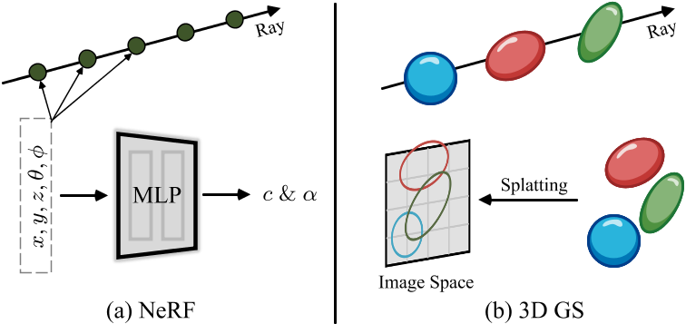

# INTRODUCTION

需求：基于图像的3D场景重建

发展史：

||||
|---|---|---|
|光场和基本场景和重建|1-3|受到对密集采样和结构化捕捉的依赖的限制，导致在处理复杂场景和照明条件方面面临重大挑战|
|structure-frommotion [4]， multi-view stereo [5] algorithms|4， 5|难以进行新视角合成，并且缺乏与深度场景理解模型的兼容性|
|NeRF：实现空间坐标到颜色和密度的直接映射|6-11，|NeRF 的成功取决于其创建连续的体积场景函数的能力，产生具有前所未有的细节和真实感的结果。 1. 计算强度。基于 NeRF 的方法是计算密集型的 [6]-[11]，通常需要大量的训练时间和大量的渲染资源，特别是对于高分辨率输出。  2. 可编辑性。操纵隐式表示的场景可能具有挑战性，因为对神经网络权重的直接修改与场景的几何或外观属性的变化并不直观相关。|
|3D Gaussian splatting (GS) [12]|12|引入先进的、明确的场景表示，使用空间中数百万个可学习的 3D 高斯模型对场景进行建模。 采用显式表示和高度并行化的工作流程，促进更高效的计算和渲染|

|ID|Year|Name|Note|Tags|Link|
|---|---|---|---|---|---|
|12|2023|3D Gaussian Splatting for Real-Time Radiance Field Rendering|||[link](https://caterpillarstudygroup.github.io/ReadPapers/17.html)|

# BACKGROUND

## Problem Formulation

### Radiance Field

[GAMES101课程关于光场的介绍](https://caterpillarstudygroup.github.io/GAMES101_mdbook/Color/LightField.html)

光场是三维空间中光分布的表示，它捕获光如何与环境中的表面和材料相互作用[30]。在数学上，光场可以描述为函数

$$
L : (x, y, z, θ, φ) \in R^5 → R^+
$$

其中(x, y, z)为映射空间中的一个点，(θ, φ)为球坐标指定的方向。  
radiance value为非值。  
L可以通过隐式或显式表示来封装，每种表示对于场景表示和渲染都有特定的优势。

### Implicit Radiance Field

隐式辐射场表示场景中的光分布，而无需显式定义场景的几何形状。

L经常使用神经网络来学习连续的体积场景表示[35]，[36]。最突出的例子是 NeRF [15]。

在 NeRF 中，神经网络（通常是MLP）将一组空间坐标 (x, y, z) 和观察方向 (θ, φ) 映射到颜色和密度值。任何点的辐射度都不会显式存储，而是通过查询 MLP 即时计算。因此，该函数可以写为：

$$
L = MLP(x, y, z, θ, φ)
$$

Good：这种格式允许对复杂场景进行可微分和紧凑的表示  
Bad：然而由于volumetric ray marching [12]，渲染的计算负载高。

### Explicit Radiance Field

显式辐射场直接表示离散空间结构中的光分布，例如体素、网格、点云。**该结构中的每个元素存储其各自空间位置的辐射信息**。  

显式辐射场表示的通用形式可以写为：

$$
L = \text {DataStructure}[(x,y,z)] \cdot f(θ, φ)
$$

Good：这种方法允许更直接且通常更快地访问radiance value。  
Bad：代价是更高的内存使用量和可能更低的分辨率。

### 3D Gaussian Splatting: 两全其美

3D GS [12]是显式辐射场，又具有隐式辐射场的优点。因为它结合了基于神经网络的优化和显式结构化数据存储的优点。因此可以实时、高质量渲染，并且需要更少的训练时间，特别是对于复杂场景和高分辨率输出。 3D 高斯表示形式为：

$$
L = \sum_i G(x,y,z,\mu_i, \sigma_i)\cdot c_i(θ, φ)
$$

> 显式的方法，只能把radiance绑定在点上，因此受限于点的分辨率，而点的分辨率又受限于内存。  
> 3D GS把radiance绑定在有体积的点（球）上，所以对点的分辨率要求低一点。球的作用有点像点之间的插值。  

## 背景和术语

### 场景重建与渲染

3D重建：图像->3D模型  
渲染：3D模型->图像

### 神经渲染和辐射场

### 体积表示和ray marching

体积表示不仅将对象和场景建模为表面，而且将其建模为充满材料或空白空间的体积[46]。这种方法可以更准确地渲染雾、烟或半透明材料等现象。  
光线行进是一种与体积表示一起使用的技术，通过增量跟踪穿过体积的光路来渲染图像[13]、[14]。 

[非表面模型的渲染](https://caterpillarstudygroup.github.io/GAMES101_mdbook/AdvancedRendering/AdcancedAppearcing.html)

NeRF [15] 与体积射线行进有着相同的精神，并引入了重要性采样和位置编码来提高合成图像的质量。因此高质量的结果，高计算成本。

### 基于点的渲染

基于点的渲染是一种使用点而不是传统多边形来可视化 3D 场景的技术。可以通过可学习神经网络等附加属性来增强点描述符[47]、[48]，并有效渲染[49]、[50]。

Good：对于渲染复杂、非结构化或稀疏的几何数据特别有效。
Bad：存在渲染漏洞或锯齿效应等问题。 3D GS [12] 通过使用各向异性高斯函数扩展了这一概念，以实现更连续、更有凝聚力的场景表示。

# 3D GAUSSIAN SPLATTING: PRINCIPLES

## 使用学习的 3D 高斯函数进行新颖视图合成

3D GS 如何在给定结构良好的 3D 高斯的情况下合成图像，即3D GS的前向过程。

$$
L = \sum_i G(x,y,z,\mu_i, \Sigma_i)\cdot c_i(θ, φ)
$$

### 输入

一组高斯球，每个高斯球包含以下信息：  
- 位置：\\(\mu\\)
- 不透明度： \\(\alpha\\)  
- 协方差：\\(\Sigma\\)
- 颜色：c

一个高斯球是 3D GS 中场景表示的最小元素。

所有属性都可以通过反向传播来学习和优化。现在假设这些高斯球都已经优化好了。  

### Splatting

首先将这些 3D 高斯投影到基于像素的图像平面上，这一过程称为“splatting”。  

  

[Frustum](https://caterpillarstudygroup.github.io/GAMES101_mdbook/MVP/PerspectiveProjection.html)

相机pose确定以后，根据frustum切出能看见的高斯球。计算出相机视角下的高斯球的协方差。

### 可微分渲染 by pixels

> 此处先只介绍基本过程，不讲加速算法

给定像素 x 的位置，可以通过投影变换 W 来计算其到所有重叠高斯函数的距离，即这些高斯函数的深度，形成高斯函数 N 的排序列表。

然后，采用alpha合成来计算该像素的最终颜色：

  
如图所示，NeRF和3D GS的渲染可以看作是彼此的逆过程。  

### 加速技术

像素级计算的成本比较高，因此将精度从像素级转移到块级。  

具体来说，3D GS 先将图像划分为多个不重叠的图块，每个图块包含 16×16 像素。  

3D GS 进一步确定每个图块被哪些投影高斯覆盖。如果一个投影高斯覆盖多个图块，则需要把高斯复制多份。

## 3D GS的优化：为给定场景获取构造良好的 3D 高斯

3D GS 的优化，旨在构建大量 3D 高斯集合，准确捕捉场景的本质，从而促进自由视点渲染。

### 参数优化

#### Loss

> 由于ray marching成本高昂，NeRF 通常在像素级别而不是图像级别计算损失。

# 3D GAUSSIAN SPLATTING: DIRECTIONS

# APPLICATION AREAS AND TASKS

## Simultaneous Localization and Mapping (SLAM)

## Dynamic Scene Reconstruction

## AI-Generated Content (AIGC)

## Autonomous Driving

## Endoscopic Scene Reconstruction

## Medical Image

# Reference

A Survey on 3D Gaussian Splatting