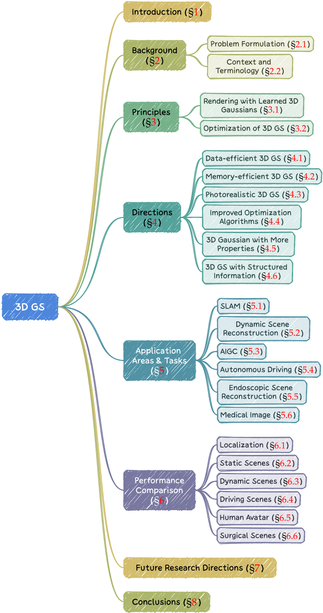

# INTRODUCTION

需求：基于图像的3D场景重建

发展史：

||||
|---|---|---|
|光场和基本场景和重建|1-3|受到对密集采样和结构化捕捉的依赖的限制，导致在处理复杂场景和照明条件方面面临重大挑战|
|structure-frommotion [4]， multi-view stereo [5] algorithms|4， 5|难以进行新视角合成，并且缺乏与深度场景理解模型的兼容性|
|NeRF：实现空间坐标到颜色和密度的直接映射|6-11，|NeRF 的成功取决于其创建连续的体积场景函数的能力，产生具有前所未有的细节和真实感的结果。 1. 计算强度。基于 NeRF 的方法是计算密集型的 [6]-[11]，通常需要大量的训练时间和大量的渲染资源，特别是对于高分辨率输出。  2. 可编辑性。操纵隐式表示的场景可能具有挑战性，因为对神经网络权重的直接修改与场景的几何或外观属性的变化并不直观相关。|
|3D Gaussian splatting (GS) [12]|12|引入先进的、明确的场景表示，使用空间中数百万个可学习的 3D 高斯模型对场景进行建模。 采用显式表示和高度并行化的工作流程，促进更高效的计算和渲染|

|ID|Year|Name|Note|Tags|Link|
|---|---|---|---|---|---|
|12|2023|3D Gaussian Splatting for Real-Time Radiance Field Rendering|||[link](https://caterpillarstudygroup.github.io/ReadPapers/17.html)|

# BACKGROUND

# 3D GAUSSIAN SPLATTING: PRINCIPLES

# 3D GAUSSIAN SPLATTING: DIRECTIONS

# APPLICATION AREAS AND TASKS

## Simultaneous Localization and Mapping (SLAM)

## Dynamic Scene Reconstruction

## AI-Generated Content (AIGC)

## Autonomous Driving

## Endoscopic Scene Reconstruction

## Medical Image

# Reference

A Survey on 3D Gaussian Splatting