转载出处：https://www.daniel-holden.com/page/creating-looping-animations-motion-capture

# Creating Looping Animations from Motion Capture

Created on Sept. 19, 2022, 11:01 a.m.

Today I'd like to talk about a couple of different ideas for how to automatically create looping animations from motion capture data.

But first, a little bit of philosophical discussion - because some of you reading this might be thinking "but Dan, aren't you trying to move animation tech away from the use of small, looped animation clips?".

Well the truth is this: the way I feel about looping animations is pretty much the way I feel about tiling textures. That yes - if done poorly they can look bad - and when there is a short repeat period with no added details on top the repetition becomes painfully obvious in a way that destroys both realism and immersion. But I've [sort of been](https://twitter.com/BrianKaris/status/1547739866816847872) convinced that looping/tiling is a powerful form of proceduralism we should exploit in games - and that if we want to create worlds with a level of perceived detail that comes close to reality (and more importantly, fit those worlds in RAM or on our hard drives), it may well be an ally rather than an enemy.

Nonetheless, whenever a discussion leads down the path of "we must have the ability to individually tweak each of the 27 frames of locomotion in the main run cycle otherwise we risk creating an experience too jarring for the player during the hours of gameplay they will see it repeated" I cannot help but think animation tech is still somehow stuck in the days of [this](https://www.daniel-holden.com/media/uploads/Looping/terrain.jpg).

> &#x2705; loop不仅是一小段动画的不段循环，也可以看作是小样本生成任务。只需要一小段reference motion，就可以生成无限时长的丰富但又具有reference motion特点的动作。由于reference motion可以精心制作的高质量数据，生成出的序列也是高质量的。    

Longer loops definitely help, as does adding procedural details on top, or a variety system which random selects different animations over time. Either way, the one thing I'm *not* going to be convinced of is that the solution to making looping animations look good is the animation equivalent of pixel-polishing!

Okay - rant indulged... onto the technical stuff...


---

If we have a clip of animation we want to make loop there are essentially two things we need to do: 1. make the first and last frame of the animation the same. 2. ensure the velocity of the first frame and last frame are similar enough that we don't have a visual discontinuity.

> &#x2705; 看样子，本文的目的不是小样本生成。而是一段动作序列的首尾拼接，达到序列级的循环。  

Luckily, one of my favorite tools in animation programming can be used for exactly this: [inertialization](https://www.daniel-holden.com/page/spring-roll-call#inertialization). And while most often this is used for stitching together two different animations at runtime, we can also use it offline to *stitch an animation to itself* creating what is essentially a looped animation.

For example, given something like the following:     

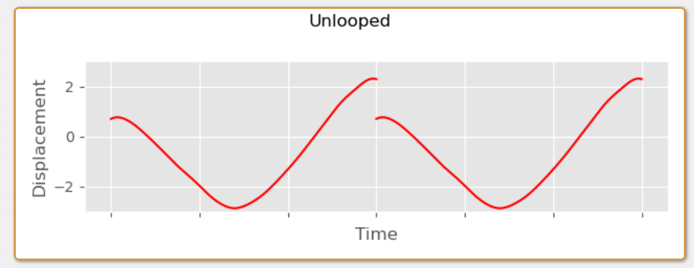 

We can take the difference between the first and last frame of animation, as well as the difference in velocity, and then add back this difference as an offset, decayed over time by something like a [critically damped spring](https://www.daniel-holden.com/page/spring-roll-call#critical):   

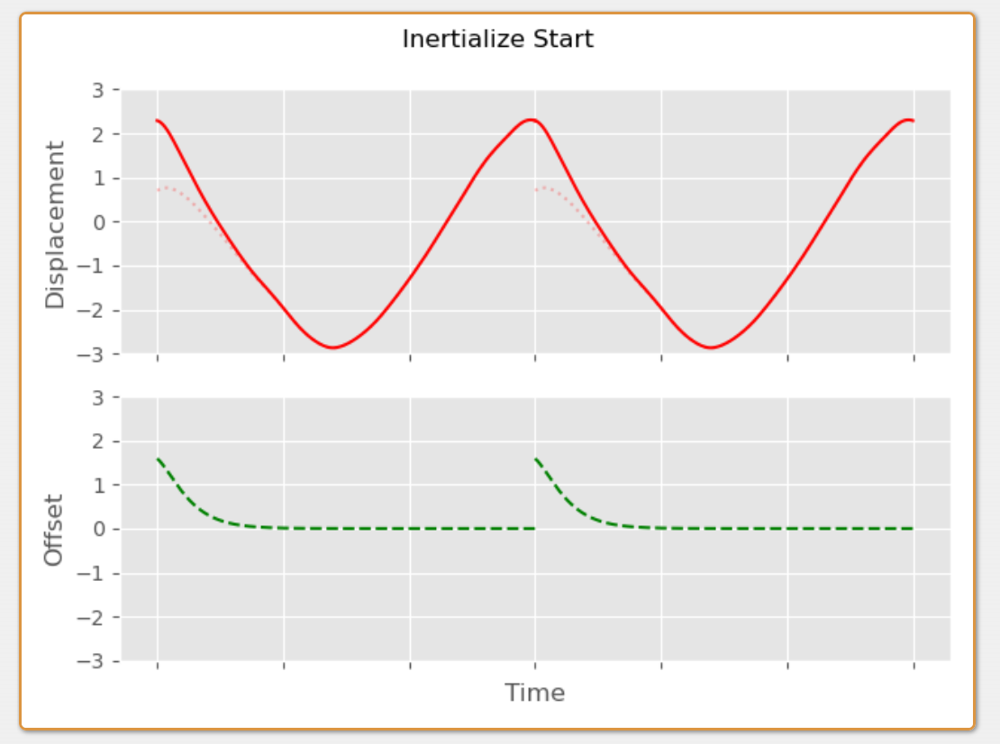   


In this case I've added this offset to the front of the animation, but we could add it to the back instead:

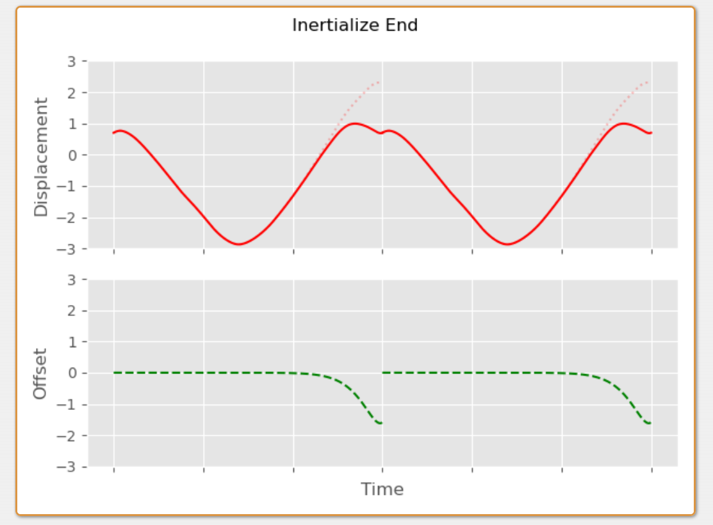 

We can also distribute the offset over both sides of the clip - by applying some amount of the offset to the front of the animation, and some amount of it to the back in the opposite direction. We can even have individual half-lives for each side if we want to, or account for the velocity and position discontinuities in different ratios at the back and front:   

 


To implement this in code, first we need to compute the differences for the start and end frames:   

```c++
void compute_start_end_positional_difference(
    slice1d<vec3> diff_pos,
    slice1d<vec3> diff_vel,
    const slice2d<vec3> pos,
    const float dt)
{
    // Check we have at least 2 frames of animation
    assert(pos.rows >= 2);

    // Loop over every joint
    for (int j = 0; j < pos.cols; j++)
    {
        // Positional difference between first and last frame
        diff_pos(j) = pos(pos.rows-1, j) - pos(0, j);
        
        // Velocity difference between first and last frame
        diff_vel(j) = 
            ((pos(pos.rows-1, j) - pos(pos.rows-2, j)) / dt) -
            ((pos(         1, j) - pos(         0, j)) / dt);
    }
}

void compute_start_end_rotational_difference(
    slice1d<vec3> diff_rot,
    slice1d<vec3> diff_vel,
    const slice2d<quat> rot,
    const float dt)
{
    // Check we have at least 2 frames of animation
    assert(rot.rows >= 2);

    // Loop over every joint
    for (int j = 0; j < rot.cols; j++)
    {
        // Rotational difference between first and last frame 
        // represented in scaled-angle-axis space
        diff_rot(j) = quat_to_scaled_angle_axis(
            quat_abs(quat_mul_inv(rot(rot.rows-1, j), rot(0, j))));

        // Angular velocity difference between first and last frame
        diff_vel(j) = 
            quat_differentiate_angular_velocity(
                rot(rot.rows-1, j), rot(rot.rows-2, j), dt) -
            quat_differentiate_angular_velocity(
                rot(         1, j), rot(         0, j), dt);
    }
}
```

Note that we convert the rotational offset into [scaled-angle-axis space](https://www.daniel-holden.com/page/exponential-map-angle-axis-angular-velocity) to allow us to treat it like a vector and combine it with angular velocities.  

Then, given our inertialization function which decays the difference...

```c++
vec3 decayed_offset(
    const vec3 x, // Initial Position
    const vec3 v, // Initial Velocity
    const float halflife, 
    const float dt)
{
    float y = halflife_to_damping(halflife) / 2.0f;	
    vec3 j1 = v + x*y;
    float eydt = fast_negexpf(y*dt);

    return eydt*(x + j1*dt);
}
```


We can use it to compute the offset we need to apply at each frame.

```c++
void compute_inertialize_both_offsets(
    slice2d<vec3> offsets,
    const slice1d<vec3> diff_pos,
    const slice1d<vec3> diff_vel,
    const float halflife_start, 
    const float halflife_end, 
    const float ratio,
    const float dt)
{
    // Check ratio of correction for start
    // and end is between 0 and 1
    assert(ratio >= 0.0f && ratio <= 1.0f);
  
    // Loop over every frame
    for (int i = 0; i < offsets.rows; i++)
    {
        // Loop over every joint
        for (int j = 0; j < offsets.cols; j++)
        {
            offsets(i, j) = 
                // Decayed offset from start
                decayed_offset(
                    ratio * diff_pos(j), 
                    ratio * diff_vel(j), 
                    halflife_start, 
                    i * dt) +
                // Decayed offset from end
                decayed_offset(
                    (1.0f-ratio) * -diff_pos(j), 
                    (1.0f-ratio) *  diff_vel(j), 
                    halflife_end, 
                    ((offsets.rows-1) - i) * dt);
        }
    }
}
```


And then apply this offset to the actual animation.

```c++
void apply_positional_offsets(
    slice2d<vec3> out, 
    const slice2d<vec3> pos, 
    const slice2d<vec3> offsets)
{
    // Loop over every frame
    for (int i = 0; i < pos.rows; i++)
    {
        // Loop over every joint
        for (int j = 0; j < pos.cols; j++)
        {
            // Simply add on offset
            out(i, j) = pos(i, j) + offsets(i, j);
        }
    }
}

void apply_rotational_offsets(
    slice2d<quat> out, 
    const slice2d<quat> rot, 
    const slice2d<vec3> offsets)
{
    // Loop over every frame
    for (int i = 0; i < rot.rows; i++)
    {
        // Loop over every joint
        for (int j = 0; j < rot.cols; j++)
        {
            // Convert back from scaled-angle-axis space and
            // multiply on the left. This rotates the first
            // frame toward the last frame.
            out(i, j) = quat_mul(
                quat_from_scaled_angle_axis(offsets(i, j)),
                rot(i, j));
        }
    }
}
```

And this is how it looks on the character:

> &#x1F50E; https://www.daniel-holden.com/media/uploads/Looping/inertialize_both.m4v


Unfortunately the spring-based inertializer has a problem here... if we slow down the animation we can see that there is a small discontinuity at the end of the loop. This is because even with a reasonably short half-life the exponential decay still produces some tiny residual offset at the end of the animation:

> &#x1F50E; https://www.daniel-holden.com/media/uploads/Looping/inertialize_slowmo.m4v


An inertializer with a fixed fade out time fixes this. For example, here is a basic cubic inertialization function we can use instead that decays exactly to zero by blendtime:

```c++
vec3 decayed_offset_cubic(
    const vec3 x, // Initial Position
    const vec3 v, // Initial Velocity
    const float blendtime, 
    const float dt,
    const float eps=1e-8)
{
    float t = clampf(dt / (blendtime + eps), 0, 1);

    vec3 d = x;
    vec3 c = v * blendtime;
    vec3 b = -3*d - 2*c;
    vec3 a = 2*d + c;
    
    return a*t*t*t + b*t*t + c*t + d;
}
```

Now we can be sure our offsets will definitely be blended out in time:

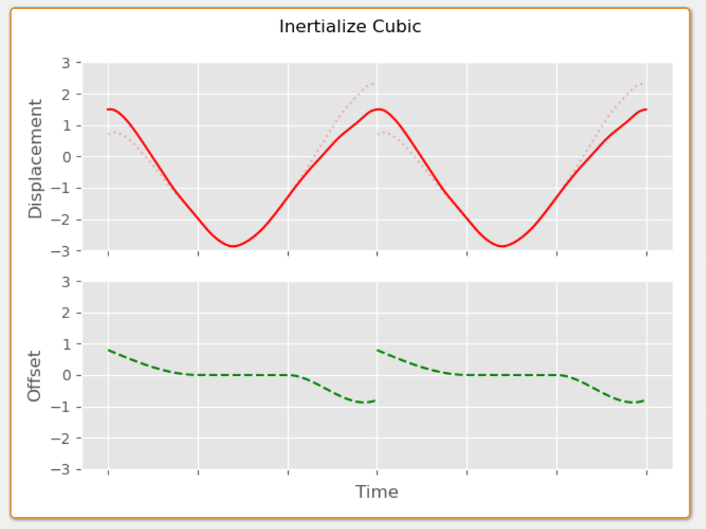 

Which removes the discontinuity.

> &#x1F50E; https://www.daniel-holden.com/media/uploads/Looping/inertialize_cubic.m4v

Something else we can do is spread the offset over the whole animation using a kind of linear fade rather than distributing it just at either end:

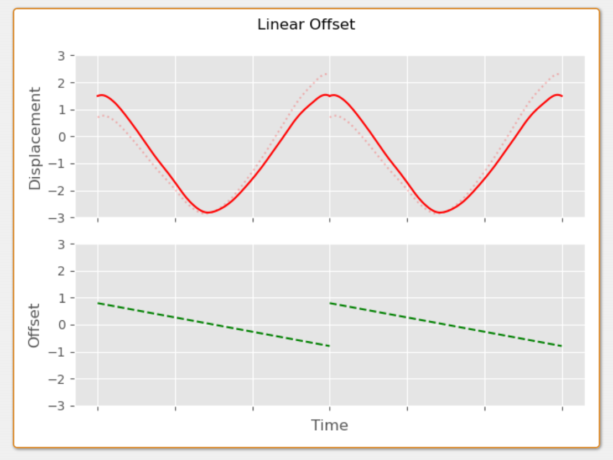 


The problem here is that doing so naively introduces a velocity discontinuity. Which again is visible if we watch the loop in slow-mo:

> &#x1F50E; https://www.daniel-holden.com/media/uploads/Looping/linear.m4v


This velocity discontinuity can be removed by again using some inertializers, but in this case using them just to blend out the velocity difference at either end:

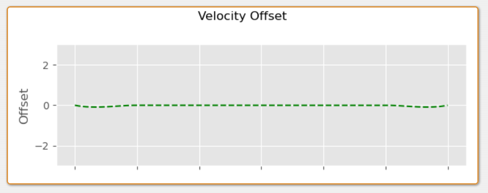 

This is then added to the linear offset:

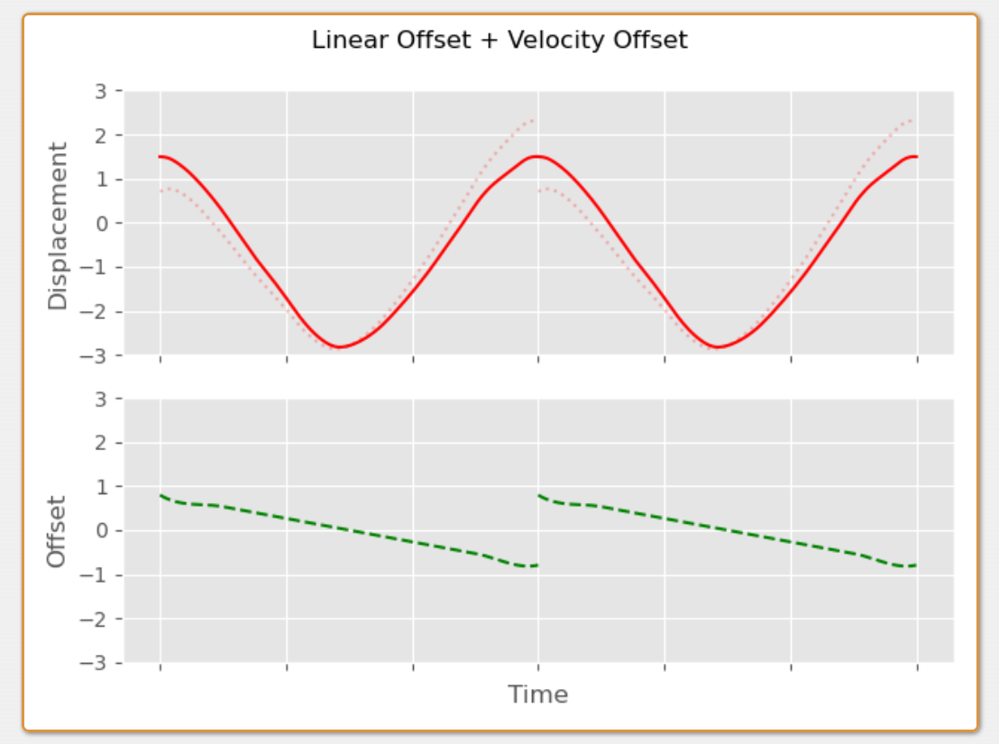 

Which in C++ looks something like this:

```c++
vec3 decayed_velocity_offset_cubic(
    const vec3 v, // Initial Velocity 
    const float blendtime, 
    const float dt,
    const float eps=1e-8f)
{
    float t = clampf(dt / (blendtime + eps), 0, 1);

    vec3 c = v * blendtime;
    vec3 b = -2*c;
    vec3 a = c;
    
    return a*t*t*t + b*t*t + c*t;
}

void compute_linear_inertialize_offsets(
    slice2d<vec3> offsets,
    const slice1d<vec3> diff_pos,
    const slice1d<vec3> diff_vel,
    const float blendtime_start, 
    const float blendtime_end, 
    const float ratio,
    const float dt)
{
    assert(ratio >= 0.0f && ratio <= 1.0f);

    // Loop over every frame
    for (int i = 0; i < offsets.rows; i++)
    {
        // Loop over every joint
        for (int j = 0; j < offsets.cols; j++)
        {    
            offsets(i, j) = 
                // Initial linear offset
                lerpf(
                     ratio,
                    (ratio-1.0f),
                    ((float)i / (offsets.rows-1))) * diff_pos(j) + 
                // Velocity offset at start
                decayed_velocity_offset_cubic(
                    ratio * diff_vel(j), 
                    blendtime_start, 
                    i * dt) + 
                // Velocity offset at end
                decayed_velocity_offset_cubic(
                    (1.0f-ratio) * diff_vel(j), 
                    blendtime_end, 
                    ((offsets.rows-1) - i) * dt);
        }
    }
}
```

Note that the velocity introduced by the linear fade needs to be accounted for when we apply the inertializers, but in this case because it's the same on both the start and the end of the animation it cancels itself out. As we will see later, if the velocity introduced by our initial offset is different at the start and end we need to account for it when setting the initial velocity of the inertializers.

That aside, here is what this looks like on the character:

> &#x1F50E; https://www.daniel-holden.com/media/uploads/Looping/linear_inertialize.m4v
 

This spreads the adjustment over the whole animation which in many cases is very useful and generally looks good for short animations. However, in certain cases it introduces a kind of "drift" to the animation which might not be what we want and can introduce foot sliding:

> &#x1F50E; https://www.daniel-holden.com/media/uploads/Looping/linear_comparison.m4v

One idea is to limit the linear fade to just the start and end. Here we can use a little function I'm calling "softfade", to make a linear ramp that fades the offset out. The alpha parameter here can be used to adjust the "hardness" of the ramp.

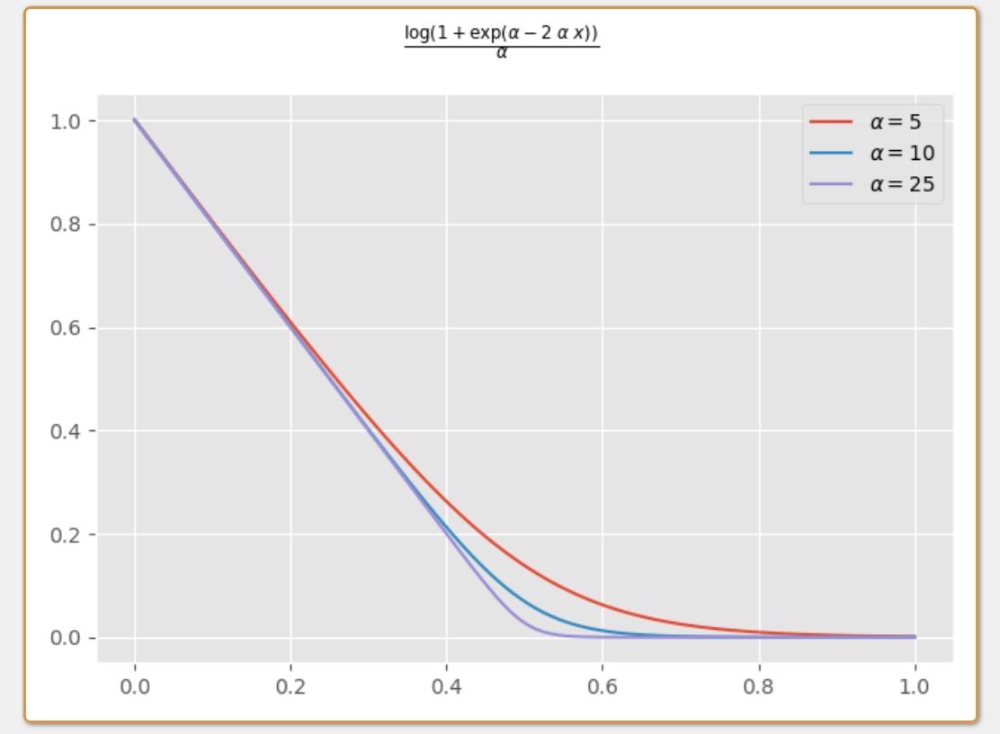

Which we might implement in C++ like this:

```c++
float softfade(const float x, const float alpha)
{
    return logf(1.0f + expf(alpha - 2.0f*alpha*x)) / alpha;
}

// Function using `softfade` to decay some offset
vec3 decayed_offset_softfade(
    const vec3 x, // Initial Position
    const float duration,
    const float hardness,
    const float dt)
{
    return x * softfade(dt / duration, hardness);
}

// Gradient of the `softfade` function at zero
float softfade_grad_zero(const float alpha)
{
    return (-2.0f * expf(alpha)) / (1.0f + expf(alpha));
}

// Gradient of the `decayed_offset_softfade` 
// function with a `dt` of zero
vec3 decayed_offset_softfade_grad_zero(
    const vec3 x,
    const float duration,
    const float hardness)
{
    return x * (softfade_grad_zero(hardness) / duration);
}
```

This we can apply to either side of the animation for the durations we want.

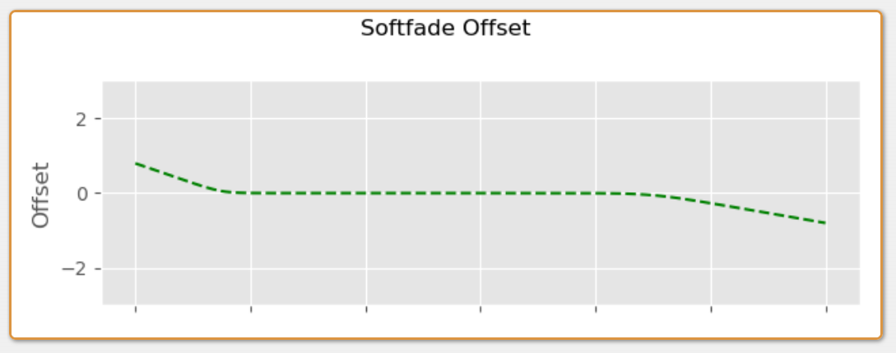

Like before we need to account for the velocity discontinuity using additional inertialization - but with that the results are smooth.

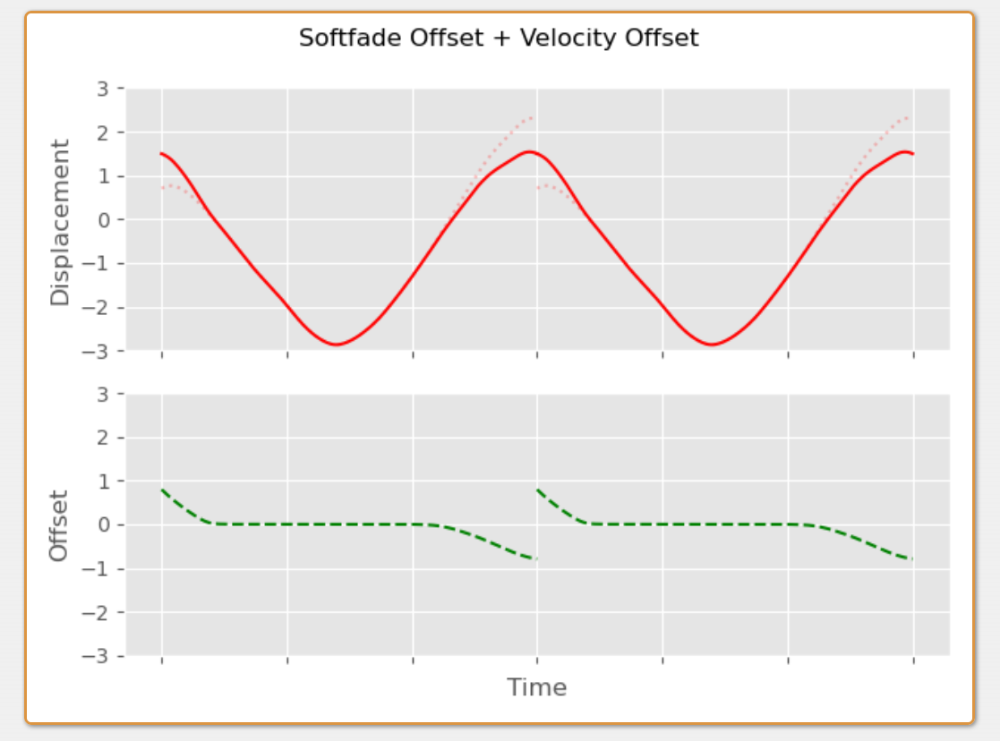

In C++ the implementation could look something like this. First we need to update our function which computes the difference in position and velocity to take into account the velocity introduced by the softfade offset:

```c++
void compute_softfade_start_end_difference(
    slice1d<vec3> diff_pos,
    slice1d<vec3> diff_vel,
    const slice2d<vec3> pos,
    const float duration_start, 
    const float duration_end, 
    const float hardness_start, 
    const float hardness_end, 
    const float ratio,
    const float dt)
{
    assert(pos.rows >= 2);

    // Loop over every joint
    for (int j = 0; j < pos.cols; j++)
    {
        // Positional difference between first and last frame
        diff_pos(j) = pos(pos.rows-1, j) - pos(0, j);
        
        // End frame velocity (including softfade)
        vec3 velocity_end = 
            (pos(pos.rows-1, j) - pos(pos.rows-2, j)) / dt + 
            decayed_offset_softfade_grad_zero(
                ratio * diff_pos(j), 
                duration_start, 
                hardness_start) * dt;
        
        // Start frame velocity (including softfade)
        vec3 velocity_start = 
            (pos(         1, j) - pos(         0, j)) / dt +
            decayed_offset_softfade_grad_zero(
                (1.0f-ratio) * diff_pos(j), 
                duration_end, 
                hardness_end) * dt;

        // Velocity difference between first and last frame
        diff_vel(j) = velocity_end - velocity_start;
    }
}

void compute_softfade_start_end_difference(
    slice1d<vec3> diff_rot,
    slice1d<vec3> diff_vel,
    const slice2d<quat> rot,
    const float duration_start, 
    const float duration_end, 
    const float hardness_start, 
    const float hardness_end, 
    const float ratio,
    const float dt)
{
    assert(rot.rows >= 2);

    // Loop over every joint
    for (int j = 0; j < rot.cols; j++)
    {
        // Rotational difference between first and last frame 
        // represented in scaled-angle-axis space
        diff_rot(j) = quat_to_scaled_angle_axis(
            quat_abs(quat_mul_inv(rot(rot.rows-1, j), rot(0, j))));
        
        // End frame velocity (including softfade)
        vec3 velocity_end = 
            quat_differentiate_angular_velocity(
                rot(rot.rows-1, j), rot(rot.rows-2, j), dt) + 
            decayed_offset_softfade_grad_zero(
                ratio * diff_rot(j), 
                duration_start, 
                hardness_start) * dt;
        
        // Start frame velocity (including softfade)
        vec3 velocity_start = 
            quat_differentiate_angular_velocity(
                rot(         1, j), rot(         0, j), dt) +
            decayed_offset_softfade_grad_zero(
                (1.0f-ratio) * diff_rot(j), 
                duration_end, 
                hardness_end) * dt;

        // Velocity difference between first and last frame
        diff_vel(j) = velocity_end - velocity_start;
    }
}
```

Then we can compute our softfade offset:

```c++
void compute_softfade_inertialize_offsets(
    slice2d<vec3> offsets,
    const slice1d<vec3> diff_pos,
    const slice1d<vec3> diff_vel,
    const float blendtime_start, 
    const float blendtime_end, 
    const float duration_start, 
    const float duration_end, 
    const float hardness_start, 
    const float hardness_end, 
    const float ratio,
    const float dt)
{
    // Loop over every frame
    for (int i = 0; i < offsets.rows; i++)
    {
        // Loop over every joint
        for (int j = 0; j < offsets.cols; j++)
        {    
            offsets(i, j) = 
                // Softfade at start
                decayed_offset_softfade(
                    ratio * diff_pos(j), 
                    duration_start, 
                    hardness_start, 
                    i * dt) + 
                // Softfade at end
                decayed_offset_softfade(
                    (1.0f-ratio) * -diff_pos(j), 
                    duration_end, 
                    hardness_end, 
                    ((offsets.rows-1) - i) * dt) + 
                // Velocity offset at start
                decayed_velocity_offset_cubic(
                    ratio * diff_vel(j), 
                    blendtime_start, 
                    i * dt) + 
                // Velocity offset at end
                decayed_velocity_offset_cubic(
                    (1.0f-ratio) * diff_vel(j), 
                    blendtime_end, 
                    ((offsets.rows-1) - i) * dt);
        }
    }
}
```

Using this we can adjust the fade-out time to just a section of the animation to avoid too much drift.

> &#x1F50E; https://www.daniel-holden.com/media/uploads/Looping/softfade.m4v

We also need to handle the root carefully. If we want it to loop in the world space we can use any of the techniques above, however more often we only want it to loop in the character space - or to be more specific - we just want to remove any potential velocity discontinuity at the loop transition point.

What this means in practice is that we need to compute our offsets in the character space, but apply them in the world space of the first or last frame. Secondly, as we've seen before, we only need to inertialize out the difference in velocity, and add back the offset this produces.

Here is what that looks like in code:

```c++
void compute_root_inertialize_offsets(
    slice2d<vec3> offsets_pos, 
    slice2d<vec3> offsets_rot, 
    const slice2d<vec3> pos, 
    const slice2d<quat> rot, 
    const float blendtime_start, 
    const float blendtime_end, 
    const float ratio,
    const float dt)
{
    // Check animation is at least 2 frames
    assert(rot.rows >= 2 && pos.rows >= 2);
    
    // Get root start and end rotations
    quat root_start = rot(         0, 0);
    quat root_end   = rot(rot.rows-1, 0);
    
    // Compute character space difference in positional velocity
    vec3 pos_vel_end   = quat_inv_mul_vec3(root_end, 
        (pos(pos.rows-1, 0) - pos(pos.rows-2, 0)) / dt);
    vec3 pos_vel_start = quat_inv_mul_vec3(root_start, 
        (pos(         1, 0) - pos(         0, 0)) / dt);
    vec3 diff_pos_vel = pos_vel_end - pos_vel_start;
    
    // Compute character space difference in rotational velocity
    vec3 rot_vel_end   = quat_inv_mul_vec3(root_end, 
        quat_differentiate_angular_velocity(
            rot(rot.rows-1, 0), rot(rot.rows-2, 0), dt));
    vec3 rot_vel_start = quat_inv_mul_vec3(root_start,  
         quat_differentiate_angular_velocity(
            rot(         1, 0), rot(         0, 0), dt));
    vec3 diff_rot_vel = rot_vel_end - rot_vel_start;
    
    // Loop over frames
    for (int i = 0; i < rot.rows; i++)
    {
        // Root positional offset
        offsets_pos(i, 0) = 
            // Velocity offset at start
            decayed_velocity_offset_cubic(
                ratio * quat_mul_vec3(root_start, diff_pos_vel),
                blendtime_start,
                i * dt) +
            // velocity offset at end
            decayed_velocity_offset_cubic(
                (1.0f-ratio) * quat_mul_vec3(root_end, diff_pos_vel),
                blendtime_end,
                ((rot.rows-1) - i) * dt);
        
        // Root rotational offset
        offsets_rot(i, 0) =
            // Velocity offset at start
            decayed_velocity_offset_cubic(
                ratio * quat_mul_vec3(root_start, diff_rot_vel),
                blendtime_start,
                i * dt) +
            // velocity offset at end
            decayed_velocity_offset_cubic(
                (1.0f-ratio) * quat_mul_vec3(root_end, diff_rot_vel),
                blendtime_end,
                ((rot.rows-1) - i) * dt);
    }
}
```

And here is a kind of top-down 2D visualization of what this is effectively doing.

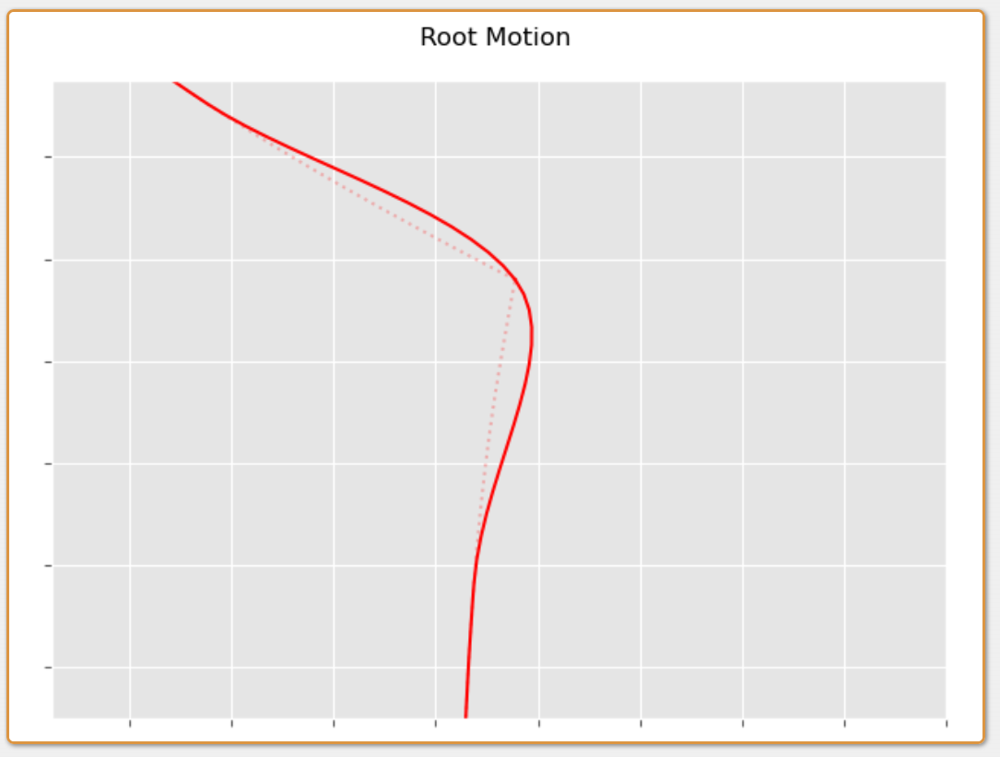

Now when we play back the looped clip and let the displacement of the root accumulate we can see that even for clips with very different root velocities at the start and end we don't see any discontinuity:

> &#x1F50E; https://www.daniel-holden.com/media/uploads/Looping/root_motion.m4v

Although I've provided some specific implementations here, there are practically infinite ways to produce looped animations using this idea.

For example, I am sure we could take some ideas from [adjustment blending](https://www.youtube.com/watch?v=eeWBlMJHR14) to try and improve the results. At the end of the day all we need to do is produce an offset with a total displacement that accounts for the positional difference and an offset in velocities at either end which accounts for the velocity difference - everything that happens in the middle is essentially up to us!

If you want to have a play around with the system shown in this post I've prepared a web-demo [here](https://www.daniel-holden.com/media/uploads/Looping/looping.html).

And the source code for everything is available [here](https://github.com/orangeduck/Animation-Looping).
