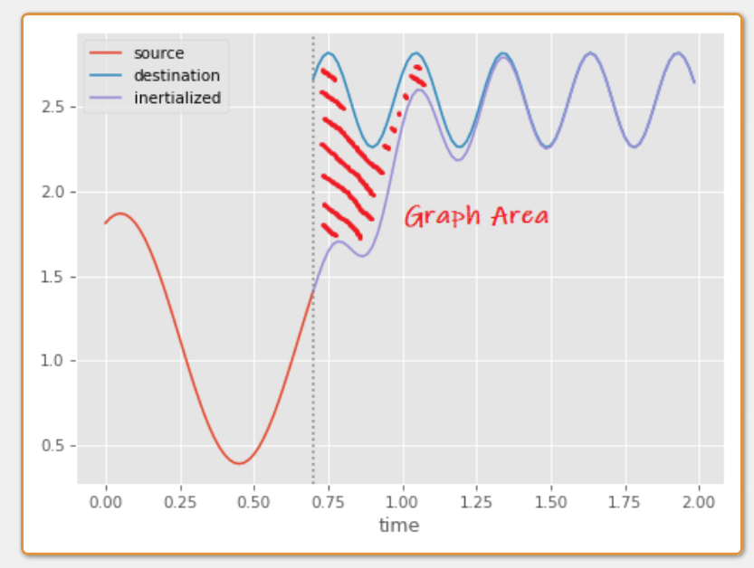
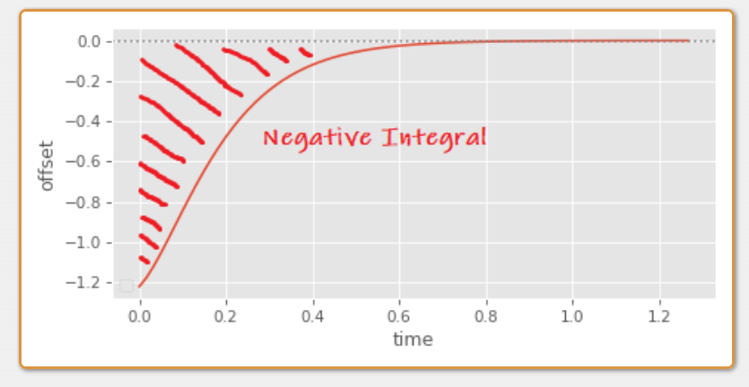
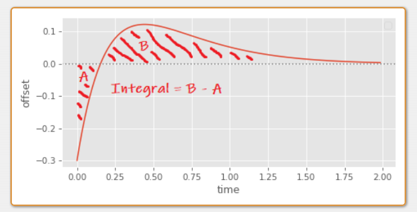
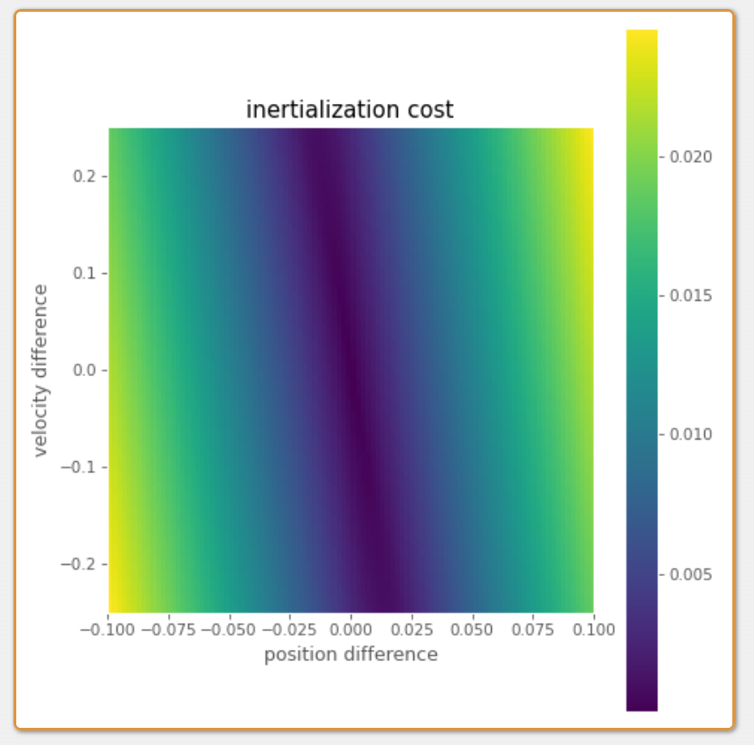
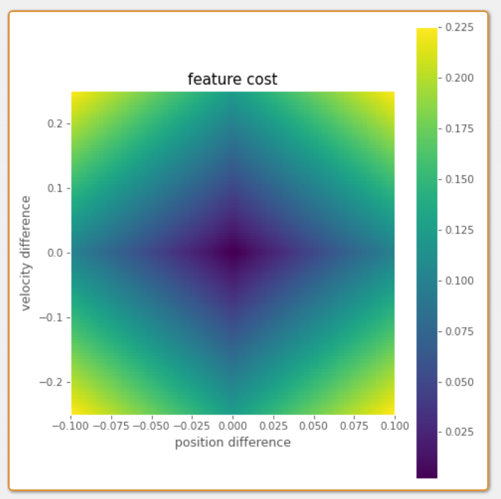
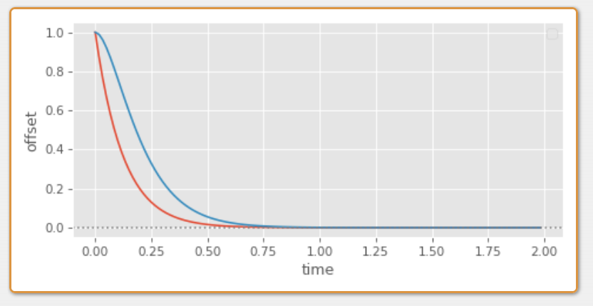
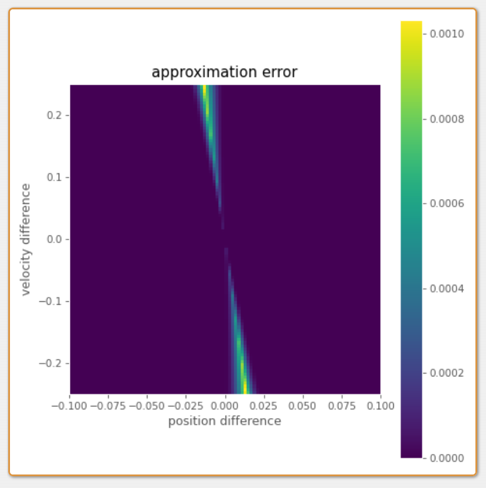
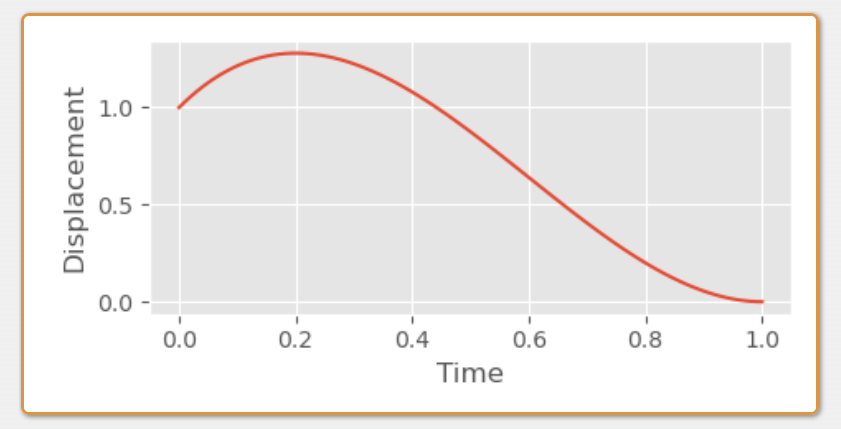
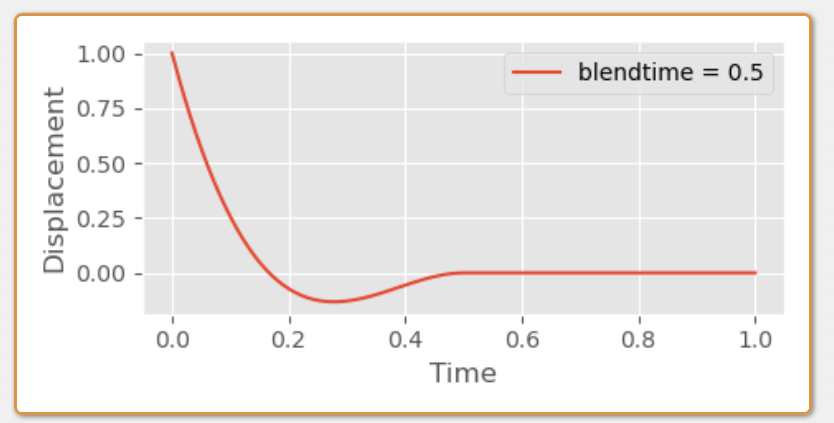

转载出处：https://www.daniel-holden.com/page/inertialization-transition-cost

# Inertialization Transition Cost

Created on June 2, 2022, 3:21 p.m.

Something which is often required by animation systems (Motion Matching being a key example) is a way to compute a "cost" associated with a particular transition between two frames of animation.

> &#x2705; cost：转移代价

In Motion Matching this is typically done by taking the difference between ["features"](https://montreal.ubisoft.com/en/introducing-learned-motion-matching/) of both the source and destination animations. Usually, the positions of a few key joints (such as the feet), as well as their velocities. The magnitudes (or squared magnitudes) of the differences of these feature values is computed, and then added together using some user specified or automatically computed weights.

And although both simple and fast, there are two limitations to this notion of a "transition cost". The first problem is that we're mixing units (such as positions and velocities). This is why we need some kind of weighting terms to balance the contribution from each of these things. Setting good weights by hand is quite difficult, so we often resort to some kind of statistical normalization instead - something which can be a little brittle to changes in our data.

The second problem is that this does not account for the relationships between these features. And having some particular combination of joint position and velocity can often result in an unexpectedly good transition, which is not accounted for when we just add up those differences separately (as we will see later).

While I was thinking about this problem, I wondered if we could do something better by assuming our transitions are performed using [inertialization](https://www.daniel-holden.com/page/spring-roll-call#inertialization). The idea I came up with was this: let's define our transition cost as *the total displacement* caused by an inertialized transition. i.e. The area of the graph between the source and destination animations:

 

When we're using a critically damped spring to produce this offset between source and destination, something like this area can be computed directly using the *integral* of the spring equation.

For example, here's the integral of a critically damped spring, with target position zero and target velocity zero (as used to decay the offset of the inertializer), where the initial position is given as `x`, the initial velocity as `v` and half-damping `y` is as defined [here](https://www.daniel-holden.com/page/spring-roll-call#critical):


\begin{align*} \int (e^{−y\cdot t}\cdot (x+(v+x\cdot y)\cdot t))dt & =−e^{−y\cdot t} \cdot \frac{1}{y^2} \cdot (t\cdot v\cdot y+x\cdot y\cdot (t\cdot y+2)+v) \end{align*}
​

Then, by taking the definite integral of this equation from zero to infinity, we can get an equation which tells us the total area under the graph:

\begin{align*} \int_{0 }^{\infty}  (e^{−y\cdot t}\cdot (x+(v+x\cdot y)\cdot t))dt & =\\\\
−e^{−y\cdot \infty  } \cdot \frac{1}{y^2} \cdot (\infty \cdot v\cdot y+x\cdot y\cdot (\infty \cdot y+2)+v)&-\\\\
−e^{−y\cdot 0  } \cdot \frac{1}{y^2} \cdot (0 \cdot v\cdot y+x\cdot y\cdot (0 \cdot y+2)+v)&=\\\\
0+ \frac{1}{y^2} \cdot (x \cdot y\cdot 2+v)&= \frac{2 \cdot x\cdot y+v}{y^2} \end{align*}


However this isn't exactly what we're looking for - and it wont exactly give us the area of the graph between source and destination animations in all cases. The first reason for this is that this number can be negative: springs which start with a negative displacement will produce a graph primarily below zero, resulting in a negative integral:

 

The second, worse problem, is that some graphs can even cross zero - producing an area both above and below zero, leading to an integral which underestimates the total area since it subtracts one from the other:

 

In these cases we need to split the integral into two parts - first computing the absolute value of the area before the graph crosses zero, and then the part after.

To find the time at which the graph crosses zero we can set the spring equation to equal zero and solve for time:

\begin{align*} e^{−y\cdot t}\cdot (x+(v+x\cdot y)\cdot t)&=0\\\\
x+(v+x\cdot y)\cdot t&=0\\\\
(v+x\cdot y)\cdot t&=−x\\\\
t&= \frac{−x}{ v+x\cdot y } \end{align*}
​

The trick here is to remove the \\(e^{−y\cdot t}\\) term as for any value of `t` it simply scales the whole of the left hand side of the equation and so does not affect the point at which 0 is crossed.

Then, we need three different definite integrals, first from `0` to `t`, from `t` to \\( \infty \\), and finally the one we already computed from `0` to \\( \infty \\):

\begin{align*} I(x,v,y,t)&=(e^{−y\cdot t}\cdot (x+(v+x\cdot y)\cdot t))\\\\
\int_{t}^{0} I(x,v,y,t)dt&= \frac{2\cdot x\cdot y+v}{ y^2} −e^{−y\cdot t}\cdot \frac{1 }{y^2}\cdot (t\cdot v\cdot y+x\cdot y\cdot (t\cdot y+2)+v)\\\\
\int_{t }^{\infty} I(x,v,y,t)dt&=e^{−y\cdot t}\cdot \frac{1 }{y^2}\cdot (t\cdot v\cdot y+x\cdot y\cdot (t\cdot y+2)+v)\\\\
\int_{0}^{\infty} I(x,v,y,t)dt&= \frac{2\cdot x\cdot y+v} {y^2} \end{align*}
​

With these three integrals we can get an accurate estimate of the area of our transition. Given an initial positional difference `x`, velocity difference `v` and a `halflife`, we can compute the total displacement as follows:

```c++
def decay_spring_damper_intersection(x, v, halflife, eps=1e-8):
    y = halflife_to_damping(halflife) / 2.0
    return -x / (v + x * y)

def decay_spring_damper_displacement(x, v, halflife):
    y = halflife_to_damping(halflife) / 2.0
    
    t = decay_spring_damper_intersection(x, v, halflife)
    
    int_0 = (x*y*2 + v) / (y*y)
    int_t = (np.exp(-y*t) / (y*y)) * (t*v*y + x*y*(t*y+2) + v)
    
    return np.where(t > 0.0, 
        abs(int_0 - int_t) + abs(int_t),
        abs(int_0))
```

But given we want to use this as a cost function, what does it actually look like? Well here's a 2D plot, with difference in position on the x-axis and difference in velocity on y-axis (the `halflife` here is set to `0.15`):

 

We can compare this to the cost function we would get if we just add the summed absolute differences in position and velocity (here the velocity difference is scaled by `0.5`):

 

The main difference we can see is that our new transition cost resembles more of a skewed valley than an inverted pyramid - the cost of a positive offset can actually be low - as long as it's combined with a negative velocity offset of the right magnitude. This makes sense - a large velocity offset can initialize the spring in a way such that it corrects itself back to zero more quickly than an initial velocity offset of zero:

 

But the problem with this cost function in practice is that since it's not a normal euclidean distance, it's not totally clear how we might integrate it with the rest of our system and exploit many of the common acceleration structures used in Motion Matching.

It would be nice if instead there were a "feature" we could compute which emulated the behavior of this cost function.

Well, as long as we're willing to accept the approximation |\\(\frac{2\cdot x\cdot y+v}{ y^2}\\)| which somewhat under-estimates the cost for oscillations around zero, there is!

The first step is to expand out the position difference `x` and elocity difference `v` from the source `s` and destination animations `d` into `s` \\(s_{pos}\\), \\(d_{pos}\\), \\(s_{vel}\\), and \\(d_{vel}\\), giving:

\begin{align*} |\frac{2\cdot(s_{pos}-d_{pos}) \cdot y+(s_{vel}-d_{vel})}{ y^2}|\end{align*}

Then, we just need to re-arrange it until we've got all the `s` variables on one side of a difference, and all the `d` on the other:

\begin{align*} =&|\frac{2\cdot y\cdot s_{pos}-2\cdot y\cdot d_{pos}+s_{vel}-d_{vel} }{ y^2}|\\\\
=&|\frac{(2\cdot y\cdot s_{pos}+s_{vel})-(2\cdot y\cdot d_{pos}+d_{vel}) }{ y^2}|\\\\
=&|\frac{(2\cdot y\cdot s_{pos}+s_{vel})}{ y^2}-\frac{(2\cdot y\cdot d_{pos}+d_{vel}) }{ y^2}|\\\\
=&|(\frac{2\cdot s_{pos}}{ y}+\frac{s_{vel}}{ y^2})-(\frac{2\cdot d_{pos}}{y}+\frac{d_{vel} }{ y^2})|\end{align*}

Which tells us that to emulate this approximate cost function the feature we need to put into our database is exactly the following:

\begin{align*} \frac{2\cdot pos}{y}+\frac{vel }{ y^2}\end{align*}

where `pos` is the bone position, `vel` is the bone velocity, and `y` is the half-damping which we compute from the half-life.

And although I'm certain there are some pathological cases which assign a small cost to transitions with large oscillations, in practice, if you use a relatively small half-life it seems to work. Here I've visualized the error of this function in comparison to our more exact cost function given previously.

 

You can see that at least the error is limited to a fairly small part of the space where we have a large velocity offset and small, exact positional offset.

To test this feature, I added it to my [previous Motion Matching demo](https://www.daniel-holden.com/page/code-vs-data-driven-displacement), using the original setup and acceleration structure, but replacing the existing bone position and bone velocity features with [this feature](https://github.com/orangeduck/Motion-Matching/blob/inertialize_feature/database.h#L444):

> &#x1F50E; https://www.daniel-holden.com/media/uploads/MotionMatchingInertializeFeature.m4v

Not bad! And although the difference is not hugely significant, to me it looks like an overall improvement, and I was surprised at how well this idea worked out-of-the-box with no tweaking of velocity and positional weights required. So while perhaps not a silver bullet, to me this still seems like a fairly good way to potentially reduce the database size and remove one more weight for users to tweak!

---

As a disclaimer I should say that while I thought this was an interesting idea worth sharing, it's not something I've tested myself extensively, so in practice your mileage may vary.

Also worth noting is that although I've provided the derivation here for a spring-based inertializer, I think a similar derivation should be perfectly possible for inertializers that blend out the offset using a polynomial (and in fact it may well be easier).

Finally, it's worth mentioning that when we compute the total displacement here we are making an assumption that the inertialized movement of a joint's position in character space is going to be similar to what we would get if we individually inertialized all of the local joint rotations down the chain - something that may well not often be true.

---

## Appendix: Cubic Inertializer

For fun I thought I would try and do the same derivation for a simple cubic inertializer function (which I used in [my article on looping animations](https://www.daniel-holden.com/page/creating-looping-animations-motion-capture)):

```c++
def decay_cubic(
    x,
    v,
    blendtime, 
    dt,
    eps=1e-8):
    
    t = np.clip(dt / (blendtime + eps), 0, 1)

    d = x
    c = v * blendtime
    b = -3*d - 2*c
    a = 2*d + c
    
    return a*t*t*t + b*t*t + c*t + d
```

The idea behind this function is essentially just to find the coefficients of a cubic polynomial with some initial position and velocity on the y-axis, which crosses the x-axis at `1`, with a velocity of `0`. Then, if we want to change how long it takes to decay we can simply scale the x-axis (and adjust the initial velocity accordingly).

 

The way we use this inertializer is a bit different. Rather than decaying the offset over time, we keep track of the initial offset, the time since transition, and compute the decayed offset on the fly based on how long it has been since the transition (we can actually do things this way with our spring-based inertializer too if we want).

```c++
void decayed_offset_cubic(
    vec3& out_x,
    vec3& out_v,
    const vec3 init_x,
    const vec3 init_v,
    const float blendtime, 
    const float dt,
    const float eps=1e-8f)
{
    float t = clampf(dt / (blendtime + eps), 0.0f, 1.0f);

    vec3 d = init_x;
    vec3 c = init_v * blendtime;
    vec3 b = -3.0f*d - 2.0f*c;
    vec3 a = 2.0f*d + c;
    
    out_x = a*t*t*t + b*t*t + c*t + d;
    out_v = (3.0f*a*t*t + 2.0f*b*t + c) / (blendtime + eps);
}

void inertialize_cubic_transition(
    vec3& off_x, 
    vec3& off_v, 
    float& off_t,
    const vec3 src_x,
    const vec3 src_v,
    const vec3 dst_x,
    const vec3 dst_v,
    const float blendtime)
{
    vec3 dec_x, dec_v;
    decayed_offset_cubic(dec_x, dec_v, off_x, off_v, blendtime, off_t);
    
    off_x = (dec_x + src_x) - dst_x;
    off_v = (dec_v + src_v) - dst_v;
    off_t = 0.0f;
}

void inertialize_cubic_update(
    vec3& out_x, 
    vec3& out_v,
    float& off_t,
    const vec3 off_x,
    const vec3 off_v,
    const vec3 in_x, 
    const vec3 in_v,
    const float blendtime,
    const float dt)
{
    off_t += dt;
    
    vec3 dec_x, dec_v;
    decayed_offset_cubic(dec_x, dec_v, off_x, off_v, blendtime, off_t);
    
    out_x = in_x + dec_x;
    out_v = in_v + dec_v;
}
```

Just like our spring, this function can cross the x-axis before `1`, which means if we want to compute the absolute displacement, we need to compute the integral in two parts:

 

And, just like before this means we need to compute the intersection time. In this case, since our cubic function is tangent to the x-axis at 1, we know that two of the roots will be exactly 1, which makes our lives a lot easier when it comes to finding the final one:

\begin{align*} a x^3 +b x^2 +c x+d=(x−1)(x−1)(x − ?) ​\end{align*}

To compute the final root we can use [synthetic division](https://www.youtube.com/watch?v=aGpsjErdPnU):

\begin{align*} (a x^3 +b x^2 +c x+d) / (x−1)&=a x^2 +(a+b) x+(a+b+c)\\\\
(a x^2 +(a+b) x+(a+b+c)) / (x−1)&=a x+2a+b ​\end{align*}
 
Which means the value of the final root is given by the following:

\begin{align*} a x+2a+b &=0\\\\
x&= \frac{−2a −b}{a} ​\end{align*}

We then just need to scale this by the `blendtime` if we want to get the actual intersection time:

```c++
def decay_cubic_intersection(x, v, blendtime, eps=1e-8):
    
    d = x
    c = v * blendtime
    b = -3*d - 2*c
    a = 2*d + c

    t = (-2*a - b) / (a + eps)
    
    return t * blendtime
```

So, depending on if there is an intersection between `0` and `1`, the total displacement is either the `blendtime` multiplied by the integral of our polynomial between `0` and `1`, or the blendtime multiplied by the sum of two integrals: one between `0` and `t`, and one between `t` and `1` where `t` is the intersection time:

\begin{align*} \int_{0}^{t} a x^3 +b x^2 +c x+ddx&=\frac{at^4}{4} +\frac{bt^3}{3} +\frac{ct^2}{2}+dt\\\\
 \int_{t}^{1} a x^3 +b x^2 +c x+ddx&=(\frac{a}{4} +\frac{b}{3} +\frac{c}{2}+d)-(\frac{at^4}{4} +\frac{bt^3}{3} +\frac{ct^2}{2}+dt)\\\\
\int_{0}^{1} a x^3 +b x^2 +c x+ddx&=\frac{a}{4} +\frac{b}{3} +\frac{c}{2}+d \end{align*}

Which in code looks something like this:

```c++
def decay_cubic_displacement(x, v, blendtime, eps=1e-8):
    
    d = x
    c = v * blendtime
    b = -3*d - 2*c
    a = 2*d + c

    t = (-2*a - b) / (a + eps)
    
    int_0 = a/4 + b/3 + c/2 + d
    int_t = (a*t*t*t*t)/4 + (b*t*t*t)/3 + (c*t*t)/2 + (d*t)
    
    return blendtime * np.where((t >= 0.0) & (t <= 1.0),
        abs(int_0 - int_t) + abs(int_t),
        abs(int_0))
```

Again, like before, if we can accept the approximation which does not split the integral into two parts, and underestimates the displacement of oscillations, we can derive a motion matching feature by getting all the source variables and destinations variables on either side of a subtraction, where here `z` is the `blendtime`:

\begin{align*} =&z|\frac{a}{4} +\frac{b}{3} +\frac{c}{2}+d|\\\\
=&z|\frac{z}{2}s_{vel} -\frac{z}{2}d_{vel} -\frac{2z}{3}s_{vel} +\frac{2z}{3}d_{vel} +\frac{1}{2}s_{pos}-\frac{1}{2}d_{pos}+\frac{z}{4}s_{vel}-\frac{z}{4}d_{vel}|\\\\
=&z|(\frac{z}{2}s_{vel} -\frac{2z}{3}s_{vel} +\frac{1}{2}s_{pos} +\frac{z}{4}s_{vel} )-(\frac{z}{2}d_{vel}-\frac{2z}{3}d_{vel}+\frac{1}{2}d_{pos}+\frac{z}{4}d_{vel})|\\\\
=&z|(\frac{z}{12}s_{vel}+\frac{1}{2}s_{pos} )-(\frac{z}{12}d_{vel}+\frac{1}{2}d_{pos})|  \end{align*}

Giving the following feature:

\begin{align*} \frac{z\cdot pos}{2}+\frac{z^2\cdot vel}{12} \end{align*}

where `pos` is the bone position, `vel` is the bone velocity, and `z` is the `blendtime`. I find it interesting how close this is to the spring-based feature given that the half-damping `y` is kind of similar to an inverse blend time.

Finally, here you can see an [adaption of my motion matching demo](https://github.com/orangeduck/Motion-Matching/tree/inertialize_feature_cubic), with this feature used for matching, and the cubic inertializer used for blending:

> &#x1F50E; https://www.daniel-holden.com/media/uploads/MotionMatchingCubicInertializeFeature.m4v

Nice!

---------------------------------------
> 本文出自CaterpillarStudyGroup，转载请注明出处。
>
> https://caterpillarstudygroup.github.io/ImportantArticles/