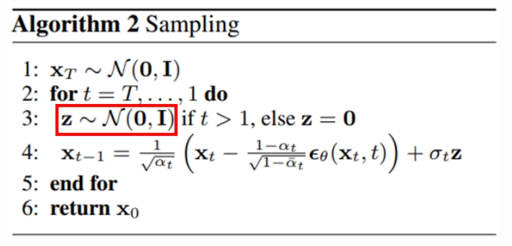
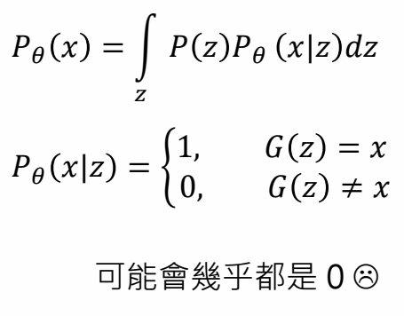
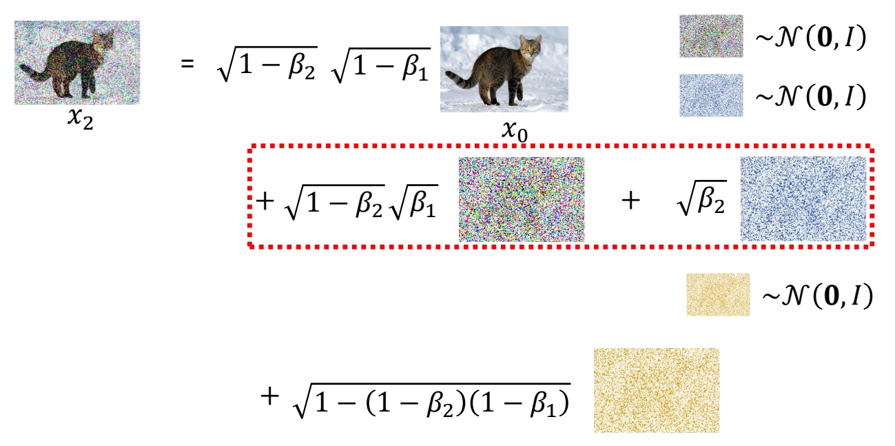
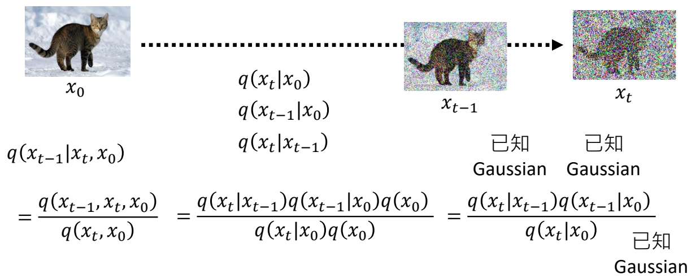
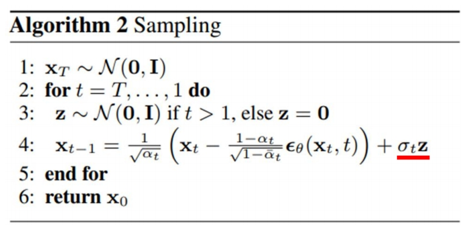
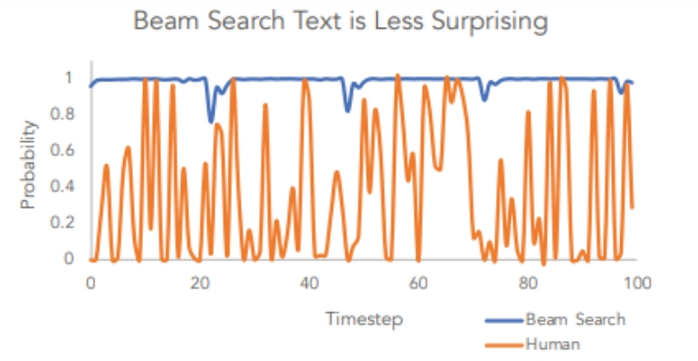
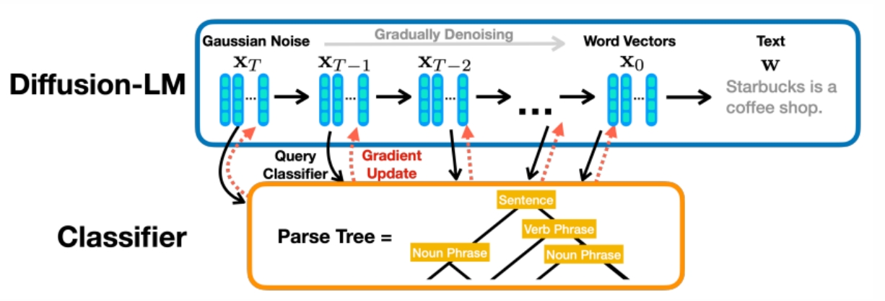

P2   
## 基本概念 

 

P3   
## VAE vs. Diffusion Model 

 

P5   
## <u>Training</u> 

 

> &#x2705; 红框：\\(X_o\\) 与 noise 做加权平均，权重是预定义好的。得到的是带噪声图像，\\(\alpha \\) 越来越小，即噪声越来越多。   
> &#x2705; \\(\epsilon_\theta \\) 的预测结果应趋近于 \\(\epsilon\\) 。   

P6

 

P7   

|||
|--|--|
| 想像中… |   |
| 实际上…  |   |

> &#x2705; 上面过程将加噪过程逐步拆解，是为了帮助理解逐步去噪的过程。但实际上，公式可以证明，逐步加噪和一步加噪在数学上是等价的。   

P8   
## <u> Inference </u> 

 

 

> &#x2705; \\(X_T\\) 是初始噪声，每个 step 还要每次额外生成一个噪声\\(Z\\).   
> &#x2705; \\(\alpha \\) 和 \\( \bar{\alpha } \\) 是两组数值序列。   

P9   

> &#x2705; 红圈是一个简单的分布，例于标准高斯，通过 NN 的转换，合成一个复杂的分布，期望这个分布与真正的图像分布是一致的。   

P10   
## 影像生成模型本质上的共同目标

 

> &#x2705; 实际使用中还会加一个 condition，但整体上没有本质差异，因此后面推导中不考虑 condition.    

P11   
## Maximum Likelihood Estimation

 

Sample {\\(x^1,x^2,\cdots ,x^m\\)} from \\(P_{data}(x)\\)    

We can compute \\(P_\theta (x^i)\\)    

\begin{align*} \theta ^\ast =\text{arg } \max_{\theta } \prod_{i=1}^{m} P_\theta (x^i) \end{align*}

> &#x2753; 怎样衡量两个分布是否接近？   
> &#x2705; \\(P_{data}\\) 代表真实分布，从分布中 Sample 出来的 \\(x\\) 即训练集    
> &#x2705; \\(P_\theta (x^i)\\) 代有 \\(P_\theta\\) 生成 \\(x^i\\) 的概率，但由于 \\(P_\theta\\) 非常复杂，算不出这个概率，但此处假设 \\(P_\theta (x^i)\\) 已知。    
> &#x2705; 目标：找出让真实 \\(x^i\\) 被生成出来的概率最高的\\(\theta \\).    

P12  

 

Maximum Likelihood = Minimize KL Divergence    

> &#x2705; 结论：让真实数据的概率最大，与让两个分布尽量接近，在数学上是一致的。   
> &#x2705; VAE、diffusion、flow based 等生成模型，都是以最大化 Likelihood 为目标。GAN 是最小化 JS Divergence 为目标。   

P13   
## VAE: Compute \\(𝑃_\theta(x)\\)   

|||
|--|--|
|  |  |
|  |  |

> &#x2705; VAE 和 diffusion 非常相似，许多公式是通用的。    
> &#x2705; \\(G（z）\\) 不代表某个生成结果，而是一个高斯的均值，然后计算 \\(x\\) 在这个分布中的概率。   

P14   
## VAE: Lower bound of \\(log P(x)\\)  

> &#x2705; 通常无法最大化 \\(P（x）\\)，而是最大化 \\(log P(x)\\) 的下界。  
> &#x2705; 以下公式推导中省略参数 \\( \theta\\)。   

P15   
## DDPM: Compute \\(𝑃_\theta(x)\\)   

  

$$
P\theta (x_0)=\int\limits _{x_1:x_T}^{} P(x_T)P_\theta (x_{T-1}|x_T)\dots P_\theta (x_{t-1}|x_t) \dots P_\theta(x_0|x_1)dx_1:x_T  
$$

> &#x2705; 对于 diffusion model，每次 denoise 出的是一个高斯分布的均值。   
> &#x2705; 得出 \\(x_0\\) 在最终分布中的概率。   
> &#x2753; 问题，为什么假设\\(G(x_t)\\) 是高斯分布的 mean？   
> &#x2705; 答：有人尝试过其它假设，效果没有变好，且高斯分布便于计算。   

P16   
## DDPM: Lower bound of \\(log P(x)\\)  

  

  

P17   
  

> &#x2705; 提前定好一组 \\(\beta \\)．代表 noise 要加多大。   
> &#x2705; \\(q（x_t｜x_{t-1}）\\) 仍然属于高斯分布，其均值为 \\(\sqrt{1-\beta _t} \cdot x_t\\)，方差为 \\(\beta _t\\).   

P18   
  

> &#x2705; 两次 sample 出的 noise 是独立同分布。   

P19   
  

> &#x2705; 两个 noise 以这种形式相加的结果，也符合某个特定的高斯分布。   

P20   
  

> &#x2705; 结论：\\( x_t=\sqrt{\bar{\alpha }_t}  \cdot x_0+\sqrt{1-\bar{\alpha }_t} \cdot \varepsilon \\).    

P21   
  

P22   
## DDPM: Lower bound of \\(log P(x)\\)  

\begin{align*} E_{q(x_1|x_0)}[log P(x_0|x_1)]-KL(q(x_T|x_0)||P(x_T))\\\\
-\sum_{t=2}^{T}E_{q(x_t|x_0)}[KL(q(x_{t-1}|x_t,x_0)||P(x_{t-1}|x_t))]   \end{align*}

> &#x2705; 目标是要优化 \\( \theta\\)，第二项与\\( \theta\\)无关，可以略掉。   
> &#x2705; 第三项的 KL Divrgence 涉及到两个分布，分布1是固定的，可以通过计算得到，分布2是由 \\( \theta\\) 决定的，是要优化的对象。   

P23  

  

  

> &#x2705; 已知 \\(q (x_t\mid x_0)\\)，\\(q (x_{t-1} \mid x_0)\\) 和 \\(q (x_t \mid x_{t-1})\\)，求 \\(q (x_{t-1} \mid x_t,x_0)\\).   

P24   
  

> &#x2705; 已知\\(x_0\\) 和 \\(x_t\\)，求 \\(x_{t-1}\\) 的分布。   

P25   
  

<https://arxiv.org/pdf/2208.11970.pdf>

P26   
  

> &#x2705; 结论：\\(q(x_{t-1}|x_t,x_0)\\) 也是高斯分布。   

P27   
  

How to minimize KL divergence?    

  

  

> &#x2705; 两个高斯分布的 KLD 有公式解，但此处不同公式解为  \\( \theta\\) 只能影响分布2的均值。   
> &#x2705; 因此减小 KLD 的方法是让分布2的均值接近分布均值。   

P28   
  

  

> &#x2705; 分布1的均值可以看作是 \\(x_{t-1}\\) 的 GT 了。   

P31   
  

> &#x2705; 具体的训练方法：    
> &#x2705;（1）取一个数据作为 \\(x_0\\)。   
> &#x2705;（2）sample 出 \\(\varepsilon \\)，计算 \\(x_t\\).   
> &#x2705;（3）根据公式，用 \\(x_t\\) 来表示 \\(x_{t-1}\\) 分布的均值，发现 \\(x\\) 与 \\(x_{t-1}\\) 之间相差一个 noise．   
> &#x2705;（4）用网络学习这个 noise.   

P32   
  

  

> &#x2705; 因为唯一未知的部分就是 \\(\varepsilon \\).   
> &#x2705; \\(\alpha \\) 是预定义的超参，DDPM 试图学习 \\(\alpha \\)，发现没有提升。

P33   
  

为什么不直接取 Mean？

> &#x2753; 预测出的高斯均值是最大概率的值，为什么不直接取均值？而是要再 sample 一次？   

P34   
## 免责声明：以下只是猜测    

P35   
## 为什么生成文句时需要 Sample？

> &#x2705; 很多生成算法都不直接生成结果，而是生成分布再 sample.  

P36  
## 为什么生成文句时需要 Sample？

 - The Curious Case of Neural Text Degeneration   

<https://arxiv.org/abs/1904.09751>  

  

> &#x2705; 因为：（1）每次取概率最大的值，会导致生成重复结果。    

P37   
  

> &#x2705; 数据分析发现，人写文章大多数不是选概率最大的词。   

P39   
## Diffusion Model 是一种 Autoregressive 

  

P43   
## Diffusion Model for Text

 - Difficulty:    
 - Solution: Noise on latent space    

  

<https://arxiv.org/abs/2205.14217>

> &#x2705; 文字是离散的，不能直接加 noise．  

P44   

  

<https://arxiv.org/abs/2210.08933>

P45   
## Diffusion Model for Text

 - Solution: Don’t add Gaussian noise 

<https://arxiv.org/abs/2210.16886>

Diffusion via Edit￾based Reconstruction (DiffusER)

  

  

<https://arxiv.org/abs/2107.03006>

> &#x2705; 不加高斯噪声，加 MASK．   

P48   
## Mask-Predict 

<https://aclanthology.org/D19-1633/>

  

> &#x2705; 把几率比较低的部分盖住，再做一次生成。   

P49   
## Mask-Predict 

<https://arxiv.org/abs/2202.04200>

<https://arxiv.org/abs/2301.00704>

  

P50   
  

  

P51   

Scheduled Parallel Decoding with MaskGIT

Sequential Decoding with Autoregressive Transformers

