P1   
## Large Multimodal Models:     
## Notes on CVPR 2023 Tutorial   

**Chunyuan Li**   
Microsoft Research, Redmond    
<https://chunyuan.li>   

**Abstract**   

This tutorial note summarizes the presentation on **Large Multimodal Models: To-wards Building and Surpassing Multimodal GPT-4, a part of CVPR 2023 tutorial on Recent Advances in Vision Foundation Models**. The tutorial consists of three parts. We first **introduce the background on recent GPT-like large models for vision-and-language modeling** to motivate the research in instruction-tuned large multimodal models (LMMs). As a pre-requisite, **we describe the basics of instruction-tuning in large language models**, which is further extended to the multimodal space. Lastly, **we illustrate how to build the minimum prototype of multimodal GPT-4 like models**
with the open-source resource, and review the recently emerged topics.    

> &#x2753; GPT 是语言模型，为什么说它是多模态模型？   
> &#x2753; 什么是 instruction-tuning？    

P3   
## 1 Prologue   

In view of the rapid assimilation and widespread adoption of OpenAI ChatGPT [32]/GPT-4 [33] in contemporary society, there has been a growing interest among academics and researchers to develop open-source large language models (LLMs), and simultaneously explore the extensions into large multimodal models (LMMs)\\(^1\\). In order to elucidate this popular topic for a broader audience, in the CVPR 2023 tutorial on **Recent Advances in Vision Foundation Models**, we have provided a lecture on **Large Multimodal Models: Towards Building and Surpassing Multimodal GPT-4**, based on the public materials in the literature. This note summarizes the tutorial presentation and makes it more complete. It gives guided tours through the literature and explain topics to those who seek to learn the areas on LMMs from basics to the advances. It is prepared for audience including graduate students, researchers and professionals that LMMs are outside their specialties, to help them develop perspectives, and identify trends in LMMs in an accessible way.     

> &#x2705; 在本文中，LMM＝multimodal LLM   

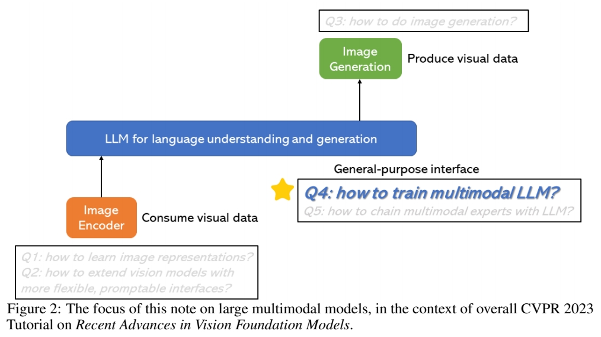  

In the full tutorial, as shown in Figure 2, we have covered the most recent approaches and principles at the frontier of learning and applying vision foundation models, **including** Q1: Visual and Vision-Language Pre-training; Q2: Generic Vision Interface; Q3: Alignments in Text-to-image Generation; Q4: Large Multimodal Models; and Q5: Multimodal Agents.   
This note **focuses** **on Q4: how to leverage LLM for multimodality, and train LMMs in an end-to-end fashion, so that the models can see and chat.** The presentation consists of three parts. To start, we first share background on recent GPT-like large models for vision-and-language modeling in Section 2. In the 2nd part, as a pre-requisite, we will introduce the concept of instruction tuning in language domains in Section 3, which empowered ChatGPT. Finally, Section 4 covers the last part of the presentation, where we focus on how to build a minimum version of multimodal GPT-4, using LLaVA as a running example. Since LMM is a popular research topic, many new papers have appeared in this line of research in the past three months, of which we provide a summary, so that the audience may quickly get a picture on what the LMM community has been working on.    
The related links of the tutorial presentation on large multimodal models are available at:    
 - *Slides*: <https://tinyurl.com/5c2c2mtm>      
 - *YouTube Video*: <https://youtu.be/mkI7EPD1vp8>    
 - *Bilibili Video*: <https://www.bilibili.com/video/BV1Ng4y1T7v3/>      
For the full information and other parts of the CVPR tutorial, please see the official website at:     
<https://vlp-tutorial.github.io/>    

P4   
## 2 Background   
### 2.1 Image-to-Text Generative Models

LMMs in their current form is primarily **an image-to-text generative model, which takes images as input, and outputs a text sequence.** One example is illustrated in Figure 3 (a) Left. All of the model variants share very similar model architecture and training objective.   
 - *Model Architecture*. As illustrated in Figure 3 (a) Right, the model typically consists of an **image encoder to extract visual features**, and **a language model to decode the text sequence**. The vision and language modalities can be **optionally connected by trainable connection module.** The image encoder and language model can be either trained from scratch or initialized from pre-trained models.    
 - *Training Objective*. As illustrated in Figure 3 (b), it typically employs an auto-regressive loss on the output text tokens. For the attention map in the Transformers [46], **image tokens can attend to each other, and the text token depends on and all image tokens and the previous text tokens.**

    
    

> &#x2705; 语言通常使用自回归方式，图像通常使用 attenion 方式。   

### 2.2 Case Studies  

We use some known LMMs as examples to illustrate how the network architecture framework can be instantiated in different models, while maintaining the same auto-regressive training objective.   

**Case Study I: LMM trained with image-text pairwise instances.** Most LMMs are trained on a large number of image-text pairs, where each training sample is a pair. GIT and BLIP2 are two large models that achieve state-of-the-art (SoTA) performance on many datasets. The comparisons are shown in Figure 4(a). GIT [48] initializes image encoder with constrastive pre-trained Microsoft Florence model, and train a language model from scratch. On the other hand, BLIP2 freezes the weights of pre-trained image and language model, and a train lightweight Q-former. **BLIP2 [20] shows higher sample-efficiency with the bootstrapping training method.**   

> &#x2705; GIT 对所有模块进行端到端训练。   
> &#x2705; BLIP2 fix 已有模块，仅训练新增的 connection 模块。 

p5   

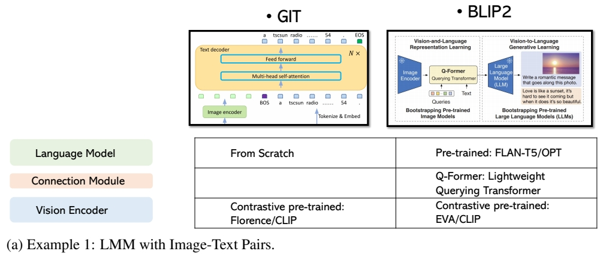  

  

**Case Study II: LMM trained with interleaved image-text sequence instances.** We use Flamingo [1] as example, shown in Figure 4(b). It connect the frozen pre-trained image and language models – by adding novel architectural components in between. Specifically, **Perceiver Sampler module helps reduce compute complexity, and Gated Transformer module helps stabilize training in the initial stage.** Flamingo is trained on a mixture of complementary large-scale multimodal data coming only from the web, without using any data annotated for machine learning purposes. After this training is done, Flamingo can be directly adapted to vision tasks via simple few-shot learning without any additional task-specific tuning.    

> &#x2753; 这个数据集和 pair data 有什么区别？   
> &#x2705; Flamingo 的训练方式同 BLIP2．   

**Multimodal In-Context-Learning.** Beside the SoTA performance on dozens of academic bench-marks, proabably the most appealing aspect of Flamingo is that it exhibits an emerged property: Multimodal In-Context-Learning. Specifically, **given a couple of image-text pairs as examples, Flamingo can zero-shot task transfer to new unseen problems, such as solving visual math problems**. This means Flamingo can tackle a number of difficult problems with just a handful of task-specific examples, **without any additional training required.** For example in Figure 5, two new tasks are presented to Flamingo. The top row provides two image-text pairs as the context in the prompt, where the text describes the name of the animal in the image, followed by the geographical information
of the animal. Flamingo is able to understand the patterns in the task instruction illustrated by the examples, and output the corresponding information for a new image. In the bottom row, the text first shows the optical character recognition (OCR) result of the image, followed by the arithmetic result. Flamingo learns the task instruction illustrated in the multimodal context, outputs the correct answer for a new math problem in the image. Therefore, Flamingo is generally considered as the GPT-3 moment [3] in the multimodal domain.    

> &#x2705; 对于新任务，不需要训练，只需要给几个例子就能学会。    
> &#x2753; Flamingo 有交互功能吗？怎样学习例子？   
> &#x2753; 这个特性与 In-Context-Learning 有什么关系？   

P6   
  

### 2.3 OpenAI Multimulti GPT4 and Research Gaps 

In March 2023, OpenAI released GPT-4 [33], with impressive capability in visual understanding and reasoning. Though the model details are unknown, there is no doubt that GPT4 enables many new scenarios, based on the examples highlighted the technique report. For instance, two popular visual examples are illustrated in Figure 6. The first one identifies the uncommon visual region and exhibits
strong complex reasoning performance. The second one recognizes text in the image and captures the mere across image-text. For a while, the research community had no clue how this new ability is achieved (probably because they are not tightened to any established academic tasks/datasets), but all are determined that these are exciting results. It naturally raise a question: How can we build Multimodal GPT-4 like models?     

  

To answer it, we start to review the big models from OpenAI, by highlighting the most appealing properties for each model in Figure 7. There are several key observations: (i) GPT-2 [38] is the auto-regressive counterpart in the BERT era [8] for the paradigm of pre-training then fine-tuning. Compared with GPT-2, GPT-3 [3] is a 175B model trained on web-scale text corpus, which exhibits two emerging properties with a frozen model: in-context-learning [3] and chain-of-thoughts (CoT) reasoning [53].. This means, without any additional training required, the model can tackle a wide range of new problems with just a few task-specific examples and by properly prompting it step-by-step, respectively. **It further leads to the paradigm from fine-tuning model weights to prompting**   

P7    

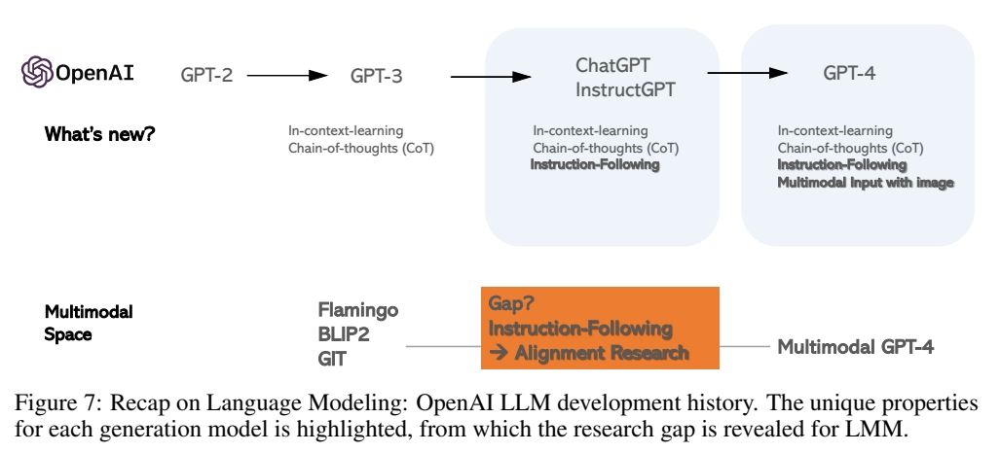  

**frozen models, where the latter shows higher generality and lower adaptation cost in task transfer.** (ii) ChatGPT and InstructGPT [34] shows the importance of instruction-following and alignment with human intents for LLMs, by fine-tuning the base language model GPT-3/GPT-3.5 on high quality instruction-following data, and improving them with a reward model via reinforcement learning with human feedback. (\\(iii\\)) GPT-4 not only improves the language ability of previous models, but also allows visual signals as additional input for understanding and reasoning. We see that the newer generation model maintains/improves the existing properties of the previous ones, and enable new properties.   

> &#x2705; In-Context-learning 指通过新任务的例子学习新任务。   
> &#x2705; Instruction-Following 指通过理解任务描述完成新任务。 

In another words, from GPT-3 to GPT-4, we see two new properties: instruction-following and multimodal input. This reveals the gap between existing LMMs such as Flamingo and multimodal GPT-4: how to perform instruction-following and alignment research in the multimodal space. and thus the focus of this tutorial & note.    

P8   
## 3 Pre-requisite: Instruction Tuning in Large Language Models    

Note that instruction-following is a notion originated in natural language processing (NLP). To study the intuition and gain a full picture of the history, we revisit instruction tuning with LLMs.    

### 3.1 Instruction Tuning   
 
    
    
    
 
**Traditional Language Data**. As a typical data instance in NLP, seq2seq representation is quite common for many language tasks: each data instance consists of two parts: sequence as the input and sequence as the output. We provide two examples in Figure 8 (a). Without any task instruction specified, we know they are translation and summarization tasks, respectively.   

This seq2seq representation is also how NLP community used to use their data. **Task instructions are implicit**. Based on each data domain, **individual models are trained, or sometimes multi-tasking over multiple data domain without specifying the task instructions**. When such models are trained, they are **hard to generalize to new tasks in a zero-shot fashion**, because the models do not learn the skill to understand the task instruction, and have no ability to distinguish and generalize what task to perform in the testing stage.   

**Instruct Language Data.** Instead, recently researchers start to **explicitly add task instructions in the model training,** as shown in Figure 8 (b). Interestingly, the task instructions of most NLP tasks can be **expressed in natural language** as well. It leads a new data format: instruction-input-output triplets. Based on the new format, **one single model can be trained, multi-tasking with specified instructions.** Since models have observed many task instructions and many instances for each task in training, it **is natural and easy for the models to generalize to new tasks by task composition** in the inference stage.   

P9   
For example, in the evaluation stage, a new task that require both summarization and translation is provided in Figure 8 (c). Though the model has never seen this new task in training, it observes individual task basis, and learn to perform on new tasks. Note that we humans are always creating new tasks in our daily life, and presumably these new tasks would never been observed by models. It is thus appealing if a model is able to solve thousands of new tasks in the wild in without training. This is partially why ChatGPT is becoming popular and prevalent quickly.     

**3.2 Self-Instruct and Open-Source LLMs**    

How can we collect a diverse set of high-quality instruction-following data? There are two general schemes. One is human-human interaction, where humans (task providers) provide the annotation statement and requirements, based on which another group of humans complete the annotation tasks. such a scheme is typically cost and time consuming. The other scheme is human-machine interaction, where similarly **humans provide the annotation statement and requirements**, but it is now the **machines/models that complete the annotation tasks.**   

To enable LLMs to follow natural language instructions and complete real-world tasks, researchers have been exploring methods of **instruction-tuning** of LLMs. This is implemented by either fine-tuning the model on a wide range of tasks using human-annotated prompts and feedback [34], or supervised finetuning using public benchmarks and datasets augmented with manually or automatically generated instructions [52]. Among these methods, Self-Instruct tuning [51] is a simple and effective method of aligning LLMs to human intent, by **learning from instruction-following data generated by SoTA teacher LLMs.** It turns out that the line of instruction-tuning research has produced effective means to improve the zero and few-shot generalization abilities of LLMs. Self-instruct leverages the in-context-learning ability of LLM. The pipeline is illustrated in Figure 9. Humans create a few examples (i.e., seed examples) as the context, and ask LLM such as GPT-3 or GPT-4 to create more instruct and responses that follows the requirements stated in the prompt. The machine-generated instruction-following data can be further selected to construct with the prompt for in-context-learning in the next data generation iteration. The procedure iterates till a given number of samples are collected. Due to the relatively lower cost and higher response speed of API calls (compared with human annotations), self-instruct is becoming more favorable in the research community.    

    

> &#x2705; (1) 人工生成一些例子。 (2) LLM 通过例子学习任务。(3) LLM 生成新的问题并回答。（4）人工把生成结果变为数据。    

**Open-Source LLMs: LLaMA Family.** The open-source community has witnessed a surge of open
LLM. The success of ChatGPT [32] and GPT-4 [33] offers tremendous opportunities to improve open-source LLMs using instruction-tuning. Figure 10 compares several open-source instruction tuned LLMs. LLaMA [45] is a series of open-sourced LLMs, which match the performance of proprietary LLMs such as GPT-3. To teach LLaMA to follow instructions, Self-Instruct tuning has been quickly adopted given its superior performance and low cost. For example, to name a few early attempts in this line of research, Stanford Alpaca [43] uses 52K instruction-following samples generated by GPT-3.5, while Vicuna [47] uses around 500K high-quality instruction-following samples (150K conversions) between user and GPT [39]. To advance the SoTA of instruction-tuning for LLMs, GPT-4 is utilized as the teacher to generate the responses for the Alpaca instructions [36]. Many papers have been proposed to improve the instruction-following data to improve the model alignment quality in chat. For a comprehensive review, we suggest the readers to refer the recent paper [50], where a LLM Tulu is trained on a mix of several high-quality instruct data, and comprehensive comparisons are conducted across multiple benchmarks.   

P10   
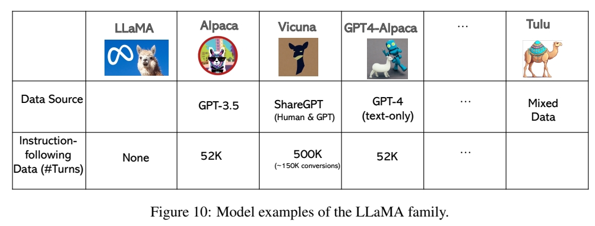    
    
  
**Quick Assessment of LLM Chatbots.** To study the quality of LLM Chatbots, We consider *Vicuna-Instructions*-\\(80^2\\) [47], a dataset with **80 challenging questions that baseline models find challenging.** Beside generic instructions, there are 8 categories, including knowledge, math, Fermi, counterfactual, roleplay, generic, coding, writing, common-sense. To quantitatively compare the performance, we **ask GPT-4 to rate the response** from score 1 to 10 for any two given chatbots, then compute the relative score. The results are shown in Figure 11. Surprisingly, it turns out this evaluation metric is quite consistent across different settings. The open-source LLaMA family seem performing closely to SoTA proprietary Chatbots.   

**Further Discussions.** There are several important topics on LLMs that we have not covered in the tutorial presentation, but are worthwhile future exploring.   

 - *Data-centric AI*. We emphasize that the developmet of these open-source LLM projects is data-centric [29], rather than model-centric, so that we hope readers could align the perspective when discussing the topic. **As the training objective and network architectures are becoming similar and even identical** on GPT-like projects, **the key differential factor is data.** For example, behaviors of the aforementioned LLMs are determined by the instruction tuning data.    

 - *False Promise?* There is a debate that the open LLMs could catch up with the proprietary LLMs is a false promise [14]. To align the discussions, we argue that **there are two distinctive abilities for LLMs: the instruction-following ability to know which task to perform, and massive knowledge storage to complete the task with quality. Imitation models are good at the former,** by mimicking ChatGPT’s style **but not its factuality.** They authors in [14] conclude that there exists a substantial capabilities gap between open and closed LMs that, with current methods, can only be bridged using an unwieldy amount of imitation data or by using more capable base LMs. They also advocate that the highest leverage action for improving open-source models is **to tackle the difficult challenge of developing better base LMs.** However, unfortunately the resources to train such base LMs are only available in a few industry labs, and the formulas to train the base LMs is largely well explored. It seems more promising for most academic research labs to explore the opportunities in alignment research with affordable resources, or explore the techniques to reduce the compute the barriers.    

> &#x2705;  Imitation Modes 从 base model 处得到大量数据，可得到 instruction-following 的能力，但其质量无法达到 base model.   

 - *Base LLMs*. Developing more capable or commercial usable LLMs is of great value. Besides LLaMA, the open-source community has developed several capable base LLMs such as OpenLLaMA [11], MPT [44] and Falcon [35], or released the training recipe [5].    

<https://github.com/lm-sys/FastChat/blob/main/fastchat/eval/table/question.jsonl>    

P11    
## 4 Instructed Tuned Large Multimodal Models  

In this tutorial, we illustrate how to **build the minimum prototype of multimodal GPT4 with open-source resources.** Specially, we use LLaVA [24] as the running example, a similar idea is also
proposed in its co-current work miniGPT-4 [66].   

### 4.1 Open-Source Prototypes: LLaVA / MiniGPT4

The research in the multimodal space has often been inspired by the latest advances in NLP in recent years. One successful recipe is to keep asking what would happen if the most intriguing and successful NLP ideas are borrowed for the vision-and-language community. We are leveraging the self-instruct idea from the language domain. The unique challenge with self-instruct is that **there is no strong multimodal teacher available yet. How can we use language model such as language-only GPT-4 to create multimodal instruction following data.**    

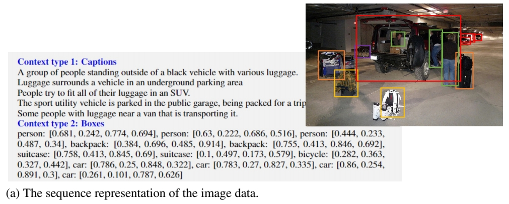  

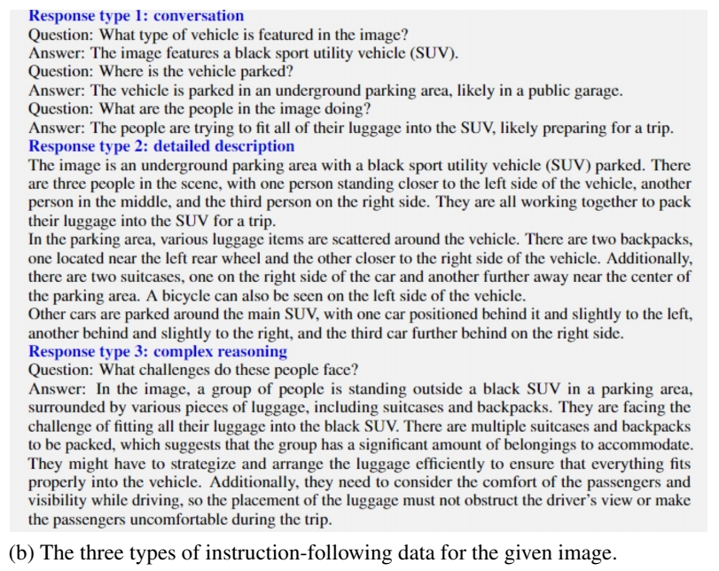  

### 4.1.1 Data Creation

Instead of directly feed images into OpenAI GPT, we use their **symbolic sequence representations** shown in Figure 12 (a). In LLaVA, the caption and boxes are considered, due to the following    

P12   
  

reasons: (1) it is empirically found that GPT-4 can understand them well, in contrast that ChatGPT has a difficult time in understanding the box data. (2) they are important to **represent the image as informative as possible.**   

> &#x2705; 图像 → 结构化文本 → 文本输出。    
> &#x2705; 结构化文本称为 text representation.    

As exemplified in Figure 12 (b), three types of instruction-following data are considered: **multi-turn conversations** so that users can chat with bot, **detailed description** so that long response can be generated from the bot; Lastly, **complex reasoning**, this is more about the implication of the image, rather than the image content. For example, “what challenge do these people face” in this image? The image is about a SUV in the parking area, while the challenge is how the luggage can be packed into the SUV due to the tight space in the car. In total, 158K samples are collected.      

To summarize, the trick is that whatever tasks one wants to the model to perform in the serving stage, it is important to **create the corresponding instruction-following for the training**.

> &#x2753; 怎样让模型不只识别图片信息，还要根据图片做复杂推断？    

### 4.1.2 Network Architecture and Training

As illustrated in Figure 13, the LLaVA network architecture is an instantiation of the general image-to-text generative model framework introduced in Section 2 and Figure 3. Specifically, **LLaVa connects
pre-trained CLIP ViT-L/14 visual encoder [37] and large language model Vicuna [47], using a simple
projection matrix.** A two-stage instruction-tuning procedure is considered:   

 - *Stage 1: Pre-training for Feature Alignment.* Only the projection matrix is updated, based on a subset of CC3M [40]. The only task is **image captioning**.    
 - *Stage 2: Fine-tuning End-to-End.* Both the projection matrix and LLM are updated for two different use scenarios.    

> &#x2705; 即使每个模块分工明确且单独训好，E2E 的 finetune 还是必不可少的。   

### 4.1.3 Performance

**Performance on Visual Chat: Towards building multimodal GPT-4 level chatbot.** . LLaVA is fine-tuned on the generated multimodal instruction-following data, which contains a diverse set of task instruction and response for daily user-oriented applications. It is empirically found that **fine-tuning the linear projection layer only is sufficient for the chat demo/scenarios, though it requires longer training time.**   

  

An evaluation dataset with 30 unseen images is constructed: each image is associated with three types of instructions: conversation, detailed description and complex reasoning. This leads to 90 new language-image instructions, on which we test LLaVA and GPT-4, and use GPT-4 to rate their responses from score 1 to 10. The summed score and relative score per type is reported in Figure 14. Overall, LLaVA achieves 85.1% relative score compared with GPT-4, **indicating the effectiveness of the proposed self-instruct method in multimodal settings.**   

P13   
**Performance on Science QA: New SoTA with the synergy of LLaVA with GPT-4.** LLaVA is fine-tuned on a multimodal rea￾soning dataset in the science domain [26]. In Figure 15, LLaVA alone achieves 90.92%. We use the language-only GPT-4 as the judge, to predict the final answer based on its own previous answers and the LLaVA answers. This “GPT-4 as judge” scheme yields a new SoTA 92.53%.    

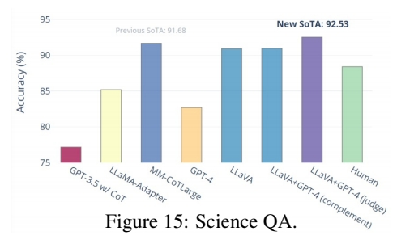  

P14   
**Performance on OCR in the wild: An emerging property.** LLaVA has never been explicitly trained on OCR data, i.e., images that contains text from the corresponding caption. Surprisingly, **the model show strong zero-shot OCR task transfer ability in the wild.** Some examples are shown in Figure 16.   

P16   
### 4.2 Emerging Topics

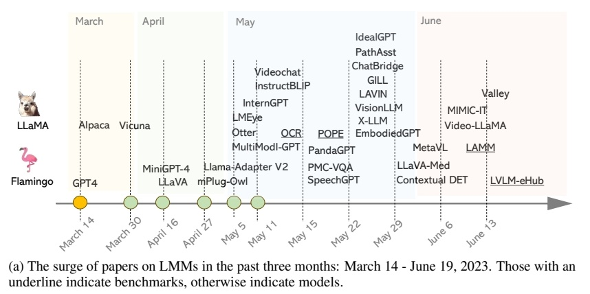  

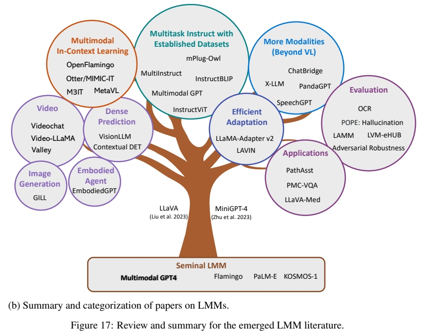  

The history of recent instructed tuned LMM are illustrated in Figure 17 (a). Due to the popularity of ChatGPT and GPT-4, **instructed tuned LMM** appears as an emerging line of research in the past three months after GPT-4 was proposed. Alpaca and Vicuna were proposed to make LLaMA more instruction-following in the language domain in March. In two weeks, MiniGPT-4 and LLaVA were proposed to make Vicuna to see and chat about the visual world. In ten days, Llama-Adpter v2 and mPlug-OWL started to compare performance with MiniGPT-4/LLaVA, indicating the beginning of model evolution. The data points in April are relatively sparse. In May, a large number of LMM papers appeared on arXiv, which improve this line of research from many different aspects. The momentum is till going in June.    

P17   
It is easy to lose track of all the recent papers for the readers, so as well in our literature review. To better organize the literature, we group them based on specific research topics in this tutorial, shown in Figure 17 (b). The early LMMs with billions of parameters include GPT-4 [33], Flamingo [1], PaLM-E [9] and KOSMOS-1 [15]. In constrast to these proprietary LMMs, LLaVA/MiniGPT-4 open the opportunities to build LMMs with open-source resource. We will discuss the several topics as below, in addition to dense prediction [49, 60], video [62, 28, 21], image generation [16] and embodied agent [31].   

#### 4.2.1 More Modalities (Beyond VL)

&#x1F50E; *ChatBridge: Bridging Modalities with Large Language Model as a Language Catalyst [65]*   
&#x1F50E; *PandaGPT: One Model To Instruction-Follow Them All [41]*        
&#x1F50E; *SpeechGPT: Empowering large language models with intrinsic cross-modal conversational abilities [61]*    
&#x1F50E; *X-LLM: Bootstrapping Advanced Large Language Models by Treating Multi-Modalities as Foreign Languages [4]*   

While LMM extends LLM by adding the vision modality into language, it is natural to further extend the framework to include more modalities beyond vision and language. Following this spirit, several attempts have been made. In Figure 18, PandaGPT leverages ImageBind to add more modalities into LMMs. The ImageBind model [12] **learns a single, shared representation space for text, image/video, audio, sensors that record depth (3D), thermal (infrared radiation), and inertial measurement units (IMU), which calculate motion and position.** ImageBind provides a holistic understanding of the visual world that connects objects in a photo with how they will sound, their 3D shape, how warm or cold they are, and how they move. **By training a projection layer for one modality in LMM, the model can zero-shot transfer to infer over other modalities due to the shared multimodal embedding space.** Another representative model is SpeechGPT, where language and speech modalities are enabled for both input and output ends. Despite of rich model variations, the idea to connect diverse modalities is similar to LMM that adds images into LLMs.   

> &#x2705; 把多种模态信息融合到同一空间，那多种骨骼动作也可以，哪来的 pairdata呢？   
> &#x2705; 只训一个模态，其它模态能自动迁移，这些模态是怎么对齐的？   
> &#x2705; 不同骨骨动作的迁移，BVH 能否作为中间的结构化文本？   

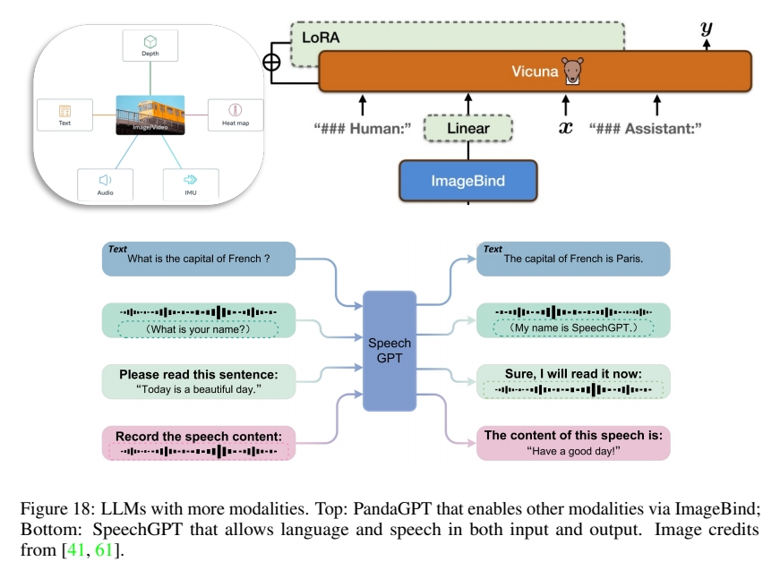  

P18   
  

#### 4.2.2 Multitask Instruct with Established Academic Datasets/Tasks

&#x1F50E; *MultiInstruct: Improving Multi-Modal Zero-Shot Learning via Instruction Tuning [57]*   
&#x1F50E; *mPlug-OWL: Modularization empowers large language models with multimodality [58]*   
&#x1F50E; *InstructBLIP: Towards general-purpose vision-language models with instruction tuning [6]*   
&#x1F50E; *Multimodal-GPT: A vision and language model for dialogue with humans [13]*   
&#x1F50E; *Instruction-ViT: Multi-Modal Prompts for Instruction Learning in ViT [54]*   

As discussed earlier in Section 3, instruction tuning in the language domains is implemented in two different ways: **fine-tuning the model on a wide range of tasks using human-annotated prompts and feedback [34],** or **supervised fine-tuning using public benchmarks and datasets augmented with manually or automatically generated instructions [52]**. The former is good at user-oriented daily life tasks, and the latter is good at achieving good numbers on established benchmarks. LLaVA/MiniGPT-4 can be categorized as the former class. Several other works either target for the latter class or combine both classes.    

> &#x2705; 用 prompt 使用更友好，但用数据 finetue 能得到更好的效果。   
> &#x2705; 前者数据来自 daily conversation，因此没有明确的任务类型，属于通才。   
> &#x2705; 后者数据来专用数据集，有明确的任务类型，属于专才。   

#### 4.2.3 Multimodal In-Context-Learning

&#x1F50E; *OpenFlamingo [2]*   
&#x1F50E; *Otter: A Multi-Modal Model with In-Context Instruction Tuning [18]*
&#x1F50E; \\(M^3\\)*IT: A Large-Scale Dataset towards Multi-Modal Multilingual Instruction Tuning [22]*    
&#x1F50E; *MetaVL: Transferring In-Context Learning Ability From Language Models to Vision-Language Models [30]*    

Similar to the behaviour of LLMs, which can address a language task by processing examples of the task in their text prompt, **multimodal in-context-learning refers to an visual and text interface can steer the model towards solving a multimodal task.** Given a few example pairs of visual inputs and expected text responses composed in the multimodal prompt, the model can be asked a question with a new image or video, and then generate an answer.

P19   
OpenFlamingo [2] is an open source version of DeepMind’s Flamingo model, trained on Multimodal C4 dataset [67], which is a billions-scale corpus of image interleaved with text. To explicit enhance the multimodal in-context-learning ability of LMMs, MIMIC-IT [17] dataset is constructed, which is 2.4M multimodal instruction instances with in-context examples. By tuning OpenFlamingo on MIMIC-IT, a new model Otter is obtained with a stronger instruction-following ability. The model life cycle is summarized in Figure 20. Using two image-text pairs as the context, Otter learns the concise answering style demonstrated by the examples, otherwise a tedious response is generated.

> &#x2705; 提升 in-context-learning 主要靠增加数据集。   

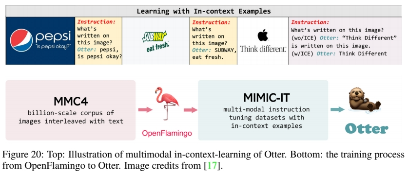  

#### 4.2.4 Parameter-Efficient Training

&#x1F50E;  *LLaMA-Adapter V2: Parameter-Efficient Visual Instruction Model [10]*   
&#x1F50E;  *Cheap and Quick: Efficient Vision-Language Instruction Tuning for Large Language Models [27]*   
&#x1F50E;  *QLoRA: Efficient Finetuning of Quantized LLMs [7]*   

While fine-tuning very large models often leads to high performance, it is prohibitively expensive; For example, regular 16-bit fine-tuning of a LLaMA 65B parameter model [45] requires more than 780 GB of GPU memory [7]. Therefore, it is critical to reduce the memory footprint of LLMs/LMMs, especially when it comes to improve the accessibility of large models to a wider community. Parameter-efficient training is an effective approach for LMM adaptation. Two representative methods are illustrated in Figure 21. **They freeze most of the model parameters, and only allow a small of trainable parameter to update with domain specific data.** For example, LLaMA Adapter v2 and LAVIN only has 14M and 3.8M trainable parameters, compared with 7B/13B LLM parameters. **Another efficient training method is quantization.** The recent QLoRA finetunes 65B LLaMA for 24 hours on a single GPU, reaching 99.3% of the performance level of ChatGPT. Since instruction tuning typically involves a small amount of data, it makes parameter-efficient training or model quantization feasible with limited GPU resources.

> &#x2705; quantization 是什么技术？   

    

> &#x2705; 可以在两个模态的中间加 adapter，学习模态间的 alignment.   
> &#x2705; 可以在两个模态上增加 adapter，增加模态的泛化性。   

P20   
    

#### 4.2.5 Benchmarks

&#x1F50E; *On the Hidden Mystery of OCR in Large Multimodal Models [25]*   
&#x1F50E; *Evaluating Object Hallucination in Large Vision-Language Models [23]*    
&#x1F50E; *On Evaluating Adversarial Robustness of Large Vision-Language Models [64]*    
&#x1F50E; *LAMM: Language-Assisted Multi-Modal Instruction-Tuning Dataset, Framework, and Benchmark [59]*    
&#x1F50E; *LVLM-eHub: A Comprehensive Evaluation Benchmark for Large Vision-Language Models [56]*    

While LMMs have shown excellent visual recognition and reasoning in an open-set manner with free-form text in many scenarios, the evaluation of LMMs is becoming an urgent and challenging problem. Several related benchmarks have been developed to evaluate various aspects of LMMs, ranging from their specific abilities including **OCR[25], object hallucination [23] and adversarial robustness [64], to comprehensive evaluation [59, 56].**    

> &#x2753; 这四个能力是怎么评价的？    
> &#x2705; OCR：从图片中识别文本。LMM 不需要学习就具有的能力，其中 BLIP2 甚至优于专门训练的 OCR 任务 SOTA．   

It is surprising that LMMs shows strong zero-shot OCR performance in the wild, without explicitly training on text recognition data. To shed light on the hidden mystery of OCR in LMMs, a compre-hensive empirical study is conducted in [25] to compare open-source LMMs on 24 academic text recognition datasets, shown in Figure 22. Three observations are highlighted: (1) LLaVA consistently outperforms miniGPT-4 on 21 out of 24 datasets, despite LLaVA being trained with an order of magnitude smaller training data. (2) Training with significantly larger training data leads to higher OCR performance, as demonstrated by BLIP2 [20] and mPLUG-Owl. (3) In most cases, supervised SoTA results significantly outperform zero-shot LMM. However, it is worth noting that in the WordArt dataset [55], which primarily features challenging artistic text, BLIP2 surpasses supervised SoTA. This reveals the potential of LMM in recognizing more complex text types.     

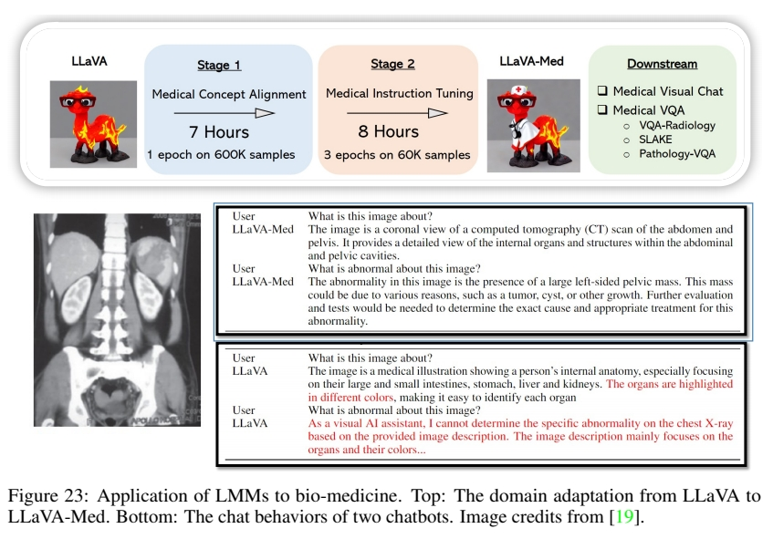    

P21   
#### 4.2.6 Applications

&#x1F50E; *PathAsst: Redefining Pathology through Generative Foundation AI Assistant for Pathology [42]*    
&#x1F50E; *PMC-VQA: Visual Instruction Tuning for Medical Visual Question Answering [63]*    
&#x1F50E; *LLaVA-Med: Training a Large Language-and-Vision Assistant for Biomedicine in One Day [19]*    

The success of ChatGPT/GPT-4 in the general domain has inspired the interests in building assistants in the vertical domains such as medicine, gaming and education. Such **domain-specific assistants** can have the several advantages over the general domain counterpart: (1) training high-quality domain knowledge makes the assistants more helpful, (2) the model size can be smaller, and thus severing cost is low, (3) the sensitive user prompt data can be maintained internally by serving the model at local, and the privacy issue can be avoided.   

> &#x2753; 为什么 domain-specific assistants 会更小？   

LMMs have been recently explored in the biomedical domain [42, 63, 19], where conversational gener-ative AI has demonstrated remarkable promise for empowering biomedical practitioners. LLaVA-Med is a cost-efficient approach for training a vision-language conversational assistant that can answer open-ended research questions of biomedical images. The key idea is to leverage a large-scale, broad-coverage biomedical figure-caption dataset extracted from PubMed Central, use GPT-4 to self-instruct open-ended instruction-following data from the captions, and then fine-tune a large general-domain vision-language model LLaVA using a novel curriculum learning method. Specifically, the model first learns to align biomedical vocabulary using the figure-caption pairs as is, then learns to master open-ended conversational semantics using GPT-4 generated instruction-following data, broadly mimicking how a layperson gradually acquires biomedical knowledge. In Figure 23, we provide examples on the biomed visual conversations of different chatbots. LLaVA-Med precisely answers the questions with biomedical knowledge, while LLaVA behaves like a layperson, who hallucinate based on commonsense.    

P22    
## 5 How Close We Are with OpenAI Multimodal GPT-4?

With all these new works, are we close or even surpassing OpenAI Multimodal GPT-4? It is encouraging to see that the open-source community has quickly developed a variety of models and prototypes for various new capabilities. For example, LLaVA/Mini-GPT4 paves the way towards building multimodal chatbots, with some examples that reproduce the results in OpenAI GPT-4 technique report; GILL [16] extends LMMs for end-to-end image generation, to our best knowledge, this is a capability that the current GPT-4 does not exhibit. From the perspective of enabling new multimodal capabilities with the minimum prototypes, the open-source community seems close to OpenAI Multimodal GPT-4, by exploring the baby steps towards building the general-purpose multimodal assistant.    

  

However, there is a large gap in terms of scaling a given capability, for example, even the for visual reasoning capability that we have observed in LLaVA. Figure 24 shows two more visual examples from OpenAI technique report. To correctly answer the questions, it requires models to understand multiple high-resolution images and long sequence, as well we responding with domain knowledge. It requires much larger compute and more powerful language models, which are not available for most people.   

In summary, we have presented the background and strong capabilities of large multimodal models, reviewed instruction tuning in LLMs, and showed how we can build a prototype such as LLaVA and minigpt4 using open-sourced resources. We also summarize and cateorized the most recent papers merged on this line of research to help thoese who are interested to gain the momentum to start the journey of LMM research.   

To discuss the next steps to work on as a community, one sustainable suggestion can be that **those with resource can continue focusing on the scaling success and study new emerging properties, while others focus on prototypes for new functionalities and evaluation,** as well as developing techniques to reduce the compute barriers and thus allow more accessibility for larger model compute.   

P23   
**Acknowledgments**   

We thank all authors who have contributed to the related papers in LLM/LMM, which makes the tutorial possible. We have tried to track related papers for the CVPR tutorial before June 19, 2023, but may not cover all the papers on the topic, due to the fast research pace in LMMs. Apologies in advance.    

**References**

 [1] Jean-Baptiste Alayrac, Jeff Donahue, Pauline Luc, Antoine Miech, Iain Barr, Yana Hasson, Karel Lenc, Arthur Mensch, Katie Millican, Malcolm Reynolds, et al. Flamingo: a visual language model for few-shot learning. *arXiv preprint arXiv:2204.14198*, 2022. 5, 6, 17    

[2] Anas Awadalla, Irena Gao, Joshua Gardner, Jack Hessel, Yusuf Hanafy, Wanrong Zhu, Kalyani Marathe, Yonatan Bitton, Samir Gadre, Jenia Jitsev, Simon Kornblith, Pang Wei Koh, Gabriel Ilharco, Mitchell Wortsman, and Ludwig Schmidt. Openflamingo, March 2023. 13, 18, 19      

[3] Tom Brown, Benjamin Mann, Nick Ryder, Melanie Subbiah, Jared D Kaplan, Prafulla Dhariwal, Arvind Neelakantan, Pranav Shyam, Girish Sastry, Amanda Askell, et al. Language models are few-shot learners. *Advances in neural information processing systems*, 33:1877–1901, 2020. 5,6    

[4] Feilong Chen, Minglun Han, Haozhi Zhao, Qingyang Zhang, Jing Shi, Shuang Xu, and Bo Xu. X-llm: Bootstrapping advanced large language models by treating multi-modalities as foreign languages. *arXiv preprint arXiv:2305.04160*, 2023. 17     

[5] Together Computer. Redpajama-data: An open source recipe to reproduce llama training dataset, 2023. 10     

[6] Wenliang Dai, Junnan Li, Dongxu Li, Anthony Meng Huat Tiong, Junqi Zhao, Weisheng Wang, Boyang Li, Pascale Fung, and Steven Hoi. Instructblip: Towards general-purpose vision-language models with instruction tuning. *arXiv preprint arXiv:2305.06500*, 2023. 18     

[7] Tim Dettmers, Artidoro Pagnoni, Ari Holtzman, and Luke Zettlemoyer. Qlora: Efficient finetuning of quantized llms. *arXiv preprint arXiv:2305.14314*, 2023. 19     

[8] Jacob Devlin, Ming-Wei Chang, Kenton Lee, and Kristina Toutanova. Bert: Pre-training of deep bidirectional transformers for language understanding. *arXiv preprint arXiv:1810.04805*, 2018. 6     

[9] Danny Driess, Fei Xia, Mehdi SM Sajjadi, Corey Lynch, Aakanksha Chowdhery, Brian Ichter, Ayzaan Wahid, Jonathan Tompson, Quan Vuong, Tianhe Yu, et al. PaLM-E: An embodied multimodal language model. *arXiv preprint arXiv:2303.03378*, 2023. 17    

[10] Peng Gao, Jiaming Han, Renrui Zhang, Ziyi Lin, Shijie Geng, Aojun Zhou, Wei Zhang, Pan Lu, Conghui He, Xiangyu Yue, et al. Llama-adapter v2: Parameter-efficient visual instruction model. *arXiv preprint arXiv:2304.15010*, 2023. 19    

[11] Xinyang Geng and Hao Liu. Openllama: An open reproduction of llama, May 2023. 10    

[12] Rohit Girdhar, Alaaeldin El-Nouby, Zhuang Liu, Mannat Singh, Kalyan Vasudev Alwala, Armand Joulin, and Ishan Misra. Imagebind: One embedding space to bind them all. In *Proceedings of the IEEE/CVF Conference on Computer Vision and Pattern Recognition,* pages 15180–15190, 2023. 17     

[13] Tao Gong, Chengqi Lyu, Shilong Zhang, Yudong Wang, Miao Zheng, Qian Zhao, Kuikun Liu, Wenwei Zhang, Ping Luo, and Kai Chen. Multimodal-gpt: A vision and language model for dialogue with humans. *arXiv preprint arXiv:2305.04790*, 2023. 18      

[14] Arnav Gudibande, Eric Wallace, Charlie Snell, Xinyang Geng, Hao Liu, Pieter Abbeel, Sergey Levine, and Dawn Song. The false promise of imitating proprietary llms. *arXiv preprint arXiv:2305.15717*, 2023. 10     

P23    
[15] Shaohan Huang, Li Dong, Wenhui Wang, Yaru Hao, Saksham Singhal, Shuming Ma, Tengchao Lv, Lei Cui, Owais Khan Mohammed, Qiang Liu, et al. Language is not all you need: Aligning perception with language models. *arXiv preprint arXiv:2302.14045*, 2023. 17    

[16] Jing Yu Koh, Daniel Fried, and Ruslan Salakhutdinov. Generating images with multimodal language models. *arXiv preprint arXiv:2305.17216*, 2023. 17, 22    

[17] Bo Li, Yuanhan Zhang, Liangyu Chen, Jinghao Wang, Fanyi Pu, Jingkang Yang, Chunyuan Li, and Ziwei Liu. Mimic-it: Multi-modal in-context instruction tuning. *arXiv preprint arXiv:2306.05425*, 2023. 19    

[18] Bo Li, Yuanhan Zhang, Liangyu Chen, Jinghao Wang, Jingkang Yang, and Ziwei Liu. Otter: A multi-modal model with in-context instruction tuning. *arXiv preprint arXiv:2305*.03726, 2023. 18   

[19] Chunyuan Li, Cliff Wong, Sheng Zhang, Naoto Usuyama, Haotian Liu, Jianwei Yang, Tristan Naumann, Hoifung Poon, and Jianfeng Gao. Llava-med: Training a large language-and-vision assistant for biomedicine in one day. *arXiv preprint arXiv:2306.00890*, 2023. 20, 21    

[20] Junnan Li, Dongxu Li, Silvio Savarese, and Steven Hoi. Blip-2: Bootstrapping language-image pre-training with frozen image encoders and large language models. *arXiv preprint arXiv:2301.12597*, 2023. 4, 5, 13, 20    

[21] KunChang Li, Yinan He, Yi Wang, Yizhuo Li, Wenhai Wang, Ping Luo, Yali Wang, Limin Wang, and Yu Qiao. Videochat: Chat-centric video understanding. *arXiv preprint arXiv:2305.06355*, 2023. 17   

[22] Lei Li, Yuwei Yin, Shicheng Li, Liang Chen, Peiyi Wang, Shuhuai Ren, Mukai Li, Yazheng Yang, Jingjing Xu, Xu Sun, et al. M3it: A large-scale dataset towards multi-modal multilingual instruction tuning. *arXiv preprint arXiv:2306.04387*, 2023. 18    

[23] Yifan Li, Yifan Du, Kun Zhou, Jinpeng Wang, Wayne Xin Zhao, and Ji-Rong Wen. Evaluating object hallucination in large vision-language models. *arXiv preprint arXiv:2305.10355*, 2023. 20    

[24] Haotian Liu, Chunyuan Li, Qingyang Wu, and Yong Jae Lee. Visual instruction tuning. *arXiv preprint arXiv:2304.08485*, 2023. 11, 12, 13, 14    

[25] Yuliang Liu, Zhang Li, Hongliang Li, Wenwen Yu, Mingxin Huang, Dezhi Peng, Mingyu Liu, Mingrui Chen, Chunyuan Li, Lianwen Jin, et al. On the hidden mystery of ocr in large multimodal models. *arXiv preprint arXiv:2305.07895*, 2023. 20    

[26] Pan Lu, Swaroop Mishra, Tanglin Xia, Liang Qiu, Kai-Wei Chang, Song-Chun Zhu, Oyvind Tafjord, Peter Clark, and Ashwin Kalyan. Learn to explain: Multimodal reasoning via thought chains for science question answering. *Advances in Neural Information Processing Systems*, 2022. 13    

[27] Gen Luo, Yiyi Zhou, Tianhe Ren, Shengxin Chen, Xiaoshuai Sun, and Rongrong Ji. Cheap and quick: Efficient vision-language instruction tuning for large language models. *arXiv preprint arXiv:2305.15023*, 2023. 19    

[28] Ruipu Luo, Ziwang Zhao, Min Yang, Junwei Dong, Minghui Qiu, Pengcheng Lu, Tao Wang, and Zhongyu Wei. Valley: Video assistant with large language model enhanced ability. *arXiv preprint arXiv:2306.07207*, 2023. 17    

[29] Mark Mazumder, Colby Banbury, Xiaozhe Yao, Bojan Karlaš, William Gaviria Rojas, Sudnya Diamos, Greg Diamos, Lynn He, Douwe Kiela, David Jurado, et al. Dataperf: Benchmarks for data-centric ai development. *arXiv preprint arXiv:2207.10062*, 2022. 10    

[30] Masoud Monajatipoor, Liunian Harold Li, Mozhdeh Rouhsedaghat, Lin F Yang, and Kai-Wei Chang. Metavl: Transferring in-context learning ability from language models to vision-language models. *arXiv preprint arXiv:2306.01311*, 2023. 18       

P25   
[31] Yao Mu, Qinglong Zhang, Mengkang Hu, Wenhai Wang, Mingyu Ding, Jun Jin, Bin Wang, Jifeng Dai, Yu Qiao, and Ping Luo. Embodiedgpt: Vision-language pre-training via embodied chain of thought. *arXiv preprint arXiv:2305.15021*, 2023. 17    

[32] OpenAI. ChatGPT. <https://openai.com/blog/chatgpt/,> 2022. 3, 9     

[33] OpenAI. GPT-4 technical report. <https://arxiv.org/abs/2303.08774,> 2023. 3, 6, 9, 13, 14, 17, 22     

[34] Long Ouyang, Jeffrey Wu, Xu Jiang, Diogo Almeida, Carroll Wainwright, Pamela Mishkin, Chong Zhang, Sandhini Agarwal, Katarina Slama, Alex Ray, et al. Training language models to follow instructions with human feedback. *Advances in Neural Information Processing Systems*, 35:27730–27744, 2022. 7, 9, 18     

[35] Guilherme Penedo, Quentin Malartic, Daniel Hesslow, Ruxandra Cojocaru, Alessandro Cappelli, Hamza Alobeidli, Baptiste Pannier, Ebtesam Almazrouei, and Julien Launay. The RefinedWeb dataset for Falcon LLM: outperforming curated corpora with web data, and web data only. *arXiv preprint arXiv:2306.01116*, 2023. 10     

[36] Baolin Peng, Chunyuan Li, Pengcheng He, Michel Galley, and Jianfeng Gao. Instruction tuning with GPT-4. *arXiv preprint arXiv:2304.03277*, 2023. 9     

[37] Alec Radford, Jong Wook Kim, Chris Hallacy, Aditya Ramesh, Gabriel Goh, Sandhini Agarwal, Girish Sastry, Amanda Askell, Pamela Mishkin, Jack Clark, et al. Learning transferable visual models from natural language supervision. *arXiv preprint arXiv:2103.00020*, 2021. 12    

[38] Alec Radford, Jeffrey Wu, Rewon Child, David Luan, Dario Amodei, Ilya Sutskever, et al. Language models are unsupervised multitask learners. *OpenAI blog*, 2019. 6    

[39] ShareGPT. y<https://sharegpt.com/,> 2023. 9    

[40] Piyush Sharma, Nan Ding, Sebastian Goodman, and Radu Soricut. Conceptual captions: A cleaned, hypernymed, image alt-text dataset for automatic image captioning. *In ACL*, 2018. 12    

[41] Yixuan Su, Tian Lan, Huayang Li, Jialu Xu, Yan Wang, and Deng Cai. Pandagpt: One model to instruction-follow them all. *arXiv preprint arXiv:2305.16355*, 2023. 17      

[42] Yuxuan Sun, Chenglu Zhu, Sunyi Zheng, Kai Zhang, Zhongyi Shui, Xiaoxuan Yu, Yizhi Zhao, Honglin Li, Yunlong Zhang, Ruojia Zhao, et al. Pathasst: Redefining pathology through generative foundation ai assistant for pathology. *arXiv preprint arXiv:2305.15072*, 2023. 21    

[43] Rohan Taori, Ishaan Gulrajani, Tianyi Zhang, Yann Dubois, Xuechen Li, Carlos Guestrin, Percy Liang, and Tatsunori B. Hashimoto. Stanford alpaca: An instruction-following llama model. <https://github.com/tatsu-lab/stanford_alpaca,> 2023. 9    

[44] MosaicML NLP Team. Introducing mpt-7b: A new standard for open-source, ly usable llms, 2023. Accessed: 2023-03-28. 10    

[45] Hugo Touvron, Thibaut Lavril, Gautier Izacard, Xavier Martinet, Marie-Anne Lachaux, Timo￾thée Lacroix, Baptiste Rozière, Naman Goyal, Eric Hambro, Faisal Azhar, et al. Llama: Open and efficient foundation language models. *arXiv preprint arXiv:2302.13971*, 2023. 9, 19    

[46] Ashish Vaswani, Noam Shazeer, Niki Parmar, Jakob Uszkoreit, Llion Jones, Aidan N Gomez, Łukasz Kaiser, and Illia Polosukhin. Attention is all you need. In *NeurIPS*, 2017. 4    

[47] Vicuna. Vicuna: An open-source chatbot impressing GPT-4 with 90%* chatgpt quality. <https://vicuna.lmsys.org/,> 2023. 9, 10, 12    

[48] Jianfeng Wang, Zhengyuan Yang, Xiaowei Hu, Linjie Li, Kevin Lin, Zhe Gan, Zicheng Liu, Ce Liu, and Lijuan Wang. Git: A generative image-to-text transformer for vision and language. *arXiv preprint arXiv:2205.14100*, 2022. 4, 5    

[49] Wenhai Wang, Zhe Chen, Xiaokang Chen, Jiannan Wu, Xizhou Zhu, Gang Zeng, Ping Luo, Tong Lu, Jie Zhou, Yu Qiao, et al. VisionLLM: Large language model is also an open-ended decoder for vision-centric tasks. *arXiv preprint arXiv:2305.11175*, 2023. 17    

P26   
[50] Yizhong Wang, Hamish Ivison, Pradeep Dasigi, Jack Hessel, Tushar Khot, Khyathi Raghavi Chandu, David Wadden, Kelsey MacMillan, Noah A Smith, Iz Beltagy, et al. How far can camels go? exploring the state of instruction tuning on open resources. *arXiv preprint arXiv:2306.04751*, 2023. 9   

[51] Yizhong Wang, Yeganeh Kordi, Swaroop Mishra, Alisa Liu, Noah A Smith, Daniel Khashabi, and Hannaneh Hajishirzi. Self-instruct: Aligning language model with self generated instruc-tions. *arXiv preprint arXiv:2212.10560*, 2022. 9    

[52] Yizhong Wang, Swaroop Mishra, Pegah Alipoormolabashi, Yeganeh Kordi, Amirreza Mirzaei, Anjana Arunkumar, Arjun Ashok, Arut Selvan Dhanasekaran, Atharva Naik, David Stap, et al. Benchmarking generalization via in-context instructions on 1,600+ language tasks. *arXiv preprint arXiv:2204.07705*, 2022. 9, 18   

[53] Jason Wei, Xuezhi Wang, Dale Schuurmans, Maarten Bosma, Ed Chi, Quoc Le, and Denny Zhou. Chain of thought prompting elicits reasoning in large language models. *arXiv preprint arXiv:2201.11903*, 2022. 6     

[54] Zhenxiang Xiao, Yuzhong Chen, Lu Zhang, Junjie Yao, Zihao Wu, Xiaowei Yu, Yi Pan, Lin Zhao, Chong Ma, Xinyu Liu, et al. Instruction-vit: Multi-modal prompts for instruction learning in vit. *arXiv preprint arXiv:2305.00201*, 2023. 18    

[55] Xudong Xie, Ling Fu, Zhifei Zhang, Zhaowen Wang, and Xiang Bai. Toward understanding wordart: Corner-guided transformer for scene text recognition, 2022. 20   

[56] Peng Xu, Wenqi Shao, Kaipeng Zhang, Peng Gao, Shuo Liu, Meng Lei, Fanqing Meng, Siyuan Huang, Yu Qiao, and Ping Luo. Lvlm-ehub: A comprehensive evaluation benchmark for large vision-language models. *arXiv preprint arXiv:2306.09265*, 2023. 20    

[57] Zhiyang Xu, Ying Shen, and Lifu Huang. Multiinstruct: Improving multi-modal zero-shot learning via instruction tuning. *arXiv preprint arXiv:2212.10773*, 2022. 18   

[58] Qinghao Ye, Haiyang Xu, Guohai Xu, Jiabo Ye, Ming Yan, Yiyang Zhou, Junyang Wang, Anwen Hu, Pengcheng Shi, Yaya Shi, et al. mplug-owl: Modularization empowers large language models with multimodality. *arXiv preprint arXiv:2304.14178*, 2023. 18    

[59] Zhenfei Yin, Jiong Wang, Jianjian Cao, Zhelun Shi, Dingning Liu, Mukai Li, Lu Sheng, Lei Bai, Xiaoshui Huang, Zhiyong Wang, et al. Lamm: Language-assisted multi-modal instruction-tuning dataset, framework, and benchmark. *arXiv preprint arXiv:2306.06687*, 2023. 20    

[60] Yuhang Zang, Wei Li, Jun Han, Kaiyang Zhou, and Chen Change Loy. Contextual object detection with multimodal large language models. *arXiv preprint arXiv:2305.18279*, 2023. 17    

[61] Dong Zhang, Shimin Li, Xin Zhang, Jun Zhan, Pengyu Wang, Yaqian Zhou, and Xipeng Qiu. Speechgpt: Empowering large language models with intrinsic cross-modal conversational abilities. *arXiv preprint arXiv:2305.11000*, 2023. 17    

[62] Hang Zhang, Xin Li, and Lidong Bing. Video-llama: An instruction-tuned audio-visual language model for video understanding. *arXiv preprint arXiv:2306.02858*, 2023. 17    

[63] Xiaoman Zhang, Chaoyi Wu, Ziheng Zhao, Weixiong Lin, Ya Zhang, Yanfeng Wang, and Weidi Xie. Pmc-vqa: Visual instruction tuning for medical visual question answering. *arXiv preprint arXiv:2305.10415*, 2023. 21    

[64] Yunqing Zhao, Tianyu Pang, Chao Du, Xiao Yang, Chongxuan Li, Ngai-Man Cheung, and Min Lin. On evaluating adversarial robustness of large vision-language models. arXiv preprint arXiv:2305.16934, 2023. 20    

[65] Zijia Zhao, Longteng Guo, Tongtian Yue, Sihan Chen, Shuai Shao, Xinxin Zhu, Zehuan Yuan, and Jing Liu. Chatbridge: Bridging modalities with large language model as a language catalyst. *arXiv preprint arXiv:2305.16103*, 2023. 17     

[66] Deyao Zhu, Jun Chen, Xiaoqian Shen, Xiang Li, and Mohamed Elhoseiny. Minigpt-4: Enhancing vision-language understanding with advanced large language models, 2023. 11   

P27   
[67] Wanrong Zhu, Jack Hessel, Anas Awadalla, Samir Yitzhak Gadre, Jesse Dodge, Alex Fang, Youngjae Yu, Ludwig Schmidt, William Yang Wang, and Yejin Choi. Multimodal c4: An open, billion-scale corpus of images interleaved with text. *arXiv preprint arXiv:2304.06939*, 2023. 19    

---------------------------------------
> 本文出自CaterpillarStudyGroup，转载请注明出处。
>
> https://caterpillarstudygroup.github.io/ImportantArticles/