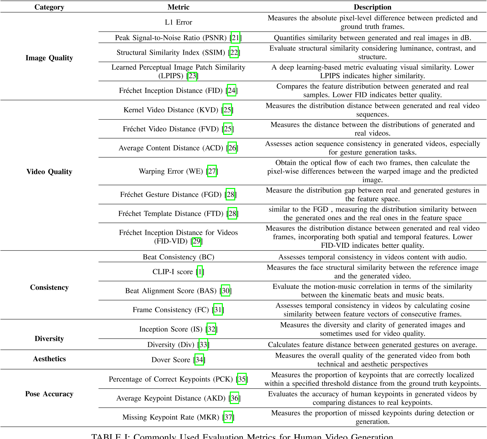

# 评价指标

图像质量、视频质量、一致性、多样性、美学和动作准确性

## Fréchet Inception Distance (FID)

<https://arxiv.org/abs/1706.08500>

 

> &#x2705; CNN＋Softmax 是一个预训练好的图像分类网络，取 softmax 上一层做为图像的 feature.    
> &#x2705; 取大量真实图像的 feature 和预训练模型生成的图 feature.    
> &#x2705; 假设两类图像的 feature 各自符合高斯分布，计算两个分布的距离。    
> &#x2705; 优点：评价结果与人类直觉很接近，缺点：需要大量 sample.   

## Contrastive Language-Image Pre-Training (CLIP) 

<https://arxiv.org/abs/2103.00020>

400 million image-text pairs  

 

> &#x2705; CLIP Score，衡量与文字的匹配度。   

P20   
## CLIP   

Encoders bridge vision and language

 - CLIP text-/image-embeddings are commonly used in diffusion models for conditional generation

  

Radford et al., “Learning Transferable Visual Models From Natural Language Supervision,” ICML 2021.     

> &#x2753; 文本条件怎么输入到 denoiser？   
> &#x2705; CLIP embedding：202 openai，图文配对训练用 CLIP 把文本转为 feature.   
