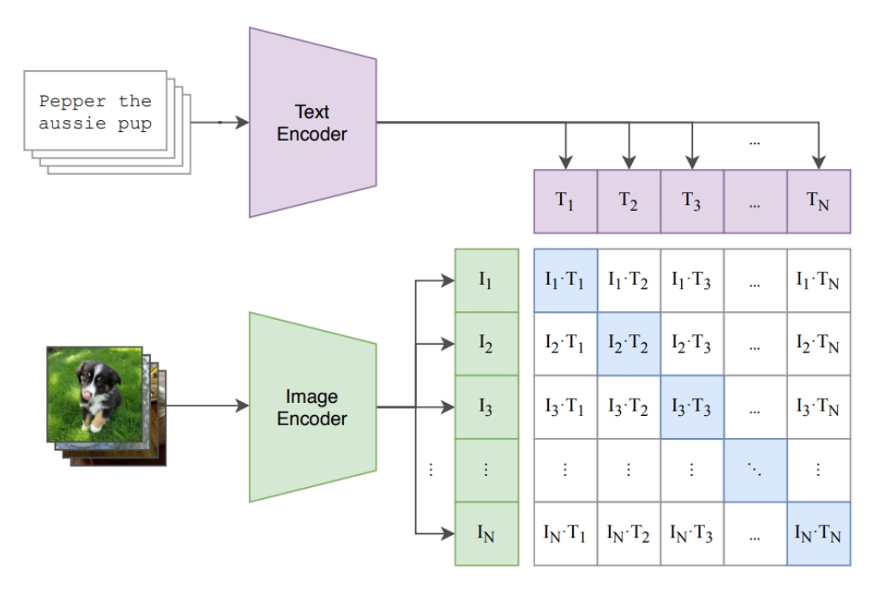

# 评价指标

 

图像质量、视频质量、一致性、多样性、美学和动作准确性

## Image-level Evaluation Metrics

 - Fréchet Inception Distance (FID, ↓): semantic similarity between images   
 - Peak Signal-to-Noise Ratio (PSNR, ↑): pixel-level similarity between images   
 - Structural Similarity Index (SSIM, ↓): pixel-level similarity between images   
 - CLIPSIM (↑): image-text relevance   

### Fréchet Inception Distance (FID)

> &#x2705; FID：评估两个 distribution 的差距有多大。   
> &#x2705; 由于使用了网络的高层 feature，可以评价 high／evel 的语义相似性。   

 

> &#x2705; CNN＋Softmax 是一个预训练好的图像分类网络，取 softmax 上一层做为图像的 feature.    
> &#x2705; 取大量真实图像的 feature 和预训练模型生成的图 feature.    
> &#x2705; 假设两类图像的 feature 各自符合高斯分布，计算两个分布的距离。    
> &#x2705; 优点：评价结果与人类直觉很接近，缺点：需要大量 sample.   

P49   
### Peak Signal-to-Noise Ratio (PSNR)

Pixel-level similarity between images

 - For two images \\(x,y \text{ of shape }  M\times N\\):   

\begin{align*} \mathrm{PSNR} (x,y) = 10 \log_{10}{} \frac{255^2}{\mathrm{MSE} (x,y)}  \end{align*}

where    

\begin{align*} \mathrm{MSE} (x,y) = \frac{1}{MN} \sum_{i=1}^{M} \sum_{j=1}^{N} (x_{ij}-y_{ij})^2\end{align*}

P50  
### Structural Similarity Index Measure (SSIM)

Pixel-level similarity between images

 - Model any image distortion as a combination of:   
(1) loss of correlation, (2) luminance distortion, (3) contrast distortion

 - For two images \\(x,y \text{ of shape }  M\times N\\):   

\begin{align*}  \mathrm{SSIM} (x,y)=l(x,y)\cdot c(x,y)\cdot s(x,y)\end{align*}

where   

\begin{align*} \begin{cases}
 \text{Lumiannce Comparison Funckon:} l(x,y)=\frac{2\mu _x\mu _y+C_1}{\mu _x^2+\mu _y^2+C_1}  \\\\ 
 \text{Contrast Comparison Funckon:} c(x,y)=\frac{2\sigma  _x\sigma  _y+C_2}{\sigma  _x^2+\sigma  _y^2+C_2}  \\\\ 
  \text{Structure Comparison Funckon:} s(x,y)=\frac{\sigma  _{xy}+C_3}{\sigma  _{x}\sigma  _{y}+C_3}  \end{cases}\end{align*}
 
P51   
### CLIP Similarity   

> &#x2705; CLIP Score，衡量与文字的匹配度。 
 

|ID|Year|Name|Note|Tags|Link|
|---|---|---|---|---|---|
||2017|GANs Trained by a Two Time-Scale Update Rule Converge to a Local Nash Equilibrium|||[link](<https://arxiv.org/abs/1706.08500>)|
||2023|Hung-Yi Lee, “Machine Learning 2023 Spring,” National Taiwan University.  |
||2010|Horé et al., “Image Quality Metrics: PSNR vs. SSIM,” |
||2004|Wang et al., “Image Quality Assessment: from Error Visibility to Structural Similarity,”|
||2021|Radford et al., “Learning Transferable Visual Models From Natural Language Supervision,” |

## **Video-level Evaluation Metrics**

 - Fréchet Video Distance (FVD, ↓): semantic similarity & temporal coherence   
 - Kernel Video Distance (KVD, ↓): video quality (via semantic features and MMD)   
 - Video Inception Score (IS, ↑): video quality and diversity   
 - Frame Consistency CLIP Score (↑): frame temporal semantic consistency  

P52   
### Fréchet Video Distance (FVD)  

Semantic similarity and temporal coherence between two videos    

 

P53   
### Kernel Video Distance   

Video quality assessment via semantic features and MMD  

     

P54   
### Video Inception Score (IS)

Video quality and diversity

 

> &#x2705; 多样性，在不给定 condition 的情况生成的分布的多样性。   
> &#x2705; 质量：在给 condition 的条件下应生成特定的类别。   

P55   
### Frame Consistence CLIP scores

Frame temporal semantic consistency

 - Compute CLIP image embeddings for all frames   
 - Report average cosine similarity between all pairs of frames   

 

|ID|Year|Name|Note|Tags|Link|
|---|---|---|---|---|---|
||2019|Unterthiner et al., “FVD: A new Metric for Video Generation,”|   
||2018|Unterthiner et al., “Towards Accurate Generative Models of Video: A New Metric & Challenges,”|
||2016|Salimans et al., “Improved Techniques for Training GANs,” |  
||2018|Barratt et al., “A Note on the Inception Score,” |
||2020|Saito et al., “Train Sparsely, Generated Densely: Memory-Efficient Unsupervised Training of High-Resolution Temporal GAN,” |
||2021|Radford et al., “Learning Transferable Visual Models From Natural Language Supervision,” |

P57   
## 主观评价    

### Hybrid evaluation：**EvalCrafter**

 - Creates a balanced prompt list for evaluation   
 - **Multi-criteria decision analysis** on 18 metrics: visual quality, content quality…   
 - Regress the coefficients of all metrics to generate an overall score aligned with user opinions   

 

|ID|Year|Name|Note|Tags|Link|
|---|---|---|---|---|---|
||2023|Liu et al., “EvalCrafter: Benchmarking and Evaluating Large Video Generation Models,”|

P45   
# Datasets

The WebVid-10M Dataset

 

Bain et al., “Frozen in Time: A Joint Video and Image Encoder for End to End Paper,” ICCV 2021.    

> &#x2705; WebVid 是常用的视频数据集，有高清视频及配对文本。   