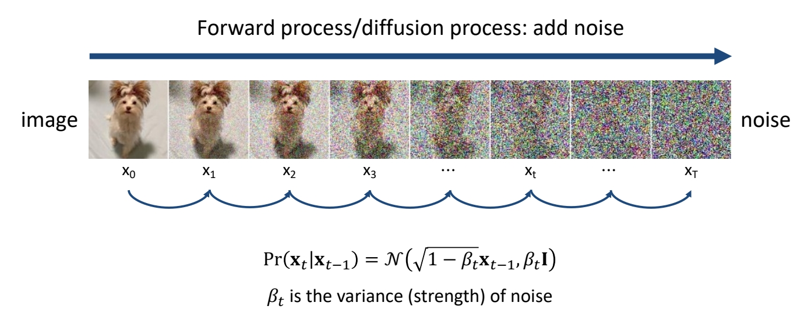
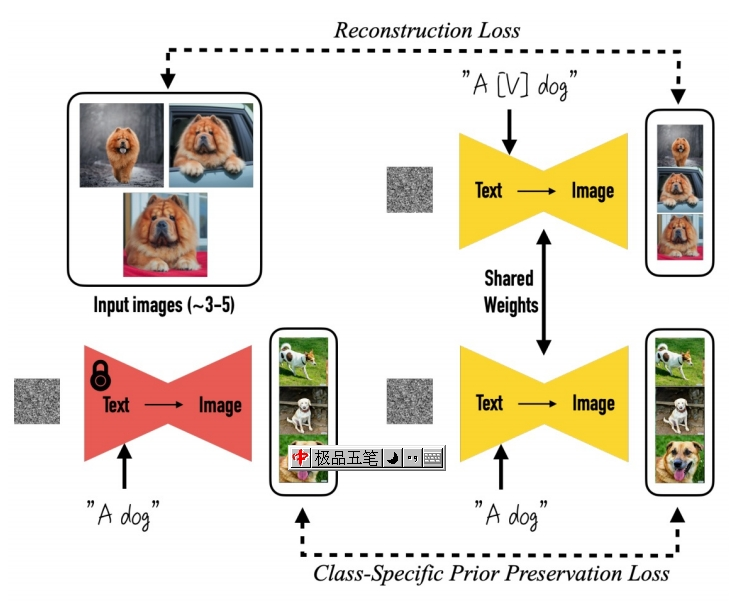

P6  
# 1 DDPM (Denoising Diffusion Probabilistic Models)

P7  
## DDPM (Denoising Diffusion Probabilistic Models)

Ho et al., “Denoising Diffusion Probabilistic Models,” NeurIPS 2020.   
Sohl-Dickstein et al., “Deep Unsupervised Learning using Nonequilibrium Thermodynamics,” ICML 2015.   
Song et al., “Score-Based Generative Modeling through Stochastic Differential Equations,” ICLR 2021.   
Vahdat et al., “Denoising Diffusion Models: A Generative Learning Big Bang,” CVPR 2023 Tutorial.   

> &#x2705; Diffusion Model 的第一篇论文    

P8   
## DDPM (Denoising Diffusion Probabilistic Models)

Ho et al., “Denoising Diffusion Probabilistic Models,” NeurIPS 2020.    
Sohl-Dickstein et al., “Deep Unsupervised Learning using Nonequilibrium Thermodynamics,” ICML 2015.    
Song et al., “Score-Based Generative Modeling through Stochastic Differential Equations,” ICLR 2021.   
Vahdat et al., “Denoising Diffusion Models: A Generative Learning Big Bang,” CVPR 2023 Tutorial.   

P9  
## DDPM (Denoising Diffusion Probabilistic Models)

Ho et al., “Denoising Diffusion Probabilistic Models,” NeurIPS 2020.    
Sohl-Dickstein et al., “Deep Unsupervised Learning using Nonequilibrium Thermodynamics,” ICML 2015.   
Song et al., “Score-Based Generative Modeling through Stochastic Differential Equations,” ICLR 2021.   
Vahdat et al., “Denoising Diffusion Models: A Generative Learning Big Bang,” CVPR 2023 Tutorial.   

> &#x2705; 通过公式推导，可以直接从 \\(x_0\\) 加噪到 \\(x_t\\)．   

P10   
## DDPM (Denoising Diffusion Probabilistic Models)

Ho et al., “Denoising Diffusion Probabilistic Models,” NeurIPS 2020.
Sohl-Dickstein et al., “Deep Unsupervised Learning using Nonequilibrium Thermodynamics,” ICML 2015.
Song et al., “Score-Based Generative Modeling through Stochastic Differential Equations,” ICLR 2021.
Vahdat et al., “Denoising Diffusion Models: A Generative Learning Big Bang,” CVPR 2023 Tutorial.

P11   
## DDPM (Denoising Diffusion Probabilistic Models)

Ho et al., “Denoising Diffusion Probabilistic Models,” NeurIPS 2020.    
Sohl-Dickstein et al., “Deep Unsupervised Learning using Nonequilibrium Thermodynamics,” ICML 2015.    
Song et al., “Score-Based Generative Modeling through Stochastic Differential Equations,” ICLR 2021.    
Vahdat et al., “Denoising Diffusion Models: A Generative Learning Big Bang,” CVPR 2023 Tutorial.   

> &#x2705; 输入带噪声图像，预测噪声，原图像去掉噪声后得到干净图像。     
> &#x2705; \\(x_t\\) 可以处于任意时间步，可以一步去噪到干净图像。   
> &#x2705; Noise Predictor Network 通常使用 UNet.    
> &#x2705; \\(t\\) 代表时间步，网络可以以此决定去噪程度。   
> &#x2705; “A cat” 是文本 condition.    

P12   
## DDPM (Denoising Diffusion Probabilistic Models)

Ho et al., “Denoising Diffusion Probabilistic Models,” NeurIPS 2020.   
Sohl-Dickstein et al., “Deep Unsupervised Learning using Nonequilibrium Thermodynamics,” ICML 2015.   
Song et al., “Score-Based Generative Modeling through Stochastic Differential Equations,” ICLR 2021.   
Vahdat et al., “Denoising Diffusion Models: A Generative Learning Big Bang,” CVPR 2023 Tutorial.   

> &#x2705; 虽然训练时是根据 \\(x_t\\) 预测 \\(x_0\\).   
> &#x2705; 但是推断时，\\(x_t\\) 减去噪声后，又重新 sample 出一个噪声后加到图像上，变成 \\(x_{t-1}\\)．   
> &#x2705; 考虑一次去噪可能会出错，所以再加一些噪声，达到慢慢去噪的效果。   

P14  

## DDIM (Denoising Diffusion Implicit Models)

Song et al., “Score-Based Generative Modeling through Stochastic Differential Equations,” ICLR 2021.    
Song et all, “Denoising Diffusion Implicit Models,” ICLR 2021.   

> &#x2753; 是否可以快速去噪？   
> &#x2705; DDIM：可以直接从 \\(t_2\\) 去噪到 \\(t_1\\).   
> &#x2705; 把 \\(x_t\\) 去掉一个 nolse 之后，不是 sample 另一个noise，而是把原来的 noise 乘以一个系数再加回去。   

P15   
## Denoising Diffusion Models

DDPM vs DDIM   

|||
|--|--|
|  | **DDPM cannot skip timesteps**    A few hundreds steps to generate an image |
| |**DDIM can skip timesteps**   Say 50 steps to generate an image |

Song et al., “Score-Based Generative Modeling through Stochastic Differential Equations,” ICLR 2021.   
Song et all, “Denoising Diffusion Implicit Models,” ICLR 2021.    

P16   
## DDIM Inversion

The task of Inversion

Song et al., “Denoising Diffusion Implicit Models,” ICLR 2021.    
Su et al., “Dual Diffusion Implicit Bridges for Image-to-Image Translation,” ICLR 2023.    
Mokadi et al., “Null-text Inversion for Editing Real Images using Guided Diffusion Models,” CVPR 2023.    

> &#x2705; 已有训好的 denoiser，输入干净图像，求它的噪声。   

P17   
## DDIM Inversion

Based on the assumption that the ODE process can be reversed in the limit of small steps    

**Forward Diffusion Process**: Add \\(\mathcal{N} (0,\mathbf{I} ) \\) Noise

**DDIM Inversion Process**: Add Noise **inverted** by the trained DDIM denoiser

Song et al., “Denoising Diffusion Implicit Models,” ICLR 2021.    
Su et al., “Dual Diffusion Implicit Bridges for Image-to-Image Translation,” ICLR 2023.   
Mokadi et al., “Null-text Inversion for Editing Real Images using Guided Diffusion Models,” CVPR 2023.    

> &#x2705; 前向过程与 DDIM Inverse 的区别   
> &#x2705; DDIM Inverse 可用于图片编辑   

p18   
## Wanted to learn more?

 - CVPR Tutorial (English): <https://www.youtube.com/watch?v=cS6JQpEY9cs>   
 - Lil’s blog: <https://lilianweng.github.io/posts/2021-07-11-diffusion-models/>   
 - Hung-yi Lee (Chinese):    
    - <https://www.youtube.com/watch?v=azBugJzmz-o>   
    - <https://www.youtube.com/watch?v=ifCDXFdeaaM>   
 - Checkout codes -- Always associate theory and implementation!   

P20   
## CLIP   

Encoders bridge vision and language

 - CLIP text-/image-embeddings are commonly used in diffusion models for conditional generation

|||
|--|--|
|   |   |

Radford et al., “Learning Transferable Visual Models From Natural Language Supervision,” ICML 2021.     

> &#x2753; 文本条件怎么输入到 denoiser？   
> &#x2705; CLIP embedding：202 openai，图文配对训练用 CLIP 把文本转为 feature.   

P21   

## Latent Diffusion

 

> &#x2705; 把图片转为 high leve sematic space    
> &#x2705; semanic 更抽像，维度更低，因此模型更高效。   

P22   
## Stable Diffusion

Conditional/unconditional image generation    

 

Rombach et al., “High-Resolution Image Synthesis with Latent Diffusion Models,” CVPR 2022.      

> &#x2705; Stable Diffusion 特点：   
> &#x2705; (1)：在 latent space 上工作   
> &#x2705; (2)：引入多种 condition．   

P24   
## LoRA: Low-Rank Adaptation   

Few-shot finetuning of large models for personalized generation

|||
|--|--|
|   |   |

Hu et al., “LoRA: Low-Rank Adaptation of Large Language Models,” arXiv 2021.    
Gu et al., “Mix-of-Show: Decentralized Low-Rank Adaptation for Multi-Concept Customization of Diffusion Models,” arXiv 2023.   

> &#x2705; LoRA：Low-Rank Adaptation    
> &#x2705; 对已训好的大模型进行微调，生成想要的风格。  
> &#x2705; 特点：要训练或调整的参数非常少。   

P25   
## DreamBooth   

Few-shot finetuning of large models for generating personalized concepts

|||
|--|--|
|   |   |

Ruiz et al., “DreamBooth: Fine Tuning Text-to-Image Diffusion Models for Subject-Driven Generation,” CVPR 2023.    

> &#x2705; DreamBooth：输入文本和图像，文本中的［V］指代图像，生成新图像。   
> &#x2705; 特点：对预训练的 diffusion model 的权重改变比较大。   

P26  
## ControlNet    

Conditional generation with various guidances    

Zhang et al., “Adding Conditional Control to Text-to-Image Diffusion Models,” ICCV 2023.     

> &#x2705; Control Net：更细粒度的 condition．   
> &#x2705; 方法：（1）预训练好 Diffusion Model（2）参数复制一份，原始网络 fix（3）用各种 condition finetune 新的网络。（4）两个网络结合到一起。   

P27   
## ControlNet   

Conditional generation with various guidances   
 - Finetune parameters of a trainable copy   

Zhang et al., “Adding Conditional Control to Text-to-Image Diffusion Models,” ICCV 2023.   

P28   
## ControlNet   

Conditional generation with various guidances

Zhang et al., “Adding Conditional Control to Text-to-Image Diffusion Models,” ICCV 2023. 

---------------------------------------
> 本文出自CaterpillarStudyGroup，转载请注明出处。
>
> https://caterpillarstudygroup.github.io/ImportantArticles_mdbook/