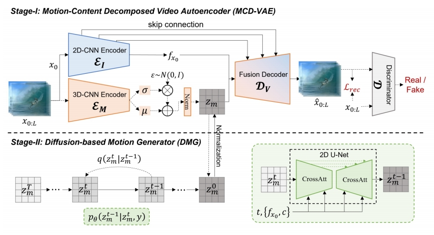
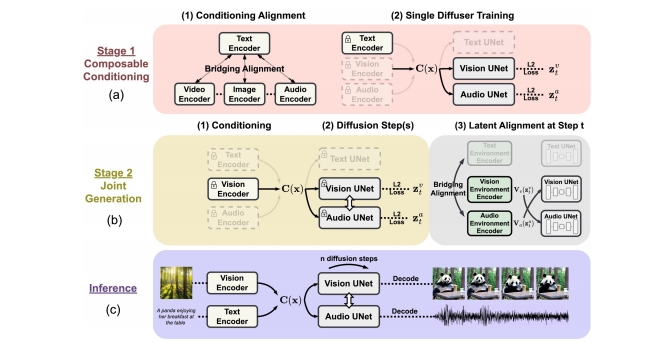

P135  

 

# MCDiff  

|ID|Year|Name|Note|Tags|Link|
|---|---|---|---|---|---|
|51|2023|Motion-Conditioned Diffusion Model for Controllable Video Synthesis|  &#x2705; (1) 把用户提供的稀疏运动轨迹转为dense光流  &#x2705; (2) 用光流作为 Condition 生成视频。|Two-stage,  自回归生成|[link](https://caterpillarstudygroup.github.io/ReadPapers/51.html)|
|44|2024|Motion-I2V: Consistent and Controllable Image-to-Video Generation with Explicit Motion Modeling|  &#x2705; &#x2705; (1) 用光流作为 Condition 生成视频。  (2) 把用户提供的控制信号转为dense光流，从而控制图像生成。|Two-stage|[link](https://caterpillarstudygroup.github.io/ReadPapers/44.html)|
|47|2024|Puppet-Master: Scaling Interactive Video Generation as a Motion Prior for Part-Level Dynamics|拖拽控制的对象零件级运动的视频生成|零件级运动数据集|[link](https://caterpillarstudygroup.github.io/ReadPapers/47.html)|

P136  

> &#x2705; 需要训练的模型，且针对一个模型进行训练。   
> &#x2705; 基本泛式：输入：一段视频，一个文生图模型，一个文本提示词。输出：基于定制化的文生图得到文生视频。   
> &#x2705; 不在大规模上训练，只在一个视频上训练，只需十分钟。  

P139   
# The Power of Sound (TPoS)

Sound- and text-guided video generation

 - Input/output: a text prompt + an audio segment → a video

 

Jeong et al., “The Power of Sound (TPoS): Audio Reactive Video Generation with Stable Diffusion,” ICCV 2023.    

> &#x2705; 用文生图模型生成 appearance, dynamics 来自于 reference video.    

P140
# Sound-Guided Video Generation: More Works

|||
|--|--|
|   | **AADiff** (Lee et al.)   “AADiff: Audio-Aligned Video Synthesis with Text-to-Image Diffusion,” CVPRW 2023. |
|  | **Generative Disco** (Liu et al.)  “Generative Disco: Text-to-Video Generation for Music Visualization,” arXiv 2023. |

Xing et al., “A Survey on Video Diffusion Models,” arXiv 2023.   

> &#x2705; 一些观察：文生图模型能生成动词，但动作没有一致性。可以通过引入 temperal attention 保证一致性。    

P141  
# Image-Guided Video Generation: More Works

|||
|--|--|
|   | Generative Image Dynamics (Li et al.)   “Generative Image Dynamics,” arXiv 2023. |
|    | **LaMD** (Hu et al.)   “LaMD: Latent Motion Diffusion for Video Generation,” arXiv 2023. |
|    | **LFDM** (Ni et al.)   “Conditional Image-to-Video Generation with Latent Flow Diffusion Models,” CVPR 2023.  |

Xing et al., “A Survey on Video Diffusion Models,” arXiv 2023.   

> &#x2705; 当前帧只与上帧和前一帧做 attention，大大减少计算量。  
> &#x2705; 在所有帧上做 attention 开销比较大。   
> &#x2705; 解决方法：前一帧与第一帧。   
> &#x2753; 怎么保证生成动作与原视频动作的一致性呢?    

P142  
# Cinematic Mindscapes   

Brain activity-guided video generation

 - Task: human vision reconstruction via fMRI signal-guided video generation   

 

Chen et al., “Cinematic Mindscapes: High-quality Video Reconstruction from Brain Activity,” arXiv 2023.     

> &#x2705; 对要编辑的视频，先 DDIM Inversion，得到 inverfed noise，这是保留了原视频 pattern 的 noise.   
> &#x2705; 用这个 noise 作为 init noise，还原出的视频跟原视频有比较好的结构化保留。   
> &#x2705; 解法方法

P144  
# Multimodal-Guided Video Generation: More Works

|||
|--|--|
|   | **MovieFactory** (Zhu et al.)   “MovieFactory: Automatic Movie Creation from Text using Large Generative Models for Language and Images,” arXiv 2023. |
|  | **CoDi** (Tang et al.)   “Any-to-Any Generation via Composable Diffusion,” NeurIPS 2023. |
|   | **MM-Diffusion** (Ruan et al.)   “MM-Diffusion: Learning Multi-Modal Diffusion Models for Joint Audio and Video Generation,” CVPR 2023. |
|   | **NExT-GPT** (Wu et al.)   “NExT-GPT: Any-to-Any Multimodal LLM,” arXiv 2023.  |
|  |  |

Xing et al., “A Survey on Video Diffusion Models,” arXiv 2023.

> &#x2705; 在物体改变比较大的情况下，diffusion 比其它生成方法效果更好。   

---------------------------------------
> 本文出自CaterpillarStudyGroup，转载请注明出处。
>
> https://caterpillarstudygroup.github.io/ImportantArticles/