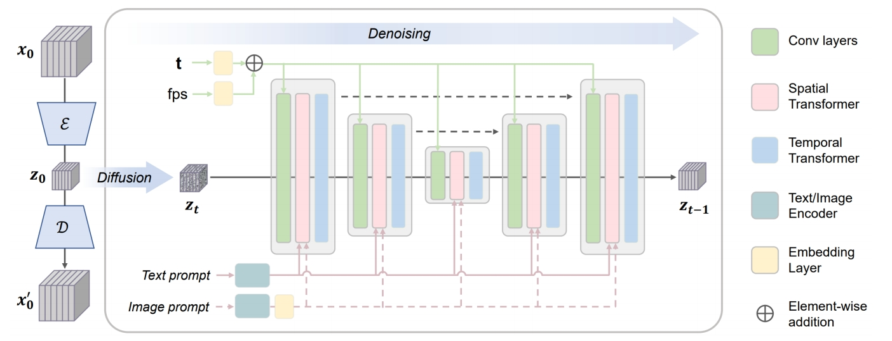

P66   
# 2 Video Generation   

## 2.2 Open-source base models

P67   

m
P68   
## ModelScopeT2V

Leverage pretrained T2I models for video generation

 - Inflate Stable Diffusion to a 3D model, preserving pretrained weights   
 - Insert spatio-temporal blocks, can handle varying number of frames   

|||
|--|--|
|   |   |

Wang et al., “ModelScope Text-to-Video Technical Report,” arXiv 2023.    

> &#x2705; 基本思路：（1）以 Stable Diffusion 为基础，在 latent space 工作。（2）把 SD 中的 2D 操作扩展为 3D.   

P69   
## ModelScopeT2V

Leverage pretrained T2I models for video generation   

 - Inflate Stable Diffusion to a 3D model, preserving pretrained weights    
 - Insert spatio-temporal blocks   

 

Wang et al., “ModelScope Text-to-Video Technical Report,” arXiv 2023.     

> &#x2705; 扩展方法为（2＋1）D，因此在 2D 时空 spatial 的卷积操作和 Attention 操作之后分别增加了 temporal 的卷积和 Attention.   

P70   
## ModelScopeT2V    

Leverage pretrained T2I models for video generation

 - Inflate Stable Diffusion to a 3D model, preserving pretrained weights   
 - Insert spatio-temporal blocks, **can handle varying number of frames**   

 

Wang et al., “ModelScope Text-to-Video Technical Report,” arXiv 2023. 

> &#x2705; 时域卷积操作能指定 frame 数，因此可以“生成视频”与“生成图像”联合训练。   
> &#x2753; 时序卷积不能做流式，能不能用 transformer.   

P71   
## ModelScopeT2V

Length = 1   
Model generate images   

P72   
## ModelScopeT2V   

Leverage pretrained T2I models for video generation

 

ZeroScope: finetunes ModelScope on a small set of high-quality videos, resulting into higher resolution at 
1024 x 576, without the Shutterstock watermark    

Wang et al., “ModelScope Text-to-Video Technical Report,” arXiv 2023.     

> &#x2705; ZeroScope 在 ModelScope 上 finetune，使用了非常小但质量非常高的数据，得到了高分辨率的生成效果。   

P73   
## ModelScopeT2V   

Leverage pretrained T2I models for video generation  

P74  
## ModelScopeT2V

Leverage pretrained T2I models for video generation

|||||
|--|--|--|--|
| " Robot dancing in times square,” arXiv 2023.  | " Clown fish swimming through the coral reef,” arXiv 2023.| " Melting ice cream dripping down the cone,” arXiv 2023.| " Hyper-realistic photo of an abandoned industrial site during a storm,” arXiv 2023.|
|   |   |   |   |

Wang et al., “ModelScope Text-to-Video Technical Report,” arXiv 2023.    

P75   
## Show-1

Better text-video alignment? Generation in both pixel- and latent-domain

 

Zhang et al., “Show-1: Marrying Pixel and Latent Diffusion Models for Text-to-Video Generation,” arXiv 2023.    

> &#x2705; 当前模型存在的问题：当文本变复杂时，文本和内容的 align 不好。  
> &#x2705; show-1 在 alignment 上做了改进。   

P76   
## Show-1

Better text-video alignment? Generation in both pixel- and latent-domain   

**Motivation**

 - Pixel-based VDM achieves better text-video alignment than latent-based VDM   

|||
|--|--|
|  |  |

Zhang et al., “Show-1: Marrying Pixel and Latent Diffusion Models for Text-to-Video Generation,” arXiv 2023.   

> &#x2705; 实验发现：pixel spase 比 latent space 更擅长 align ment.   
> &#x2705; 原因：在 latent space，文本对 pixel 的控制比较差。   

P77   
## Show-1

Generation in both pixel- and latent-domain

**Motivation**

 - Pixel-based VDM achieves better text-video alignment than latent-based VDM   
 - Pixel-based VDM takes much larger memory than latent-based VDM    

 

Zhang et al., “Show-1: Marrying Pixel and Latent Diffusion Models for Text-to-Video Generation,” arXiv 2023.   

P78   
## Show-1   

Generation in both pixel- and latent-domain  

**Motivation** 

 - Use Pixel-based VDM in low-res stage   
 - Use latent-based VDM in high-res stage   

 

Zhang et al., “Show-1: Marrying Pixel and Latent Diffusion Models for Text-to-Video Generation,” arXiv 2023.   

P79   
## Show-1   

Generation in both pixel- and latent-domain

<https://github.com/showlab/Show-1>

 - Better text-video alignment   
 - Can synthesize large motion   
 - Memory-efficient   

Zhang et al., “Show-1: Marrying Pixel and Latent Diffusion Models for Text-to-Video Generation,” arXiv 2023.   

P80  
## VideoCrafter  

• Latent diffusion inserted with temporal layers

 

Chen et al., “VideoCrafter1: Open Diffusion Models for High-Quality Video Generation,” arXiv 2023.    

P81  
## LaVie  

Joint image-video finetuning with curriculum learning

 

Wang et al., “LAVIE: High-Quality Video Generation with Cascaded Latent Diffusion Models,” arXiv 2023.   

> &#x2705; 提供了一套高质量数据集，生成的视频质量也更好（训练集很重要）。   

P83   
## Stable Video Diffusion  

Scaling latent video diffusion models to large datasets

**Data Processing and Annotation** 

 - Cut Detection and Clipping    
    - Detect cuts/transitions at multiple FPS levels   
    - Extract clips precisely using keyframe timestamps   
 - Synthetic Captioning   
    - Use CoCa image captioner to caption the mid-frame of each clip   
    - Use V-BLIP to obtain video-based caption   
    - Use LLM to summarise the image- and video-based caption   
    - Compute CLIP similarities and aesthetic scores
 - Filter Static Scene   
    - Use dense optical flow magnitudes to filter static scenes   
 - Text Detection   
    - Use OCR to detect and remove clips with excess text    

Blattmann et al., “Stable Video Diffusion: Scaling Latent Video Diffusion Models to Large Datasets,” 2023.     

> &#x2705; SVD：构建数据集    
> &#x2705; （1）把视频切成小段，描述会更准确   
> &#x2705; （2）用现有模型生成视频描述     

P84   
## Stable Video Diffusion   

Scaling latent video diffusion models to large datasets

**Data Processing and Annotation**  

 

Blattmann et al., “Stable Video Diffusion: Scaling Latent Video Diffusion Models to Large Datasets,” 2023.    

P85  
## Stable Video Diffusion   

Scaling latent video diffusion models to large datasets

**Stage I: Image Pretraining**

 - Initialize weights from Stable Diffusion 2.1 (text-to-image model)   

 

Blattmann et al., “Stable Video Diffusion: Scaling Latent Video Diffusion Models to Large Datasets,” 2023.    

P86   
## Stable Video Diffusion   

Scaling latent video diffusion models to large datasets

**Stage II: Curating a Video Pretraining Dataset**

 - Systematic Data Curation
    - Curate subsets filtered by various criteria (CLIP-, OCR-, optical flow-, aesthetic-scores…)
    - Assess human preferences on models trained on different subsets
    - Choose optimal filtering thresholds via Elo rankings for human preference votes
 - Well-curated beats un-curated pretraining dataset

 

Blattmann et al., “Stable Video Diffusion: Scaling Latent Video Diffusion Models to Large Datasets,” 2023.  

P87   
## Stable Video Diffusion  

Scaling latent video diffusion models to large datasets

**Stage III: High-Quality Finetuning**

 - Finetune base model (pretrained from Stages I-II) on high-quality video data   
    - High-Resolution Text-to-Video Generation   
       - ~1M samples. Finetune for 50K iterations at 576x1024 (in contrast to 320x576 base resolution)   
    - High Resolution Image-to-Video Generation   
    - Frame Interpolation   
    - Multi-View Generation   
 - Performance gains from curation persists after finetuning   

 

Blattmann et al., “Stable Video Diffusion: Scaling Latent Video Diffusion Models to Large Datasets,” 2023.    

> &#x2705; 在少量高质量数据上 finehune，质量提升很大。   