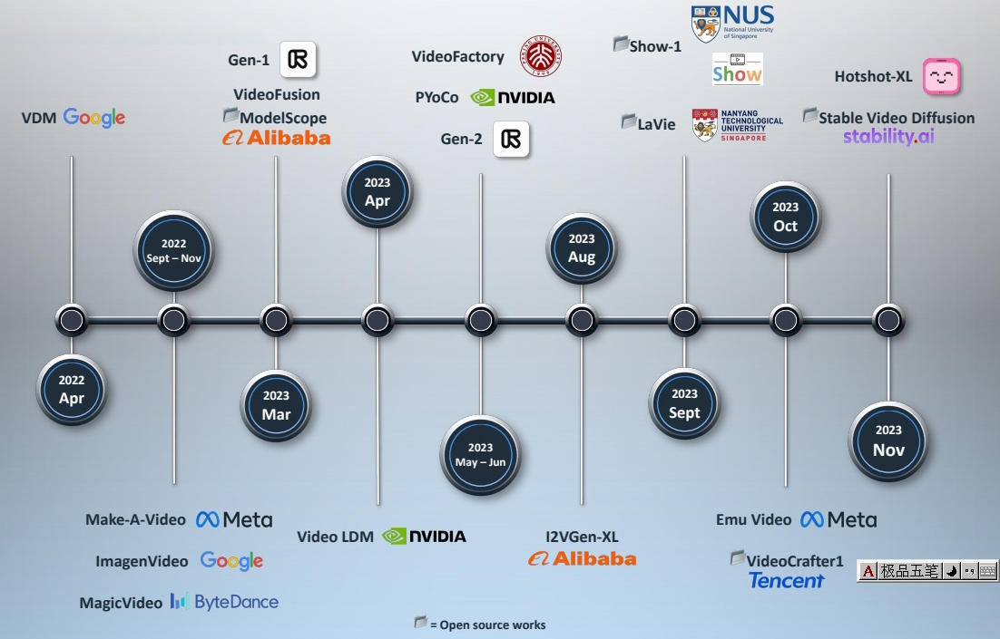

P36  
# Video Diffusion Models  

## 2D -> 3D

VDM的一般思路是，在T2I基模型的基础上，引入时序模块并使用视频数据进行训练。  

引入时间模型的方法有卷积方法（Conv3D、Conv(2+1)D）、注意力机制(Cross Attention、Transformer)

|||
|---|---|
|Conv2D||
|Conv3D||
|Conv(2+1)D||

> &#x2705; \\(t\times d\times d\\) 卷积 kenal 数量非常大，可以对 kernel 做分解，先在 spatial 上做卷积，然后在 temporal 上做卷积。   
> &#x2705; 特点：效果还不错，效率也高。   

P39   
## 3D U-Net factorized over space and time

> &#x2705; 2D U-Net 变为 3D U-Net，需要让其内部的 conv 操作和 attention 操作适配 3D.   

- Image 2D conv inflated as → space-only 3D conv, i.e., 2 in (2+1)D Conv   

> &#x2705; (1) 2D conv 适配 3D，实际上只是扩充一个维度变成伪 3D，没有对时序信息做抽象。  

   - Kernel size: (3×3) → (<u>1</u>×3×3)   
   - Feature vectors: (height × weight × channel) → (<u>frame</u> × height × width × channel)   
- Spatial attention: remain the same   

> &#x2705; (2) attention 操作同样没有考虑时序。   

- Insert temporal attention layer: attend across the temporal dimension (spatial axes as batch)   

> &#x2705; (3) 时序上的抽象体现在 temporal attention layer 上。   

|ID|Year|Name|Note|Tags|Link|
|---|---|---|---|---|---|
||2022|Video Diffusion Models|

P40  
# Make-A-Video

|ID|Year|Name|Note|Tags|Link|
|---|---|---|---|---|---|
||2022|Make-A-Video: Text-to-Video Generation without Text-Video Data|

## Cascaded generation

 

> &#x2705; 效果更好，框架在当下更主流。   
> &#x2705; (1) SD：decoder 出关键帧的大概影像。  
> &#x2705; (2) FI：补上中间帧。   
> &#x2705; (3) SSR：时空上的超分。   
> &#x2705; 时序上先生成关键帧再插帧，空间上先生成低质量图像再超分。   
> &#x2705; 这种时序方法不能做流式输出。   

P41   

    

> &#x2753; 第 3 步时间上的超分为什么没有增加帧数？   

P42  

  

> &#x2705; 此处的伪 3D 是指 (2＋1)D，它有时序上的抽像，与 VDM 不同。   
> &#x2705; 空间卷积使用预训练好的图像模型。   

P43   
 

> &#x2705; attention 操作也是 (2＋1)D．      

P44  

## **Training**
 - 4 main networks (decoder + interpolation + 2 super-res)   
    - First trained on images alone    
    - Insert and finetune temporal layers on videos   
 - Train on WebVid-10M and 10M subset from HD-VILA-100M   

> &#x2705; 先在图片上训练，再把 temporal layer 加上去。    

P58  
## Evaluate

 

P59  

   

> &#x2705; 早期都在 UCF 数据上比较，但 UCF 本身质量比较低，新的生成方法生成的质量更高，因此不常用 UCF 了。  

P60  

 

P62   

## 应用：**From static to magic**   

Add motion to a single image or fill-in the in-betw    

 

P63   
# Imagen & Imagen Video

Leverage pretrained T2I models for video generation; Cascaded generation

|||
|--|--|
|   |   |

Imagen: Saharia et al., “Photorealistic Text-to-Image Diffusion Models with Deep Language Understanding,” arXiv 2022.    
Imagen Video: Ho et al., “Imagen Video: High Definition Video Generation with Diffusion Models,” arXiv 2022.    

> &#x2705; 先在 image 上做 cascade 生成      
> &#x2705; 视频是在图像上增加时间维度的超分   
> &#x2705; 每次的超分都是独立的 diffusion model?   
> &#x2753; temporal 超分具体是怎么做的？   

P64   
# Align your Latents

|ID|Year|Name|Note|Tags|Link|
|---|---|---|---|---|---|
|48|2023|Align your Latents: High-Resolution Video Synthesis with Latent Diffusion Models|T2I(LDM) -> T2V(SVD) Cascaded generation||[link](https://caterpillarstudygroup.github.io/ReadPapers/48.html)| 

---------------------------------------
> 本文出自CaterpillarStudyGroup，转载请注明出处。
>
> https://caterpillarstudygroup.github.io/ImportantArticles/