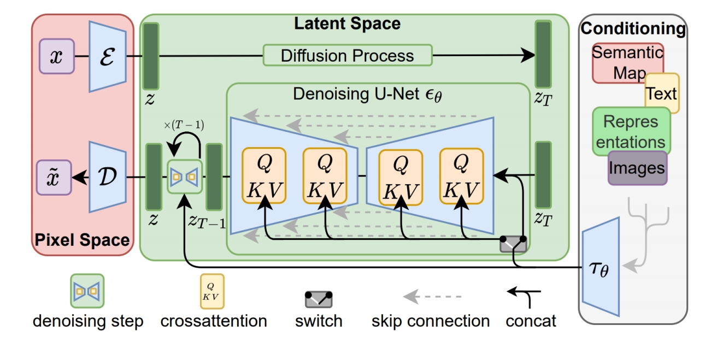
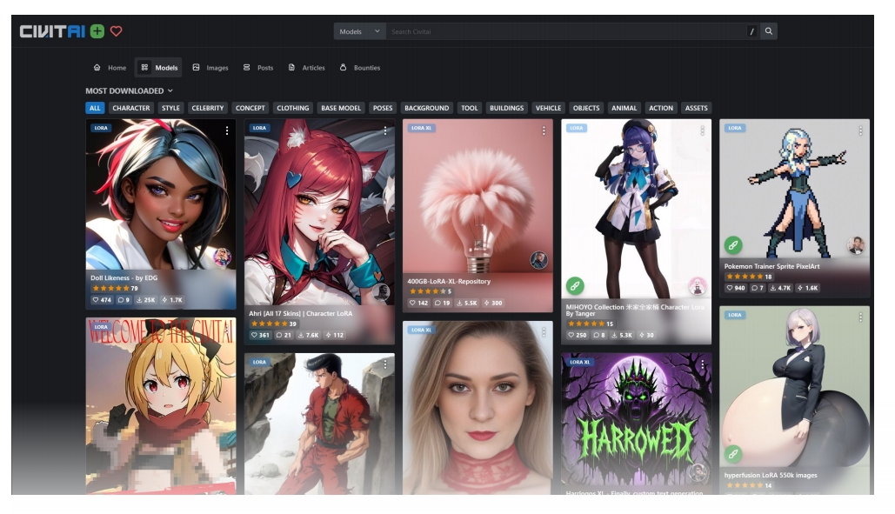

# Tutorial: Video Diffusion Models

Mike Shou   

Asst Prof, National U. of Singapore   

Joint work with Pei Yang & Jay Wu   

Slides:<https://sites.google.com/view/showlab/tutorial> 

P2  
## Video Foundation Model  

P5  
## Outline of “Tutorial: Video Diffusion Models”

1. Fundamentals of Diffusion Models
2. **Video Generation**
3. **Video Editing**
4. Summary

P6  
# 1 DDPM (Denoising Diffusion Probabilistic Models)

P7  
## DDPM (Denoising Diffusion Probabilistic Models)

Ho et al., “Denoising Diffusion Probabilistic Models,” NeurIPS 2020.   
Sohl-Dickstein et al., “Deep Unsupervised Learning using Nonequilibrium Thermodynamics,” ICML 2015.   
Song et al., “Score-Based Generative Modeling through Stochastic Differential Equations,” ICLR 2021.   
Vahdat et al., “Denoising Diffusion Models: A Generative Learning Big Bang,” CVPR 2023 Tutorial.   

P8   
## DDPM (Denoising Diffusion Probabilistic Models)

Ho et al., “Denoising Diffusion Probabilistic Models,” NeurIPS 2020.    
Sohl-Dickstein et al., “Deep Unsupervised Learning using Nonequilibrium Thermodynamics,” ICML 2015.    
Song et al., “Score-Based Generative Modeling through Stochastic Differential Equations,” ICLR 2021.   
Vahdat et al., “Denoising Diffusion Models: A Generative Learning Big Bang,” CVPR 2023 Tutorial.   

P9  
## DDPM (Denoising Diffusion Probabilistic Models)

Ho et al., “Denoising Diffusion Probabilistic Models,” NeurIPS 2020.    
Sohl-Dickstein et al., “Deep Unsupervised Learning using Nonequilibrium Thermodynamics,” ICML 2015.   
Song et al., “Score-Based Generative Modeling through Stochastic Differential Equations,” ICLR 2021.   
Vahdat et al., “Denoising Diffusion Models: A Generative Learning Big Bang,” CVPR 2023 Tutorial.   

P10   
## DDPM (Denoising Diffusion Probabilistic Models)

Ho et al., “Denoising Diffusion Probabilistic Models,” NeurIPS 2020.
Sohl-Dickstein et al., “Deep Unsupervised Learning using Nonequilibrium Thermodynamics,” ICML 2015.
Song et al., “Score-Based Generative Modeling through Stochastic Differential Equations,” ICLR 2021.
Vahdat et al., “Denoising Diffusion Models: A Generative Learning Big Bang,” CVPR 2023 Tutorial.

P11   
## DDPM (Denoising Diffusion Probabilistic Models)

Ho et al., “Denoising Diffusion Probabilistic Models,” NeurIPS 2020.    
Sohl-Dickstein et al., “Deep Unsupervised Learning using Nonequilibrium Thermodynamics,” ICML 2015.    
Song et al., “Score-Based Generative Modeling through Stochastic Differential Equations,” ICLR 2021.    
Vahdat et al., “Denoising Diffusion Models: A Generative Learning Big Bang,” CVPR 2023 Tutorial.   

P12   
## DDPM (Denoising Diffusion Probabilistic Models)

Ho et al., “Denoising Diffusion Probabilistic Models,” NeurIPS 2020.   
Sohl-Dickstein et al., “Deep Unsupervised Learning using Nonequilibrium Thermodynamics,” ICML 2015.   
Song et al., “Score-Based Generative Modeling through Stochastic Differential Equations,” ICLR 2021.   
Vahdat et al., “Denoising Diffusion Models: A Generative Learning Big Bang,” CVPR 2023 Tutorial.   

P14  

## DDIM (Denoising Diffusion Implicit Models)

Song et al., “Score-Based Generative Modeling through Stochastic Differential Equations,” ICLR 2021.    
Song et all, “Denoising Diffusion Implicit Models,” ICLR 2021.   

P15   
## Denoising Diffusion Models

DDPM vs DDIM   

|||
|--|--|
|  | **DDPM cannot skip timesteps**    A few hundreds steps to generate an image |
| |**DDIM can skip timesteps**   Say 50 steps to generate an image |

Song et al., “Score-Based Generative Modeling through Stochastic Differential Equations,” ICLR 2021.   
Song et all, “Denoising Diffusion Implicit Models,” ICLR 2021.    

P16   
## DDIM Inversion

The task of Inversion

Song et al., “Denoising Diffusion Implicit Models,” ICLR 2021.    
Su et al., “Dual Diffusion Implicit Bridges for Image-to-Image Translation,” ICLR 2023.    
Mokadi et al., “Null-text Inversion for Editing Real Images using Guided Diffusion Models,” CVPR 2023.    

P17   
## DDIM Inversion

Based on the assumption that the ODE process can be reversed in the limit of small steps    

Forward Diffusion Process: Add \\({\color{Red} \mathcal{N} (0,\mathbf{I} )} \\) Noise

DDIM Inversion Process: Add Noise \\({\color{Red}  \mathrm{inverted} }\\) by the trained DDIM denoiser

Song et al., “Denoising Diffusion Implicit Models,” ICLR 2021.    
Su et al., “Dual Diffusion Implicit Bridges for Image-to-Image Translation,” ICLR 2023.   
Mokadi et al., “Null-text Inversion for Editing Real Images using Guided Diffusion Models,” CVPR 2023.    

p18   
## Wanted to learn more?

 - CVPR Tutorial (English): <https://www.youtube.com/watch?v=cS6JQpEY9cs>   
 - Lil’s blog: <https://lilianweng.github.io/posts/2021-07-11-diffusion-models/>   
 - Hung-yi Lee (Chinese):    
    - <https://www.youtube.com/watch?v=azBugJzmz-o>   
    - <https://www.youtube.com/watch?v=ifCDXFdeaaM>   
 - Checkout codes -- Always associate theory and implementation!   

P20   
## CLIP   

 - CLIP text-/image-embeddings are commonly used in diffusion models for conditional generation

|||
|--|--|
|   |   |

Radford et al., “Learning Transferable Visual Models From Natural Language Supervision,” ICML 2021.     

P21   

## Latent Diffusion

 

P22   
## Stable Diffusion

Conditional/unconditional image generation    

 

Rombach et al., “High-Resolution Image Synthesis with Latent Diffusion Models,” CVPR 2022.      

P24   
## LoRA: Low-Rank Adaptation   

Few-shot finetuning of large models for personalized generation

|||
|--|--|
|   |   |

Hu et al., “LoRA: Low-Rank Adaptation of Large Language Models,” arXiv 2021.    
Gu et al., “Mix-of-Show: Decentralized Low-Rank Adaptation for Multi-Concept Customization of Diffusion Models,” arXiv 2023.   

P25   
## DreamBooth   

Few-shot finetuning of large models for generating personalized concepts

|||
|--|--|
|   |   |

Ruiz et al., “DreamBooth: Fine Tuning Text-to-Image Diffusion Models for Subject-Driven Generation,” CVPR 2023.    

P26  
## ControlNet    

Conditional generation with various guidances    

Zhang et al., “Adding Conditional Control to Text-to-Image Diffusion Models,” ICCV 2023.     

P27   
## ControlNet   

Conditional generation with various guidances   
 - Finetune parameters of a trainable copy   

Zhang et al., “Adding Conditional Control to Text-to-Image Diffusion Models,” ICCV 2023.    

P28   
## ControlNet   

Conditional generation with various guidances

Zhang et al., “Adding Conditional Control to Text-to-Image Diffusion Models,” ICCV 2023.    

P29   
# 2 Video Generation

P30  
## Video Foundation Model

P31  

P32   

# 2 Video Generation

## 2.1 Pioneering/early works

P34  
## Problem Definition

**Text-Guided Video Generation**   

Text prompt → video   

Video from Zhang et al., “Show-1: Marrying Pixel and Latent Diffusion Models for Text-to-Video Generation,” arXiv 2023.    

P35   
## Problem Definition   

P36  
## Video Diffusion Models  

Recap 3D Conv

|||
|--|--|
|   |   |

Du et al., “Learning Spatiotemporal Features with 3D Convolutional Networks,” ICCV 2015.     

P37  
## Video Diffusion Models

Recap (2+1)D Conv

|||
|--|--|
|   |   |

Du et al., “A Closer Look at Spatiotemporal Convolutions for Action Recognition,” CVPR 2018.    

P38   
## Video Diffusion Models   

Early work on video generation

Ho et al., “Video Diffusion Models,” NeurIPS 2022.  

P39   
## Video Diffusion Models

Early work on video generation   

 - 3D U-Net factorized over space and time   
 - Image 2D conv inflated as → space-only 3D conv, i.e., 2 in (2+1)D Conv   
    - Kernel size: (3×3) → (1×3×3)   
    - Feature vectors: (height × weight × channel) → (frame × height × width × channel)   
 - Spatial attention: remain the same   
 - Insert temporal attention layer: attend across the temporal dimension (spatial axes as batch)   

 

Ho et al., “Video Diffusion Models,” NeurIPS 2022.  

P40  
## Make-A-Video

Cascaded generation

 

Singer et al., “Make-A-Video: Text-to-Video Generation without Text-Video Data,” arXiv 2022. 

P41   
## Make-A-Video

Cascaded generation

 

Singer et al., “Make-A-Video: Text-to-Video Generation without Text-Video Data,” arXiv 2022.     

P42  
## Make-A-Video

Cascaded generation

 

Singer et al., “Make-A-Video: Text-to-Video Generation without Text-Video Data,” arXiv 2022.    

P43   
## Make-A-Video

Cascaded generation

 

Singer et al., “Make-A-Video: Text-to-Video Generation without Text-Video Data,” arXiv 2022.   

P44  
## Make-A-Video

Cascaded generation

**Training**
 - 4 main networks (decoder + interpolation + 2 super-res)   
    - First trained on images alone    
    - Insert and finetune temporal layers on videos   
 - Train on WebVid-10M and 10M subset from HD-VILA-100M   

P45   
## Datasets

The WebVid-10M Dataset

 

Bain et al., “Frozen in Time: A Joint Video and Image Encoder for End to End Paper,” ICCV 2021.    

P46   
## Evaluation Metrics

 

P47   

## Evaluation Metrics   

Quantitative evaluations

**Image-level Evaluation Metrics**

 - Fréchet Inception Distance (FID, ↓): semantic similarity between images   
 - Peak Signal-to-Noise Ratio (PSNR, ↑): pixel-level similarity between images   
 - Structural Similarity Index (SSIM, ↓): pixel-level similarity between images   
 - CLIPSIM (↑): image-text relevance   

**Video-level Evaluation Metrics**

 - Fréchet Video Distance (FVD, ↓): semantic similarity & temporal coherence   
 - Kernel Video Distance (KVD, ↓): video quality (via semantic features and MMD)   
 - Video Inception Score (IS, ↑): video quality and diversity   
 - Frame Consistency CLIP Score (↑): frame temporal semantic consistency   

P48   
## Fréchet Inception Distance (FID)

Semantic similarity between images

 

**Lantern image generated with Stable Diffusion 2.1.**    

Heusel et al., “GANs Trained by a Two Time-Scale Update Rule Converge to a Local Nash Equilibrium,” NeurIPS 2017.    
Hung-Yi Lee, “Machine Learning 2023 Spring,” National Taiwan University.    

P49   
## Peak Signal-to-Noise Ratio (PSNR)

Pixel-level similarity between images

 - For two images \\(x,y \text{ of shape }  M\times N\\):   

\begin{align*} \mathrm{PSNR} (x,y) = 10 \log_{10}{} \frac{255^2}{\mathrm{MSE} (x,y)}  \end{align*}

where    

\begin{align*} \mathrm{MSE} (x,y) = \frac{1}{MN} \sum_{i=1}^{M} \sum_{j=1}^{N} (x_{ij}-y_{ij})^2\end{align*}

Horé et al., “Image Quality Metrics: PSNR vs. SSIM,” ICPR 2010.    

P50  
## Structural Similarity Index Measure (SSIM)

Pixel-level similarity between images

 - Model any image distortion as a combination of:   
(1) loss of correlation, (2) luminance distortion, (3) contrast distortion

 - For two images \\(x,y \text{ of shape }  M\times N\\):   

\begin{align*}  \mathrm{SSIM} (xy)=l(x,y)\cdot c(x,y)\cdot s(x,y)\end{align*}

where   

\begin{align*} \begin{cases}
 \text{Lumiannce Comparison Funckon:} l(x,y)=\frac{2\mu _x\mu _y+C_1}{\mu _x^2\mu _y^2+C_1}  \\\\ 
 \text{Contrast Comparison Funckon:} c(x,y)=\frac{2\sigma  _x\sigma  _y+C_2}{\sigma  _x^2\sigma  _y^2+C_2}  \\\\ 
  \text{Structure Comparison Funckon:} s(x,y)=\frac{\sigma  _{xy}+C_3}{\sigma  _{x}\sigma  _{y}+C_3}  \end{cases}\end{align*}
 

Wang et al., “Image Quality Assessment: from Error Visibility to Structural Similarity,” IEEE Transactions on Image Processing, April 2004.   
Horé et al., “Image Quality Metrics: PSNR vs. SSIM,” ICPR 2010.   

