# Tutorial: Video Diffusion Models

Mike Shou   

Asst Prof, National U. of Singapore   

Joint work with Pei Yang & Jay Wu   

Slides:<https://sites.google.com/view/showlab/tutorial> 

P2  
## Video Foundation Model  

P5  
## Outline of “Tutorial: Video Diffusion Models”

1. Fundamentals of Diffusion Models
2. **Video Generation**
3. **Video Editing**
4. Summary

P6  
# 1 DDPM (Denoising Diffusion Probabilistic Models)

P7  
## DDPM (Denoising Diffusion Probabilistic Models)

Ho et al., “Denoising Diffusion Probabilistic Models,” NeurIPS 2020.   
Sohl-Dickstein et al., “Deep Unsupervised Learning using Nonequilibrium Thermodynamics,” ICML 2015.   
Song et al., “Score-Based Generative Modeling through Stochastic Differential Equations,” ICLR 2021.   
Vahdat et al., “Denoising Diffusion Models: A Generative Learning Big Bang,” CVPR 2023 Tutorial.   

P8   
## DDPM (Denoising Diffusion Probabilistic Models)

Ho et al., “Denoising Diffusion Probabilistic Models,” NeurIPS 2020.    
Sohl-Dickstein et al., “Deep Unsupervised Learning using Nonequilibrium Thermodynamics,” ICML 2015.    
Song et al., “Score-Based Generative Modeling through Stochastic Differential Equations,” ICLR 2021.   
Vahdat et al., “Denoising Diffusion Models: A Generative Learning Big Bang,” CVPR 2023 Tutorial.   

P9  
## DDPM (Denoising Diffusion Probabilistic Models)

Ho et al., “Denoising Diffusion Probabilistic Models,” NeurIPS 2020.    
Sohl-Dickstein et al., “Deep Unsupervised Learning using Nonequilibrium Thermodynamics,” ICML 2015.   
Song et al., “Score-Based Generative Modeling through Stochastic Differential Equations,” ICLR 2021.   
Vahdat et al., “Denoising Diffusion Models: A Generative Learning Big Bang,” CVPR 2023 Tutorial.   

P10   
## DDPM (Denoising Diffusion Probabilistic Models)

Ho et al., “Denoising Diffusion Probabilistic Models,” NeurIPS 2020.
Sohl-Dickstein et al., “Deep Unsupervised Learning using Nonequilibrium Thermodynamics,” ICML 2015.
Song et al., “Score-Based Generative Modeling through Stochastic Differential Equations,” ICLR 2021.
Vahdat et al., “Denoising Diffusion Models: A Generative Learning Big Bang,” CVPR 2023 Tutorial.

P11   
## DDPM (Denoising Diffusion Probabilistic Models)

Ho et al., “Denoising Diffusion Probabilistic Models,” NeurIPS 2020.    
Sohl-Dickstein et al., “Deep Unsupervised Learning using Nonequilibrium Thermodynamics,” ICML 2015.    
Song et al., “Score-Based Generative Modeling through Stochastic Differential Equations,” ICLR 2021.    
Vahdat et al., “Denoising Diffusion Models: A Generative Learning Big Bang,” CVPR 2023 Tutorial.   

P12   
## DDPM (Denoising Diffusion Probabilistic Models)

Ho et al., “Denoising Diffusion Probabilistic Models,” NeurIPS 2020.   
Sohl-Dickstein et al., “Deep Unsupervised Learning using Nonequilibrium Thermodynamics,” ICML 2015.   
Song et al., “Score-Based Generative Modeling through Stochastic Differential Equations,” ICLR 2021.   
Vahdat et al., “Denoising Diffusion Models: A Generative Learning Big Bang,” CVPR 2023 Tutorial.   

P14  

## DDIM (Denoising Diffusion Implicit Models)

Song et al., “Score-Based Generative Modeling through Stochastic Differential Equations,” ICLR 2021.    
Song et all, “Denoising Diffusion Implicit Models,” ICLR 2021.   

P15   
## Denoising Diffusion Models

DDPM vs DDIM   

|||
|--|--|
|  | **DDPM cannot skip timesteps**    A few hundreds steps to generate an image |
| |**DDIM can skip timesteps**   Say 50 steps to generate an image |

Song et al., “Score-Based Generative Modeling through Stochastic Differential Equations,” ICLR 2021.   
Song et all, “Denoising Diffusion Implicit Models,” ICLR 2021.    

P16   
## DDIM Inversion

The task of Inversion

Song et al., “Denoising Diffusion Implicit Models,” ICLR 2021.    
Su et al., “Dual Diffusion Implicit Bridges for Image-to-Image Translation,” ICLR 2023.    
Mokadi et al., “Null-text Inversion for Editing Real Images using Guided Diffusion Models,” CVPR 2023.    

P17   
## DDIM Inversion

Based on the assumption that the ODE process can be reversed in the limit of small steps    

Forward Diffusion Process: Add \\(\mathcal{N} (0,\mathbf{I} ) \\) Noise

DDIM Inversion Process: Add Noise \\(\mathrm{inverted} \\) by the trained DDIM denoiser

Song et al., “Denoising Diffusion Implicit Models,” ICLR 2021.    
Su et al., “Dual Diffusion Implicit Bridges for Image-to-Image Translation,” ICLR 2023.   
Mokadi et al., “Null-text Inversion for Editing Real Images using Guided Diffusion Models,” CVPR 2023.    

p18   
## Wanted to learn more?

 - CVPR Tutorial (English): <https://www.youtube.com/watch?v=cS6JQpEY9cs>   
 - Lil’s blog: <https://lilianweng.github.io/posts/2021-07-11-diffusion-models/>   
 - Hung-yi Lee (Chinese):    
    - <https://www.youtube.com/watch?v=azBugJzmz-o>   
    - <https://www.youtube.com/watch?v=ifCDXFdeaaM>   
 - Checkout codes -- Always associate theory and implementation!   

P20   
## CLIP   

 - CLIP text-/image-embeddings are commonly used in diffusion models for conditional generation

|||
|--|--|
|   |   |

Radford et al., “Learning Transferable Visual Models From Natural Language Supervision,” ICML 2021.     

P21   

## Latent Diffusion

 

P22   
## Stable Diffusion

Conditional/unconditional image generation    

 

Rombach et al., “High-Resolution Image Synthesis with Latent Diffusion Models,” CVPR 2022.      

P24   
## LoRA: Low-Rank Adaptation   

Few-shot finetuning of large models for personalized generation

|||
|--|--|
|   |   |

Hu et al., “LoRA: Low-Rank Adaptation of Large Language Models,” arXiv 2021.    
Gu et al., “Mix-of-Show: Decentralized Low-Rank Adaptation for Multi-Concept Customization of Diffusion Models,” arXiv 2023.   

P25   
## DreamBooth   

Few-shot finetuning of large models for generating personalized concepts

|||
|--|--|
|   |   |

Ruiz et al., “DreamBooth: Fine Tuning Text-to-Image Diffusion Models for Subject-Driven Generation,” CVPR 2023.    

P26  
## ControlNet    

Conditional generation with various guidances    

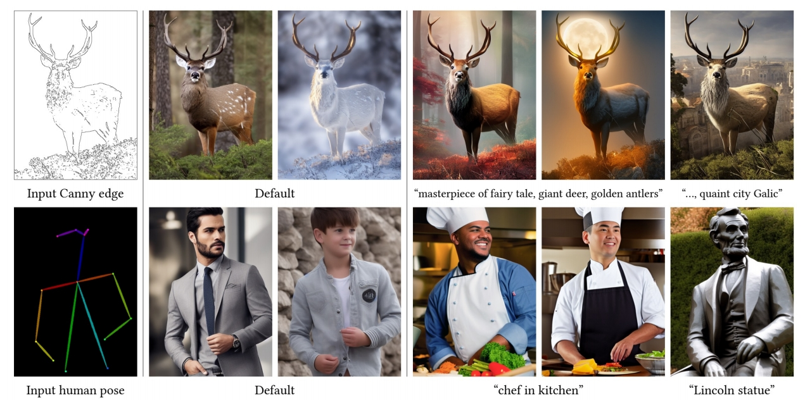

Zhang et al., “Adding Conditional Control to Text-to-Image Diffusion Models,” ICCV 2023.     

P27   
## ControlNet   

Conditional generation with various guidances   
 - Finetune parameters of a trainable copy   

Zhang et al., “Adding Conditional Control to Text-to-Image Diffusion Models,” ICCV 2023.    

P28   
## ControlNet   

Conditional generation with various guidances

Zhang et al., “Adding Conditional Control to Text-to-Image Diffusion Models,” ICCV 2023.    

P29   
# 2 Video Generation

P30  
## Video Foundation Model

P31  

P32   

# 2 Video Generation

## 2.1 Pioneering/early works

P34  
## Problem Definition

**Text-Guided Video Generation**   

Text prompt → video   

Video from Zhang et al., “Show-1: Marrying Pixel and Latent Diffusion Models for Text-to-Video Generation,” arXiv 2023.    

P35   
## Problem Definition   

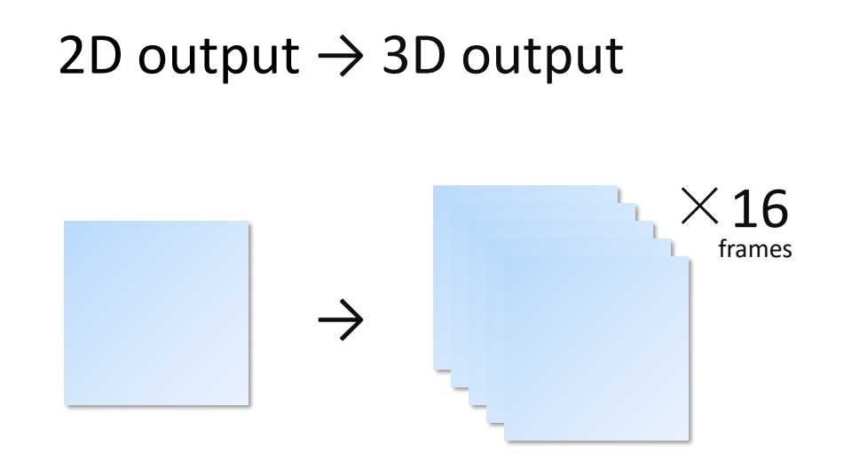

P36  
## Video Diffusion Models  

Recap 3D Conv

|||
|--|--|
|   |   |

Du et al., “Learning Spatiotemporal Features with 3D Convolutional Networks,” ICCV 2015.     

P37  
## Video Diffusion Models

Recap (2+1)D Conv

|||
|--|--|
| 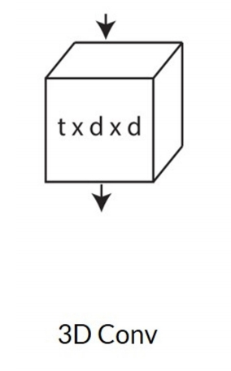  |   |

Du et al., “A Closer Look at Spatiotemporal Convolutions for Action Recognition,” CVPR 2018.    

P38   
## Video Diffusion Models   

Early work on video generation

Ho et al., “Video Diffusion Models,” NeurIPS 2022.  

P39   
## Video Diffusion Models

Early work on video generation   

 - 3D U-Net factorized over space and time   
 - Image 2D conv inflated as → space-only 3D conv, i.e., 2 in (2+1)D Conv   
    - Kernel size: (3×3) → (1×3×3)   
    - Feature vectors: (height × weight × channel) → (frame × height × width × channel)   
 - Spatial attention: remain the same   
 - Insert temporal attention layer: attend across the temporal dimension (spatial axes as batch)   

 

Ho et al., “Video Diffusion Models,” NeurIPS 2022.  

P40  
## Make-A-Video

Cascaded generation

 

Singer et al., “Make-A-Video: Text-to-Video Generation without Text-Video Data,” arXiv 2022. 

P41   
## Make-A-Video

Cascaded generation

 

Singer et al., “Make-A-Video: Text-to-Video Generation without Text-Video Data,” arXiv 2022.     

P42  
## Make-A-Video

Cascaded generation

 

Singer et al., “Make-A-Video: Text-to-Video Generation without Text-Video Data,” arXiv 2022.    

P43   
## Make-A-Video

Cascaded generation

 

Singer et al., “Make-A-Video: Text-to-Video Generation without Text-Video Data,” arXiv 2022.   

P44  
## Make-A-Video

Cascaded generation

**Training**
 - 4 main networks (decoder + interpolation + 2 super-res)   
    - First trained on images alone    
    - Insert and finetune temporal layers on videos   
 - Train on WebVid-10M and 10M subset from HD-VILA-100M   

P45   
## Datasets

The WebVid-10M Dataset

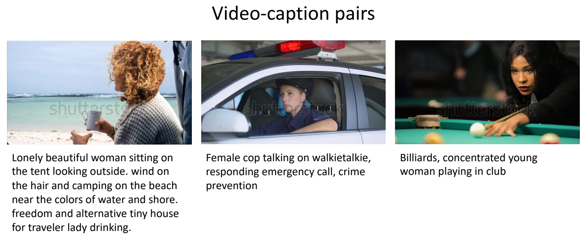 

Bain et al., “Frozen in Time: A Joint Video and Image Encoder for End to End Paper,” ICCV 2021.    

P46   
## Evaluation Metrics

 

P47   

## Evaluation Metrics   

Quantitative evaluations

**Image-level Evaluation Metrics**

 - Fréchet Inception Distance (FID, ↓): semantic similarity between images   
 - Peak Signal-to-Noise Ratio (PSNR, ↑): pixel-level similarity between images   
 - Structural Similarity Index (SSIM, ↓): pixel-level similarity between images   
 - CLIPSIM (↑): image-text relevance   

**Video-level Evaluation Metrics**

 - Fréchet Video Distance (FVD, ↓): semantic similarity & temporal coherence   
 - Kernel Video Distance (KVD, ↓): video quality (via semantic features and MMD)   
 - Video Inception Score (IS, ↑): video quality and diversity   
 - Frame Consistency CLIP Score (↑): frame temporal semantic consistency   

P48   
## Fréchet Inception Distance (FID)

Semantic similarity between images

 

**Lantern image generated with Stable Diffusion 2.1.**    

Heusel et al., “GANs Trained by a Two Time-Scale Update Rule Converge to a Local Nash Equilibrium,” NeurIPS 2017.    
Hung-Yi Lee, “Machine Learning 2023 Spring,” National Taiwan University.    

P49   
## Peak Signal-to-Noise Ratio (PSNR)

Pixel-level similarity between images

 - For two images \\(x,y \text{ of shape }  M\times N\\):   

\begin{align*} \mathrm{PSNR} (x,y) = 10 \log_{10}{} \frac{255^2}{\mathrm{MSE} (x,y)}  \end{align*}

where    

\begin{align*} \mathrm{MSE} (x,y) = \frac{1}{MN} \sum_{i=1}^{M} \sum_{j=1}^{N} (x_{ij}-y_{ij})^2\end{align*}

Horé et al., “Image Quality Metrics: PSNR vs. SSIM,” ICPR 2010.    

P50  
## Structural Similarity Index Measure (SSIM)

Pixel-level similarity between images

 - Model any image distortion as a combination of:   
(1) loss of correlation, (2) luminance distortion, (3) contrast distortion

 - For two images \\(x,y \text{ of shape }  M\times N\\):   

\begin{align*}  \mathrm{SSIM} (xy)=l(x,y)\cdot c(x,y)\cdot s(x,y)\end{align*}

where   

\begin{align*} \begin{cases}
 \text{Lumiannce Comparison Funckon:} l(x,y)=\frac{2\mu _x\mu _y+C_1}{\mu _x^2\mu _y^2+C_1}  \\\\ 
 \text{Contrast Comparison Funckon:} c(x,y)=\frac{2\sigma  _x\sigma  _y+C_2}{\sigma  _x^2\sigma  _y^2+C_2}  \\\\ 
  \text{Structure Comparison Funckon:} s(x,y)=\frac{\sigma  _{xy}+C_3}{\sigma  _{x}\sigma  _{y}+C_3}  \end{cases}\end{align*}
 

Wang et al., “Image Quality Assessment: from Error Visibility to Structural Similarity,” IEEE Transactions on Image Processing, April 2004.   
Horé et al., “Image Quality Metrics: PSNR vs. SSIM,” ICPR 2010.   

P51   
## CLIP Similarity   

Image-caption similarity

 

Radford et al., “Learning Transferable Visual Models From Natural Language Supervision,” ICML 2021.      

P52   
## Fréchet Video Distance (FVD)  

Semantic similarity and temporal coherence between two videos    

 

Unterthiner et al., “FVD: A new Metric for Video Generation,” ICLR 2019.    
Unterthiner et al., “Towards Accurate Generative Models of Video: A New Metric & Challenges,” arXiv 2018.     

P53   
## Kernel Video Distance   

Video quality assessment via semantic features and MMD  

 

Unterthiner et al., “FVD: A new Metric for Video Generation,” ICLR 2019.    
Unterthiner et al., “Towards Accurate Generative Models of Video: A New Metric & Challenges,” arXiv 2018.      

P54   
## Video Inception Score (IS)

Video quality and diversity

 

Salimans et al., “Improved Techniques for Training GANs,” NeurIPS 2016.    
Barratt et al., “A Note on the Inception Score,” ICML 2018.    
Saito et al., “Train Sparsely, Generated Densely: Memory-Efficient Unsupervised Training of High-Resolution Temporal GAN,” IJCV 2020. 

P55   
## Frame Consistence CLIP scores

Frame temporal semantic consistency

 - Compute CLIP image embeddings for all frames   
 - Report average cosine similarity between all pairs of frames   

 

Radford et al., “Learning Transferable Visual Models From Natural Language Supervision,” ICML 2021.    

P57   
## Evaluation Metrics    

Hybrid evaluation

**EvalCrafter**

 - Creates a balanced prompt list for evaluation   
 - **Multi-criteria decision analysis** on 18 metrics: visual quality, content quality…   
 - Regress the coefficients of all metrics to generate an overall score aligned with user opinions   

 

Liu et al., “EvalCrafter: Benchmarking and Evaluating Large Video Generation Models,” arXiv 2023.      

P58  
## Make-A-Video   

Cascaded generation

 

Singer et al., “Make-A-Video: Text-to-Video Generation without Text-Video Data,” arXiv 2022.    

P59   
## Make-A-Video   

Cascaded generation

 

Singer et al., “Make-A-Video: Text-to-Video Generation without Text-Video Data,” arXiv 2022.     

P60  
## Make-A-Video   

Cascaded generation

 

Singer et al., “Make-A-Video: Text-to-Video Generation without Text-Video Data,” arXiv 2022.    

P62   
## Make-A-Video   

Cascaded generation

From static to magic   
Add motion to a single image or fill-in the in-betw    

 

Singer et al., “Make-A-Video: Text-to-Video Generation without Text-Video Data,” arXiv 2022.    

P63   
## Imagen & Imagen Video

Leverage pretrained T2I models for video generation; Cascaded generation

|||
|--|--|
|   |   |

Imagen: Saharia et al., “Photorealistic Text-to-Image Diffusion Models with Deep Language Understanding,” arXiv 2022.    
Imagen Video: Ho et al., “Imagen Video: High Definition Video Generation with Diffusion Models,” arXiv 2022.    

P64   
## Align your Latents

Leverage pretrained T2I models for video generation; 
Cascaded generation   

Blattmann et al., “Align your Latents: High-Resolution Video Synthesis with Latent Diffusion Models,” CVPR 2023.     

P65   
## Align your Latents   

Leverage pretrained T2I models for video generation

**Inserting Temporal Layers**   

 - Latent space diffusion model: insert temporal convolutional & 3D attention layers   
 - Decoder: add 3D convolutional layers   
 - Upsampler diffusion model: add 3D convolution layers   

Blattmann et al., “Align your Latents: High-Resolution Video Synthesis with Latent Diffusion Models,” CVPR 2023.     

P66   
# 2 Video Generation   

## 2.2 Open-source base models

P67   

P68   
## ModelScopeT2V

Leverage pretrained T2I models for video generation

 - Inflate Stable Diffusion to a 3D model, preserving pretrained weights   
 - Insert spatio-temporal blocks, can handle varying number of frames   

|||
|--|--|
|   |   |

Wang et al., “ModelScope Text-to-Video Technical Report,” arXiv 2023.    

P69   
## ModelScopeT2V

Leverage pretrained T2I models for video generation   

 - Inflate Stable Diffusion to a 3D model, preserving pretrained weights    
 - Insert spatio-temporal blocks   

 

Wang et al., “ModelScope Text-to-Video Technical Report,” arXiv 2023.     

P70   
## ModelScopeT2V    

Leverage pretrained T2I models for video generation

 - Inflate Stable Diffusion to a 3D model, preserving pretrained weights   
 - Insert spatio-temporal blocks, **can handle varying number of frames**   

 

Wang et al., “ModelScope Text-to-Video Technical Report,” arXiv 2023. 

P71   
## ModelScopeT2V

Length = 1   
Model generate images   

P72   
## ModelScopeT2V   

Leverage pretrained T2I models for video generation

 

ZeroScope: finetunes ModelScope on a small set of high-quality videos, resulting into higher resolution at 
1024 x 576, without the Shutterstock watermark    

Wang et al., “ModelScope Text-to-Video Technical Report,” arXiv 2023.     

P73   
## ModelScopeT2V   

Leverage pretrained T2I models for video generation  

Wang et al., “ModelScope Text-to-Video Technical Report,” arXiv 2023.  

P74  
## ModelScopeT2V

Leverage pretrained T2I models for video generation

|||||
|--|--|--|--|
| " Robot dancing in times square,” arXiv 2023.  | " Clown fish swimming through the coral reef,” arXiv 2023.| " Melting ice cream dripping down the cone,” arXiv 2023.| " Hyper-realistic photo of an abandoned industrial site during a storm,” arXiv 2023.|
|   |   |   |  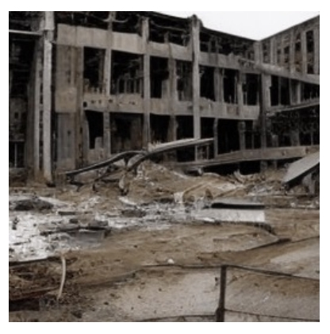 |

Wang et al., “ModelScope Text-to-Video Technical Report,” arXiv 2023.    

P75   
## Show-1

Better text-video alignment? Generation in both pixel- and latent-domain

 

Zhang et al., “Show-1: Marrying Pixel and Latent Diffusion Models for Text-to-Video Generation,” arXiv 2023.    

P76   
## Show-1

Better text-video alignment? Generation in both pixel- and latent-domain   

**Motivation**

 - Pixel-based VDM achieves better text-video alignment than latent-based VDM   

|||
|--|--|
|  |  |

Zhang et al., “Show-1: Marrying Pixel and Latent Diffusion Models for Text-to-Video Generation,” arXiv 2023.   

P77   
## Show-1

Generation in both pixel- and latent-domain

**Motivation**

 - Pixel-based VDM achieves better text-video alignment than latent-based VDM   
 - Pixel-based VDM takes much larger memory than latent-based VDM    

 

Zhang et al., “Show-1: Marrying Pixel and Latent Diffusion Models for Text-to-Video Generation,” arXiv 2023.   

P78   
## Show-1   

Generation in both pixel- and latent-domain  

**Motivation** 

 - Use Pixel-based VDM in low-res stage   
 - Use latent-based VDM in high-res stage   

 

Zhang et al., “Show-1: Marrying Pixel and Latent Diffusion Models for Text-to-Video Generation,” arXiv 2023.   

P79   
## Show-1   

Generation in both pixel- and latent-domain

<https://github.com/showlab/Show-1>

 - Better text-video alignment   
 - Can synthesize large motion   
 - Memory-efficient   

Zhang et al., “Show-1: Marrying Pixel and Latent Diffusion Models for Text-to-Video Generation,” arXiv 2023.   

P80  
## VideoCrafter  

• Latent diffusion inserted with temporal layers

 

Chen et al., “VideoCrafter1: Open Diffusion Models for High-Quality Video Generation,” arXiv 2023.    

P81  
## LaVie  

Joint image-video finetuning with curriculum learning

 

Wang et al., “LAVIE: High-Quality Video Generation with Cascaded Latent Diffusion Models,” arXiv 2023.   

P83   
## Stable Video Diffusion  

Scaling latent video diffusion models to large datasets

**Data Processing and Annotation** 

 - Cut Detection and Clipping    
    - Detect cuts/transitions at multiple FPS levels   
    - Extract clips precisely using keyframe timestamps   
 - Synthetic Captioning   
    - Use CoCa image captioner to caption the mid-frame of each clip   
    - Use V-BLIP to obtain video-based caption   
    - Use LLM to summarise the image- and video-based caption   
    - Compute CLIP similarities and aesthetic scores
 - Filter Static Scene   
    - Use dense optical flow magnitudes to filter static scenes   
 - Text Detection   
    - Use OCR to detect and remove clips with excess text    

Blattmann et al., “Stable Video Diffusion: Scaling Latent Video Diffusion Models to Large Datasets,” 2023.     

P84   
## Stable Video Diffusion   

Scaling latent video diffusion models to large datasets

**Data Processing and Annotation**  

Blattmann et al., “Stable Video Diffusion: Scaling Latent Video Diffusion Models to Large Datasets,” 2023. 84

 

P85  
## Stable Video Diffusion   

Scaling latent video diffusion models to large datasets

**Stage I: Image Pretraining**

 - Initialize weights from Stable Diffusion 2.1 (text-to-image model)   

 

Blattmann et al., “Stable Video Diffusion: Scaling Latent Video Diffusion Models to Large Datasets,” 2023.    

P86   
## Stable Video Diffusion   

Scaling latent video diffusion models to large datasets

**Stage II: Curating a Video Pretraining Dataset**

 - Systematic Data Curation
    - Curate subsets filtered by various criteria (CLIP-, OCR-, optical flow-, aesthetic-scores…)
    - Assess human preferences on models trained on different subsets
    - Choose optimal filtering thresholds via Elo rankings for human preference votes
 - Well-curated beats un-curated pretraining dataset

 

Blattmann et al., “Stable Video Diffusion: Scaling Latent Video Diffusion Models to Large Datasets,” 2023.  

P87   
## Stable Video Diffusion  

Scaling latent video diffusion models to large datasets

**Stage III: High-Quality Finetuning**

 - Finetune base model (pretrained from Stages I-II) on high-quality video data   
    - High-Resolution Text-to-Video Generation   
       - ~1M samples. Finetune for 50K iterations at 576x1024 (in contrast to 320x576 base resolution)   
    - High Resolution Image-to-Video Generation   
    - Frame Interpolation   
    - Multi-View Generation   
 - Performance gains from curation persists after finetuning   

 

Blattmann et al., “Stable Video Diffusion: Scaling Latent Video Diffusion Models to Large Datasets,” 2023.    

P89   
# 2 Video Generation

## 2.3 Other closed-source works

P90   

 

P91   
## GenTron

Transformer-based diffusion for text-to-video generation

 - Transformer-based architecture extended from DiT (class-conditioned transformer-based LDM)   
 - Train T2I à insert temporal self-attn à joint image-video finetuning (motion-free guidance)    

 

Chen et al., “GenTron: Delving Deep into Diffusion Transformers for Image and Video Generation,” arXiv 2023.    

P93   
## W.A.L.T.

Transformer-based diffusion for text-to-video generation  

 - Transformer-based denoising diffusion backbone   
 - Joint image-video training via unified image/video latent space (created by a joint 3D encoder with causal 3D conv layers, allowing the first frame of a video to be tokenized independently)   
 - Window attention to reduce computing/memory costs   
 - Cascaded pipeline for high-quality generation    
 
 

Gupta et al., “Photorealistic Video Generation with Diffusion Models,” arXiv 2023.     

P95   
## Other Closed-Source Works

|||
|--|--|
|  | |
| **Latent Shift** (An et al.) Shift latent features for better temporal coherence   “Latent-Shift: Latent Diffusion with Temporal Shift for Efficient Text-to-Video Generation,” arXiv 2023.| **Video Factory** (Wang et al.)  Modify attention mechanism for better temporal coherence   “VideoFactory: Swap Attention in Spatiotemporal Diffusions for Text-to-Video Generation,” arXiv 2023.| 
|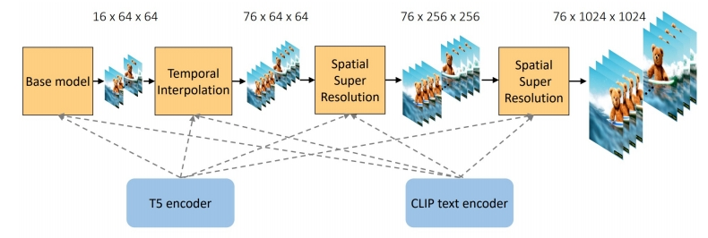 | |
| **PYoCo** (Ge et al.)  Generate video frames starting from similar noise patterns   “Preserve Your Own Correlation: A Noise Prior for Video Diffusion Models,” ICCV 2023. | *VideoFusion* (Lorem et al.)  Decompose noise into shared “base” and individual “residuals” “VideoFusion: ecomposed Diffusion Models for High-Quality Video Generation,” CVPR 2023. |

P96  
# 2 Video Generation

## 2.4 Training-efficient techniques

P97  

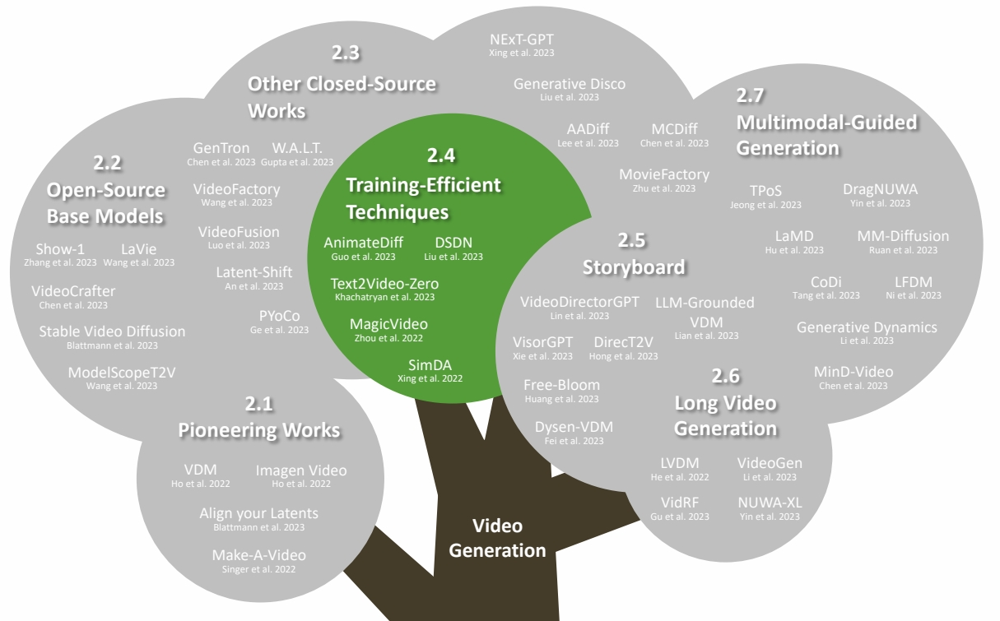 

P98 
## AnimateDiff  

Transform domain-specific T2I models to T2V models

 - Domain-specific (personalized) models are widely available for image   
    - Domain-specific finetuning methodologies: LoRA, DreamBooth…   
    - Communities: Hugging Face, CivitAI…   
 - Task: turn these image models into T2V models, without specific finetuning   

Guo et al., “AnimateDiff: Animate Your Personalized Text-to-Image Diffusion Models without Specific Tuning,” arXiv 2023.     

P99  
## AnimateDiff   

Transform domain-specific T2I models to T2V models

**Methodology**

 - Train a motion modeling module (some temporal layers) together with frozen base T2I model   
 - Plug it into a domain-specific T2I model during inference   

 

Guo et al., “AnimateDiff: Animate Your Personalized Text-to-Image Diffusion Models without Specific Tuning,” arXiv 2023.    

P100 
## AnimateDiff   

Transform domain-specific T2I models to T2V models

**Methodology** 

 - Train a motion modeling module (some temporal layers) together with frozen base T2I model   
 - Plug it into a domain-specific T2I model during inference   

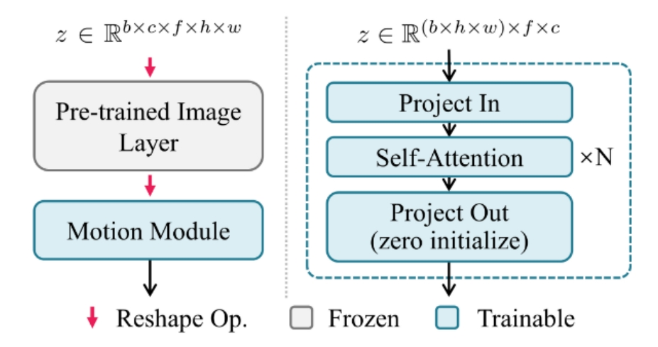   

 - Train on WebVid-10M, resized at 256x256 (experiments show can generalize to higher res.)   

Guo et al., “AnimateDiff: Animate Your Personalized Text-to-Image Diffusion Models without Specific Tuning,” arXiv 2023.    

P102  
## Text2Video-Zero   

Use Stable Diffusion to generate videos without any finetuning

**Motivation: How to use Stable Diffusion for video generation without finetuning?**  

 - Start from noises of similar pattern   
 - Make intermediate features of different frames to be similar   

Khachatryan et al., “Text2Video-Zero: Text-to-Image Diffusion Models are Zero-Shot Video Generators,” arXiv 2023.    

P103   
## Text2Video-Zero   

Use Stable Diffusion to generate videos without any finetuning

 - Start from noises of similar pattern: given the first frame’s noise, define a global scene motion, used to translate the first frame’s noise to generate similar initial noise for other frames   

 

Khachatryan et al., “Text2Video-Zero: Text-to-Image Diffusion Models are Zero-Shot Video Generators,” arXiv 2023.  

P104   
## Text2Video-Zero

Use Stable Diffusion to generate videos without any finetuning

 - Make intermediate features of different frames to be similar: always use K and V from the first frame in self-attention   

 

Khachatryan et al., “Text2Video-Zero: Text-to-Image Diffusion Models are Zero-Shot Video Generators,” arXiv 2023.    

P105   
## Text2Video-Zero

Use Stable Diffusion to generate videos without any finetuning

 - Optional background smoothing: regenerate the background, average with the first frame

 

Khachatryan et al., “Text2Video-Zero: Text-to-Image Diffusion Models are Zero-Shot Video Generators,” arXiv 2023.   

P107 
## Training Efficient Techniques: More Works

||||
|--|--|--|
|  |  |  |
| **MagicVideo** (Zhou et al.)   Insert causal attention to Stable Diffusion for better temporal coherence   “MagicVideo: Efficient Video Generation With Latent Diffusion Models,” arXiv 2022. | **Simple Diffusion Adapter** (Xing et al.)   Insert lightweight adapters to T2I models, shift latents, and finetune adapters on videos  “SimDA: Simple Diffusion Adapter for Efficient Video Generation,” arXiv 2023. | **Dual-Stream Diffusion Net** (Liu et al.)   Leverage multiple T2I networks for T2V   “Dual-Stream Diffusion Net for Text-to-Video Generation,” arXiv 2023. |

P108  
# 2 Video Generation

## 2.5 Storyboard
 
P109  
 

P110 
## opyright©Mike Shou, NUS

Human can imagine what does the scene look like “roughly”

“Two men stand in the airport waiting room and stare at the 
airplane thru window”   

What is in your mind now?

Storyboard image from deviantart.com.

P111
## What is a storyboard?

A concept in film production

 

 - Rough sketches/drawings with notes    
 - Example: Inception by Christopher Nola   

Storyboard image from deviantart.com.    

P112 
## What is a storyboard?

A concept in film production

 - How to generate such a storyboard?    
 - As humans, over the years, we have acquired such “visual prior” about object location, object shape, relation, etc.   
 - Can LLM model such visual prio？    

Storyboard image from deviantart.com.   

P113   
## VisorGPT

Can we model such visual prior with LLM

 

Xie et al., “VisorGPT: Learning Visual Prior via Generative Pre-Training,” NeurIPS 2023.

P114   
## VisorGPT

Prompt design

 

 

Xie et al., “VisorGPT: Learning Visual Prior via Generative Pre-Training,” NeurIPS 2023.   

P118   
## VisorGPT

Modeling Visual Prior via Generative Pre-Training

 

Xie et al., “VisorGPT: Learning Visual Prior via Generative Pre-Training,” NeurIPS 2023.    

P119  
## VisorGPT

Sample from the LLM which has learned visual prior

 

Xie et al., “VisorGPT: Learning Visual Prior via Generative Pre-Training,” NeurIPS 2023.    

P120   
## VisorGPT

Sample from the LLM which has learned visual prior

 

Xie et al., “VisorGPT: Learning Visual Prior via Generative Pre-Training,” NeurIPS 2023.  

P121   
## VideoDirectorGPT

Use storyboard as condition to generate video

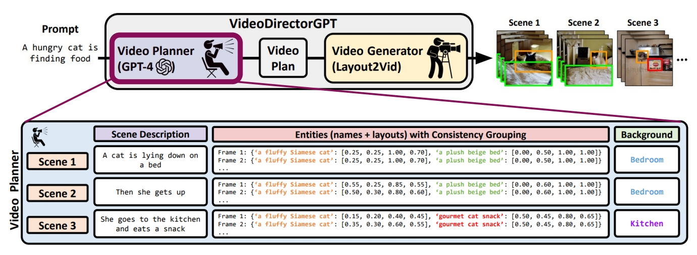 

Lin et al., “VideoDirectorGPT: Consistent Multi-scene Video Generation via LLM-Guided Planning,” arXiv 2023.   

P122  
## VideoDirectorGPT

Use storyboard as condition to generate video

 

Lin et al., “VideoDirectorGPT: Consistent Multi-scene Video Generation via LLM-Guided Planning,” arXiv 2023.    

P124   
## Long-form Video Prior

GPT can be trained to learn better long-form video prior (e.g., object position, relative size, human interaction)

**A new dataset - Storyboard20K**

 

Xie et al., “Learning Long-form Video Prior via Generative Pre-Training,” to be released in 2024.    
<https://github.com/showlab/Long-form-Video-Prior>   

P125  
## Storyboard: More Works

|||
|--|--|
|   |    |
| **Dysen-VDM** (Fei et al.) Storyboard through scene graphs “Empowering Dynamics-aware Text-to-Video Diffusion with Large Language Models,” arXiv 2023. | **DirectT2V** (Hong et al.)   Storyboard through bounding boxes   “Large Language Models are Frame-level Directors for Zero-shot Text-to-Video Generation,” arXiv 2023. |
|    |    |
| **Free-Bloom** (Huang et al.) Storyboard through detailed text prompts  “Free-Bloom: Zero-Shot Text-to-Video Generator with LLM Director and LDM Animator,” NeurIPS 2023. | **LLM-Grounded Video Diffusion Models** (Lian et al.)   Storyboard through foreground bounding boxes   “LLM-grounded Video Diffusion Models,” arXiv 2023.  |   

P126   
## 2 Video Generation

## 2.6 Long video generation

P127  

 

P128  
## NUWA-XL  

Recursive interpolations for generating very long videos

**Method Proposed**

 - A “diffusion over diffusion” architecture for very long video generation

**Key Idea**

 - Key idea: coarse-to-fine hierarchical generation

**Other Highlights**

 - Trained on very long videos (3376 frames)
 - Enables parallel inference
 - Built FlintstonesHD: a new dataset for long video generation, contains 166 episodes with an average of 38000 frames of 1440 × 1080 resolution

Yin et al., “NUWA-XL: Diffusion over Diffusion for eXtremely Long Video Generation,” arXiv 2023.   

P129  
## NUWA-XL

Recursive interpolations for generating very long videos

**Generation Pipeline**

 - Storyboard through multiple text prompts   

 

Yin et al., “NUWA-XL: Diffusion over Diffusion for eXtremely Long Video Generation,” arXiv 2023. 129

P130  
## NUWA-XL

Recursive interpolations for generating very long videos

**Generation Pipeline**

 - Storyboard through multiple text prompts
 - Global diffusion model: L text prompts → L keyframes
 - Local diffusion model: 2 text prompts + 2 keyframes → L keyframes   

 

Yin et al., “NUWA-XL: Diffusion over Diffusion for eXtremely Long Video Generation,” arXiv 2023.

P131  
## NUWA-XL

Recursive interpolations for generating very long videos

**Mask Temporal Diffusion (MTD)**  

 - A basic diffusion model for global & local diffusion models

 

Yin et al., “NUWA-XL: Diffusion over Diffusion for eXtremely Long Video Generation,” arXiv 2023.    

P133
## Long Video Generation: More Works

|||
|--|--|
|   | **Latent Video Diffusion Models for High-Fidelity Long Video Generation** (He et al.)   Generate long videos via autoregressive generation & interpolation   “Latent Video Diffusion Models for High-Fidelity Long Video Generation,” arXiv 2022.|
|   | **VidRD** (Gu et al.)   Autoregressive long video generation   “Reuse and Diffuse: Iterative Denoising for Text-to-Video Generation,” arXiv 2023. |
|   | **VideoGen** (Li et al.)   Cascaded pipeline for long video generation   “VideoGen: A Reference-Guided Latent Diffusion Approach for High Definition Text-to-Video Generation,” arXiv 2023.|

P134  
# 2 Video Generation

## 2.7 Multimodal-guided generation

P135  

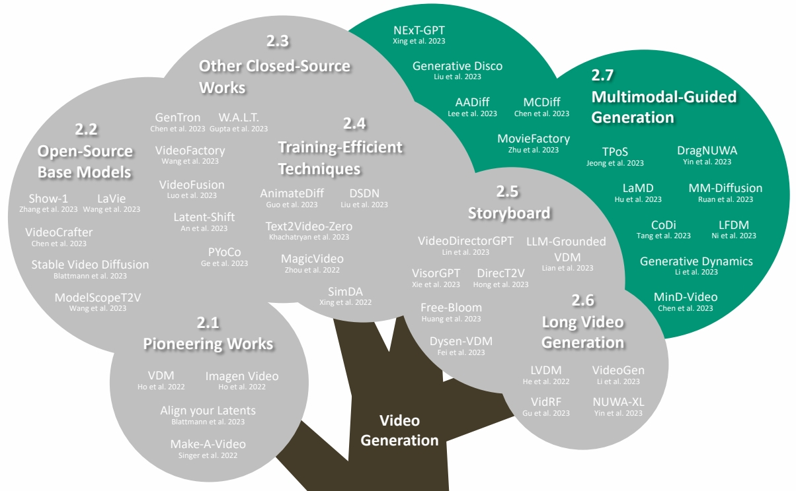 

P136  
## MCDiff  

Motion-guided video generation

 

Chen et al., “Motion-Conditioned Diffusion Model for Controllable Video Synthesis,” arXiv 2023.    

P137  
## MCDiff

Motion-guided video generation

 - Two-stage autoregressive generation

 

Chen et al., “Motion-Conditioned Diffusion Model for Controllable Video Synthesis,” arXiv 2023. 137

P139   
## The Power of Sound (TPoS)

Sound- and text-guided video generation

 - Input/output: a text prompt + an audio segment → a video

 

Jeong et al., “The Power of Sound (TPoS): Audio Reactive Video Generation with Stable Diffusion,” ICCV 2023.    

P140
## Sound-Guided Video Generation: More Works

|||
|--|--|
| 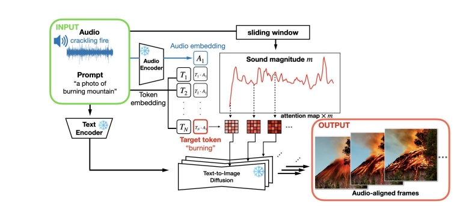  | **AADiff** (Lee et al.)   “AADiff: Audio-Aligned Video Synthesis with Text-to-Image Diffusion,” CVPRW 2023. |
|  | **Generative Disco** (Liu et al.)  “Generative Disco: Text-to-Video Generation for Music Visualization,” arXiv 2023. |

Xing et al., “A Survey on Video Diffusion Models,” arXiv 2023.   

P141  
## Image-Guided Video Generation: More Works

|||
|--|--|
|   | Generative Image Dynamics (Li et al.)   “Generative Image Dynamics,” arXiv 2023. |
|    | **LaMD** (Hu et al.)   “LaMD: Latent Motion Diffusion for Video Generation,” arXiv 2023. |
|    | **LFDM** (Ni et al.)   “Conditional Image-to-Video Generation with Latent Flow Diffusion Models,” CVPR 2023.  |

Xing et al., “A Survey on Video Diffusion Models,” arXiv 2023.   

P142  
## Cinematic Mindscapes   

Brain activity-guided video generation

 - Task: human vision reconstruction via fMRI signal-guided video generation   

 

Chen et al., “Cinematic Mindscapes: High-quality Video Reconstruction from Brain Activity,” arXiv 2023.     

P144  
## Multimodal-Guided Video Generation: More Works

|||
|   |   |
| **MovieFactory** (Zhu et al.)   “MovieFactory: Automatic Movie Creation from Text using Large Generative Models for Language and Images,” arXiv 2023. | **CoDi** (Tang et al.)  
“Any-to-Any Generation via Composable Diffusion,” NeurIPS 2023.|
|   | 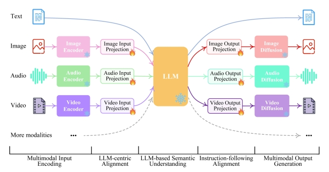  |
| **MM-Diffusion** (Ruan et al.)   “MM-Diffusion: Learning Multi-Modal Diffusion Models for Joint Audio and Video Generation,” CVPR 2023. | **NExT-GPT** (Wu et al.)   “NExT-GPT: Any-to-Any Multimodal LLM,” arXiv 2023. |

Xing et al., “A Survey on Video Diffusion Models,” arXiv 2023.

P145  
# 3 Video Editing

P146  

 

P147  
# 3 Video Editing

## 3.1 Tuning-based

P148  
## One-Shot Tuned

P149 

 

P150  
## Tune-A-Video

One-shot tuning of T2I models for T2V generation/editing

 

Wu et al., “Tune-A-Video: One-Shot Tuning of Image Diffusion Models for Text-to-Video Generation,” ICCV 2023.    

P152   
## Tune-A-Video

One-shot tuning of T2I models for T2V generation/editing

<https://github.com/showlab/Tune-A-Video>

Motivation: appearance from pretrained T2I models, dynamics from a reference video 

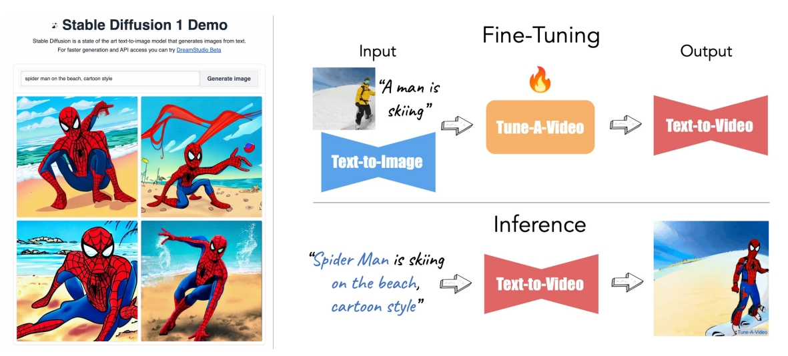 

Wu et al., “Tune-A-Video: One-Shot Tuning of Image Diffusion Models for Text-to-Video Generation,” ICCV 2023.   

P153
## Tune-A-Video

One-shot tuning of T2I models for T2V generation/editing

**Obs #1: Still images that accurately represent the verb terms**

 

**Obs #2: Extending attention to spatio-temporal yields consistent content**

 

Wu et al., “Tune-A-Video: One-Shot Tuning of Image Diffusion Models for Text-to-Video Generation,” ICCV 2023. 153

P154   
## Tune-A-Video

One-shot tuning of T2I models for T2V generation/editing

 

Wu et al., “Tune-A-Video: One-Shot Tuning of Image Diffusion Models for Text-to-Video Generation,” ICCV 2023. 154

P155
## Tune-A-Video

One-shot tuning of T2I models for T2V generation/editing

 

**Full finetuning**: finetunes the entire network

 - inefficient, especially when #frames increases;   
 - prone to overfitting → poor editing ability.   

**Our tuning strategy**: update the specific projection matrices

 - parameter efficient and fast (~10 min);    
 - retains the original property of pre-trained T2I diffusion models.   

**Structure guidance via DDIM inversion**

\begin{align*} \mathcal{V} ^\ast =\mathcal{D} (\mathrm{DDIM-samp} (\mathrm{DDIM-inv} (\varepsilon (\mathcal{V} )),\tau^\ast  ))\end{align*}

 - preserves the structural information   
 - improves temporal consistency   

Wu et al., “Tune-A-Video: One-Shot Tuning of Image Diffusion Models for Text-to-Video Generation,” ICCV 2023. 155

P156  
## Tune-A-Video

 

Wu et al., “Tune-A-Video: One-Shot Tuning of Image Diffusion Models for Text-to-Video Generation,” ICCV 2023.    

P157  
## Tune-A-Video

 

Wu et al., “Tune-A-Video: One-Shot Tuning of Image Diffusion Models for Text-to-Video Generation,” ICCV 2023.

P158  
## Tune-A-Video

 

Wu et al., “Tune-A-Video: One-Shot Tuning of Image Diffusion Models for Text-to-Video Generation,” ICCV 2023.   

P159  
## Tune-A-Video

 

Wu et al., “Tune-A-Video: One-Shot Tuning of Image Diffusion Models for Text-to-Video Generation,” ICCV 2023.

P160  
## Tune-A-Video

 

Wu et al., “Tune-A-Video: One-Shot Tuning of Image Diffusion Models for Text-to-Video Generation,” ICCV 2023.

P161
## Tune-A-Video

One-shot tuning of T2I models for T2V generation/editing

 

**Automatic metrics – CLIP Score**

 - *Frame Consistency*: the average cosine similarity between all pairs of video frames   
 - *Textual Alignment*: average CLIP score between all frames of output videos and corresponding edited prompts    

**User study** 

Compare two videos generated by our method and a baseline (shown in random order):   

 - *Which video has better temporal consistency?*    
 - *Which video better aligns with the textual description?*    

Wu et al., “Tune-A-Video: One-Shot Tuning of Image Diffusion Models for Text-to-Video Generation,” ICCV 2023.

P162  
## Dreamix

Few-shot finetuning for personalized video editing

**Main idea: Mixed Video-Image Finetuning**

 - Finetune Imagen Video (Ho et al., 2022) which is a strong video foundation model

 

 - Finetuned to generate individual frames (bypassing temporal attentions) & video

 

Molad et al, “Dreamix: Video Diffusion Models are General Video Editors,” arXiv 2023. 162

P163  
## Dreamix

Few-shot finetuning for personalized video editing

**Inference Overview**

 - Corrupt the input video by downsampling and add noise   
 - Apply the finetuned video diffusion model to denoise and upscale   

 

Molad et al, “Dreamix: Video Diffusion Models are General Video Editors,” arXiv 2023.    

P164   
## One-Shot Tuned Video Editing: More Works

|||
|--|--|
|   |   | 
| \\(\mathbf{EI^2}\\) (Zhang et al.)  Modify self-attention for better temporal consistency   “Towards Consistent Video Editing with Text-to-Image rDiffusion Models,” arXiv 2023. | **Video-P2P** (Liu et al.)   Improve input-output semantic consistency of video editing via shared embedding optimization and cross-attention control   “Video-P2P: Video Editing with Cross-attention Control,” arXiv 2023. |

P165   
## One-Shot Tuned Video Editing: More Works

 

**Compared to training-free editing methods:** 

 - Cons: still need 1 video for training
 - Pros: supports significant shape change 

Wu et al., “Tune-A-Video: One-Shot Tuning of Image Diffusion Models for Text-to-Video Generation,” ICCV 2023.    

P166  
## Multiple-Shot Tuned

Video Editing: Text Conditioned

P167  

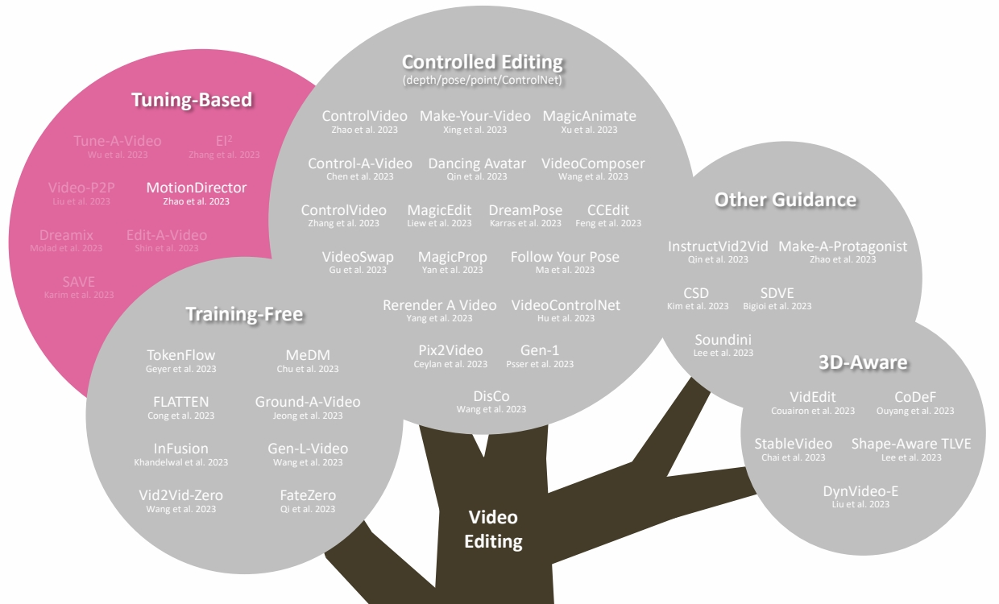 

P168
## MotionDirector

Tune on multiple videos of a motion to be customised

 

Zhao et al., “MotionDirector: Motion Customization of Text-to-Video Diffusion Models,” arXiv 2023.    

P169  
## MotionDirector

Tune on multiple videos of a motion to be customised

 

Zhao et al., “MotionDirector: Motion Customization of Text-to-Video Diffusion Models,” arXiv 2023.    

 