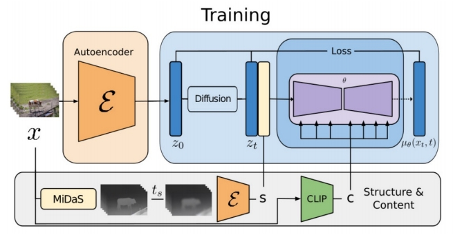
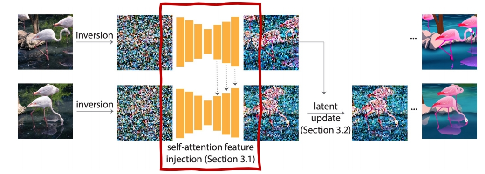
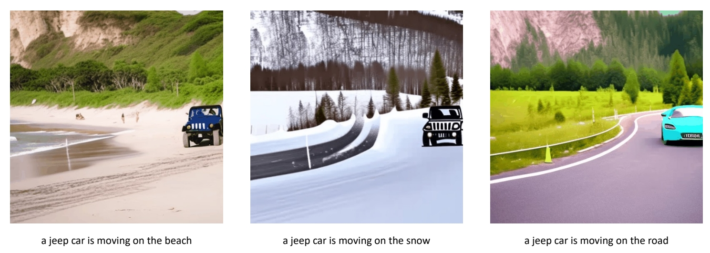
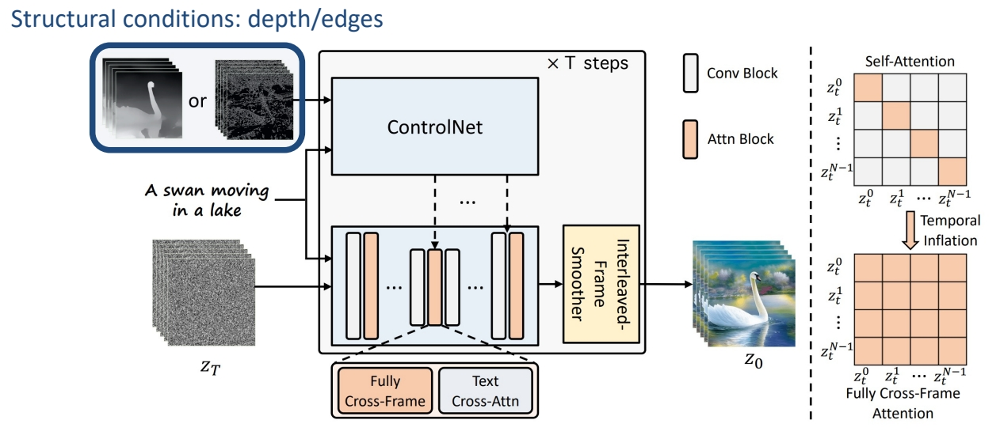
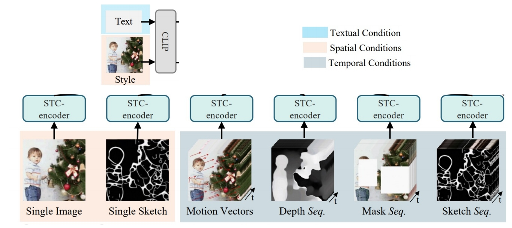
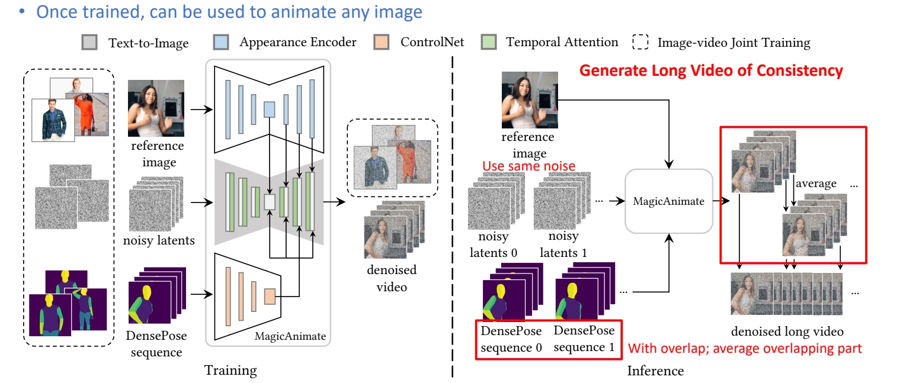
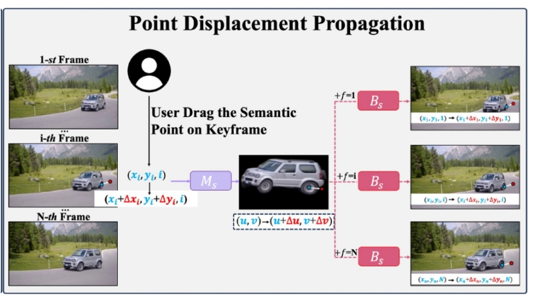

P188    
# 3 Video Editing

## 3.3 Controlled Edifng (depth/pose/point/ControlNet)

P189   

 

P190   
## Depth Control

> &#x2705; RunwayML 主要做的是 style transfer, 强制加入 depth 作为 condition, 因此可移植性非常高。   

P191    
> &#x2705; MIDS 是已有的深度估计模型。   

P192   
## Use MiDaS to offer depth condition

Depth estimating network

Ranftl et al., “Towards Robust Monocular Depth Estimation: Mixing Datasets for Zero-shot Cross-dataset Transfer,” TPAMI 2022.

> &#x2705; 深变信息 Encode 成 latent code, 与 noise conca 到一起。   

P193   
## Gen-1

Framewise depth-guided video editing

 - Inflate Stable Diffusion to a 3D model, finetune on pretrained weights   
 - Insert temporal convolution/attention layers   
 - Finetune to take **per-frame depth as conditions**   

|||
|--|--|
|   |   |

> &#x2705; 特点：(1) 不需要训练。 (2) 能保持前后一致性。   

P60   
### Gen-1

 - Transfer the style of a video using text prompts given a “driving video”

     

Esser et al., <u>"Structure and Content-Guided Video Synthesis with Diffusion Models",</u> arXiv 2023    

P61   
### Gen-1

 - Condition on structure (depth) and content (CLIP) information.   
 - Depth maps are passed with latents as input conditions.   
 - CLIP image embeddings are provided via cross-attention blocks.   
 - During inference, CLIP text embeddings are converted to CLIP image embeddings.    

     

> &#x2705; 用 depth estimator 从源视频提取 struct 信息，用 CLIP 从文本中提取 content 信息。   
> &#x2705; depth 和 content 分别用两种形式注入。depth 作为条件，与 lantent concat 到一起。content 以 cross attention 的形式注入。    

P194   
## Pix2Video

Framewise depth-guided video editing

 - Given a sequence of frames, generate a new set of images that reflects an edit.   
 - Editing methods on individual images fail to preserve temporal information.    

Ceylan et al., <u>"Pix2Video: Video Editing using Image Diffusion",</u> arXiv 2023    

> &#x2705; 没有 3D diffusion model，只是用 2D diffusion model 生成多张图像并拼成序列。关键在于保持时序的连续性。    

 - Leverage a pretrained per-frame depth-conditioned Stable Diffusion model to edit frame by frame, to maintain motion consistency between source video and edited video
 - No need for training/finetuning

 

P195   

### How to ensure temporal consistency?   

#### Obtain initial noise from DDIM inversion   

  

> &#x2705; (1) 用每一帧的原始图像的 inversion 作为 init noise.   
> &#x2705; (2) 下一帧的生成会引用上一帧的 latent.    
> &#x2705; (3) 生成的中间结果上也会有融合。   

P196   
#### **Self-Attention injection:** 

Inject self-attention features from the previous frame in U-Net for generating the current frame    

   

- Use the latent of the previous frame as keys and values to guide latent update of the current frame   

    

    

> &#x2705; reconstruction guidance，使生成的 latent code 与上一帧接近。    

> &#x2705; (1) 使用 DDIM inversion 把图像转为 noise．   
> &#x2705; (2) 相邻的 fram 应 inversion 出相似的 noise．    
> &#x2705; 使用 self-attention injection 得到相似的 noise.

P197   
### Result

 

P198   

 

P199   
## ControlNet / Multiple Control

P200   
## ControlVideo (Zhang et al. 2023)

ControlNet-like video editing

 - Input structural conditions through **ControlNet**

 

Zhang et al., “ControlVideo: Training-free Controllable Text-to-Video Generation,” arXiv 2023.    

> &#x2705; 使用预训练的 stable diffusion, 无需额外训练。   
> &#x2705; contrd net 是与 stable diffusion 配对的。   
> &#x2705; contrd net 以深度图或边缘图为条件，并在时间维度上 embed 以此得到的Z。与原始视频有比较好的对应关系，但仍存在 temporal consistency 问题。   

P201   
## ControlVideo (Zhang et al. 2023)

ControlNet-like video editing

 - Use pretrained weights for Stable Diffusion & ControlNet, no training/finetuning   
 - Inflate Stable Diffusion and ControlNet along the temporal dimension   
 - Interleaved-frame smoothing during DDIM sampling for bever temporal consistency    

 

Zhang et al., “ControlVideo: Training-free Controllable Text-to-Video Generation,” arXiv 2023.    

> &#x2705; 解决 temporal consistency 问题，方法：   
> &#x2705; 在每个 timestep，让不同帧成为前后两帧的融合。    
> &#x2753; control net 与 diffusion medel 是什么关系？     

P202   
## ControlVideo (Zhang et al. 2023)  

ControlNet-like video editing

 - Use pretrained weights for Stable Diffusion & ControlNet, no training/finetuning   
 - Inflate Stable Diffusion and ControlNet along the temporal dimension    
 - Interleaved-frame smoothing during denoising for better temporal consistency    

Zhang et al., “ControlVideo: Training-free Controllable Text-to-Video Generation,” arXiv 2023.    

P203   
## ControlVideo (Zhang et al. 2023)   

ControlNet-like video editing

  

Zhang et al., “ControlVideo: Training-free Controllable Text-to-Video Generation,” arXiv 2023.     

P207    

> &#x2705; 除了 control net, 还使用光流信息作为引导。   
> &#x2705; Gop：Group of Pictures.    

P208   
## VideoControlNet

Optical flow-guided video editing; I, P, B frames in video compression

  

Hu et al., “VideoControlNet: A Motion-Guided Video-to-Video Translation Framework by Using Diffusion Model with ControlNet,” arXiv 2023.     

> &#x2705; 内容一致性，适用于 style transfer, 但需要对物体都较大编辑力度时不适用(例如编辑物体形状)。   

P209    

> &#x2705; 也是control net 形式，但用到更多控制条件。   

P210   
## CCEdit

Mulemodal-guided video edieng

  

Feng et al., “CCEdit: Creative and Controllable Video Editing via Diffusion Models,” arXiv 2023.    

> &#x2705; 使用了更多控制信息，并把它们 combine 到一起。   

P211   
## VideoComposer

Image-, sketch-, motion-, depth-, mask-controlled video editing

**Video Editing based on Various Conditions**

  

Wang et al., “VideoComposer: Compositional Video Synthesis with Motion Controllability,” arXiv 2023.   

> &#x2705; 每个 condition 进来，都过一个 STC-Encoder, 然后把不同 condition fuse 到一起，输入到 U-Net.    

P212   
## VideoComposer

Image-, sketch-, motion-, depth-, mask-controlled video editing   

• Spako-Temporal Condikon encoder (STC-encoder): a unified input interface for condikons   

  

Wang et al., “VideoComposer: Compositional Video Synthesis with Motion Controllability,” arXiv 2023.    

P214   
## ControlNet- and Depth-Controlled Video Editing: More Works

|||
|--|--|
|   | **MagicProp** (Yan et al.)   “MagicProp: Diffusion-based Video Editing via Motion-aware Appearance Propagation,” arXiv 2023. |
|  | **Make-Your-Video** (Xing et al.)   “Make-Your-Video: Customized Video Generation Using Textual and Structural Guidance,” arXiv 2023.   |
|  | **Control-A-Video** (Lorem et al.)   “Control-A-Video: Controllable Text-to-Video Generagon with Diffusion Models,” arXiv 2023. |
|   | **MagicEdit** (Liew et al.)   “MagicEdit: High-Fidelity and Temporally Coherent Video Editing,” arXiv 2023. |
|   |  **EVE** (Chen et al.)   “EVE: Efficient zero-shot text-based Video Editing with Depth Map Guidance and Temporal Consistency Constraints,” arXiv 2023. |

P215   
## Pose Control

P216  
## DreamPose

Pose- and image-guided video generation

Input: image  \\(\quad \\) Input: pose sequence   \\(\quad \\)  Output: Video   

 
Karras et al., “DreamPose: Fashion Image-to-Video Synthesis via Stable Diffusion,” arXiv 2023.   

P218   
## MagicAnimate

Pose- and image-guided video generaeon

**Challenges**

 - Flickering video   
 - Cannot maintain background   
 - Short video animation results   

**Possible Cause**

 - Weak appearance preservation due to lack of temporal modeling    

Xu et al., “MagicAnimate: Temporally Consistent Human Image Animation using Diffusion Model,” arXiv 2023.    

> &#x2705; 把 pose control net 加到核心的 U-Net 生成。   
> &#x2705; 把原始 U-Net fix, copy- 分可以 train 的 U-Net.    
> &#x2705; 输入：reference image, 两个 U-Net 在部分 layer 进行结合达到前景 appearance 和背景 appeorance 的 Encode 推断时输入多个 Sequence, 可以生成 long video.   

P219   
## MagicAnimate

Pose- and image-guided video generation   

 

Xu et al., “MagicAnimate: Temporally Consistent Human Image Animation using Diffusion Model,” arXiv 2023.    

P220   
## MagicAnimate

Pose- and image-guided video generation

 

Xu et al., “MagicAnimate: Temporally Consistent Human Image Animation using Diffusion Model,” arXiv 2023.

P223   
## MagicAnimate

Pose-guided video generation

 

Xu et al., “MagicAnimate: Temporally Consistent Human Image Animation using Diffusion Model,” arXiv 2023.    

P224   
## Video Editing Under Pose Guidance: More Works

|||
|--|--|
|   | **Dancing Avatar** (Qin et al.)  Pose-guided video editing   “Dancing avatar: Pose and text-guided human motion videos synthesis with image diffusion model,” arXiv 2023. |
|   | **Follow Your Pose** (Ma et al.)   Pose-guided video editing    “Follow Your Pose: Pose-Guided Text-to-Video Generation using Pose-Free Videos,” arXiv 2023.  |
|   | **DisCo** (Wang et al.)   Pose-guided video editing   “Disco: Disentangled control for referring human dance generation in real world,” arXiv 2023.  |

P225   
## Point-Control

P226   
## VideoSwap

Customized video subject swapping via point control

**Problem Formulation**

 - Subject replacement: change video subject to a **customized** subject    
 - Background preservation: preserve the unedited background same as the source video    

 

Gu et al., “VideoSwap: Customized Video Subject Swapping with Interactive Semantic Point Correspondence,” 2023.    

> &#x2705; 要求，背景一致，动作一致，仅替换前景 content.   
> &#x2705; 因比对原视频提取关键点，基于关键点进行控制。   

P227    
## VideoSwap

Customized video subject swapping via point control

**Motivation**

 - Existing methods are promising but still often motion not well aligned   
 - Need ensure precise correspondence of <u> **semantic points** </u> between the source and target   

 

Gu et al., “VideoSwap: Customized Video Subject Swapping with Interactive Semantic Point Correspondence,” 2023.   

> &#x2705; (1) 人工标注每一帧的 semantic point．（少量标注，8帧）    
> &#x2705; (2) 把 point map 作为 condition．   

P228    
## VideoSwap

Customized video subject swapping via point control

**Empirical Observations**

 - **Question**: Can we <u> learn semantic point control </u> for a specific <u>source video subject</u> using only a <u>small number of source video frames</u>   
 - **Toy Experiment**: Manually define and annotate a set of semantic points on 8 frame; use such point maps as condition for training a control net, i.e., T2I-Adapter.    

 

Gu et al., “VideoSwap: Customized Video Subject Swapping with Interactive Semantic Point Correspondence,” 2023.

> &#x2705; 实验证明，可以用 semantic point 作为 control．   
> &#x2705; 结论：T2I 模型可以根据新的点的位置进行新的内容生成。   

P229    
## VideoSwap

Customized video subject swapping via point control

**Empirical Observations**

 - **Observation 1**: If we can drag the points, the trained T2I-Aapter can generate new contents based on such dragged new points (new condition)  →  feasible to use semantic points as condition to control and maintain the source motion trajectory.

 

Gu et al., “VideoSwap: Customized Video Subject Swapping with Interactive Semantic Point Correspondence,” 2023.  

> &#x2705; 也可以通过拉部分点改变车的形状。   

P230    
## VideoSwap

Customized video subject swapping via point control

**Empirical Observations**

 - **Observation 2**: Further, we can drag the semantic points to control the subject’s shape   
 
 

Gu et al., “VideoSwap: Customized Video Subject Swapping with Interactive Semantic Point Correspondence,” 2023.   

> &#x2705; 虚线框为类似于 control net 的模块，能把 semanti point 抽出来并输入到 denoise 模块中。    
> &#x2705; Latent Blend 能更好保留背景信息。   
> &#x2705; 蓝色部分为 Motion layer.    

P231    
## VideoSwap

Customized video subject swapping via point control

 

**Framework**

 - **Motion layer**: use pretrained and fixed AnimateDiff to ensure essential temporal consistency    
 - **ED-LoRA** \\(_{(Mix-of-Show)}\\): learn the wconcept to be customized   

 - **Key design aims**: 
    - Introduce semantic point correspondences to guide motion trajectory   
    - Reduce human efforts of annotating points    

Gu et al. “VideoSwap: Customized Video Subject Swapping with Interactive Semantic Point Correspondence,” 2023.   
Gu et al. “Mix-of-Show: Decentralized Low-Rank Adaptation for Multi-Concept Customization of Diffusion Models.” NeurIPS, 2023.   

P232   
## VideoSwap

Customized video subject swapping via point control

**Step 1: Semantic Point Extraction**

 - Reduce human efforts in annotating points    
    - User define point at one keyframe    
    - Propagate to other frames by point tracking/detector   
 - Embedding    

 

Gu et al., “VideoSwap: Customized Video Subject Swapping with Interactive Semantic Point Correspondence,” 2023.   

> &#x2705; 什么是比较好的 Semantic point 的表达？   

P233   
## VideoSwap

Customized video subject swapping via point control

**Methodology – Step 1: Semantic Point Extraction on the source video**

 - Reduce human efforts in annotating points   
 - Embedding   
    - Extract DIFT embedding (intermediate U-Net feature) for each semantic point   
    - Aggregate over all frames   

 

Gu et al., “VideoSwap: Customized Video Subject Swapping with Interactive Semantic Point Correspondence,” 2023.   

> &#x2753; Embedding, 怎么输人到网络中？   
> &#x2705; 网络参数本身是 fix 的，增加一些小的 MLP, 把 Embeddin 转化为不同的 scales 的 condition map, 作为 U-Net 的 condition.   

P234    
## VideoSwap

Customized video subject swapping via point control

**Methodology – Step 2: Semantic Point Registration on the source video**  

 - Introduce several learnable MLPs, corresponding to different scales
 - Optimize the MLPs    
    - Point Patch Loss: restrict diffusion loss to reconstruct local patch around the point    
    - Semantic-Enhanced Schedule: only sample higher timestep (0.5T, T), which prevents overfitting to low-level details    

 

Gu et al., “VideoSwap: Customized Video Subject Swapping with Interactive Semantic Point Correspondence,” 2023.    

> &#x2705; 有些场景下需要去除部分 semanfic point, 或移动 point 的位置。   

P235    
## VideoSwap

Customized video subject swapping via point control   

**Methodology**   

 - After Step1 (Semantic Point Extraction) and Step2 (Semantic Point Registration), those semantic points can be used to guide motion   
 - User-point interaction for various applications   

 

Gu et al., “VideoSwap: Customized Video Subject Swapping with Interactive Semantic Point Correspondence,” 2023.    

> &#x2705; 在一帧上做的 semantic point 的移动，迁移到其它帧上。   

P236   
## VideoSwap

Customized video subject swapping via point control

**Methodology**

 - How to drag point for shape change?   
    - Dragging at one frame is straightforward, propagating drag displacement over time is non-trivial, because of complex camera motion and subject motion in video.   
    - Resort to canonical space (i.e., Layered Neural Atlas) to propagate displacement.   

 

Gu et al., “VideoSwap: Customized Video Subject Swapping with Interactive Semantic Point Correspondence,” 2023.    

P237   
## VideoSwap

Customized video subject swapping via point control

**Methodology**

 - How to drag point for shape change?   
 - Dragging at one frame is straightforward, propagating drag displacement over time is non-trivial because of complex camera motion and subject motion in video.   
 - Resort to canonical space (i.e., Layered Neural Atlas) to propagate displacement.    

 

Gu et al., “VideoSwap: Customized Video Subject Swapping with Interactive Semantic Point Correspondence,” 2023.    

P238    
## VideoSwap

Customized video subject swapping via point control

 

Gu et al., “VideoSwap: Customized Video Subject Swapping with Interactive Semantic Point Correspondence,” 2023.   

P239   
## VideoSwap

Customized video subject swapping via point control

 

Gu et al., “VideoSwap: Customized Video Subject Swapping with Interactive Semantic Point Correspondence,” 2023.   

> &#x2705; point contrd 可以处理形变比较大的场景。   

P240   
## VideoSwap

Customized video subject swapping via point control

**Qualitative Comparisons to previous works**

 - VideoSwap can **support shape change** in the target swap results, leading to the correct identity of target concept. 

 

Gu et al., “VideoSwap: Customized Video Subject Swapping with Interactive Semantic Point Correspondence,” 2023.    

P241   
> &#x2705; 重建 3D 可以解决时间一致性问题。   

---------------------------------------
> 本文出自CaterpillarStudyGroup，转载请注明出处。
>
> https://caterpillarstudygroup.github.io/ImportantArticles/