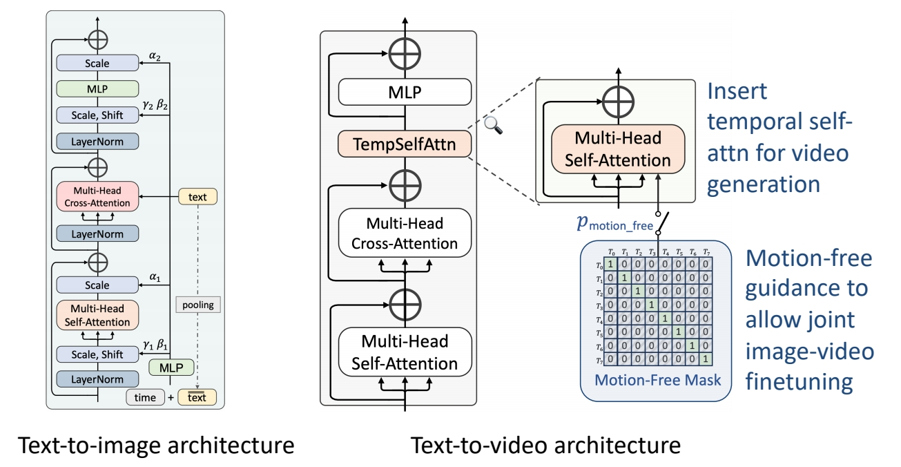

P36  

|ID|Year|Name|Note|Tags|Link|
|---|---|---|---|---|---|
|55|2022|Video Diffusion Models|引入conv(2+1)D，temporal attention||[link](https://caterpillarstudygroup.github.io/ReadPapers/55.html)|
|56|2022|Make-A-Video: Text-to-Video Generation without Text-Video Data|||[link](https://caterpillarstudygroup.github.io/ReadPapers/56.html)|
|48|2023|Align your Latents: High-Resolution Video Synthesis with Latent Diffusion Models|T2I(LDM) -> T2V(SVD) Cascaded generation||[link](https://caterpillarstudygroup.github.io/ReadPapers/48.html)| 
|57|2023|Zhang et al., “Show-1: Marrying Pixel and Latent Diffusion Models for Text-to-Video Generation,”|||[link](https://caterpillarstudygroup.github.io/ReadPapers/57.html)| 
|59|2023|Guo et al., “AnimateDiff: Animate Your Personalized Text-to-Image Diffusion Models without Specific Tuning,” arXiv 2023.|| |[link](https://caterpillarstudygroup.github.io/ReadPapers/55.html)|
||2022|Imagen Video: Ho et al., “Imagen Video: High Definition Video Generation with Diffusion Models,” arXiv 2022.  |Leverage pretrained T2I models for video generation; Cascaded generation  &#x2705; 先在 image 上做 cascade 生成   &#x2705; 视频是在图像上增加时间维度的超分     &#x2705; 每次的超分都是独立的 diffusion model?     &#x2753; temporal 超分具体是怎么做的？ |    |
||2023|Chen et al., “GenTron: Delving Deep into Diffusion Transformers for Image and Video Generation,”|Transformer-based diffusion for text-to-video generation  &#x2705;Transformer-based architecture extended from DiT (class-conditioned transformer-based LDM)   &#x2705;Train T2I \\(\to \\)  insert temporal self-attn \\(\to \\) joint image-video finetuning (motion-free guidance)    | |
||2023|Gupta et al., “Photorealistic Video Generation with Diffusion Models,”|Transformer-based diffusion for text-to-video generation  &#x2705;Transformer-based denoising diffusion backbone  &#x2705;Joint image-video training via unified image/video latent space (created by a joint 3D encoder with causal 3D conv layers, allowing the first frame of a video to be tokenized independently)  &#x2705;Window attention to reduce computing/memory costs  &#x2705;Cascaded pipeline for high-quality generation   |  |

---------------------------------------
> 本文出自CaterpillarStudyGroup，转载请注明出处。
>
> https://caterpillarstudygroup.github.io/ImportantArticles/