P145  
# 3 Video Editing

P146  

 

P147  
# 3 Video Editing

## 3.1 Tuning-based

P148  
## One-Shot Tuned

P149 

 

> &#x2705; 在一个视频上训练后可以对视频进行编辑。   
> &#x2705; 训练过程：（1）对模型的时域模块 finetune．   
> &#x2705; （2）对图像打乱后用图像 findune．  

P150  
## Tune-A-Video

One-shot tuning of T2I models for T2V generation/editing

 

Wu et al., “Tune-A-Video: One-Shot Tuning of Image Diffusion Models for Text-to-Video Generation,” ICCV 2023.    

> &#x2705; 推断过程：（1）把视频 dounsample，维度变小。   
> &#x2705; （2）加入噪声作为初始噪声，类似于 DDIM Inversion.     
> &#x2705; （3）用 diffusion model 生成。   
> &#x2705; （4）上采样。   

P152   
## Tune-A-Video

One-shot tuning of T2I models for T2V generation/editing

<https://github.com/showlab/Tune-A-Video>

**Motivation**: appearance from pretrained T2I models, dynamics from a reference video 

 

Wu et al., “Tune-A-Video: One-Shot Tuning of Image Diffusion Models for Text-to-Video Generation,” ICCV 2023.   

P153
## Tune-A-Video

One-shot tuning of T2I models for T2V generation/editing

**Obs #1: Still images that accurately represent the verb terms**

 

**Obs #2: Extending attention to spatio-temporal yields consistent content**

 

Wu et al., “Tune-A-Video: One-Shot Tuning of Image Diffusion Models for Text-to-Video Generation,” ICCV 2023.   

P154   
## Tune-A-Video

One-shot tuning of T2I models for T2V generation/editing

 

Wu et al., “Tune-A-Video: One-Shot Tuning of Image Diffusion Models for Text-to-Video Generation,” ICCV 2023.   

P155
## Tune-A-Video

One-shot tuning of T2I models for T2V generation/editing

 

**Full finetuning**: finetunes the entire network

 - inefficient, especially when #frames increases;   
 - prone to overfitting → poor editing ability.   

**Our tuning strategy**: update the specific projection matrices

 - parameter efficient and fast (~10 min);    
 - retains the original property of pre-trained T2I diffusion models.   

\begin{align*} \mathcal{V} ^\ast =\mathcal{D} (\mathrm{DDIM-samp} (\mathrm{DDIM-inv} (\varepsilon (\mathcal{V} )),\tau^\ast  ))\end{align*}

**Structure guidance via DDIM inversion**

 - preserves the structural information   
 - improves temporal consistency   

Wu et al., “Tune-A-Video: One-Shot Tuning of Image Diffusion Models for Text-to-Video Generation,” ICCV 2023.    

P156  
## Tune-A-Video

 

Wu et al., “Tune-A-Video: One-Shot Tuning of Image Diffusion Models for Text-to-Video Generation,” ICCV 2023.    

P157  
## Tune-A-Video

 

Wu et al., “Tune-A-Video: One-Shot Tuning of Image Diffusion Models for Text-to-Video Generation,” ICCV 2023.   

> &#x2705; （1）用几段视频学习 concept．   
> &#x2705; （2）把 concept 接入到 diffusion model 中。   

P158  
## Tune-A-Video

 

Wu et al., “Tune-A-Video: One-Shot Tuning of Image Diffusion Models for Text-to-Video Generation,” ICCV 2023.   

> &#x2705; 不仅学 motion，还可以学 camera motion，camera motion，物体轨迹。    

P159  
## Tune-A-Video

 

Wu et al., “Tune-A-Video: One-Shot Tuning of Image Diffusion Models for Text-to-Video Generation,” ICCV 2023.  

> &#x2705; 怎么把一个 concept 应用到不同的物体上。   
> &#x2705; 怎样只学 motion 而不被物体的 appearance 影响，能不能 decouple.   
> &#x2705; 分支1：spatial path，灰色为 spatial LoRA，学习外表信息。   
> &#x2705; 分支2：temporal path，蓝色为 temporal LoRA，这个 path 用于学习 motion.    
> &#x2705; debias：去掉 appreance 对 loss 的影响。   

P160  
## Tune-A-Video

 

Wu et al., “Tune-A-Video: One-Shot Tuning of Image Diffusion Models for Text-to-Video Generation,” ICCV 2023.  

> &#x2705; 应用：（1）也可以用于 one shot       
> &#x2705; （2）可以用于 appreace 和 motion 的组合   
> &#x2705; （3）可以用于 Image Animation   

P161
## Tune-A-Video

One-shot tuning of T2I models for T2V generation/editing

 

**Automatic metrics – CLIP Score**

 - *Frame Consistency*: the average cosine similarity between all pairs of video frames   
 - *Textual Alignment*: average CLIP score between all frames of output videos and corresponding edited prompts    

**User study** 

Compare two videos generated by our method and a baseline (shown in random order):   

 - *Which video has better temporal consistency?*    
 - *Which video better aligns with the textual description?*    

Wu et al., “Tune-A-Video: One-Shot Tuning of Image Diffusion Models for Text-to-Video Generation,” ICCV 2023.

P162  
## Dreamix

Few-shot finetuning for personalized video editing

**Main idea: Mixed Video-Image Finetuning**

 - Finetune Imagen Video (Ho et al., 2022) which is a strong video foundation model

 

 - Finetuned to generate individual frames (bypassing temporal attentions) & video

 

Molad et al, “Dreamix: Video Diffusion Models are General Video Editors,” arXiv 2023.    

P163  
## Dreamix

Few-shot finetuning for personalized video editing

**Inference Overview**

 - Corrupt the input video by downsampling and add noise   
 - Apply the finetuned video diffusion model to denoise and upscale   

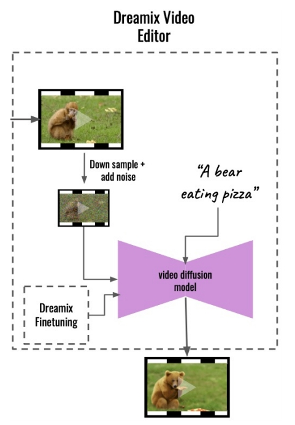 

Molad et al, “Dreamix: Video Diffusion Models are General Video Editors,” arXiv 2023.    

P164   
## One-Shot Tuned Video Editing: More Works

|||
|--|--|
|   | \\(\mathbf{EI^2}\\) (Zhang et al.)  Modify self-attention for better temporal consistency   “Towards Consistent Video Editing with Text-to-Image rDiffusion Models,” arXiv 2023. |
|   |  **Video-P2P** (Liu et al.)   Improve input-output semantic consistency of video editing via shared embedding optimization and cross-attention control   “Video-P2P: Video Editing with Cross-attention Control,” arXiv 2023. |

P165   
## One-Shot Tuned Video Editing: More Works

 

**Compared to training-free editing methods:** 

 - Cons: still need 1 video for training
 - Pros: supports significant shape change 

Wu et al., “Tune-A-Video: One-Shot Tuning of Image Diffusion Models for Text-to-Video Generation,” ICCV 2023.    

P166  
## Multiple-Shot Tuned

Video Editing: Text Conditioned

P167  

 

P168
## MotionDirector

Tune on multiple videos of a motion to be customised

 

Zhao et al., “MotionDirector: Motion Customization of Text-to-Video Diffusion Models,” arXiv 2023.    

P169  
## MotionDirector

Tune on multiple videos of a motion to be customised

 

Zhao et al., “MotionDirector: Motion Customization of Text-to-Video Diffusion Models,” arXiv 2023.    

P170   
## MotionDirector

Tune on multiple videos of a motion to be customised

 

Zhao et al., “MotionDirector: Motion Customization of Text-to-Video Diffusion Models,” arXiv 2023   

P171   
## MotionDirector

## Tune on multiple videos of a motion to be customised

 - MokonDirector can customize foundakon models to generate videos with desired mokons.

 

Zhao et al., “MotionDirector: Motion Customization of Text-to-Video Diffusion Models,” arXiv 2023.   

P172   
## MotionDirector

Tune on multiple videos of a motion to be customised  

 - The challenge is generalizing the learned motions to diverse appearance.   
 - MotionDirector learns the appearances and motions in reference videos in a decoupled way, to avoid overfitting on the limited appearances.   

 

Zhao et al., “MotionDirector: Motion Customization of Text-to-Video Diffusion Models,” arXiv 2023.   

P173   
## MotionDirector

Tune on multiple videos of a motion to be customised

 - Decouple appearance and motion.

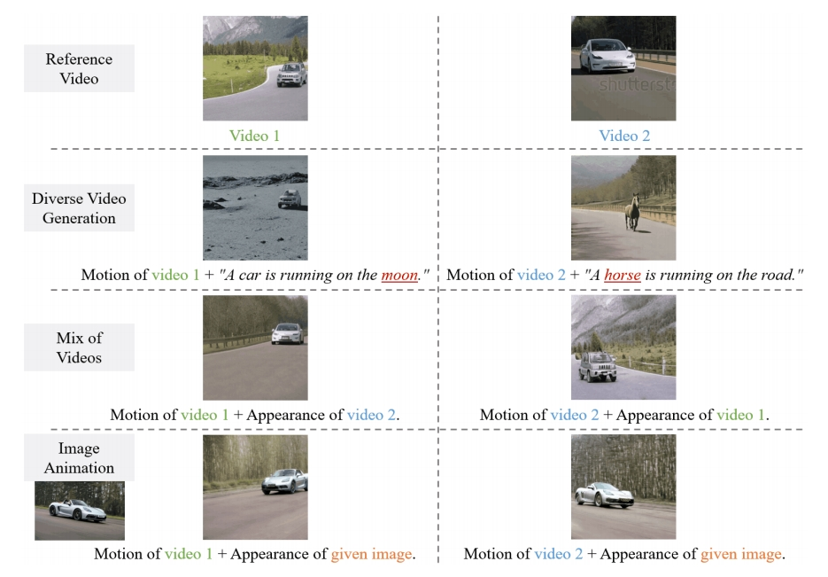 

Zhao et al., “MogonDirector: Mogon Customizagon of Text-to-Video Diffusion Models,” arXiv 2023.     

P174   
## MotionDirector  

Tune on muleple videos of a moeon to be customised

- Comparing with other methods.

 

Zhao et al., “MotionDirector: Motion Customization of Text-to-Video Diffusion Models,” arXiv 2023.    

P175   
## MotionDirector

Tune on multiple videos of a motion to be customised

 - Comparing with other methods.   

 

Zhao et al., “MotionDirector: Motion Customization of Text-to-Video Diffusion Models,” arXiv 2023.    

P176  
## MofonDirector

Tune on multiple videos of a motion to be customised

 

Zhao et al., “MotionDirector: Motion Customization of Text-to-Video Diffusion Models,” arXiv 2023.     

P177  
# 3 Video Editing

## 3.2 Training-free

P178   
 

> &#x2705; 视频编辑领域比较难的问题：怎么保持时序一致性。   

P179   
## TokenFlow

Consistent high-quality semantic edits

Main challenge using T2I to edit videos without finetuning: temporal consistency  

 

Geyer et al., “TokenFlow: Consistent Diffusion Features for Consistent Video Edigng,” arXiv 2023.    

P180   
## TokenFlow

Consistent high-quality semantic edits

**Key Idea**

 - Achieve consistency by enforcing the inter-frame correspondences in the original video   

Geyer et al., “TokenFlow: Consistent Diffusion Features for Consistent Video Edigng,” arXiv 2023.     

> &#x2705; 在 UNet 中抽出 feature map 之后，找 corresponden 并记录下来。在 denoise 过程中把这个 correspondence 应用起来。   

P181   
## TokenFlow   

Consistent high-quality semanec edits

**Main idea**

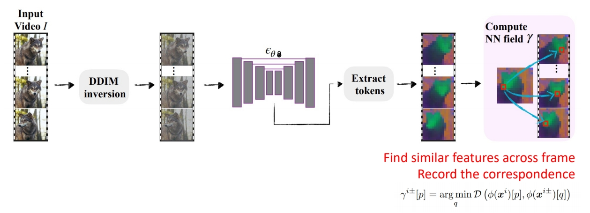 

Geyer et al., “TokenFlow: Consistent Diffusion Features for Consistent Video Editing,” arXiv 2023.    

P182   
## TokenFlow

Consistent high-quality semantic edits

**Main idea**

During conditional denoising, use features from corresponding positions in preceding and following frames instead of the pixel's own feature at output of extended-attention

|||
|--|--|
|   |   |

Geyer et al., “TokenFlow: Consistent Diffusion Features for Consistent Video Editing,” arXiv 2023.    

P183   
## TokenFlow

Consistent high-quality semantic edits

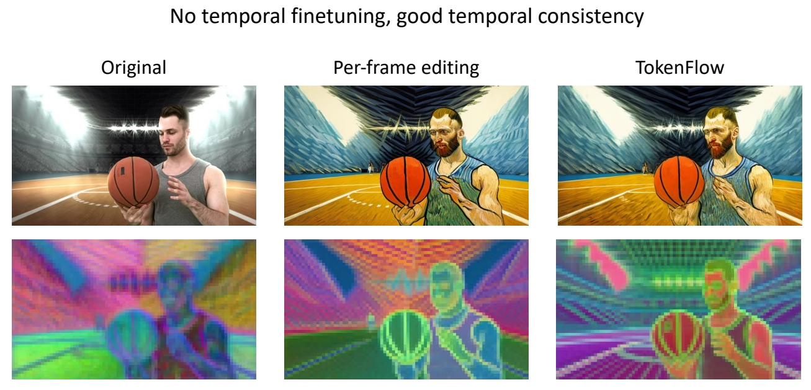 

  
Geyer et al., “TokenFlow: Consistent Diffusion Features for Consistent Video Editing,” arXiv 2023.   

> &#x2705; 在 DDIM inversion 过程中，把 attention maps 保存下来了，在 denoise 时，把这个 map 结合进去。    

P184   
## FateZero   

Attention map fusing for better temporal consistency

**Methodology** 

 - During DDIM inversion, save inverted self-/cross-attention maps    
 - During editing, use some algorithms to blend inverted maps and generated maps   

 

Qi et al., “FateZero: Fusing Attentions for Zero-shot Text-based Video Editing,” ICCV 2023.    

P185   
## FateZero   

Attention map fusing for better temporal consistency

**Methodology**

 - During DDIM inversion, save inverted self-/cross-avenkon maps   
 - During edikng, use some algorithms to blend inverted maps and generated maps   

 

Qi et al., “FateZero: Fusing Attentions for Zero-shot Text-based Video Editing,” ICCV 2023.    

P186    
## FateZero  

Attention map fusing for better temporal consistency

 

Qi et al., “FateZero: Fusing Akengons for Zero-shot Text-based Video Edigng,” ICCV 2023.    

P187   
## Training-Free Video Editing: More Works

|||
|--|--|
| 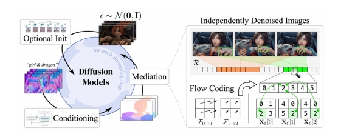  | **MeDM** (Chu et al.)   OpScal flow-based guidance for temporal consistency   “MeDM: Mediagng Image Diffusion Models for Video-to￾Video Translagon with Temporal Correspondence Guidance,” arXiv 2023. |
|  | **Ground-A-Video** (Jeong et al.)   Improve temporal consistency via modified attention and optical flow   “Ground-A-Video: Zero-shot Grounded Video Editing using Text-to-image Diffusion Models,” arXiv 2023. |
|   | **Gen-L-Video** (Lorem et al.)   Edit very long videos using existing generators   “Gen-L-Video: Multi-Text to Long Video Generation via Temporal Co-Denoising,” arXiv 2023.  |
|   | **FLATTEN** (Cong et al.)   Optical flow-guided attention for temporal consistency   “Flatten: optical flow-guided attention for consistent text-to-video editing,” arXiv 2023. |
| 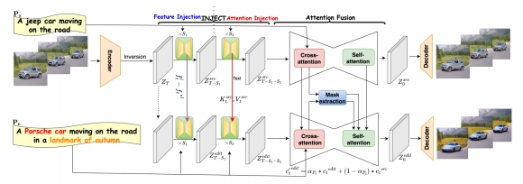 | **InFusion** (Khandelwal et al.)   Improve temporal consistency via fusing latents   “InFusion: Inject and Attention Fusion for Multi Concept Zero-Shot Text-based Video Editing,” ICCVW 2023.  |
|   | **Vid2Vid-Zero** (Wang et al.)   Improve temporal consistency via cross￾attention guidance and null-text inversion   “Zero-Shot Video Editing Using Off-The-Shelf Image Diffusion Models,” arXiv 2023. |

P188    
# 3 Video Editing

## 3.3 Controlled Edifng (depth/pose/point/ControlNet)

P189   

 

P190   
## Depth Control

P192   
## Use MiDaS to offer depth condition

Depth estimating network

Ranftl et al., “Towards Robust Monocular Depth Estimation: Mixing Datasets for Zero-shot Cross-dataset Transfer,” TPAMI 2022.

P193   
## Gen-1

Framewise depth-guided video editing

 - Inflate Stable Diffusion to a 3D model, finetune on pretrained weights   
 - Insert temporal convolution/attention layers   
 - Finetune to take **per-frame depth as conditions**   

|||
|--|--|
|   |   |

Psser et al., “Structure and Content-Guided Video Synthesis with Diffusion Models,” ICCV 2023. 

P194   
## Pix2Video

Framewise depth-guided video editing

 - Leverage a pretrained per-frame depth-conditioned Stable Diffusion model to edit frame by frame, to maintain motion consistency between source video and edited video
 - No need for training/finetuning
 - Challenge is how to ensure temporal consistency?   

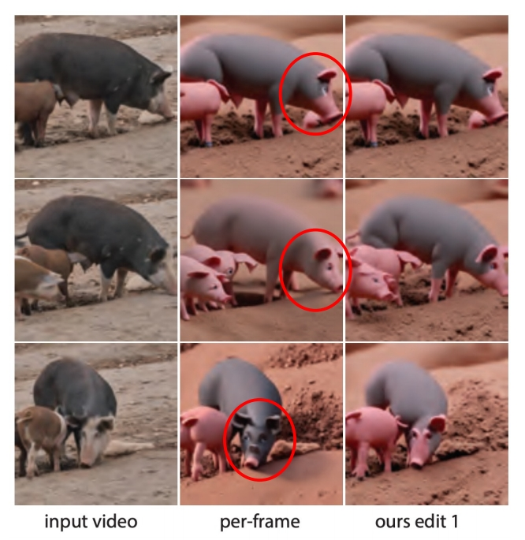 

Ceylan et al., “Pix2Video: Video Editing using Image Diffusion,” ICCV 2023.   

P195   
## Pix2Video

Framewise depth-guided video editing

 - How to ensure temporal consistency?   
    - Obtain initial noise from DDIM inversion   

 

Ceylan et al., “Pix2Video: Video Editing using Image Diffusion,” ICCV 2023.    

P196   
## Pix2Video

Framewise depth-guided video editing

 - How to ensure temporal consistency?    
    - Inject self-attention features from the previous frame in U-Net for generating the current frame    
    - Use the latent of the previous frame to guide latent update of the current frame   
 
 

Ceylan et al., “Pix2Video: Video Editing using Image Diffusion,” ICCV 2023.    

P197   
## Pix2Video

Framewise depth-guided video editing

 

Ceylan et al., “Pix2Video: Video Editing using Image Diffusion,” ICCV 2023   

P198   
## Pix2Video

Framewise depth-guided video editing

 

Ceylan et al., “Pix2Video: Video Editing using Image Diffusion,” ICCV 2023.

P199   
## ControlNet / Multiple Control

P200   
## ControlVideo (Zhang et al. 2023)

ControlNet-like video editing

 - Input structural conditions through **ControlNet**

 

Zhang et al., “ControlVideo: Training-free Controllable Text-to-Video Generation,” arXiv 2023.    

P201   
## ControlVideo (Zhang et al. 2023)

ControlNet-like video editing

 - Use pretrained weights for Stable Diffusion & ControlNet, no training/finetuning   
 - Inflate Stable Diffusion and ControlNet along the temporal dimension   
 - Interleaved-frame smoothing during DDIM sampling for bever temporal consistency    

 

Zhang et al., “ControlVideo: Training-free Controllable Text-to-Video Generation,” arXiv 2023.    

P202   
## ControlVideo (Zhang et al. 2023)  

ControlNet-like video editing

 - Use pretrained weights for Stable Diffusion & ControlNet, no training/finetuning   
 - Inflate Stable Diffusion and ControlNet along the temporal dimension    
 - Interleaved-frame smoothing during denoising for better temporal consistency    

Zhang et al., “ControlVideo: Training-free Controllable Text-to-Video Generation,” arXiv 2023.    

P203   
## ControlVideo (Zhang et al. 2023)   

ControlNet-like video editing

  

Zhang et al., “ControlVideo: Training-free Controllable Text-to-Video Generation,” arXiv 2023.     

P208   
## VideoControlNet

Optical flow-guided video editing; I, P, B frames in video compression

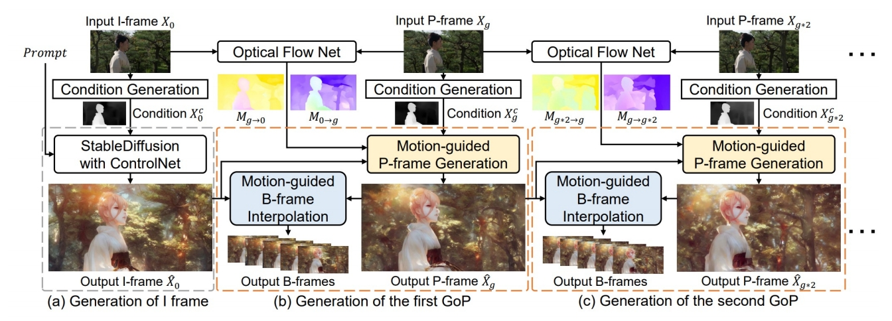  

Hu et al., “VideoControlNet: A Motion-Guided Video-to-Video Translation Framework by Using Diffusion Model with ControlNet,” arXiv 2023.     

P210   
## CCEdit

Mulemodal-guided video edieng

  

Feng et al., “CCEdit: Creative and Controllable Video Editing via Diffusion Models,” arXiv 2023.    

P211   
## VideoComposer

Image-, sketch-, motion-, depth-, mask-controlled video editing

**Video Editing based on Various Conditions**

  

Wang et al., “VideoComposer: Compositional Video Synthesis with Motion Controllability,” arXiv 2023.  

P212   
## VideoComposer

Image-, sketch-, motion-, depth-, mask-controlled video editing   

• Spako-Temporal Condikon encoder (STC-encoder): a unified input interface for condikons   

  

Wang et al., “VideoComposer: Compositional Video Synthesis with Motion Controllability,” arXiv 2023.    

P214   
## ControlNet- and Depth-Controlled Video Editing: More Works

|||
|--|--|
|   | **MagicProp** (Yan et al.)   “MagicProp: Diffusion-based Video Editing via Motion-aware Appearance Propagation,” arXiv 2023. |
| 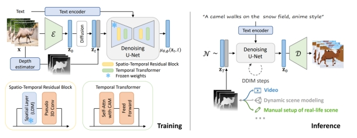 | **Make-Your-Video** (Xing et al.)   “Make-Your-Video: Customized Video Generation Using Textual and Structural Guidance,” arXiv 2023.   |
| 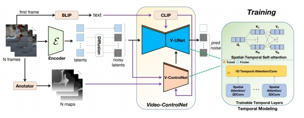 | **Control-A-Video** (Lorem et al.)   “Control-A-Video: Controllable Text-to-Video Generagon with Diffusion Models,” arXiv 2023. |
|   | **MagicEdit** (Liew et al.)   “MagicEdit: High-Fidelity and Temporally Coherent Video Editing,” arXiv 2023. |
|   |  **EVE** (Chen et al.)   “EVE: Efficient zero-shot text-based Video Editing with Depth Map Guidance and Temporal Consistency Constraints,” arXiv 2023. |

P215   
## Pose Control

P216  
## DreamPose

Pose- and image-guided video generation

Input: image  \\(\quad \\) Input: pose sequence   \\(\quad \\)  Output: Video   

 
Karras et al., “DreamPose: Fashion Image-to-Video Synthesis via Stable Diffusion,” arXiv 2023.   

P218   
## MagicAnimate

Pose- and image-guided video generaeon

**Challenges**

 - Flickering video   
 - Cannot maintain background   
 - Short video animation results   

**Possible Cause**

 - Weak appearance preservation due to lack of temporal modeling    

Xu et al., “MagicAnimate: Temporally Consistent Human Image Animation using Diffusion Model,” arXiv 2023.  

P219   
## MagicAnimate

Pose- and image-guided video generation   

 

Xu et al., “MagicAnimate: Temporally Consistent Human Image Animation using Diffusion Model,” arXiv 2023.    

P220   
## MagicAnimate

Pose- and image-guided video generation

 

Xu et al., “MagicAnimate: Temporally Consistent Human Image Animation using Diffusion Model,” arXiv 2023.

P223   
## MagicAnimate

Pose-guided video generation

 

Xu et al., “MagicAnimate: Temporally Consistent Human Image Animation using Diffusion Model,” arXiv 2023.    

P224   
## Video Editing Under Pose Guidance: More Works

|||
|--|--|
|   | **Dancing Avatar** (Qin et al.)  Pose-guided video editing   “Dancing avatar: Pose and text-guided human motion videos synthesis with image diffusion model,” arXiv 2023. |
|   | **Follow Your Pose** (Ma et al.)   Pose-guided video editing    “Follow Your Pose: Pose-Guided Text-to-Video Generation using Pose-Free Videos,” arXiv 2023.  |
|   | **DisCo** (Wang et al.)   Pose-guided video editing   “Disco: Disentangled control for referring human dance generation in real world,” arXiv 2023.  |

P225   
## Point-Control

P226   
## VideoSwap

Customized video subject swapping via point control

**Problem Formulation**

 - Subject replacement: change video subject to a **customized** subject    
 - Background preservation: preserve the unedited background same as the source video    

 

Gu et al., “VideoSwap: Customized Video Subject Swapping with Interactive Semantic Point Correspondence,” 2023.    

P227    
## VideoSwap

Customized video subject swapping via point control

**Motivation**

 - Existing methods are promising but still often motion not well aligned   
 - Need ensure precise correspondence of <u> **semantic points** </u> between the source and target   

 

Gu et al., “VideoSwap: Customized Video Subject Swapping with Interactive Semantic Point Correspondence,” 2023.   

> &#x2705; （1）人工标注每一帧的 semantic point．（少量标注，8帧）    
> &#x2705; （2）把 point map 作为 condition．   

P228    
## VideoSwap

Customized video subject swapping via point control

**Empirical Observations**

 - **Question**: Can we <u> learn semantic point control </u> for a specific <u>source video subject</u> using only a <u>small number of source video frames</u>   
 - **Toy Experiment**: Manually define and annotate a set of semantic points on 8 frame; use such point maps as condition for training a control net, i.e., T2I-Adapter.    

 

Gu et al., “VideoSwap: Customized Video Subject Swapping with Interactive Semantic Point Correspondence,” 2023.

> &#x2705; 实验证明，可以用 semantic point 作为 control．   

P229    
## VideoSwap

Customized video subject swapping via point control

**Empirical Observations**

 - **Observation 1**: If we can drag the points, the trained T2I-Aapter can generate new contents based on such dragged new points (new condition)  →  feasible to use semantic points as condition to control and maintain the source motion trajectory.

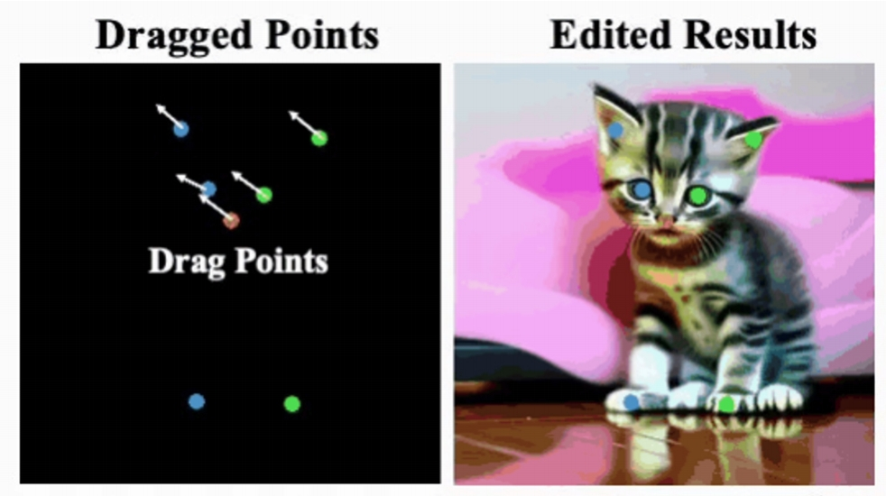 

Gu et al., “VideoSwap: Customized Video Subject Swapping with Interactive Semantic Point Correspondence,” 2023.  

> &#x2705; 也可以通过拉部分点改变车的形状。   

P230    
## VideoSwap

Customized video subject swapping via point control

**Empirical Observations**

 - **Observation 2**: Further, we can drag the semantic points to control the subject’s shape   
 
 

Gu et al., “VideoSwap: Customized Video Subject Swapping with Interactive Semantic Point Correspondence,” 2023.   

P231    
## VideoSwap

Customized video subject swapping via point control

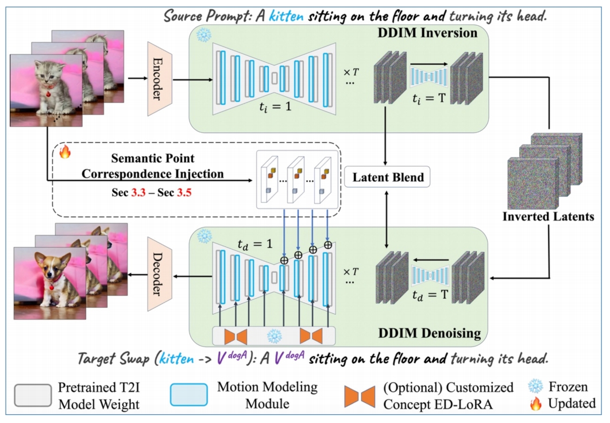 

**Framework**

 - **Motion layer**: use pretrained and fixed AnimateDiff to ensure essential temporal consistency    
 - **ED-LoRA** \\(_{(Mix-of-Show)}\\): learn the wconcept to be customized   

 - **Key design aims**: 
    - Introduce semantic point correspondences to guide motion trajectory   
    - Reduce human efforts of annotating points    

Gu et al. “VideoSwap: Customized Video Subject Swapping with Interactive Semantic Point Correspondence,” 2023.   
Gu et al. “Mix-of-Show: Decentralized Low-Rank Adaptation for Multi-Concept Customization of Diffusion Models.” NeurIPS, 2023.   

P232   
## VideoSwap

Customized video subject swapping via point control

**Step 1: Semantic Point Extraction**

 - Reduce human efforts in annotating points    
    - User define point at one keyframe    
    - Propagate to other frames by point tracking/detector   
 - Embedding    

 

Gu et al., “VideoSwap: Customized Video Subject Swapping with Interactive Semantic Point Correspondence,” 2023.   

P233   
## VideoSwap

Customized video subject swapping via point control

**Methodology – Step 1: Semantic Point Extraction on the source video**

 - Reduce human efforts in annotating points   
 - Embedding   
    - Extract DIFT embedding (intermediate U-Net feature) for each semantic point   
    - Aggregate over all frames   

 

Gu et al., “VideoSwap: Customized Video Subject Swapping with Interactive Semantic Point Correspondence,” 2023.   

P234    
## VideoSwap

Customized video subject swapping via point control

**Methodology – Step 2: Semantic Point Registration on the source video**  

 - Introduce several learnable MLPs, corresponding to different scales
 - Optimize the MLPs    
    - Point Patch Loss: restrict diffusion loss to reconstruct local patch around the point    
    - Semantic-Enhanced Schedule: only sample higher timestep (0.5T, T), which prevents overfitting to low-level details    

 

Gu et al., “VideoSwap: Customized Video Subject Swapping with Interactive Semantic Point Correspondence,” 2023.    

P235    
## VideoSwap

Customized video subject swapping via point control   

**Methodology**   

 - After Step1 (Semantic Point Extraction) and Step2 (Semantic Point Registration), those semantic points can be used to guide motion   
 - User-point interaction for various applications   

 

Gu et al., “VideoSwap: Customized Video Subject Swapping with Interactive Semantic Point Correspondence,” 2023.    

P236   
## VideoSwap

Customized video subject swapping via point control

**Methodology**

 - How to drag point for shape change?   
    - Dragging at one frame is straightforward, propagating drag displacement over time is non-trivial, because of complex camera motion and subject motion in video.   
    - Resort to canonical space (i.e., Layered Neural Atlas) to propagate displacement.   

 

Gu et al., “VideoSwap: Customized Video Subject Swapping with Interactive Semantic Point Correspondence,” 2023.    

P237   
## VideoSwap

Customized video subject swapping via point control

**Methodology**

 - How to drag point for shape change?   
 - Dragging at one frame is straightforward, propagating drag displacement over time is non-trivial because of complex camera motion and subject motion in video.   
 - Resort to canonical space (i.e., Layered Neural Atlas) to propagate displacement.    

 

Gu et al., “VideoSwap: Customized Video Subject Swapping with Interactive Semantic Point Correspondence,” 2023.    

P238    
## VideoSwap

Customized video subject swapping via point control

 

Gu et al., “VideoSwap: Customized Video Subject Swapping with Interactive Semantic Point Correspondence,” 2023.   

P239   
## VideoSwap

Customized video subject swapping via point control

 

Gu et al., “VideoSwap: Customized Video Subject Swapping with Interactive Semantic Point Correspondence,” 2023.   

> &#x2705; point contrd 可以处理形变比较大的场景。   

P240   
## VideoSwap

Customized video subject swapping via point control

**Qualitative Comparisons to previous works**

 - VideoSwap can **support shape change** in the target swap results, leading to the correct identity of target concept. 

 

Gu et al., “VideoSwap: Customized Video Subject Swapping with Interactive Semantic Point Correspondence,” 2023.    

P242   
# 3 Video Editing

## 3.4 3D-Aware

P243   

 

P244   
## Layered Neural Atlases

Decompose a video into two images

 - Decompose a video into a foreground image + a background image    

 

Kasten et al., “Layered Neural Atlases for Consistent Video Editing,” arXiv 2023.   

P245    
## Layered Neural Atlases

Decompose a video into two images

 - Decompose a video into a foreground image + a background image   
 - Edit the foreground/background image = edit the video    

 

Kasten et al., “Layered Neural Atlases for Consistent Video Editing,” arXiv 2023.    

P246   
## VidEdit

Atlas-based video editing

 - Decompose a video into a foreground image + a background image   
 - Edit the foreground/background image = edit the video   
 - Use diffusion to edit foreground/background atlas   

 

Video from Kasten et al., “Layered Neural Atlases for Consistent Video Edigng,” arXiv 2023.    
Couairon et al., “VidEdit: Zero-Shot and Spagally Aware Text-Driven Video Edigng,” arXiv 2023.   

P247    
## StableVideo & Shape-aware Text-drive Layered Video Editing

Atlas-based video edieng

 

Lee et al., “Shape-aware Text-driven Layered Video Editing,” CVPR 2023.   
Chai et al., “StableVideo: Text-driven Consistency-aware Diffusion Video Editing,” ICCV 2023.   

P248   
## StableVideo

Atlas-based video editing

 

Chai et al., “StableVideo: Text-driven Consistency-aware Diffusion Video Edigng,” ICCV 2023.   

> &#x2705; 给一个场景的多视角图片，基于 MLP 学习 3D 场景的隐式表达。   

P249    
## Content Deformation Field (CoDeF)

Edit a video = edit a canonical image + learned deformaeon field

 - Limitations of Neural Layered Atlases   
    - Limited capacity for faithfully reconstructing intricate video details, missing subtle motion features like blinking eyes and slight smiles   
    - Distorted nature of the estimated atlas leads to impaired semantic information   

 - Content Deformation Field: inspired by dynamic NeRF works, a new way of representing video, as a 2d canonical image + 3D deformation field over time   

 - Edit a video = edit a canonical image + learned deformation field   

Ouyang et al., “CoDeF: Content Deformation Fields for Temporally Consistent Video Processing,” arXiv 2023.

P250    
## Content Deformation Field (CoDeF)

Edit a video = edit a canonical image + learned deformation field    

**Problem Formulation**

 - Decode a video into a 2D canonical field and a 3D temporal deformation field   
 - Deformation Field: video (x, y, t) → canonical image coordinate (x’, y’)   
 - Canonical Field: (x’, y’) → (r, g, b), like a “2D image”   

 

Ouyang et al., “CoDeF: Content Deformation Fields for Temporally Consistent Video Processing,” arXiv 2023.   

P251   
## Content Deformation Field (CoDeF)

Edit a video = edit a canonical image + learned deformation field    

**CoDeF compared to Atlas**

 - Superior robustness to non-rigid motion   
 - Effective reconstruction of subtle movements (e.g. eyes blinking)    
 - More accurate reconstruction: 4.4dB higher PSNR   

Ouyang et al., “CoDeF: Content Deformation Fields for emporally Consistent Video Processing,” arXiv 2023.   

> &#x2705; CoDef 把 3D 视频压缩为 2D Image，因此可以利用很多 2D 算法，再把 deformation 传递到整个视频。    

P252   
## Content Deformation Field (CoDeF)

Edit a video = edit a canonical image + learned deformation field   

 

Ouyang et al., “CoDeF: Content Deformation Fields for emporally Consistent Video Processing,” arXiv 2023.   

> &#x2705; 在时序上有比较好的一致性。   
> &#x2705; 由于使用了 control net，与原视频在 Spatial level 也保持得非常好。   

P253   
## Content Deformafon Field (CoDeF)

Edit a video = edit a canonical image + learned deformation field   

 

Ouyang et al., “CoDeF: Content Deformation Fields for emporally Consistent Video Processing,” arXiv 2023.   

P254   
## DynVideo-E

Edit a video = edit a canonical ~~image~~ 3D NeRF   

Canonical image in CoDeF is still 2D   

Can we represent the video in a truly 3D space?   

Liu et al., “DynVideo-E: Harnessing Dynamic NeRF for Large-Scale Motion- and View-Change Human-Centric Video Editing,” arXiv 2023.   

P255   
## DynVideo-E

Edit a video = edit a canonical ~~image~~ 3D NeRF

 

Liu et al., “DynVideo-E: Harnessing Dynamic NeRF for arge-Scale Motion- and View-Change Human-Centric Video Editing,” arXiv 2023.   

P256   
> &#x2705; Nerf 在人体成像上比较好。   

P257   
## DynVideo-E

Edit a video = edit a canonical ~~image~~ 3D NeRF   

**Main idea**

 - For the first time introduce the dynamic NeRF as an innovative video representation for large-scale motion- and view-change human-centric video editing.   

Liu et al., “DynVideo-E: Harnessing Dynamic NeRF for Large-Scale Motion- and View-Change Human-Centric Video Editing,” arXiv 2023.

> &#x2705; 不直接编辑图像，而是编辑 Nerf．   
> &#x2705;（1）认为背景静止，学出背景 Neof．   
> &#x2705; Stale Diffusion 用来计算 Loss.  

P258  
## DynVideo-E

Edit a video = edit a canonical ~~image~~ 3D NeRF   

Follow HOSNeRF, represent the video as:   
 - Background NeRF   
 - Human NeRF   
 - Deformation Field   

Edit background NeRF and human NeRF respectively   

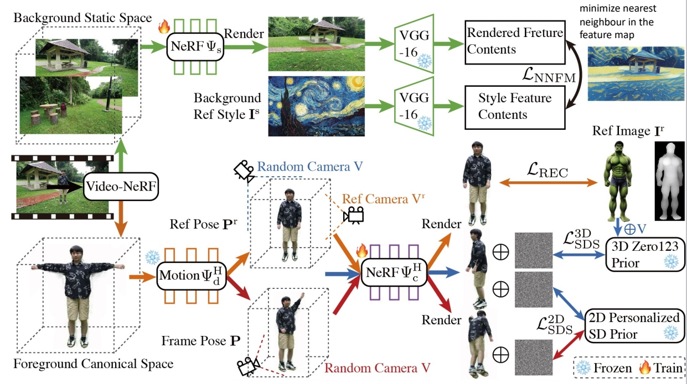 

Liu et al., “HOSNeRF: Dynamic Human-Object-Scene Neural Radiance Fields from a Single Video,” ICCV 2023.   
Liu et al., “DynVideo-E: Harnessing Dynamic NeRF for Large-Scale Mogon- and View-Change Human-Centric Video Edigng,” arXiv 2023.   

P259  
## DynVideo-E

DynVideo-E significantly outperforms SOTA approaches on two challenging datasets by a large margin of 50% ∼ 95% in terms of human preference   

P263   
# 3 Video Editing  

## 3.5 Other Guidance

P264  

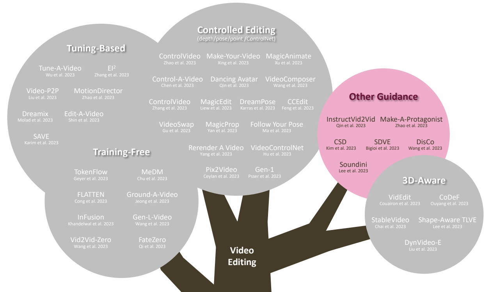 

P265   
## InstructPix2Pix

Instruction-guided image editing

 

Brooks et al., “InstructPix2Pix: Learning to Follow Image diting Instructions,” CVPR 2023.  

P266   
## InstructVid2Vid

Instruction-guided Video Editing

 - Generate ⟨instruction, video⟩ dataset using ChatGPT, BLIP and Tune-A-Video   
 - Train inflated Stable Diffusion for instruction-guided video editing   

 

Qin et al., “InstructVid2Vid: Controllable Video Editing with Natural Language Instructions,” arXiv 2023.    

> &#x2705;（1）把说话的部分 mask 掉 （2）用 diffusion 根据 Audio Feature 生成说话的部分。   
> &#x2705; 额外约束：（1）reference 状态 （2）前后帧 smooth     

P267   
## Speech Driven Video Editing via an Audio-Conditioned Diffusion Model

Speech-driven video editing

 

Bigioi et al., “Speech Driven Video Editing via an Audio-Conditioned Diffusion Model,” arXiv 2023.   

P268   
## Soundini

Sound-guided video editing

 

Lee et al., “Soundini: Sound-Guided Diffusion for Natural Video Editing,” arXiv 2023.    

P269   
## Video Editing Under Various Guidance: More Works

|||
|--|--|
|   | **Collaborative Score Distillation** (Kim et al.)   Instruction-guide video editing   “Collaborative Score Distillation for Consistent Visual Synthesis,” NeurIPS 2023. |
|   | **Make-A-Protagonist** (Zhao et al.)   Video ediSng with an ensemble of experts   “Make-A-Protagonist: Generic Video Edigng with An Ensemble of Experts,” arXiv 2023. |
|   | **DragNUWA** (Yin et al.)   Multimodal-guided video editing   “DragNUWA: Fine-grained Control in Video Generation by Integrating Text, Image, and Trajectory,” arXiv 2023. |

