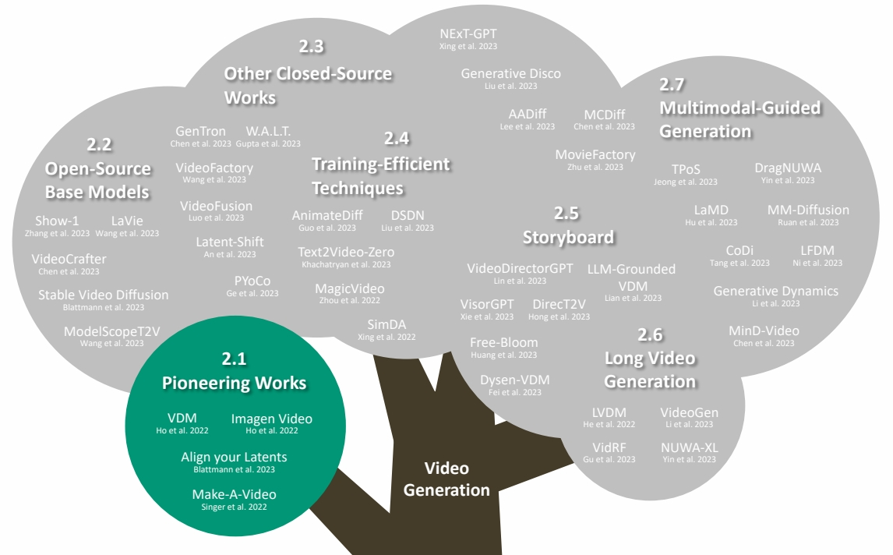
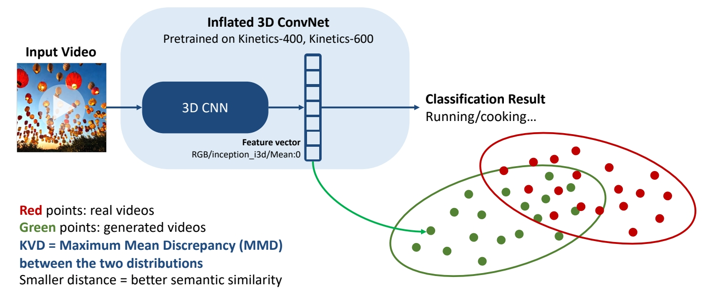
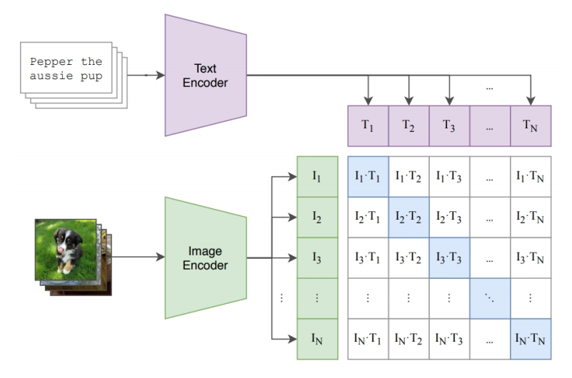
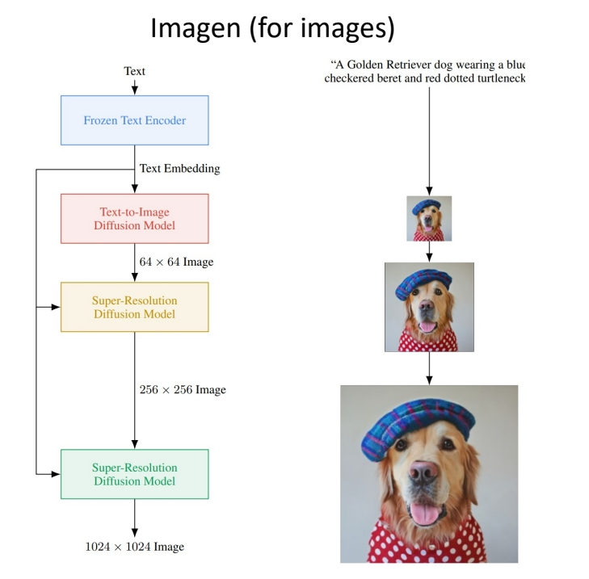
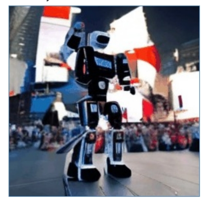
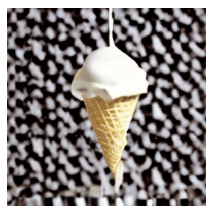
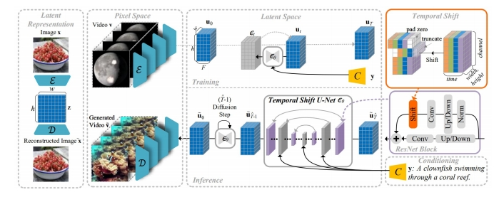
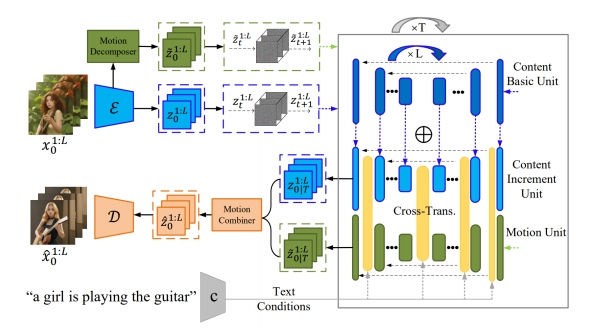

P29   
# 2 Video Generation

P30  
## Video Foundation Model

P31  

P32   

# 2 Video Generation

## 2.1 Pioneering/early works

P34  
## Problem Definition

**Text-Guided Video Generation**   

Text prompt → video   

Video from Zhang et al., “Show-1: Marrying Pixel and Latent Diffusion Models for Text-to-Video Generation,” arXiv 2023.    

P35   
## Problem Definition   

> &#x2705; 从 2D 输出变成 3D 输出。   

P36  
## Video Diffusion Models  

Recap 3D Conv

|||
|--|--|
|   |   |

Du et al., “Learning Spatiotemporal Features with 3D Convolutional Networks,” ICCV 2015.     

P37  
## Video Diffusion Models

Recap (2+1)D Conv

|||
|--|--|
|   |   |

Du et al., “A Closer Look at Spatiotemporal Convolutions for Action Recognition,” CVPR 2018.    

> &#x2705; \\(t\times d\times d\\) 卷积 kenal 数量非常大，可以对 kernel 做分解，先在 spatial 上做卷积，然后在 temporal 上做卷积。   
> &#x2705; 特点：效果还不错，效率也高。   

P38   
## Video Diffusion Models   

Early work on video generation

Ho et al., “Video Diffusion Models,” NeurIPS 2022.  

P39   
## Video Diffusion Models

Early work on video generation   

 - 3D U-Net factorized over space and time   
 - Image 2D conv inflated as → space-only 3D conv, i.e., 2 in (2+1)D Conv   
    - Kernel size: (3×3) → (<u>1</u>×3×3)   
    - Feature vectors: (height × weight × channel) → (<u>frame</u> × height × width × channel)   
 - Spatial attention: remain the same   
 - Insert temporal attention layer: attend across the temporal dimension (spatial axes as batch)   

 

Ho et al., “Video Diffusion Models,” NeurIPS 2022.  

> &#x2705; 2D U-Net 变为 3D U-Net，需要让其内部的 conv 操作和 attention 操作适配 3D.   
> &#x2705; （1）2D conv 适配 3D，实际上只是扩充一个维度变成伪 3D，没有对时序信息做抽象。  
> &#x2705; （2）attention 操作同样没有考虑时序。   
> &#x2705; （3）时序上的抽象体现在 temporal attention layer上。   

P40  
## Make-A-Video

Cascaded generation

 

Singer et al., “Make-A-Video: Text-to-Video Generation without Text-Video Data,” arXiv 2022. 

> &#x2705; 效果更好，框架在当下更主流。   
> &#x2705; （1）SD：decoder 出关键帧的大概影像。  
> &#x2705; （2）FI：补上中间帧。   
> &#x2705; （3）SSR：时空上的超分。   

P41   
## Make-A-Video

Cascaded generation

 

Singer et al., “Make-A-Video: Text-to-Video Generation without Text-Video Data,” arXiv 2022.     

> &#x2753; 第 3 步时间上的超分为什么没有增加帧数？   

P42  
## Make-A-Video

Cascaded generation

 

Singer et al., “Make-A-Video: Text-to-Video Generation without Text-Video Data,” arXiv 2022.    

> &#x2705; 此处的伪 3D 是指（2＋1）D，它有时序上的抽像，与 VDM 不同。   
> &#x2705; 空间卷积使用预训练好的图像模型。   

P43   
## Make-A-Video

Cascaded generation

 

Singer et al., “Make-A-Video: Text-to-Video Generation without Text-Video Data,” arXiv 2022.   

> &#x2705; attention 操作也是（2＋1）D．   

P44  
## Make-A-Video

Cascaded generation

**Training**
 - 4 main networks (decoder + interpolation + 2 super-res)   
    - First trained on images alone    
    - Insert and finetune temporal layers on videos   
 - Train on WebVid-10M and 10M subset from HD-VILA-100M   

P45   
## Datasets

The WebVid-10M Dataset

 

Bain et al., “Frozen in Time: A Joint Video and Image Encoder for End to End Paper,” ICCV 2021.    

> &#x2705; WebVid 是常用的视频数据集，有高清视频及配对文本。   

P46   
## Evaluation Metrics

 

P47   

## Evaluation Metrics   

Quantitative evaluations

**Image-level Evaluation Metrics**

 - Fréchet Inception Distance (FID, ↓): semantic similarity between images   
 - Peak Signal-to-Noise Ratio (PSNR, ↑): pixel-level similarity between images   
 - Structural Similarity Index (SSIM, ↓): pixel-level similarity between images   
 - CLIPSIM (↑): image-text relevance   

**Video-level Evaluation Metrics**

 - Fréchet Video Distance (FVD, ↓): semantic similarity & temporal coherence   
 - Kernel Video Distance (KVD, ↓): video quality (via semantic features and MMD)   
 - Video Inception Score (IS, ↑): video quality and diversity   
 - Frame Consistency CLIP Score (↑): frame temporal semantic consistency   

P48   
## Fréchet Inception Distance (FID)

Semantic similarity between images

 

**Lantern image generated with Stable Diffusion 2.1.**    

Heusel et al., “GANs Trained by a Two Time-Scale Update Rule Converge to a Local Nash Equilibrium,” NeurIPS 2017.    
Hung-Yi Lee, “Machine Learning 2023 Spring,” National Taiwan University.    

> &#x2705; FID：评估两个 distribution 的差距有多大。由于使用了网络的高层 feature，可以评价 high／evel 的语义相似性。   

P49   
## Peak Signal-to-Noise Ratio (PSNR)

Pixel-level similarity between images

 - For two images \\(x,y \text{ of shape }  M\times N\\):   

\begin{align*} \mathrm{PSNR} (x,y) = 10 \log_{10}{} \frac{255^2}{\mathrm{MSE} (x,y)}  \end{align*}

where    

\begin{align*} \mathrm{MSE} (x,y) = \frac{1}{MN} \sum_{i=1}^{M} \sum_{j=1}^{N} (x_{ij}-y_{ij})^2\end{align*}

Horé et al., “Image Quality Metrics: PSNR vs. SSIM,” ICPR 2010.    

P50  
## Structural Similarity Index Measure (SSIM)

Pixel-level similarity between images

 - Model any image distortion as a combination of:   
(1) loss of correlation, (2) luminance distortion, (3) contrast distortion

 - For two images \\(x,y \text{ of shape }  M\times N\\):   

\begin{align*}  \mathrm{SSIM} (x,y)=l(x,y)\cdot c(x,y)\cdot s(x,y)\end{align*}

where   

\begin{align*} \begin{cases}
 \text{Lumiannce Comparison Funckon:} l(x,y)=\frac{2\mu _x\mu _y+C_1}{\mu _x^2+\mu _y^2+C_1}  \\\\ 
 \text{Contrast Comparison Funckon:} c(x,y)=\frac{2\sigma  _x\sigma  _y+C_2}{\sigma  _x^2+\sigma  _y^2+C_2}  \\\\ 
  \text{Structure Comparison Funckon:} s(x,y)=\frac{\sigma  _{xy}+C_3}{\sigma  _{x}\sigma  _{y}+C_3}  \end{cases}\end{align*}
 

Wang et al., “Image Quality Assessment: from Error Visibility to Structural Similarity,” IEEE Transactions on Image Processing, April 2004.   
Horé et al., “Image Quality Metrics: PSNR vs. SSIM,” ICPR 2010.   

P51   
## CLIP Similarity   

Image-caption similarity

 

Radford et al., “Learning Transferable Visual Models From Natural Language Supervision,” ICML 2021.      

P52   
## Fréchet Video Distance (FVD)  

Semantic similarity and temporal coherence between two videos    

 

Unterthiner et al., “FVD: A new Metric for Video Generation,” ICLR 2019.    
Unterthiner et al., “Towards Accurate Generative Models of Video: A New Metric & Challenges,” arXiv 2018.     

P53   
## Kernel Video Distance   

Video quality assessment via semantic features and MMD  

 

Unterthiner et al., “FVD: A new Metric for Video Generation,” ICLR 2019.    
Unterthiner et al., “Towards Accurate Generative Models of Video: A New Metric & Challenges,” arXiv 2018.      

P54   
## Video Inception Score (IS)

Video quality and diversity

 

Salimans et al., “Improved Techniques for Training GANs,” NeurIPS 2016.    
Barratt et al., “A Note on the Inception Score,” ICML 2018.    
Saito et al., “Train Sparsely, Generated Densely: Memory-Efficient Unsupervised Training of High-Resolution Temporal GAN,” IJCV 2020. 

> &#x2705; 多样性，在不给定 condition 的情况生成的分布的多样性。   
> &#x2705; 质量：在给 condition 的条件下应生成特定的类别。   

P55   
## Frame Consistence CLIP scores

Frame temporal semantic consistency

 - Compute CLIP image embeddings for all frames   
 - Report average cosine similarity between all pairs of frames   

 

Radford et al., “Learning Transferable Visual Models From Natural Language Supervision,” ICML 2021.    

P57   
## Evaluation Metrics    

Hybrid evaluation

**EvalCrafter**

 - Creates a balanced prompt list for evaluation   
 - **Multi-criteria decision analysis** on 18 metrics: visual quality, content quality…   
 - Regress the coefficients of all metrics to generate an overall score aligned with user opinions   

 

Liu et al., “EvalCrafter: Benchmarking and Evaluating Large Video Generation Models,” arXiv 2023.      

P58  
## Make-A-Video   

Cascaded generation

 

Singer et al., “Make-A-Video: Text-to-Video Generation without Text-Video Data,” arXiv 2022.    

P59   
## Make-A-Video   

Cascaded generation

 

Singer et al., “Make-A-Video: Text-to-Video Generation without Text-Video Data,” arXiv 2022.     

> &#x2705; 早期都在UCF数据上比较，但UCF本身质量比较低，新的生成方法生成的质量更高，因此不常用 UCF 了。  

P60  
## Make-A-Video   

Cascaded generation

 

Singer et al., “Make-A-Video: Text-to-Video Generation without Text-Video Data,” arXiv 2022.    

P62   
## Make-A-Video   

Cascaded generation

**From static to magic**   

Add motion to a single image or fill-in the in-betw    

 

Singer et al., “Make-A-Video: Text-to-Video Generation without Text-Video Data,” arXiv 2022.    

P63   
## Imagen & Imagen Video

Leverage pretrained T2I models for video generation; Cascaded generation

|||
|--|--|
|   |   |

Imagen: Saharia et al., “Photorealistic Text-to-Image Diffusion Models with Deep Language Understanding,” arXiv 2022.    
Imagen Video: Ho et al., “Imagen Video: High Definition Video Generation with Diffusion Models,” arXiv 2022.    

> &#x2705; 先在 image 上做 cascade 生成      
> &#x2705; 视频是在图像上增加时间维度的超分   

P64   
## Align your Latents

Leverage pretrained T2I models for video generation; 
Cascaded generation   

Blattmann et al., “Align your Latents: High-Resolution Video Synthesis with Latent Diffusion Models,” CVPR 2023.     

> &#x2705; 在 latent space 工作，因此 “生成关键帧 + 插帧 + 超分” 之后要 Decoder.   

P65   
## Align your Latents   

Leverage pretrained T2I models for video generation

**Inserting Temporal Layers**   

 - Latent space diffusion model: insert temporal convolutional & 3D attention layers   
 - Decoder: add 3D convolutional layers   
 - Upsampler diffusion model: add 3D convolution layers   

> &#x2705; 所有工作的基本思路：（1）先从小的生成开始（2）充分利用 T2I．   

P66   
# 2 Video Generation   

## 2.2 Open-source base models

P67   

P68   
## ModelScopeT2V

Leverage pretrained T2I models for video generation

 - Inflate Stable Diffusion to a 3D model, preserving pretrained weights   
 - Insert spatio-temporal blocks, can handle varying number of frames   

|||
|--|--|
|   |   |

Wang et al., “ModelScope Text-to-Video Technical Report,” arXiv 2023.    

> &#x2705; 基本思路：（1）以 Stable Diffusion 为基础，在 latent space 工作。（2）把 SD 中的 2D 操作扩展为 3D.   

P69   
## ModelScopeT2V

Leverage pretrained T2I models for video generation   

 - Inflate Stable Diffusion to a 3D model, preserving pretrained weights    
 - Insert spatio-temporal blocks   

 

Wang et al., “ModelScope Text-to-Video Technical Report,” arXiv 2023.     

> &#x2705; 扩展方法为（2＋1）D，因此在 2D 时空 spatial 的卷积操作和 Attention 操作之后分别增加了 temporal 的卷积和 Attention.   

P70   
## ModelScopeT2V    

Leverage pretrained T2I models for video generation

 - Inflate Stable Diffusion to a 3D model, preserving pretrained weights   
 - Insert spatio-temporal blocks, **can handle varying number of frames**   

 

Wang et al., “ModelScope Text-to-Video Technical Report,” arXiv 2023. 

> &#x2705; 时域卷积操作能指定 frame 数，因此可以“生成视频”与“生成图像”联合训练。   

P71   
## ModelScopeT2V

Length = 1   
Model generate images   

P72   
## ModelScopeT2V   

Leverage pretrained T2I models for video generation

 

ZeroScope: finetunes ModelScope on a small set of high-quality videos, resulting into higher resolution at 
1024 x 576, without the Shutterstock watermark    

Wang et al., “ModelScope Text-to-Video Technical Report,” arXiv 2023.     

> &#x2705; ZeroScope 在 ModelScope 上 finetune，使用了非常小但质量非常高的数据，得到了高分辨率的生成效果。   

P73   
## ModelScopeT2V   

Leverage pretrained T2I models for video generation  

P74  
## ModelScopeT2V

Leverage pretrained T2I models for video generation

|||||
|--|--|--|--|
| " Robot dancing in times square,” arXiv 2023.  | " Clown fish swimming through the coral reef,” arXiv 2023.| " Melting ice cream dripping down the cone,” arXiv 2023.| " Hyper-realistic photo of an abandoned industrial site during a storm,” arXiv 2023.|
|   |   |   |   |

Wang et al., “ModelScope Text-to-Video Technical Report,” arXiv 2023.    

P75   
## Show-1

Better text-video alignment? Generation in both pixel- and latent-domain

 

Zhang et al., “Show-1: Marrying Pixel and Latent Diffusion Models for Text-to-Video Generation,” arXiv 2023.    

> &#x2705; 当前模型存在的问题：当文本变复杂时，文本和内容的 align 不好。  
> &#x2705; show-1 在 alignment 上做了改进。   

P76   
## Show-1

Better text-video alignment? Generation in both pixel- and latent-domain   

**Motivation**

 - Pixel-based VDM achieves better text-video alignment than latent-based VDM   

|||
|--|--|
|  |  |

Zhang et al., “Show-1: Marrying Pixel and Latent Diffusion Models for Text-to-Video Generation,” arXiv 2023.   

> &#x2705; 实验发现：pixel spase 比 latent space 更擅长 align ment.   
> &#x2705; 原因：在 latent space，文本对 pixel 的控制比较差。   

P77   
## Show-1

Generation in both pixel- and latent-domain

**Motivation**

 - Pixel-based VDM achieves better text-video alignment than latent-based VDM   
 - Pixel-based VDM takes much larger memory than latent-based VDM    

 

Zhang et al., “Show-1: Marrying Pixel and Latent Diffusion Models for Text-to-Video Generation,” arXiv 2023.   

P78   
## Show-1   

Generation in both pixel- and latent-domain  

**Motivation** 

 - Use Pixel-based VDM in low-res stage   
 - Use latent-based VDM in high-res stage   

 

Zhang et al., “Show-1: Marrying Pixel and Latent Diffusion Models for Text-to-Video Generation,” arXiv 2023.   

P79   
## Show-1   

Generation in both pixel- and latent-domain

<https://github.com/showlab/Show-1>

 - Better text-video alignment   
 - Can synthesize large motion   
 - Memory-efficient   

Zhang et al., “Show-1: Marrying Pixel and Latent Diffusion Models for Text-to-Video Generation,” arXiv 2023.   

P80  
## VideoCrafter  

• Latent diffusion inserted with temporal layers

 

Chen et al., “VideoCrafter1: Open Diffusion Models for High-Quality Video Generation,” arXiv 2023.    

P81  
## LaVie  

Joint image-video finetuning with curriculum learning

 

Wang et al., “LAVIE: High-Quality Video Generation with Cascaded Latent Diffusion Models,” arXiv 2023.   

> &#x2705; 提供了一套高质量数据集，生成的视频质量也更好（训练集很重要）。   

P83   
## Stable Video Diffusion  

Scaling latent video diffusion models to large datasets

**Data Processing and Annotation** 

 - Cut Detection and Clipping    
    - Detect cuts/transitions at multiple FPS levels   
    - Extract clips precisely using keyframe timestamps   
 - Synthetic Captioning   
    - Use CoCa image captioner to caption the mid-frame of each clip   
    - Use V-BLIP to obtain video-based caption   
    - Use LLM to summarise the image- and video-based caption   
    - Compute CLIP similarities and aesthetic scores
 - Filter Static Scene   
    - Use dense optical flow magnitudes to filter static scenes   
 - Text Detection   
    - Use OCR to detect and remove clips with excess text    

Blattmann et al., “Stable Video Diffusion: Scaling Latent Video Diffusion Models to Large Datasets,” 2023.     

> &#x2705; SVD：构建数据集    
> &#x2705; （1）把视频切成小段，描述会更准确   
> &#x2705; （2）用现有模型生成视频描述     

P84   
## Stable Video Diffusion   

Scaling latent video diffusion models to large datasets

**Data Processing and Annotation**  

 

Blattmann et al., “Stable Video Diffusion: Scaling Latent Video Diffusion Models to Large Datasets,” 2023.    

P85  
## Stable Video Diffusion   

Scaling latent video diffusion models to large datasets

**Stage I: Image Pretraining**

 - Initialize weights from Stable Diffusion 2.1 (text-to-image model)   

 

Blattmann et al., “Stable Video Diffusion: Scaling Latent Video Diffusion Models to Large Datasets,” 2023.    

P86   
## Stable Video Diffusion   

Scaling latent video diffusion models to large datasets

**Stage II: Curating a Video Pretraining Dataset**

 - Systematic Data Curation
    - Curate subsets filtered by various criteria (CLIP-, OCR-, optical flow-, aesthetic-scores…)
    - Assess human preferences on models trained on different subsets
    - Choose optimal filtering thresholds via Elo rankings for human preference votes
 - Well-curated beats un-curated pretraining dataset

 

Blattmann et al., “Stable Video Diffusion: Scaling Latent Video Diffusion Models to Large Datasets,” 2023.  

P87   
## Stable Video Diffusion  

Scaling latent video diffusion models to large datasets

**Stage III: High-Quality Finetuning**

 - Finetune base model (pretrained from Stages I-II) on high-quality video data   
    - High-Resolution Text-to-Video Generation   
       - ~1M samples. Finetune for 50K iterations at 576x1024 (in contrast to 320x576 base resolution)   
    - High Resolution Image-to-Video Generation   
    - Frame Interpolation   
    - Multi-View Generation   
 - Performance gains from curation persists after finetuning   

 

Blattmann et al., “Stable Video Diffusion: Scaling Latent Video Diffusion Models to Large Datasets,” 2023.    

> &#x2705; 在少量高质量数据上 finehune，质量提升很大。   

P89   
# 2 Video Generation

## 2.3 Other closed-source works

P90   

 

P91   
## GenTron

Transformer-based diffusion for text-to-video generation

 - Transformer-based architecture extended from DiT (class-conditioned transformer-based LDM)   
 - Train T2I \\(\to \\)  insert temporal self-attn \\(\to \\) joint image-video finetuning (motion-free guidance)    

 

Chen et al., “GenTron: Delving Deep into Diffusion Transformers for Image and Video Generation,” arXiv 2023.    

P93   
## W.A.L.T.

Transformer-based diffusion for text-to-video generation  

 - Transformer-based denoising diffusion backbone   
 - Joint image-video training via unified image/video latent space (created by a joint 3D encoder with causal 3D conv layers, allowing the first frame of a video to be tokenized independently)   
 - Window attention to reduce computing/memory costs   
 - Cascaded pipeline for high-quality generation    
 
 

Gupta et al., “Photorealistic Video Generation with Diffusion Models,” arXiv 2023.     

P94   
> &#x2753; 已训好的图像生成模型，怎样转成同风格的视频生成模型？    

P95   
## Other Closed-Source Works

|||
|--|--|
|   | **Latent Shift** (An et al.) Shift latent features for better temporal coherence   “Latent-Shift: Latent Diffusion with Temporal Shift for Efficient Text-to-Video Generation,” arXiv 2023. |
|  | **Video Factory** (Wang et al.)  Modify attention mechanism for better temporal coherence   “VideoFactory: Swap Attention in Spatiotemporal Diffusions for Text-to-Video Generation,” arXiv 2023. |
|  | **PYoCo** (Ge et al.)  Generate video frames starting from similar noise patterns   “Preserve Your Own Correlation: A Noise Prior for Video Diffusion Models,” ICCV 2023.  |
|   | **VideoFusion** (Lorem et al.)  Decompose noise into shared “base” and individual “residuals” “VideoFusion: ecomposed Diffusion Models for High-Quality Video Generation,” CVPR 2023. |

> &#x2705; Framwork（1）在原模型中加入 temporal layers（2）fix 原模型，训练新的 layers（3）把 lager 插入到目标 T2 I 模型中。   

P96  
# 2 Video Generation

## 2.4 Training-efficient techniques

> &#x2705; 在低分辨率数据上训练，但结果可以泛化到高分辨率。   

P97  

 

P98 
## AnimateDiff  

Transform domain-specific T2I models to T2V models

 - Domain-specific (personalized) models are widely available for image   
    - Domain-specific finetuning methodologies: LoRA, DreamBooth…   
    - Communities: Hugging Face, CivitAI…   
 - **Task: turn these image models into T2V models, without specific finetuning**   

Guo et al., “AnimateDiff: Animate Your Personalized Text-to-Image Diffusion Models without Specific Tuning,” arXiv 2023.     

> &#x2705; 用同一个 patten 生成 noise，得到的 image 可能更有一致性。   
> &#x2705; （2）中间帧的特征保持一致。    

P99  
## AnimateDiff   

Transform domain-specific T2I models to T2V models

**Methodology**

 - Train a motion modeling module (some temporal layers) together with frozen base T2I model   
 - Plug it into a domain-specific T2I model during inference   

 

Guo et al., “AnimateDiff: Animate Your Personalized Text-to-Image Diffusion Models without Specific Tuning,” arXiv 2023.    

> &#x2705; 在 noise 上对内容进行编辑，即定义第一帧的 noise，以及后面帧的 noise 运动趋势。   

P100 
## AnimateDiff   

Transform domain-specific T2I models to T2V models

**Methodology** 

 - Train a motion modeling module (some temporal layers) together with frozen base T2I model   
 - Plug it into a domain-specific T2I model during inference   

   

 - Train on WebVid-10M, resized at 256x256 (experiments show can generalize to higher res.)   

Guo et al., “AnimateDiff: Animate Your Personalized Text-to-Image Diffusion Models without Specific Tuning,” arXiv 2023.    

> &#x2705; 保证中间帧尽量相似。   

P101   
> &#x2705; 扣出背景并 smooth.    

P102  
## Text2Video-Zero   

Use Stable Diffusion to generate videos without any finetuning

**Motivation: How to use Stable Diffusion for video generation without finetuning?**  

 - Start from noises of similar pattern   
 - Make intermediate features of different frames to be similar   

Khachatryan et al., “Text2Video-Zero: Text-to-Image Diffusion Models are Zero-Shot Video Generators,” arXiv 2023.    

P103   
## Text2Video-Zero   

Use Stable Diffusion to generate videos without any finetuning

 - Start from noises of similar pattern: given the first frame’s noise, define a global scene motion, used to translate the first frame’s noise to generate similar initial noise for other frames   

 

Khachatryan et al., “Text2Video-Zero: Text-to-Image Diffusion Models are Zero-Shot Video Generators,” arXiv 2023.  

P104   
## Text2Video-Zero

Use Stable Diffusion to generate videos without any finetuning

 - Make intermediate features of different frames to be similar: always use K and V from the first frame in self-attention   

 

Khachatryan et al., “Text2Video-Zero: Text-to-Image Diffusion Models are Zero-Shot Video Generators,” arXiv 2023.    

P105   
## Text2Video-Zero

Use Stable Diffusion to generate videos without any finetuning

 - Optional background smoothing: regenerate the background, average with the first frame

 

Khachatryan et al., “Text2Video-Zero: Text-to-Image Diffusion Models are Zero-Shot Video Generators,” arXiv 2023.   

P106   
> &#x2705; 文本 → 结构化的中间脚本 → 视频   

P107 
## Training Efficient Techniques: More Works

|||
|--|--|
|   | **MagicVideo** (Zhou et al.)   Insert causal attention to Stable Diffusion for better temporal coherence   “MagicVideo: Efficient Video Generation With Latent Diffusion Models,” arXiv 2022.  |
|    | **Simple Diffusion Adapter** (Xing et al.)   Insert lightweight adapters to T2I models, shift latents, and finetune adapters on videos  “SimDA: Simple Diffusion Adapter for Efficient Video Generation,” arXiv 2023. |
|  | **Dual-Stream Diffusion Net** (Liu et al.)   Leverage multiple T2I networks for T2V   “Dual-Stream Diffusion Net for Text-to-Video Generation,” arXiv 2023. |

> &#x2705; 用纯文本的形式把图片描述出来。   
> &#x2705; 方法：准备好 pair data，对 GPT 做 fine-tome.    

P108  
# 2 Video Generation

## 2.5 Storyboard
 
P109  
 

P110 
## What is a storyboard?

Human can imagine what does the scene look like “roughly”

“Two men stand in the airport waiting room and stare at the 
airplane thru window”   

What is in your mind now?

Storyboard image from deviantart.com.

> &#x2705; 难点：保持内容的一致性。   

P111
## What is a storyboard?

A concept in film production

 

 - Rough sketches/drawings with notes    
 - Example: Inception by Christopher Nola   

Storyboard image from deviantart.com.    

P112 
## What is a storyboard?

A concept in film production

 - How to generate such a storyboard?    
 - As humans, over the years, we have acquired such “visual prior” about object location, object shape, relation, etc.   

 - Can LLM model such visual prio？    

Storyboard image from deviantart.com.   

> &#x2705; 没有训练 GPT／LLM，而是使用文本来引导，但是生成结果不合理。   

P113   
## VisorGPT

Can we model such visual prior with LLM

 

Xie et al., “VisorGPT: Learning Visual Prior via Generative Pre-Training,” NeurIPS 2023.

P114   
## VisorGPT

Prompt design

 

 

Xie et al., “VisorGPT: Learning Visual Prior via Generative Pre-Training,” NeurIPS 2023.   

P116    
> &#x2705; 两层 diffusion    

P118   
## VisorGPT

Modeling Visual Prior via Generative Pre-Training

 

Xie et al., “VisorGPT: Learning Visual Prior via Generative Pre-Training,” NeurIPS 2023.    

P119  
## VisorGPT

Sample from the LLM which has learned visual prior

 

Xie et al., “VisorGPT: Learning Visual Prior via Generative Pre-Training,” NeurIPS 2023.    

> &#x2705; Global：文生图  \\(\quad\\)  Local：图序列补全。   

P120   
## VisorGPT

Sample from the LLM which has learned visual prior

 

Xie et al., “VisorGPT: Learning Visual Prior via Generative Pre-Training,” NeurIPS 2023.  

P121   
## VideoDirectorGPT

Use storyboard as condition to generate video

 

Lin et al., “VideoDirectorGPT: Consistent Multi-scene Video Generation via LLM-Guided Planning,” arXiv 2023.   

P122  
## VideoDirectorGPT

Use storyboard as condition to generate video

 

Lin et al., “VideoDirectorGPT: Consistent Multi-scene Video Generation via LLM-Guided Planning,” arXiv 2023.    

P124   
## Long-form Video Prior

GPT can be trained to learn better long-form video prior (e.g., object position, relative size, human interaction)

**A new dataset - Storyboard20K**

 

Xie et al., “Learning Long-form Video Prior via Generative Pre-Training,” to be released in 2024.    
<https://github.com/showlab/Long-form-Video-Prior>   

P125  
## Storyboard: More Works
  
|||
|--|--|
|   | **Dysen-VDM** (Fei et al.) Storyboard through scene graphs “Empowering Dynamics-aware Text-to-Video Diffusion with Large Language Models,” arXiv 2023. |
|   | **DirectT2V** (Hong et al.)   Storyboard through bounding boxes   “Large Language Models are Frame-level Directors for Zero-shot Text-to-Video Generation,” arXiv 2023. |
|    | **Free-Bloom** (Huang et al.) Storyboard through detailed text prompts  “Free-Bloom: Zero-Shot Text-to-Video Generator with LLM Director and LDM Animator,” NeurIPS 2023. |
|   | **LLM-Grounded Video Diffusion Models** (Lian et al.)   Storyboard through foreground bounding boxes   “LLM-grounded Video Diffusion Models,” arXiv 2023. |

> &#x2705; （1）画运动轨迹（2）光流（3）做为 condition，可以细粒度地控制运动轨迹。   

P126   
## 2 Video Generation

## 2.6 Long video generation

P127  

 

P128  
## NUWA-XL  

Recursive interpolations for generating very long videos

**Method Proposed**

 - A “diffusion over diffusion” architecture for very long video generation

**Key Idea**

 - Key idea: coarse-to-fine hierarchical generation

**Other Highlights**

 - Trained on very long videos (3376 frames)
 - Enables parallel inference
 - Built FlintstonesHD: a new dataset for long video generation, contains 166 episodes with an average of 38000 frames of 1440 × 1080 resolution

Yin et al., “NUWA-XL: Diffusion over Diffusion for eXtremely Long Video Generation,” arXiv 2023.   

P129  
## NUWA-XL

Recursive interpolations for generating very long videos

**Generation Pipeline**

 - Storyboard through multiple text prompts   

 

Yin et al., “NUWA-XL: Diffusion over Diffusion for eXtremely Long Video Generation,” arXiv 2023.    

P130  
## NUWA-XL

Recursive interpolations for generating very long videos

**Generation Pipeline**

 - Storyboard through multiple text prompts
 - Global diffusion model: L text prompts → L keyframes
 - Local diffusion model: 2 text prompts + 2 keyframes → L keyframes   

 

Yin et al., “NUWA-XL: Diffusion over Diffusion for eXtremely Long Video Generation,” arXiv 2023.

P131  
## NUWA-XL

Recursive interpolations for generating very long videos

**Mask Temporal Diffusion (MTD)**  

 - A basic diffusion model for global & local diffusion models

 

Yin et al., “NUWA-XL: Diffusion over Diffusion for eXtremely Long Video Generation,” arXiv 2023.    

P133
## Long Video Generation: More Works

|||
|--|--|
|   | **Latent Video Diffusion Models for High-Fidelity Long Video Generation** (He et al.)   Generate long videos via autoregressive generation & interpolation   “Latent Video Diffusion Models for High-Fidelity Long Video Generation,” arXiv 2022.|
|   | **VidRD** (Gu et al.)   Autoregressive long video generation   “Reuse and Diffuse: Iterative Denoising for Text-to-Video Generation,” arXiv 2023. |
|   | **VideoGen** (Li et al.)   Cascaded pipeline for long video generation   “VideoGen: A Reference-Guided Latent Diffusion Approach for High Definition Text-to-Video Generation,” arXiv 2023.|

P134  
# 2 Video Generation

## 2.7 Multimodal-guided generation

P135  

 

P136  
## MCDiff  

Motion-guided video generation

 

Chen et al., “Motion-Conditioned Diffusion Model for Controllable Video Synthesis,” arXiv 2023.    

P137  
## MCDiff

Motion-guided video generation

 - Two-stage autoregressive generation

 

Chen et al., “Motion-Conditioned Diffusion Model for Controllable Video Synthesis,” arXiv 2023.    

P139   
## The Power of Sound (TPoS)

Sound- and text-guided video generation

 - Input/output: a text prompt + an audio segment → a video

 

Jeong et al., “The Power of Sound (TPoS): Audio Reactive Video Generation with Stable Diffusion,” ICCV 2023.    

P140
## Sound-Guided Video Generation: More Works

|||
|--|--|
|   | **AADiff** (Lee et al.)   “AADiff: Audio-Aligned Video Synthesis with Text-to-Image Diffusion,” CVPRW 2023. |
|  | **Generative Disco** (Liu et al.)  “Generative Disco: Text-to-Video Generation for Music Visualization,” arXiv 2023. |

Xing et al., “A Survey on Video Diffusion Models,” arXiv 2023.   

P141  
## Image-Guided Video Generation: More Works

|||
|--|--|
|   | Generative Image Dynamics (Li et al.)   “Generative Image Dynamics,” arXiv 2023. |
|    | **LaMD** (Hu et al.)   “LaMD: Latent Motion Diffusion for Video Generation,” arXiv 2023. |
|    | **LFDM** (Ni et al.)   “Conditional Image-to-Video Generation with Latent Flow Diffusion Models,” CVPR 2023.  |

Xing et al., “A Survey on Video Diffusion Models,” arXiv 2023.   

> &#x2705; 当前帧只与上帧和前一帧做 attention，大大减少计算量。  

P142  
## Cinematic Mindscapes   

Brain activity-guided video generation

 - Task: human vision reconstruction via fMRI signal-guided video generation   

 

Chen et al., “Cinematic Mindscapes: High-quality Video Reconstruction from Brain Activity,” arXiv 2023.     

> &#x2705; 对要编辑的视频，先 DDIM Inversion，得到 inverfed noise，这是保留了原视频 pattern 的 noise.   
> &#x2705; 用这个 noise 作为 init noise，还原出的视频跟原视频有比较好的结构化保留。   

P144  
## Multimodal-Guided Video Generation: More Works

|||
|--|--|
|   | **MovieFactory** (Zhu et al.)   “MovieFactory: Automatic Movie Creation from Text using Large Generative Models for Language and Images,” arXiv 2023. |
|  | **CoDi** (Tang et al.)   “Any-to-Any Generation via Composable Diffusion,” NeurIPS 2023. |
|   | **MM-Diffusion** (Ruan et al.)   “MM-Diffusion: Learning Multi-Modal Diffusion Models for Joint Audio and Video Generation,” CVPR 2023. |
|   | **NExT-GPT** (Wu et al.)   “NExT-GPT: Any-to-Any Multimodal LLM,” arXiv 2023.  |
|  |  |

Xing et al., “A Survey on Video Diffusion Models,” arXiv 2023.
