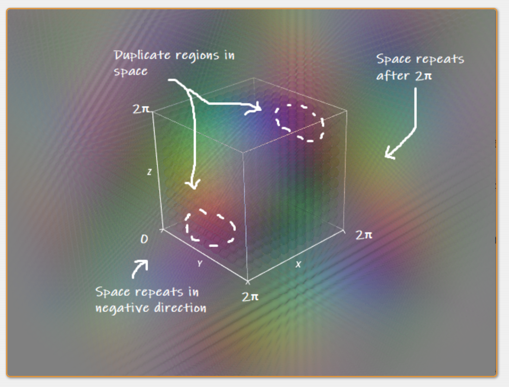
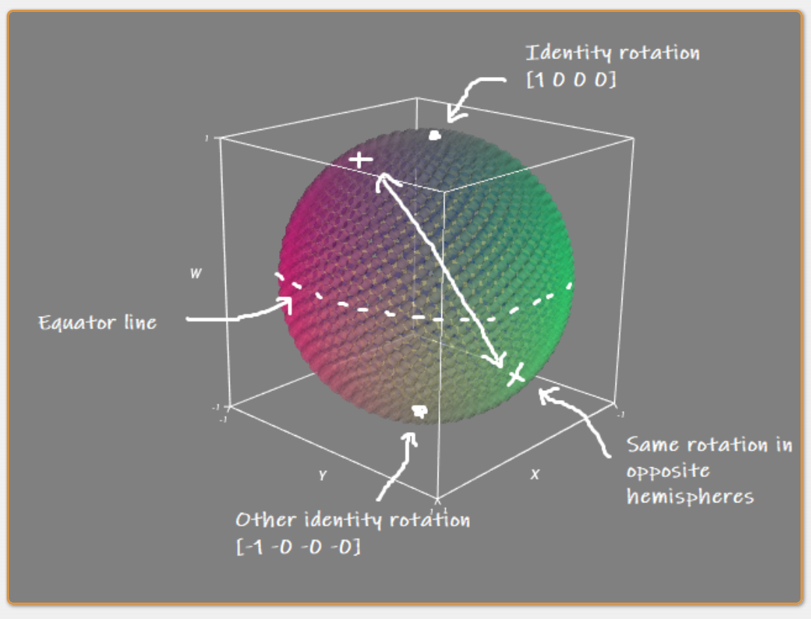
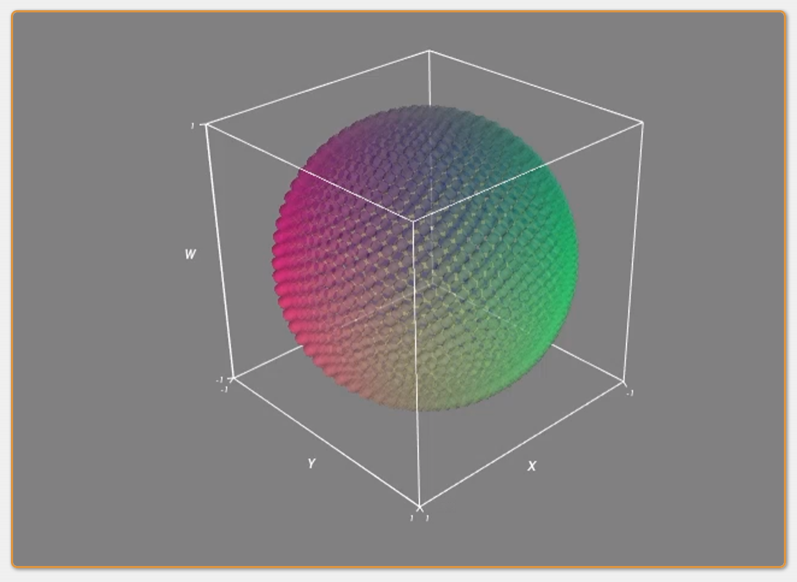
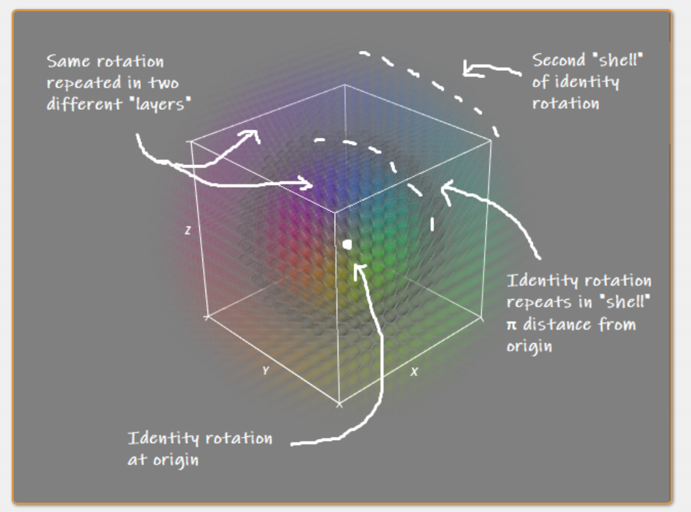

转载出处：https://www.daniel-holden.com/page/visualizing-rotation-spaces


# Visualizing Rotation Spaces

Created on June 13, 2021, 3:54 p.m.

There are many different ways we can represent the rotation of an object in 3D space. The most classic of these is the [Rotation Matrix](https://en.wikipedia.org/wiki/Rotation_matrix), but there are others you might have come across such as [Euler Angles](https://en.wikipedia.org/wiki/Euler_angles), [Quaternions](https://www.3dgep.com/understanding-quaternions/), and the [Exponential Map](http://webhome.cs.uvic.ca/~blob/courses/485c/notes/pdf/expmap.pdf).

It can be hard to get a deeper, intuitive understanding for some of these other representations, but one way to do so is to try and think about the space they encode, and the rotations given by the points in those spaces.

I thought I would share how I visualize in my head each of these spaces. To do so I tried to encode each valid rotation in the space as a differently colored point and render them like a volume. The mapping is not entirely perfect - nearby rotations are given similar colors, but some different rotations have the same color (albeit a different gradient). Nonetheless, I think it overall gives a good starting point for how to picture these spaces and work with them.

If you want to see exactly how I made these visualizations be sure to check out the source code at the bottom of the page.

---

## Euler Angles

Euler angles are sets of three angles each of which represents a rotation around a different axis. These are then combined together to produce a final rotation by applying one rotation after the other. We can therefore imagine the space of Euler angles as being a 3D space, where each point represents a unique set of three Euler angles, encoding a different rotation.

 

Right away we can see some interesting things about this 3D space - first, it repeats itself periodically every \\(2\pi \\) - as, no matter what the axis, rotating by \\(2\pi+x \\) is the same as just rotating by `x`.

> &#x2705; 属性一：以\\(2\pi \\)为周期重复。  

This periodic repetition isn't like a `mod` function with a sudden discontinuity - instead it's smooth like a `sin` function. If we look at values less than zero we can see this same periodic repetition into the negative space too, as rotating by \\(-x \\) is the same as \\(2\pi+x \\).

> &#x2705; 属性二：周期交界处连续。  

A weird thing about this space is that if you look very closely there are duplicate regions inside this 3D cube of rotations. Depending on the axes we choose and the order we apply our rotations there can sometimes be multiple ways to get to the same final rotation. Similarly, if we switch the order of rotations we get a completely different space.

> &#x2705; 属性三：周期内（\\(2\pi \\)范围内）有重复。即同一状态可能有多种表达。    

For some extreme rotations we can also face the issue of [gimbal lock](https://en.wikipedia.org/wiki/Gimbal_lock), where a specific combination of two rotations can make the third unable to do anything, rendering a whole region of the space the same.

> &#x2705; 属性四：gimbal lock

<iframe 
src="./assets/euler_angles.mp4" 
scrolling="no" 
border="0" 
frameborder="no" 
framespacing="0" 
allowfullscreen="true" 
height=600 
width=800> 
</iframe> 

You can interpolate in this space, but the result is not going to be the shortest path between between the two rotations, and depending on the way the angles are combined it can result in all sorts of weird twists and swings as we pass through different regions of the space.

> &#x2705; 属性五：插值不友好。会引入额外的自转或旋转。  

There are also no "holes" in this space - every point within it represents a valid rotation, from the origin outward to infinity. We can use this to represent rotations which "wrap around" multiple times by using these larger repetitions. This can be both good and bad depending on what our application is - we may want to distinguish between rotations of \\(2\pi\\) and \\(4\pi\\) or we may prefer they were always both encoded by the same value.

> &#x2705; 属性六：所有3D空间的取值都是合法的。  

If we look at an individual axis we might think this space acts like normal angles do, looping around every \\(2\pi\\), but expand this to three dimensions and while we *can* represent any rotation in 3D space we want, generally we can't do so in a consistent or regular way and inside this cube we have weird deformations that change based on the axes of rotation and the order of application.

> &#x2705; 属性七：在3D中各向异性。只有沿着特定轴才会表现出\\(2\pi\\)周期。  

---

## Quaternions

Quaternions are four dimensional numbers that can be used to represent rotations. These four numbers are generally "normalized", meaning the total length of the vector is one. We can therefore say that normalized quaternions lie on the surface of a four dimensional hyper-sphere with radius one. While we can't easily visualize a four dimensional hyper-sphere we *can* easily visualize a three dimensional sphere by simply forgetting about one of the dimensions (we can assume it is always zero).

I like to visualize the `w` dimension on the vertical axis, and the `x` and `y` dimensions on the other two axes, meaning that the identity quaternion `[1 0 0 0]` is encoded by the point right at the north pole of the sphere:

> &#x2705; 3D坐标为(w, x, y)  

 

As we move down the surface of the sphere from the top to bottom we start to represent rotations of greater amounts up until we get to the equator, which represents rotations of \\(2\pi\\) (or \\(-\pi\\)) around each dimension. If we keep moving down we start to represent rotations of over \\(\pi\\), until we get back down to the south-pole, which encodes a full rotation of \\(2\pi\\).

> &#x2705; \\(\cos(\frac{0}{2})=1\\), \\(\cos(\frac{\pi}{2})=0\\), \\(\cos(\frac{2\pi}{2})=-1\\)

This gives us our first interesting insight into quaternions - the south-pole encodes the same rotation as the north-pole - the identity rotation. In fact, the whole of the southern hemisphere encodes rotations which are also represented in the northern hemisphere and we can switch between these two simply by negating the quaternion. While **the north and south hemispheres encode the same rotation in absolute terms**, we usually say **the southern hemisphere represents rotations "going the long way round"** - e.g. rotating by \\(\frac{3}{2} \pi \\) instead of  \\(-\frac{1}{2} \pi \\). This fact that quaternions can have two different encodings for the same rotation is the so called "double cover" property of the quaternions.

This may sound odd at first but it isn't any different to the Euler angles in some respect - these also have multiple "covers" of the space of rotations - in fact the Euler angles have infinite "covers" - there is another one each time the space repeats. And when you look at it this way it may even seem odd that the quaternions only have two covers - they can only represent rotations between \\(-2 \pi \\) and  \\(+2 \pi \\) because they are limited to this finite surface on the hyper-sphere.

> &#x2705; 属性一：每个四元数有两种表示。  

 

The normalized quaternions have a big "hole" in the middle of the sphere (and outside the sphere) of values that don't (by default) represent a valid rotation. And even if we consider un-normalized quaternions as valid rotations (we say they can just be normalized), there is still the point right at the origin which cannot represent a valid rotation.

> &#x2705; 属性二：存在不合法的表示。  

If we want to interpolate two quaternions there are two ways to do it - we can linearly interpolate and then re-normalize to get back onto the surface of the sphere, or we can interpolate along the surface of the sphere (the so called [slerp](https://en.wikipedia.org/wiki/Slerp) function). Both can work fine as long as we are careful when we interpolate rotations from two different hemispheres of the sphere as we might find we end up "going the long way around" by mistake.

> &#x2705; 属性三：可直接插值，但对于两个半球的表示的插值，可能插出不合适的路径。    

I like to think of the quaternion space of rotations in terms of its two hemispheres - with all rotations at the top representing "short" (less than \\(\pi \\) in magnitude) rotations, and all those at the bottom going "the long way round". When we multiply quaternions we are essentially traveling around the surface of this sphere as if flying a plane around the globe. No matter how many rotations we combine we never end up off the surface, but we can quickly lose track of (or meaning in) how many times we may have looped around and in which hemisphere we are now located.

---

## Exponential Map

The [exponential map](https://www.daniel-holden.com/page/exponential-map-angle-axis-angular-velocity) is an encoding of a rotation where we take the axis of rotation, and scale it by the angle of rotation around that axis, divided by two. This produces a 3D vector space where the origin encodes the identity rotation, and further rotations along each axis are encoded by vectors extending in those directions.

> &#x2705; angle * axis / 2  
> &#x2705; (0, 0, 0)代表identity

 

Unlike the Euler angle space, which is shaped like a cube, the exponential map produces a space like a kind of solid sphere, with "shells" of identity rotation every \\(\pi \\) distance from the origin and additional "layers" which encode the same set of rotations on top.

> &#x2705; 半径为\\(\pi \\)的地方也是identity  

<iframe 
src="./assets/exponential_map.mp4" 
scrolling="no" 
border="0" 
frameborder="no" 
framespacing="0" 
allowfullscreen="true" 
height=600 
width=800> 
</iframe> 

**Both linear interpolation and spherical interpolation can work in this space**, and as long as you don't interpolate between "layers" by mistake, they both work pretty nicely. Like the Euler angles, this space provides infinite "covers", and as we move further away from the origin we can represent multiple "wrap arounds" of rotation up to infinity. There are also no undefined points in the space - every point represents a valid rotation and the identity rotation is neatly at zero.

> &#x2705; 属性一：方便插值  
> &#x2705; 属性二：无非法值  
> &#x2753; interpolate between "layers"是什么意思？为什么说这是错误的？  

This space has a lot of nice properties, but it lacks one very important one - an efficient way of composing rotations - which is why we usually need to convert back to the quaternion representation first. Sad, because other than that I think it's a pretty cool looking space!

> &#x2705; 属性三：不能进行进行旋转的组合。   

---

## Source Code

If you want to try out any of the these visualizations yourself here is the quick and dirty code I used to generate these images/videos. You can also see the exact algorithm I used to color the points - essentially I take the axis of rotation as the RGB color, and then interpolate it with grey based on the amount of rotation around that axis (this makes the identity rotation grey).

```python
import numpy as np
from mayavi import mlab

""" General Functions """

def quat_from_angle_axis(angle, axis):
    c = np.cos(angle / 2.0)
    s = np.sin(angle / 2.0)
    return np.concatenate([c[...,None], s[...,None] * axis], axis=-1)

def quat_mul(x, y):
    
    x0, x1, x2, x3 = x[...,0:1], x[...,1:2], x[...,2:3], x[...,3:4]
    y0, y1, y2, y3 = y[...,0:1], y[...,1:2], y[...,2:3], y[...,3:4]

    return np.concatenate([
        y0 * x0 - y1 * x1 - y2 * x2 - y3 * x3,      
        y0 * x1 + y1 * x0 - y2 * x3 + y3 * x2,   
        y0 * x2 + y1 * x3 + y2 * x0 - y3 * x1,    
        y0 * x3 - y1 * x2 + y2 * x1 + y3 * x0], axis=-1)

def quat_from_euler(x):
    r0 = quat_from_angle_axis(x[...,0], np.array([1,0,0]))
    r1 = quat_from_angle_axis(x[...,1], np.array([0,1,0]))
    r2 = quat_from_angle_axis(x[...,2], np.array([0,0,1]))
    return quat_mul(r2, quat_mul(r1, r0))

def quat_log(q, eps=1e-8):
    length = np.sqrt(np.sum(q[...,1:]*q[...,1:], axis=-1))
    return np.where((length < eps)[...,None],
        q[...,1:],
        (np.arctan2(length, q[...,0]) / length)[...,None] * q[...,1:])

def lerp(x, y, a):
    return (1.0 - a) * x + a * y

def log_color(x, eps=1e-8):
    length = np.sqrt(np.sum(x*x, axis=-1))
    color = ((x / length[...,None]) + 1.0) / 2.0
    grey = np.array([0.5, 0.5, 0.5])
    return np.where((length < eps)[...,None],
        grey,
        lerp(grey, color, 1 - (np.cos(2 * length)[...,None] + 1) / 2))

def plot(position, color, opacity, scale=0.5):
    
    # Convert to uint8
    rgba = np.concatenate([color, opacity[...,None]], axis=-1)
    rgba = np.clip(255 * rgba, 0, 255).astype(np.uint8)

    # plot the points
    pts = mlab.pipeline.scalar_scatter(
        position[...,0].ravel(), 
        position[...,1].ravel(), 
        position[...,2].ravel())
    
    # assign the colors to each point
    pts.add_attribute(rgba.reshape([-1, 4]), 'colors') 
    pts.data.point_data.set_active_scalars('colors')
    
    # set scaling for all the points
    g = mlab.pipeline.glyph(pts, transparent=True)
    g.glyph.glyph.scale_factor = scale 
    g.glyph.scale_mode = 'data_scaling_off'

""" Euler Angles Visualization """

mlab.figure(size=(640, 600))

position = []
for x in np.linspace(-2*np.pi, 4*np.pi, 35):
    for y in np.linspace(-2*np.pi, 4*np.pi, 35):
        for z in np.linspace(-2*np.pi, 4*np.pi, 35):
            position.append(np.array([x, y, z]))
            
position = np.array(position)

color = log_color(quat_log(quat_from_euler(position)))

inner_distance = np.max(abs(position - np.clip(position, 0, 2*np.pi)), axis=-1)
inner_factor = inner_distance / (2*np.pi)
inner_mask = inner_distance < 1e-5

opacity = np.ones_like(position[...,0])
opacity[ inner_mask] = 0.25
opacity[~inner_mask] = lerp(0.06, 0.0, inner_factor[~inner_mask])

plot(position, color, opacity, 0.5)

ax = mlab.axes(
    extent=[0, 2*np.pi, 0, 2*np.pi, 0, 2*np.pi], 
    ranges=[0, 2*np.pi, 0, 2*np.pi, 0, 2*np.pi])
ax.axes.label_format = ''
ax.axes.font_factor = 0.75
mlab.outline(extent=[0, 2*np.pi, 0, 2*np.pi, 0, 2*np.pi])
mlab.show()

""" Quaternions Visualization """

mlab.figure(size=(640, 600))

def fibonacci_sphere(samples=1):

    points = []
    phi = np.pi * (3. - np.sqrt(5.)) 

    for i in range(samples):
        y = 1 - (i / float(samples - 1)) * 2
        radius = np.sqrt(1 - y * y)

        theta = phi * i

        x = np.cos(theta) * radius
        z = np.sin(theta) * radius

        points.append((x, y, z))

    return points

position = np.array(fibonacci_sphere(1500))

# Swap position for better looking distribution
position = np.concatenate([
    position[...,0:1],
    position[...,2:3],
    position[...,1:2],
    ], axis=-1)

# Color with w on vertical axis
color = log_color(quat_log(np.concatenate([
    position[...,2:3], 
    position[...,0:1], 
    position[...,1:2], 
    np.zeros_like(position[...,0:1])
], axis=-1)))

# Fixed opacity
opacity = 0.3 * np.ones_like(position[...,0])

plot(position, color, opacity, 0.1)

ax = mlab.axes(
    extent=[-1, 1, -1, 1, -1, 1], 
    ranges=[-1, 1, -1, 1, -1, 1],
    xlabel='X',
    ylabel='Y',
    zlabel='W')
ax.axes.label_format = '%3.0f'
ax.axes.font_factor = 0.75

mlab.outline(extent=[-1, 1, -1, 1, -1, 1])
mlab.show()

""" Exponential Map Visualization """

mlab.figure(size=(640, 600))

position = []
for x in np.linspace(-2*np.pi, 2*np.pi, 25):
    for y in np.linspace(-2*np.pi, 2*np.pi, 25):
        for z in np.linspace(-2*np.pi, 2*np.pi, 25):
            point = np.array([x, y, z])
            length = np.sqrt(np.sum(point*point, axis=-1))
            if length < 2*np.pi:
                position.append(point)

position = np.array(position)

color = log_color(position)

inner_length = np.sqrt(np.sum(position*position, axis=-1))
inner_mask = inner_length < np.pi
inner_factor = np.maximum(inner_length - np.pi, 0.0) / np.pi

opacity = np.ones_like(position[...,0])
opacity[ inner_mask] = 0.25
opacity[~inner_mask] = lerp(0.06, 0.0, inner_factor)[~inner_mask]

plot(position, color, opacity, 0.4)

ax = mlab.axes(
    extent=[-np.pi, np.pi, -np.pi, np.pi, -np.pi, np.pi], 
    ranges=[-np.pi, np.pi, -np.pi, np.pi, -np.pi, np.pi],
    nb_labels=0)
ax.axes.label_format = ''
ax.axes.font_factor = 0.75

mlab.outline(extent=[-np.pi, np.pi, -np.pi, np.pi, -np.pi, np.pi])
mlab.show()
```
