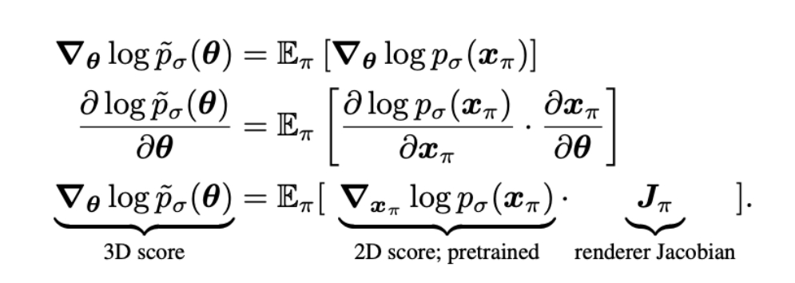
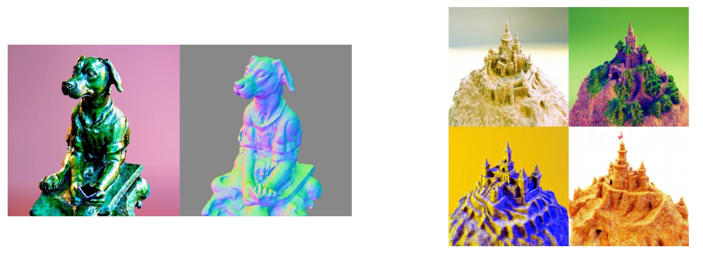

P22    
## Outline

 - 2D diffusion models for 3D generation     

P23   
## 2D Diffusion Models for 3D Generation   

 - Just now, we discussed diffusion models directly on 3d.   
 - However, there are a lot fewer 3d data than 2d.   
    - A lot of experiments are based on ShapeNet!   
 - Can we use 2d diffusion models as a “prior” for 3d?   

P25    
## DreamFusion: Setup    

 - Suppose there is a text-to-image diffusion model.    
 -  Goal: optimize NeRF parameter such that each angle “looks 
good” from the text-to-image model.    
 - Unlike ancestral sampling (e.g., DDIM), the underlying 
parameters are being optimized over some loss function.    

     
     

Poole et al., <u>"DreamFusion: Text-to-3D using 2D Diffusion",</u> ICLR 2023    

> &#x2705; 参数不在 2D 空间而是在 Nerf 空间，构成优化问题，通过更新 Nerf 参数来满足 loss.    
  

P26   
## DreamFusion: Score Distillation Sampling   

     

Poole et al., <u>"DreamFusion: Text-to-3D using 2D Diffusion",</u> ICLR 2023     

> &#x2705; 第二项：\\( \partial \\) Output／ \\( \partial \\) Input．   
> &#x2705; 第三项：\\( \partial \\) Input Image／ \\( \partial \\)  Nerf Angle    
> &#x2705; 第二项要计算 diffusion model 的梯度，成本非常高。    
> &#x2705; 第二项要求反向传播 through the diffuson model，很慢，且费内存。   
> &#x2705; 这一页描述 Image → Loss 的过程。    
> &#x2705; 公式 1 为 diffusion model objective fanction.    
> &#x2705; 公式 2 为算法中使用的 loss，由于\\(x =g(\theta )\\)，\\(\frac{\partial L}{\partial \theta } =\frac{\partial L}{\partial x } \cdot \frac{\partial x }{\partial \theta } \\)，其中 \\(\frac{\partial L}{\partial x }\\) 又分为第一项和第二项。    
> &#x2705; 公式 2 中的常系数都省掉了。    
> &#x2705; 公式 3 把公式 2 中的第二项去掉了，为本文最终使用的 loss.   

P27   
## DreamFusion: Score Distillation Sampling

Consider the KL term to minimize (given t):   

$$
\mathbf{KL} (q(\mathbf{z} _ t|g(\theta );y,t)||p\phi (\mathbf{z} _ t;y,t))
$$

KL between noisy real image distribution and generated image 
distributions, conditioned on y!     

KL and its gradient is defined as:    

  

(B) can be derived from chain rule    

$$
\nabla _ \theta \log p _ \phi (\mathbf{z} _ t|y)=s _ \phi (\mathbf{z} _ t|y)\frac{\partial \mathbf{z} _ t}{\partial \theta }=\alpha _ ts _ \phi (\mathbf{z} _ t|y)\frac{\partial \mathbf{x} }{\partial \theta } =-\frac{\alpha _ t}{\sigma _ t}\hat{\epsilon }_ \phi (\mathbf{z} _ t|y)\frac{\partial \mathbf{x} }{\partial \theta }   
$$

(A) is the gradient of the entropy of the forward process with fixed variance = 0.    

Poole et al., <u>"DreamFusion: Text-to-3D using 2D Diffusion",</u> ICLR 2023   

> &#x2705; A: the gradient of the entropy of the forward process。由于前向只是加噪，因此 A 是固定值，即 0.    
> &#x2705; P27 和 P28 证明 P26 中的第二项可以不需要。  
> &#x2753; KL 散度用来做什么？LOSS 里没有这一项。    
> &#x2705; KL 用于度量 \\(P(\mathbf{Z}_t｜t)\\) 和 \\(q(\mathbf{Z}_t｜t)\\)．  
> &#x2705; KL 第一项为 Nerf 的渲染结果加噪，KL 第二项为真实数据加噪。    

P28    
## DreamFusion: Score Distillation Sampling  

$$
(A)+(B)=\frac{\alpha _ t}{\sigma _ t}\hat{\epsilon } _ \phi (\mathbf{z} _ t|y)\frac{\partial \mathbf{x} }{\partial \theta }
$$

However, this objective can be quite noisy.     
Alternatively, we can consider a “baseline” approach in reinforcement learning: add a component that has zero mean but reduces variance. Writing out (A) again:     

  

Thus, we have:

  

This has the same mean, but **reduced variance**, as we train \\(\hat{\epsilon } _ \phi\\) to predict \\(\epsilon\\)    

Poole et al., <u>"DreamFusion: Text-to-3D using 2D Diffusion",</u> ICLR 2023    

P29   
## DreamFusion in Text-to-3D    

 - SDS can be used to optimize a 3D representation, like NeRF.   

  

Poole et al., <u>"DreamFusion: Text-to-3D using 2D Diffusion",</u> ICLR 2023    

> &#x2705; (1) 生成 Nerf (2) Nerf 投影 (3) 投影图加噪再去噪 (4) 对生成结果求 loss    
> &#x2705; entire pipeline.    
> &#x2705; 左上：从相机视角，生成 object 的投影。   
> &#x2705; 左下：以相机视角为参数，推断出每个点的 Nerf 参数。   
> &#x2705; 左中：左上和左下结合，得到渲染图像。    
> &#x2705; 生成随机噪声，对渲染图像加噪。   
> &#x2705; 右上：使用 diffusion model 从加噪图像中恢复出原始图像。（包含多个 step）   
> &#x2705; 右下：得到噪声，并与原始噪声求 loss.    
> &#x2705; 根据 loss 反传梯度优化左下的 MLP.    

P30   
## Extensions to SDS: Magic3D

2x speed and higher resolution   
 - Accelerate NeRF with Instant-NGP, for coarse representations.    
 - Optimize a fine mesh model with differentiable renderer.   

  

Lin et al., <u>"Magic3D: High-Resolution Text-to-3D Content Creation",</u> CVPR 2023   

> &#x2705; Instant NGP 代替左下的 Nerf MLP．以 coarse representetion 作为 condition 来生成 fine mesh model.    

P31
## Alternative to SDS: Score Jacobian Chaining

A different formulation, motivated from approximating 3D score.   

  

In principle, the diffusion model is the noisy 2D score (over clean images),   
but in practice, the diffusion model suffers from out-of-distribution (OOD) issues!    

For diffusion model on noisy images, **the non-noisy images are OOD**!    

Wang et al., <u>"Score Jacobian Chaining: Lifting Pretrained 2D Diffusion Models for 3D Generation",</u> CVPR 2023.     

> &#x2705; 2D sample, 3D score    

P32   
## Score Jacobian Chaining   

SJC approximates noisy score with “Perturb-and-Average Scoring”, which is not present in SDS.   
 - Use score model on multiple noise-perturbed data, then average it.    

  

Wang et al., <u>"Score Jacobian Chaining: Lifting Pretrained 2D Diffusion Models for 3D Generation",</u> CVPR 2023.    

> &#x2705; 通过这种方法来近似 clean image 的输出，解决 clean image 的 OOD 问题。    

P33    
## SJC and SDS

SJC is a competitive alternative to SDS.   

 

Wang et al., <u>"Score Jacobian Chaining: Lifting Pretrained 2D Diffusion Models for 3D Generation",</u> CVPR 2023.    

P34   
## Alternative to SDS: ProlificDreamer   

 - SDS-based method often set classifier-guidance weight to 100, which limits the “diversity” of the generated samples.   
 - ProlificDreamer reduces this to 7.5, leading to diverse samples.    

 

Wang et al., <u>"ProlificDreamer: High-Fidelity and Diverse Text-to-3D Generation with Variational Score Distillation",</u> arXiv 2023    

P35   
## ProlificDreamer and Variational Score Distillation  

Instead of maximizing the likelihood under diffusion model, VSD minimizes the KL divergence via variational inference.    

$$
\begin{matrix}
\min_{\mu } D _ {\mathrm{KL} }(q^\mu _ 0(\mathbf{x} _ 0|y)||p _ 0(\mathbf{x} _ 0|y)). \\\\
\quad \mu \quad \text{is the distribution of NeRFs} .
\end{matrix}
$$

Suppose is a \\(\theta _ \tau \sim \mu \\) NeRF sample, then VSD simulates this ODE:    

 

 - Diffusion model can be used to approximate score of noisy real images.   
 - How about noisy rendered images?   sss

> &#x2705; 第一项由 diffusion model 得到，在此处当作 GT．   

P36   
## ProlificDreamer and Variational Score Distillation

 - Learn another diffusion model to approximate the score of noisy rendered images!

 

Wang et al., <u>"ProlificDreamer: High-Fidelity and Diverse Text-to-3D Generation with Variational Score Distillation",</u> arXiv 2023    

> &#x2705; 使用 LoRA 近第二项。    

P37   
## Why does VSD work in practice?    

 - The valid text-to-image NeRFs form a distribution with infinite possibilities!    
 - In SDS, epsilon is the score of noisy “dirac distribution” over finite renders, which converges to the true score with infinite renders!    
 - In VSD, the LoRA model aims to **represent the (true) score of noisy distribution over infinite number of renders!**   
 - If the generated NeRF distribution is only one point and LoRA overfits perfectly, then VSD = SDS!    
 - But LoRA has good generalization (and learns from a trajectory of NeRFs), so closer to the true score!    

 - This is analogous to    
    - Representing the dataset score via mixture of Gaussians on the dataset (SDS), versus     
    - Representing the dataset score via the LoRA UNet (VSD)    

Wang et al., <u>"ProlificDreamer: High-Fidelity and Diverse Text-to-3D Generation with Variational Score Distillation",</u> arXiv 2023    

---------------------------------------
> 本文出自CaterpillarStudyGroup，转载请注明出处。
>
> https://caterpillarstudygroup.github.io/ImportantArticles/