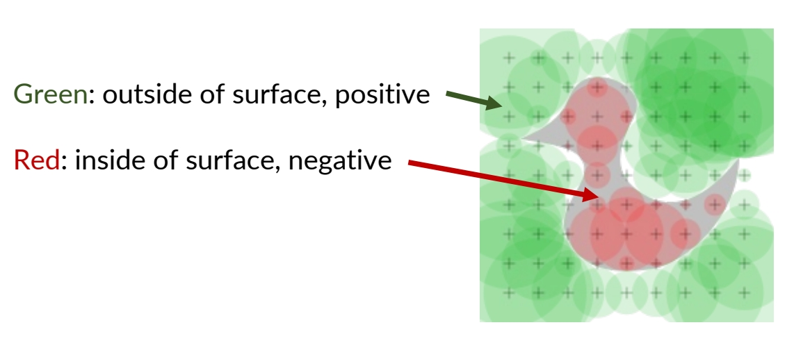
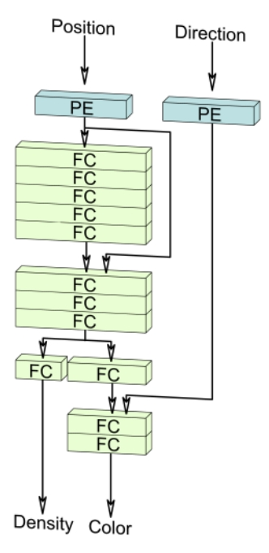

P11   
# 3D    
 - **Diffusion on various 3D representations**    
 - 2D diffusion models for 3D generation    
 - Diffusion models for view synthesis    
 - 3D reconstruction    
 - 3D editing    

# Diffusion on various 3D representations

P12   
## 3D Shape Generation and Completion through Point-Voxel Diffusion   

A set of points with location information.    

  

  

Zhou et al., <u>"3D Shape Generation and Completion through Point-Voxel Diffusion",</u> ICCV 2021    
Liu et al, <u>"Point-Voxel CNN for Efficient 3D Deep Learning",</u> NeurIPS 2019    

> &#x2705; 分支1：逐顶点的 MLP (对应图中 b)   
> &#x2705; 分支2：VOX 可以看作是低分辨率的 points    
> &#x2705; 优点是结构化，可用于 CNN    
> &#x2753; VOX → points，低分辨到高分辨率要怎么做？   
> &#x2753; 怎么把 voxel 内的点转换为 voxel 的特征？     

P13    
### Result    

  

> &#x2705; Completion：深度图 → 完整点    
> &#x2705; 方法：(1) 基于深度图生成点云 (2) 用 inpainting 技术补全    
> &#x2705; generation 和 completion 是两种不同的 task.    

P14     
## LION

  

Zeng et al., <u>"LION: Latent Point Diffusion Models for 3D Shape Generation",</u> NeurIPS 2022    

> &#x2705; 特点：    
> &#x2705; 1、latent diffusion model for point clouds.    
> &#x2705; 2、point-voxel CNN 架构，用于把 shape 编码成 latent shape 及 lantent point.    
> &#x2705; 3、diffusion model 把 latent point 重建出原始点。    

P15   
## Point-E

Point-E uses a synthetic view from fine-tuned GLIDE, and then ”lifts” the image to a 3d point cloud.

  

  

Nichol et al., <u>"Point-E: A System for Generating 3D Point Clouds from Complex Prompts",</u> arXiv 2022     

> &#x2705; point E task：文生成点云。    
> &#x2705; 第1步：文生图，用 fine-tuned GLIDE     
> &#x2705; 第2步：图生点，用 transformer-based diffusion model.     

P16   
# Diffusion Models for Signed Distance Functions   

SDF is a function representation of a surface.  
For each location x, |SDF(x)| = smallest distance to any point on the surface.    

  

P17   
## Neural Wavelet-domain Diffusion for 3D Shape Generation

 - Memory of SDF grows cubically with resolution    
 - Wavelets can be used for compression!   
 - Diffusion for coarse coefficients, then predict detailed ones.   

  

  

Hui et al., <u>"Neural Wavelet-domain Diffusion for 3D Shape Generation",</u> arXiv 2022    

> &#x2705; 这里说的 SDF，是用离散的方式来记录每个点的 distance.     
> &#x2705; Wavelet 把 SDF 变为 coarse 系数，diffusion model 生成 coarse 系数，再通过另一模型变为 detailed   

P18   
## DiffusionSDF

  

**Latent space diffusion for SDFs, where conditioning can be provided with cross attention**

Chou et al., <u>"DiffusionSDF: Conditional Generative Modeling of Signed Distance Functions",</u> arXiv 2022    

> &#x2705; 原理与上一页相似，只是把 waveles 换成了 VAE.    

P19   
# Diffusion Models for NeRF    

Neural Radiance Fields (NeRF) is another representation of a 3D object.    

  

> &#x2705; NeRF：用体的方式来描述 3D 物体     
> &#x2705; (1) 从 diffusion 中提取 image （2）从 image 计算 loss (3) loss 更新 image (4) image 更新 NeRF．    
> &#x2705; \\(（x,y,z,\theta ,\phi ）\\) 是每个点在向量中的表示，其中前三维是 world coordinate，后面两维是 viewing direction     
> &#x2705; density 描述这个点有多透明。    
> &#x2705; F 是一个小型的网络，例如 MLP.    

 
P20   

  
**NeRF**    
(Fully implicit)    

  
**Voxels**    
(Explicit / hybrid)    

  
**Triplanes**    
(Factorized, hybrid)    

Image from EG3D paper.    

P21   
> &#x2705; Nerf 可以有三种表示形式        

 - Triplanes, regularized ReLU Fields, the MLP of NeRFs...    
 - A good representation is important!     

  
Triplane diffusion    

  
Regularized ReLU Fields    

  
Implicit MLP of NeRFs     

Shue et al., <u>"3D Neural Field Generation using Triplane Diffusion",</u> arXiv 2022    
Yang et al., <u>"Learning a Diffusion Prior for NeRFs",</u> ICLR Workshop 2023    
Jun and Nichol, <u>"Shap-E: Generating Conditional 3D Implicit Functions",</u> arXiv 2023    

> &#x2705; 这三种表示形式都可以与 diffuson 结合。   
> &#x2705; 好的表示形式对diffusion 的效果很重要。    

---------------------------------------
> 本文出自CaterpillarStudyGroup，转载请注明出处。
>
> https://caterpillarstudygroup.github.io/ImportantArticles/