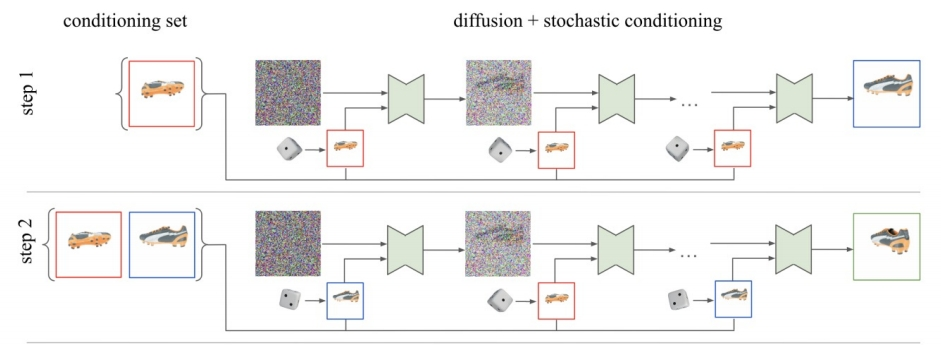

P40   
## 3DiM   

 - Condition on a frame and two poses, predict another frame.     

  

UNet with frame cross-attention   

  

Sample based on stochastic conditions,   
allowing the use of multiple conditional frames.    

Watson et al., <u>"Novel View Synthesis with Diffusion Models",</u> ICLR 2023    

> &#x2705; UNet，2 branch，分别用于原始角度和要生成的角度。   
> &#x2705; 引入 step 2 是为了内容一致性。   
> &#x2705; frame：坐标系。在不同的坐标系下看到的是不同的视角。    
> &#x2753; 为什么有两个pose？   
> &#x2705; 每个 frame 的内部由 cross-attention 连接。    

P41    
## GenVS   

 - 3D-aware architecture with latent feature field.    
 - Use diffusion model to improve render quality based on structure.   

  

Chan et al., <u>"Generative Novel View Synthesis with 3D-Aware Diffusion Models",</u> arXiv 2023    

> &#x2705; (1) 生成 feature field (2) render 其中一个视角 (3) 优化渲染效果     
> &#x2705; (2) 是 MLP (3) 是 diffusion．    

## More

|ID|Year|Name|Note|Tags|Link|
|---|---|---|---|---|---|
||2023|Watson et al.,"Novel View Synthesis with Diffusion Models"|
||2024|CAT3D|

---------------------------------------
> 本文出自CaterpillarStudyGroup，转载请注明出处。
>
> https://caterpillarstudygroup.github.io/ImportantArticles/