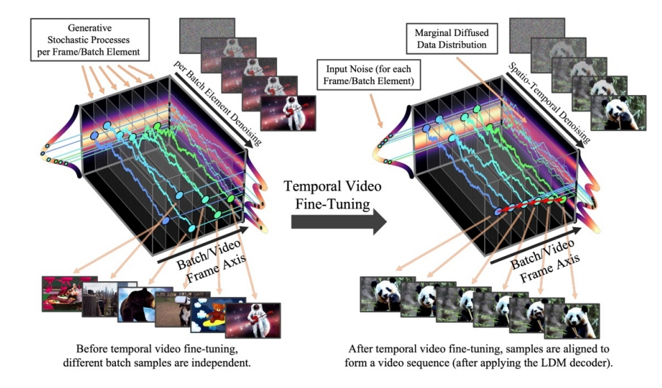
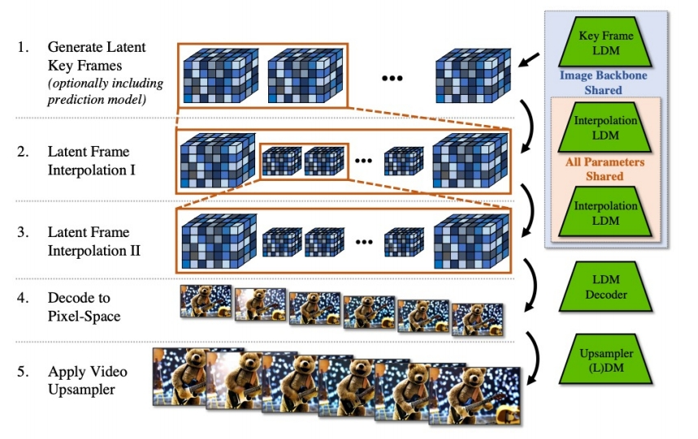

P45    
## Outline

 - Inverse problems    
 - **3D**    
 - Video    
 - Miscellaneous    

 - 3D editing    

P46   
## Instruct NeRF2NeRF

Edit a 3D scene with text instructions   

  

Haque et al., <u>"Instruct-NeRF2NeRF: Editing 3D Scenes with Instructions",</u> arXiv 2023      

> &#x2705; 用 Nerf 来描述 3D scene。通过文件条件把原 Nerf，变成另一个 Nerf，从而得到新的 3D scene.    

P47   
## Instruct NeRF2NeRF   

**Edit a 3D scene with text instructions**   
 -  Given existing scene, use Instruct Pix2Pix to edit image at different viewpoints.   
 - Continue to train the NeRF and repeat the above process   

  

Haque et al., <u>"Instruct-NeRF2NeRF: Editing 3D Scenes with Instructions",</u> arXiv 2023   

> &#x2705; 首先有一个训好的 Nerf. 对一个特定的场景使用 Instruct Pix 2 pix 在 2D 上编辑训练新的 Werf.    
> &#x2705; 基于 score disllation sampling.    

P48   
## Instruct NeRF2NeRF

With each iteration, the edits become more consistent.    

Haque et al., <u>"Instruct-NeRF2NeRF: Editing 3D Scenes with Instructions",</u> arXiv 2023   

P49   
## Vox-E: Text-guided Voxel Editing of 3D Objects    

 - Text-guided object editing with SDS
 - Regularize the structure of the new voxel grid.

  

Sella et al., <u>"Vox-E: Text-guided Voxel Editing of 3D Objects",</u> arXiv 2023   

P50   
# Video   

- Video generative models   

P51   
## Video Diffusion Models

3D UNet from a 2D UNet.   
 - 3x3 2d conv to 1x3x3 3d conv.   
 - Factorized spatial and temporal attentions.   

     
     

Ho et al., <u>"Video Diffusion Models",</u> NeurIPS 2022   

> &#x2705; 利用 2D 做 3D，因为 3D 难训且数据少。  
> &#x2705; 通到添加时序信息，把图像变成视频。此处的 3D 是 2D＋时间，而不是立体。    
> &#x2705; 对向量增加一个维度，并在新的维度上做 attention.   

P52   
## Imagen Video: Large Scale Text-to-Video   

 - 7 cascade models in total.   
 - 1 Base model (16x40x24)   
 - 3 Temporal super-resolution models.   
 - 3 Spatial super-resolution models.   

     

Ho et al., <u>"Imagen Video: High Definition Video Generation with Diffusion Models",</u> 2022    

> &#x2705; 通过 7 次 cascade，逐步提升顺率和像素的分辨率，每一步的训练对上一步是依赖的。    

P53   
## Make-a-Video  

 - Start with an unCLIP (DALL-E 2) base network.    

     

Singer et al., <u>"Make-A-Video: Text-to-Video Generation without Text-Video Data",</u> ICLR 2023    

> &#x2705; 把 text 2 image model 变成 text to video model，但不需要 text-video 的 pair data.    

P54   
## Make-a-Video   

     
3D Conv from Spatial Conv + Temporal Conv   

     
3D Attn from Spatial Attn + Temporal Attn   

Different from Imagen Video, only the image prior takes text as input!   

Singer et al., <u>"Make-A-Video: Text-to-Video Generation without Text-Video Data",</u> ICLR 2023     

> &#x2705; 与 Imagin 的相同点：(1) 使用 cascade 提升分辨率， (2) 分为时间 attention 和空间 attention.    
> &#x2705; 不同点：(1) 时间 conv＋空间 conv.    

P55   
## Video LDM   

 - Similarly, fine-tune a text-to-video model from text-to-image model.    

     

Blattmann et al., <u>"Align your Latents: High-Resolution Video Synthesis with Latent Diffusion Models",</u> CVPR 2023    

> &#x2705; 特点：(1) 使用 latent space． (2) Encoder fix．用 video 数据 fineture Decoder.    

P56   
## Video LDM: Decoder Fine-tuning   

 - Fine-tune the decoder to be video-aware, keeping encoder frozen.    

     

Blattmann et al., <u>"Align your Latents: High-Resolution Video Synthesis with Latent Diffusion Models",</u> CVPR 2023    

P57    
## Video LDM: LDM Fine-tuning   

 - Interleave spatial layers and temporal layers.    
 - The spatial layers are frozen, whereas temporal layers are trained.    
 - Temporal layers can be Conv3D or Temporal attentions.   
 - Context can be added for autoregressive generation.    

     

Optional context via learned down-sampling operation.   

**For Conv3D,**    
shape is [batch, time, channel, height, width]    

**For Temporal attention,**   
shape is [batch \\(^\ast \\)height\\(^\ast \\) width, time, channel]    

Blattmann et al., <u>"Align your Latents: High-Resolution Video Synthesis with Latent Diffusion Models",</u> CVPR 2023   

> &#x2705; 时序层除了时序 attention，还有 3D conv，是真正的 3D，但是更复杂，且计算、内存等消耗更大。   

P58   
## Video LDM: Upsampling
 - After key latent frames are generated, the latent frames go through temporal interpolation.   
 - Then, they are decoded to pixel space and optionally upsampled.   

     

Blattmann et al., <u>"Align your Latents: High-Resolution Video Synthesis with Latent Diffusion Models",</u> CVPR 2023    

---------------------------------------
> 本文出自CaterpillarStudyGroup，转载请注明出处。
>
> https://caterpillarstudygroup.github.io/ImportantArticles/