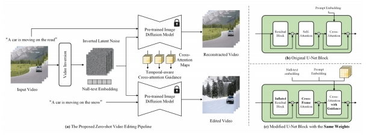
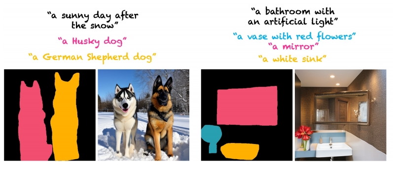

P59   
## Outline   

 - Video style transfer / editing methods    

P60   
## Gen-1

 - Transfer the style of a video using text prompts given a “driving video”

     

Esser et al., <u>"Structure and Content-Guided Video Synthesis with Diffusion Models",</u> arXiv 2023    

P61   
## Gen-1

 - Condition on structure (depth) and content (CLIP) information.   
 - Depth maps are passed with latents as input conditions.   
 - CLIP image embeddings are provided via cross-attention blocks.   
 - During inference, CLIP text embeddings are converted to CLIP image embeddings.    

     

Esser et al., <u>"Structure and Content-Guided Video Synthesis with Diffusion Models",</u> arXiv 2023     

> &#x2705; 用 depth estimator 从源视频提取 struct 信息，用 CLIP 从文本中提取 content 信息。   
> &#x2705; depth 和 content 分别用两种形式注入。depth 作为条件，与 lantent concat 到一起。content 以 cross attention 的形式注入。    

P62   
## Pix2Video: Video Editing Using Image Diffusion   

 - Given a sequence of frames, generate a new set of images that reflects an edit.   
 - Editing methods on individual images fail to preserve temporal information.    

Ceylan et al., <u>"Pix2Video: Video Editing using Image Diffusion",</u> arXiv 2023    

> &#x2705; 没有 3D diffusion model，只是用 2D diffusion model 生成多张图像并拼成序列。关键在于保持时序的连续性。    

P63   
## Pix2Video: Video Editing Using Image Diffusion   

    

 - **Self-Attention injection:** use the features of previous frame for Key and Values.   

    

Ceylan et al., <u>"Pix2Video: Video Editing using Image Diffusion",</u> arXiv 2023   

> &#x2705; (1) 使用 DDIM inversion 把图像转为 noise．   
> &#x2705; (2) 相邻的 fram 应 inversion 出相似的 noise．    
> &#x2705; 使用 self-attention injection 得到相似的 noise.    

P64    
## Pix2Video: Video Editing Using Image Diffusion   

    

Ceylan et al., <u>"Pix2Video: Video Editing using Image Diffusion",</u> arXiv 2023    

> &#x2705; reconstruction guidance，使生成的 latent code 与上一帧接近。    

P65   
## Pix2Video: Video Editing Using Image Diffusion  

 - The two methods improve the temporal consistency of the final video!   

Ceylan et al., <u>"Pix2Video: Video Editing using Image Diffusion",</u> arXiv 2023   

P66    
## Concurrent / Related Works   

    
FateZero: Store attention maps from DDIM inversion for later use    

    
Tune-A-Video: Fine-tune projection matrices of the attention layers, from text2image model to text2video model.    

    
Vid2vid-zero: Learn a null-text embedding for inversion, then use cross-frame attention with original weights.    

P67   
# Miscellaneous   

 - Diffusion models for large contents   

P68   
## Diffusion Models for Large Contents   

 - Suppose model is trained on small, squared images, how to extend it to larger images?   
 - Outpainting is always a solution, but not a very efficient one!   

Let us generate this image with a diffusion model only trained on squared regions:    

    

1. Generate the center region \\(q(\mathbf{x} _ 1,\mathbf{x} _ 2)\\)    
2. Generate the **surrounding region conditioned on parts of the center image** \\(q(\mathbf{x} _ 3|\mathbf{x} _ 2)\\)    

    

Latency scales linearly with the content size!     

> &#x2705; 根据左边的图生成右边的图，存在的问题：慢     
> &#x2705; 直接生成大图没有这样的数据。   
> &#x2705; 并行化的生成。    
   
P69   
## Diffusion Models for Large Contents

 - Unlike autoregressive models, diffusion models can generate large contents **in parallel**!    

    

Zhang et al., <u>"DiffCollage: Parallel Generation of Large Content with Diffusion Models",</u> CVPR 2023    

P70   
## Diffusion Models for Large Contents   

 - A “large” diffusion model from “small” diffusion models!   

    

    

Zhang et al., <u>"DiffCollage: Parallel Generation of Large Content with Diffusion Models",</u> CVPR 2023   

P71   
## Diffusion Models for Large Contents

 - Applications such as long images, looped motion, 360 images…   

Zhang et al., <u>"DiffCollage: Parallel Generation of Large Content with Diffusion Models",</u> CVPR 2023   

P72   
## Related Works   

 - Based on similar ideas but differ in how overlapping regions are mixed.

    

    

Jiménez, <u>"Mixture of Diffusers for scene composition and high resolution image generation",</u> arXiv 2023    
Bar-Tal et al., <u>"MultiDiffusion: Fusing Diffusion Paths for Controlled Image Generation",</u> ICML 2023   

> &#x2705; 这种并行化方法可以用于各种 overlapping 的场景。    

---------------------------------------
> 本文出自CaterpillarStudyGroup，转载请注明出处。
>
> https://caterpillarstudygroup.github.io/ImportantArticles/