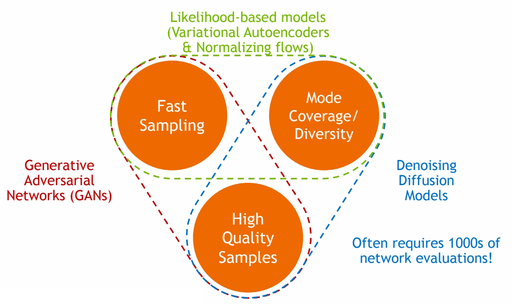
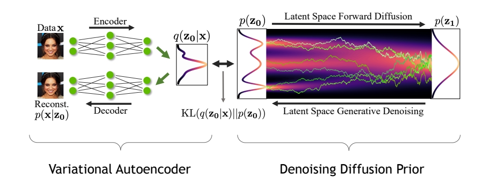

P38   
# Accelerated Sampling    

P39   
## The generative learning trilemma

 

> &#x1F50E; <u>Tackling the Generative Learning Trilemma with Denoising Diffusion GANs, ICLR 2022</u> 

其中Diffusion based生成模型的主要问题是生成速度慢，因此需要在保持高采样质量和多样性的前提下，针对采样速度慢的问题进行加速。   

P41  
## Acceleration Techniques   

- Advanced ODE/SDE Solvers    
- Distillation Techniques    
- Low-dim. Diffusion Processes     
- Advanced Diffusion Processes    

P42   
# Advanced ODE/SDE Solvers

> &#x2705; ODE 实现 std normal 分布与真实数据分布之间的映射。    

P43   
## Generative ODEs    

Solve ODEs with as little function evaluations as possible    

$$
dx=\epsilon _\theta (x,t)dt
$$

 

- 一阶方法（Euler 方法）：每个时间步简化为线性过程。当 step 较大时，会与 GT 有较大的偏离。     

P44    

 

- 高阶方法
P45   
 

P46   
## 扩散模型 ODE/SDE 求解器的相关工作

|ID|Year|Name|Note|Tags|Link|
|---|---|---|---|---|---|
||2021|Denoising Diffusion Implicit Models (DDIM)|||[link](https://caterpillarstudygroup.github.io/ReadPapers/2.html)|
||2021|Score-Based Generative Modeling through Stochastic Differential Equations|Runge-Kutta adaptive step-size ODE solver|
||2021|Gotta Go Fast When Generating Data with Score-Based Models|Higher-Order adaptive step-size SDE solver|
||2021|Denoising Diffusion Implicit Models|Reparametrized, smoother ODE|   
||2022|gDDIM: Generalized denoising diffusion implicit models|Reparametrized, smoother ODE|
||2022|Pseudo Numerical Methods for Diffusion Models on Manifolds|Higher-Order ODE solver with linear multistepping|
||2022|Fast Sampling of Diffusion Models with Exponential Integrator|Exponential ODE Integrators|
||2022|DPM-Solver: A Fast ODE Solver for Diffusion Probabilistic Model Sampling in Around 10 Steps|Exponential ODE Integrators|
||2022|DPM-Solver++: Fast Solver for Guided Sampling of Diffusion Probabilistic Models|Exponential ODE Integrators|
||2022|Elucidating the Design Space of Diffusion-Based Generative Models|Higher-Order ODE solver with Heun’s Method|
||2023|UniPC: A Unified Predictor-Corrector Framework for Fast Sampling of Diffusion Models|
||2023|Parallel Sampling of Diffusion Model|
||2023|A Geometric Perspective on Diffusion Models|

> &#x2705; 这些solvers可以以plug-in的方式使用，且通常能比DDPM更快收敛。  

# Distillation Techniques

P48    
## ODE Distillation

 

Can we train a neural network to directly predict \\(\mathbf{x} _{{t}'} \\) given \\(\mathbf{x} _t\\)?    

> &#x2705; \\(\mathbf{x} _{{t}'} \\)与\\(\mathbf{x} _t\\)的关系是确定的。  

P49    

|ID|Year|Name|Note|Tags|Link|
|---|---|---|---|---|---|
||2022|**Progressive distillation** for fast sampling of diffusion models|||[link](https://caterpillarstudygroup.github.io/ReadPapers/1.html)|
||2023|On Distillation of Guided Diffusion Models|**Award Candidate**|| [link](https://caterpillarstudygroup.github.io/ReadPapers/3.html)|
||2023|**Consistency Models**|||[link](https://caterpillarstudygroup.github.io/ReadPapers/7.html)

P52   
## SDE Distillation

 

Can we train a neural network to directly predict **distribution of** \\(\mathbf{x} _ {{t}'} \\) given \\(\mathbf{x} _ t \\) ?    

> &#x2705; \\(\mathbf{x} _ t\\) 与 \\( \mathbf{x} _ {{t}' }\\) 没有必然的联系，得到的是 \\( \mathbf{x} _ {{t}' }\\) 的分布。    

但Normal assumption in denoising distribution holds only for small step    

> &#x2705; 从 \\(t\\) 与 \\({t}'\\) 的差距过大时，normal 分布不足以表达 \\(q(\mathbf{x} _ {{t}'}｜\mathbf{x} _ t)\\).    

 

因此**Requires more complicated functional approximators!**，例如GAN或energy-based。   

|ID|Year|Name|Note|Tags|Link|
|---|---|---|---|---|---|
||2022|Tackling the Generative Learning Trilemma with Denoising Diffusion GANs|GAN|| [link](https://caterpillarstudygroup.github.io/ReadPapers/10.html) |
||2021|Learning energy-based models by diffusion recovery likelihood|Energy-based models|

P54   
## Training-based Sampling Techniques

|ID|Year|Name|Note|Tags|Link|
|---|---|---|---|---|---|
||2021|Knowledge Distillation in Iterative Generative Models for Improved Sampling Speed|Knowledge distillation|
||2022|Learning Fast Samplers for Diffusion Models by Differentiating Through Sample Quality|Learned Samplers|
||2023|Fast Sampling of Diffusion Models via Operator Learning|Neural Operators|
||2023|Wavelet Diffusion Models Are Fast and Scalable Image Generators|Wavelet Diffusion Models|
||2022|GENIE: Higher-Order Denoising Diffusion Solvers|Distilled ODE Solvers|

P56   
# Low-dim Diffusion Process

## Cascaded Generation    

 

Cascaded Diffusion Models outperform Big-GAN in FID and IS and VQ-VAE2 in Classification Accuracy Score.    

|ID|Year|Name|Note|Tags|Link|
|---|---|---|---|---|---|
||2021|Cascaded Diffusion Models for High Fidelity Image Generation|||[link](https://caterpillarstudygroup.github.io/ReadPapers/3.html)|
||2022|Hierarchical Text-Conditional Image Generation with CLIP Latents|
||2022|Photorealistic Text-to-Image Diffusion Models with Deep Language Understanding|     

P57   
## Latent Diffusion Models   

### Main Idea：  

**Variational autoencoder + score-based prior**   

 

Encoder maps the input data to an embedding space    
Denoising diffusion models are applied in the latent space    

P58   
### Advantages:    

(1) The distribution of latent embeddings close to Normal distribution \\(\to \\) ***Simpler denoising, Faster synthesis***!    
(2) Latent space \\(\to \\) ***More expressivity and flexibility in design!***    
(3) Tailored Autoencoders \\(\to \\) ***More expressivity, Application to any data type (graphs, text, 3D data, etc.)!***     

|ID|Year|Name|Note|Tags|Link|
|---|---|---|---|---|---|
||2021|Score-based generative modeling in latent space|**End-to-End** Training objective    &#x2705; 这篇文章对 VAE 和 diffusion 一起进行训练，文章的创新点是，利用 score matching 中的信息来计算 cross entropy.    |
|45|2022|High-Resolution Image Synthesis with Latent Diffusion Models|**Two-stage** Training，先训E&D，再训diffusion。每次需要训练的网络都不大。|| [link](https://caterpillarstudygroup.github.io/ReadPapers/45.html)|   
||2021|D2C: Diffusion-Denoising Models for Few-shot Conditional Generation|
||2022|Score-Guided Intermediate Layer Optimization: Fast Langevin Mixing for Inverse Problems|
||2022|Dimensionality-Varying Diffusion Process|   

The efficiency and expressivity of latent diffusion models + open-source access fueled a large body of work in the community           

# Advanced Diffusion Models

> &#x2705; 这一部分没有讲

P63   
## ODE interpretation    

把ODE看作是Deterministic generative process   

 

 - DDIM sampler can be considered as an integration rule of the following ODE:    

$$
d\mathbf{\bar{x} } (t)=\epsilon ^{(t)} _ \theta(\frac{\mathbf{\bar{x} } (t)}{\sqrt{\eta ^2+1}} )d\eta (t); \mathbf{\bar{x} } =\mathbf{x} / \sqrt{\bar{a} },\eta = \sqrt{1-\bar{a}} / \sqrt{\bar{a } }
$$

 - Karras et al. argue that the ODE of DDIM is favored, as the tangent of the solution trajectory always points 
towards the denoiser output.   

 - This leads to largely linear solution trajectories with low curvature à Low curvature means less truncation 
errors accumulated over the trajectories. 

> &#x1F50E; <u>Song et al., “Denoising Diffusion Implicit Models”, ICLR 2021.</u>   
> &#x1F50E; <u>Karras et al., “Elucidating the Design Space of Diffusion-Based Generative Models”, arXiv 2022.</u>   
> &#x1F50E; <u>Salimans & Ho, “Progressive distillation for fast sampling of diffusion models”, ICLR 2022.</u>   

P64   
## “Momentum-based” diffusion      

##### Introduce a velocity variable and run diffusion in extended space

 

<u>Dockhorn et al., “Score-Based Generative Modeling with Critically-Damped Langevin Diffusion”, ICLR 2022.</u>     

P65   
## Additional Reading

 - Schrödinger Bridge:    
> &#x1F50E; Bortoli et al., <u>"Diffusion Schrödinger Bridge",</u> NeurIPS 2021    
> &#x1F50E; Chen et al., <u>“Likelihood Training of Schrödinger Bridge using Forward-Backward SDEs Theory”, </u>ICLR 2022    
 - Diffusion Processes on Manifolds:   
> &#x1F50E; Bortoli et al., <u>"Riemannian Score-Based Generative Modelling", </u>NeurIPS 2022    
 - Cold Diffusion:    
> &#x1F50E; Bansal et al., <u>"Cold Diffusion: Inverting Arbitrary Image Transforms Without Noise", </u>arXiv 2022      
 - Diffusion for Corrupted Data:    
> &#x1F50E; Daras et al., <u>"Soft Diffusion: Score Matching for General Corruptions", </u>TMLR 2023      
> &#x1F50E; Delbracio and Milanfar, <u>"Inversion by Direct Iteration: An Alternative to Denoising Diffusion for Image Restoration", </u>arXiv 2023    
> &#x1F50E; Luo et al., <u>"Image Restoration with Mean-Reverting Stochastic Differential Equations", </u>ICML 2023    
> &#x1F50E; Liu et al., <u>“I2SB: Image-to-Image Schrödinger Bridge”, </u>ICML 2023    
 - Blurring Diffusion Process:    
> &#x1F50E; Hoogeboom and Salimans, <u>"Blurring Diffusion Models", </u>ICLR 2023   
> &#x1F50E; Rissanen et al, <u>“Generative Modelling With Inverse Heat Dissipation”, </u>ICLR 2023  

---------------------------------------
> 本文出自CaterpillarStudyGroup，转载请注明出处。
>
> https://caterpillarstudygroup.github.io/ImportantArticles/