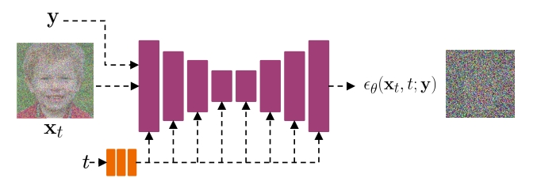
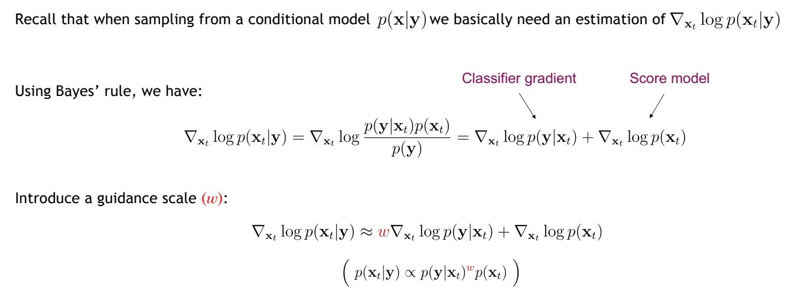

P66   
# Conditional Generation and Guidance    

P67   
## Impressive Conditional Diffusion Models    
##### Text-to-image generation   

 

<u>Ramesh et al., “Hierarchical Text-Conditional Image Generation with CLIP Latents”, arXiv 2022.</u>    
<u>Saharia et al., “Photorealistic Text-to-Image Diffusion Models with Deep Language Understanding”, arXiv 2022.</u>    

P68   
## Conditioning and Guidance Techniques

Explicit Conditions    
Classifier Guidance    
Classifier-free Guidance    

P69   
## Conditioning and Guidance Techniques

Explicit Conditions    

P70   
## Explicit Conditional Training   

Conditional sampling can be considered as training \\(p(\mathbf{x} |\mathbf{y} )\\) where \\(\mathbf{y}\\) is the input conditioning (e.g., text) and \\(\mathbf{x}\\) is generated output (e.g., image)    

Train the score model for \\(\mathbf{x}\\) conditioned on \\(\mathbf{y}\\) using:    

$$
\mathbb{E} _ {(\mathbf{x,y} )\sim P\mathrm{data} (\mathbf{x,y} )}\mathbb{E} _ {\epsilon \sim \mathcal{N}(\mathbf{0,I} ) }\mathbb{E} _{t\sim u[0,T]}||\epsilon _ \theta (\mathbf{x} _ t,t;\mathbf{y} )- \epsilon ||^2_2 
$$

The conditional score is simply a U-Net with \\(\mathbf{x}_t\\) and \\(\mathbf{y}\\) together in the input.    

 

> &#x2705; 需要 \\((x，y)\\) 的 pair data.            

P71   
## Conditioning and Guidance Techniques

Classifier Guidance    

P72   
## Classifier Guidance: Bayes’ Rule in Action

 

<u>Song et al., “Score-Based Generative Modeling through Stochastic Differential Equations”, *ICLR*, 2021</u>    
<u>Nie et al., “Controllable and Compositional Generation with Latent-Space Energy-Based Models”, NeurIPS 2021</u>    
<u>Dhariwal and Nichol, “Diffusion models beat GANs on image synthesis”, NeurIPS 2021.</u>    

> &#x2705; \\(p(y)\\) 与 \\(\mathbf{x} _ t\\) 无关，因此可以去掉。     
> &#x2705; 在 diffusion 的基础上再训练一个分类网络。   
> &#x2705; \\(\omega \\) 决定分类器的影响力。   
> &#x2705; 此方法只适用于少量的离散的 \\(y\\)。    

P73    
## Conditioning and Guidance Techniques

Classifier-free Guidance    

P74    
## Classifier-free guidance   
##### Get guidance by Bayes’ rule on conditional diffusion models

 - Recall that classifier guidance requires training a classifier.   
 - Using Bayes’ rule again:   

 

 - Instead of training an additional classifier, get an “implicit classifier” by jointly training a conditional and  unconditional diffusion model. In practice, the conditional and unconditional models are trained together by randomly dropping the condition of the diffusion model at certain chance.     

 - The modified score with this implicit classifier included is:   

 

<u>Ho & Salimans, “Classifier-Free Diffusion Guidance”, 2021.</u>     

> &#x2705; Corditional 版本用前面的 Explicit 方法。两个 model 结合使用可以得到一个分类器，这个分类器被称为 Implicit 分类器。   
> &#x2753; 然后又用这个分类器再学一个 Conditional 生成？    
> &#x2705; 训一个模型同时支持 Conditional 和 Unconditional 两个任务。    

P75   
## Classifier-free guidance

##### Trade-off for sample quality and sample diversity

 

Large guidance weight \\((\omega  )\\) usually leads to better individual sample quality but less sample diversity.    

<u>Ho & Salimans, “Classifier-Free Diffusion Guidance”, 2021.</u>     

P76   
## Summary   

We reviewed diffusion fundamentals in 4 parts:     
 - Discrete-time diffusion models    
 - Continuous-time diffusion models     
 - Accelerated sampling from diffusion models    
 - Guidance and conditioning.    

Next, we will review different applications and use cases of diffusion models after a break.    

---------------------------------------
> 本文出自CaterpillarStudyGroup，转载请注明出处。
>
> https://caterpillarstudygroup.github.io/ImportantArticles/