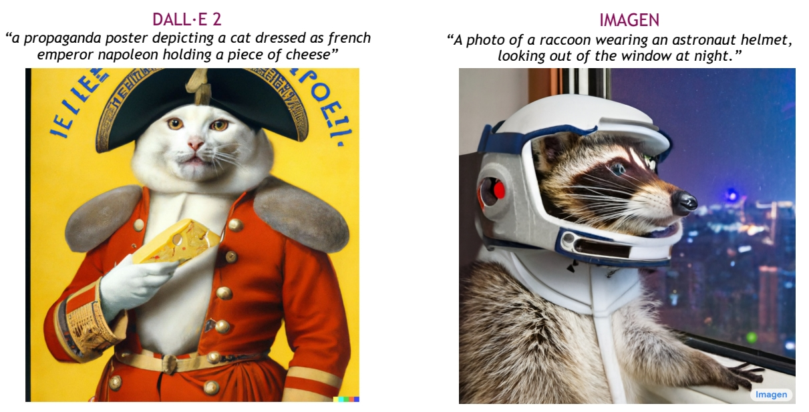

P66   
# Conditional Generation and Guidance    

P67   
> &#x2705; 通常需要的是特定的生成，而不是随意的生成。因此需要通过control引入特定的需求。  

以下是文生图的例子：

 

<u>Ramesh et al., “Hierarchical Text-Conditional Image Generation with CLIP Latents”, arXiv 2022.</u>    
<u>Saharia et al., “Photorealistic Text-to-Image Diffusion Models with Deep Language Understanding”, arXiv 2022.</u>    

P68   
## Conditioning and Guidance Techniques

Explicit Conditions    
Classifier Guidance    
Classifier-free Guidance    

P69   

# Explicit Conditions    

P70   
Conditional sampling can be considered as training \\(p(\mathbf{x} |\mathbf{y} )\\) where \\(\mathbf{y}\\) is the input conditioning (e.g., text) and \\(\mathbf{x}\\) is generated output (e.g., image)    

Train the score model for \\(\mathbf{x}\\) conditioned on \\(\mathbf{y}\\) using:    

$$
\mathbb{E} _ {(\mathbf{x,y} )\sim P\mathrm{data} (\mathbf{x,y} )}\mathbb{E} _ {\epsilon \sim \mathcal{N}(\mathbf{0,I} ) }\mathbb{E} _{t\sim u[0,T]}||\epsilon _ \theta (\mathbf{x} _ t,t;\mathbf{y} )- \epsilon ||^2_2 
$$

The conditional score is simply a U-Net with \\(\mathbf{x}_t\\) and \\(\mathbf{y}\\) together in the input.    

 

> &#x2705; 需要 \\((x，y)\\) 的 pair data.            

P71   

# Classifier Guidance    

P72   
## Bayes’ Rule in Action

 

> &#x2705; \\(p(y)\\) 与 \\(\mathbf{x} _ t\\) 无关，因此可以去掉。     

## 训练方法

> &#x2705; 第一步：需要一个训好的p(x)的 diffusion model 。  
> &#x2705; 第二步：训练一个分类网络，输入xt能够正确地预测控制条件（y不一定是离散的类别）。  
> &#x2705; 第三步：取第二步的梯度，用一定的权重\\(w \\)结合到第一步的forward过程中。\\(w \\)决定分类器的影响力。   

> &#x2705; 只需要部分pair data和大量的非pair data。但需要单独训练一个分类器。  

## 相关论文

> &#x1F50E; <u>Song et al., “Score-Based Generative Modeling through Stochastic Differential Equations”, *ICLR*, 2021</u>    
> &#x1F50E; <u>Nie et al., “Controllable and Compositional Generation with Latent-Space Energy-Based Models”, NeurIPS 2021</u>    
> &#x1F50E; <u>Dhariwal and Nichol, “Diffusion models beat GANs on image synthesis”, NeurIPS 2021.</u>    

P73    

# Classifier-free Guidance    

P74   
Instead of training an additional classifier, get an “implicit classifier” by jointly training a conditional and  unconditional diffusion model. In practice, the conditional and unconditional models are trained together by randomly dropping the condition of the diffusion model at certain chance.     

> &#x2705; Classifier Guidance 的问题:  
> &#x2705; 1. 需要额外训练一个噪声版本的图像分类器  
> &#x2705; 2. 分类器的质量会影响按类别生成的效果  
> &#x2705; 3. 过梯度更新图像会导致对抗攻击效应，生成图像可能会通过人眼不可察觉的细节欺骗分类器，实际上并没有按条件生成。

## implicit classifier

Recall that classifier guidance requires training a classifier. Using Bayes’ rule again:   

 

 - The modified score with this implicit classifier included is:   

 

> &#x2705; 把公式1代入Classifier Guidance Diffusion Model的公式中，得到公式2  

## 训练方法

> &#x2705; 训一个模型同时支持 Conditional 和 Unconditional 两个任务。    
> &#x2705; 训练时随机地使用“条件+数据”和“None+数据”进行训练。  

> &#x1F50E; <u>Ho & Salimans, “Classifier-Free Diffusion Guidance”, 2021.</u>     

P75   

## Trade-off for sample quality and sample diversity

 

Large guidance weight \\((\omega  )\\) usually leads to better individual sample quality but less sample diversity.    

<u>Ho & Salimans, “Classifier-Free Diffusion Guidance”, 2021.</u>     

