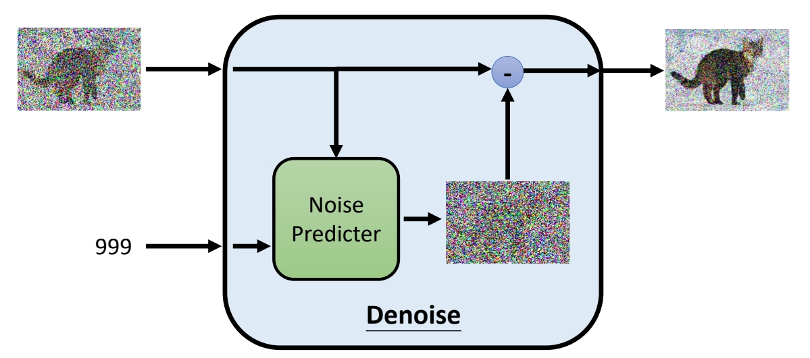
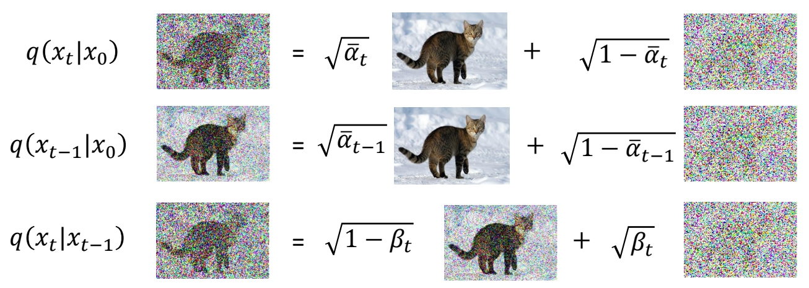
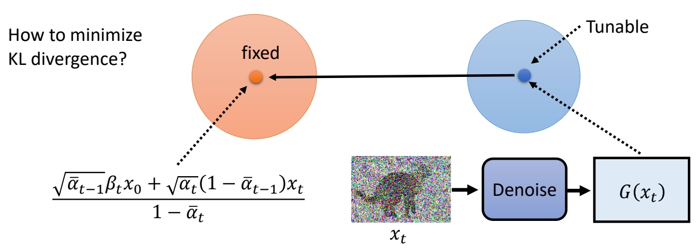

P12  
# Diffusion Model 是如何运作的？

P13   

Denoising diffusion models consist of two processes:    
 - Forward diffusion process that gradually adds noise to input   
 - Reverse denoising process that learns to generate data by denoising    

 

P14   
## Forward Diffusion Process

The formal definition of the forward process in T steps:    

### 直观理解

> 真正的加噪过程，**不是直接的image + noise**。  

### 从数学上理解

> &#x2705; 从第一张图像到最后的纯噪声，实际上是分布的改变。

 

通过逐步的 scale down 让均值趋近于 0。通过引入噪声使方差趋近于 1。使得原始分布逐步逼近 \\(\mathcal{N} (0,1 )\\)分布，   

> &#x2753; 求联合分布有什么用?    

### 从操作层面理解

 

> &#x2705; 实际上，在给定一张图像x0时，想要获得第t张加噪图像时，不需要真的通过公式\\(q(x_t|x_{t-1})\\)从 \\(\mathbf{x} _{t-1}\\)到 \\(\mathbf{x} _{t}\\)一步一步计算出来，可以直接从 \\(\mathbf{x}_0\\)生成任意的 \\(\mathbf{x}_t\\)。 

 

从数学上可以证明，从x0逐步计算到xt和从x0直接计算到xt，这两种行为是等价的。  

根据公式 \\(\mathbf{x} _t=\sqrt{\bar{a} _t}   \mathbf{x} _0+\sqrt{(1-\bar{a} _t) }  \varepsilon  \\)可知，当 \\(\bar{a} _T  → 0\\)，分布\\(q(x_T)\\)的均值趋于0，方差趋于1，变成纯高斯噪声。

P16   
### 进一步理解

So far, we discussed the diffusion kernel \\(q(\mathbf{x} _t|\mathbf{x} _0)\\) but what about \\(q(\mathbf{x}_t)\\)?   

 

The diffusion kernel is Gaussian convolution.    

> &#x2705; convolution 是一种信号平滑方法。    
> &#x2705; \\(q(\mathbf{x} _ t|\mathbf{x} _ 0)\\) 是标准高斯分布，因此 \\(q(\mathbf{x} _ t)\\) 是以高斯分布为权重的真实数据的加权平均。     

 

We can sample \\(\mathbf{x}_t \sim q(\mathbf{x}_t)\\) by first sampling \\(\mathbf{x}_0\\) and then sampling \\(\mathbf{x}_t \sim q(\mathbf{x}_t|\mathbf{x}_0)\\) (i.e., ancestral sampling).   

> &#x2705; 实际上，没有任意一个时间步的 \\(q(\mathbf{x})\\) 的真实分布，只有这些分布的 sample.    

## Reverse Denoising Process

P17   
### 直观理解

Denoise是一个网络模块，通过Denoise模块学习每个时间步的去噪过程。  

> &#x2705; 把 \\(\mathbf{x}_0\\) 加噪为 init-noise，再从 init-noise 恢复出 \\(\mathbf{x}_0\\)，这个操作是不可行的。     
> &#x2705; 因为，根据公式 \\(\mathbf{x} _t=\sqrt{\bar{a} _t}   \mathbf{x} _0+\sqrt{(1-\bar{a} _t) }  \varepsilon  \\), 且 \\(\bar{a} _T  → 0\\)，那么经过 \\(T\\) 步加噪后，\\(\mathbf{x} _t\approx \varepsilon \\). 而是 \\(\varepsilon \\) 是一个与 \\(\mathbf{x} _ 0\\) 没有任务关系的噪声，所以不可能从中恢复出 \\(\mathbf{x} _ 0\\).    

### 从数学上理解

从xT到x0的过程，也是分布的改变。从\\(\mathcal{N}(\mathbf{x}_T；\mathbf{0,I})\\)w分布变成真实分布的过程。  

 

 

与Forward不同的是，\\(q(\mathbf{x}_{t-1}|\mathbf{x}_t)\\)没有一个准确的数学公式来表达。

Can we approximate \\(q(\mathbf{x}_{t-1}|\mathbf{x}_t)\\)? Yes, we can use a **Normal distribution** if \\(\beta _t\\) is small in each forward diffusion step.    

> &#x2705; Nomal distribution 是特定均值和方差的高斯分布，不一定是 std 高斯。  
  
P18    

 

假设\\(p(\mathbf{x} _ T)\\)和\\(p(\mathbf{x}_{t-1}|\mathbf{x}_t)\\)分别符合以上分布。  
从第1个分布中sample出\\(x_T\\)，把它代入第二个分布，就可以sample出\\(x_{T-1}\\)，直到最终sample出\\(x_0\\)

**由于以上截图来自不同的材料，存在p和q混有的情况，需注意区分。**

P19   
### Learning Denoising Model   

 

> &#x2705; 以上是去噪模型的公式，下面有关于这些公式的详细解释。  

P20   
# 训练与推断

使用Forward流程对真实数据加噪，以构造pair data。  
使用使用Denoise模块学习去噪分布，完成去噪过程。  

 

P21    
## Implementation Considerations   

Diffusion models often use U-Net architectures with ResNet blocks and self-attention layers to represent \\(\epsilon _\theta (\mathbf{x}_t,t)\\).    

 

Time representation: sinusoidal positional embeddings or random Fourier features.    

Time features are fed to the residual blocks using either simple spatial addition or using adaptive group normalization layers. (see <u>Dharivwal and Nichol NeurIPS 2021</u>).    

> &#x2705; \\(\sigma \\) 是怎么定义的？    

# 数学原理

P10   
## 生成模型本质上的共同目标

### 目标是要学一个分布

 

生成模型的本质是要学到真实数据的分布，以及从某个已经分布（通常是正态分布）到这个真实数据分布的映射。  

> &#x2705; 实际使用中还会加一个 condition，但整体上没有本质差异，因此后面推导中不考虑 condition.    

P11   
### 定义目标函数

#### 以Minimize KL Divergence作为目标函数

 

目标是让生成数据的分布与真实数据的分布尽量的接近，但是怎样衡量两个分布是否接近？   

> &#x2705; 常用KL Divergence来衡量预测分布与GT分布之间的距离。

#### 以Maximum Likelihood Estimation

\\(P_{data}\\) 代表真实分布，从分布中 Sample 出来的 \\(x\\) 即训练集    
\\(x_i\\)是数据集里的一个数据，也是真实数据分布里的一个采样。\\(P_\theta (x^i)\\) 代表 \\(P_\theta\\) 生成 \\(x^i\\) 的概率。  

> &#x2705; 由于 \\(P_\theta\\) 非常复杂，算不出这个概率，但此处假设 \\(P_\theta (x^i)\\) 已知。    

于是可以将定义目标函数为：找出让真实 \\(x^i\\) 被生成出来的概率最高的\\(\theta \\).    

\begin{align*} \theta ^\ast =\text{arg } \max_{\theta } \prod_{i=1}^{m} P_\theta (x^i) \end{align*}

#### 两个目标函数是等价的

可通过数据推导证明，这里提到的两个目标，本质上是一致的。证明过程如下：

P12  

 

Maximum Likelihood = Minimize KL Divergence    

> &#x2705; 结论：让真实数据的概率最大，与让两个分布尽量接近，在数学上是一致的。   
> &#x2705; VAE、diffusion、flow based 等生成模型，都是以最大化 Likelihood 为目标。GAN 是最小化 JS Divergence 为目标。   

P13   
## Compute \\(𝑃_\theta(x)\\)   

### 计算\\(𝑃_\theta(x)\\)的常用技巧

> &#x2705; VAE 和 diffusion 非常相似，许多公式是通用的。    

#### 技巧一：不推断生成结果，而是推断生成结果分布的均值

|||
|--|--|
|  |  |
|  |  |

> &#x2705; \\(G（z）\\) 不代表某个生成结果，而是一个高斯的均值，然后计算 \\(x\\) 在这个分布中的概率。   

P14   
#### 技巧二：不求\\(𝑃_\theta(x)\\)，而是求Lower bound of \\(log P(x)\\)  

> &#x2705; 通常无法最大化 \\(P（x）\\)，而是最大化 \\(log P(x)\\) 的下界。  
> &#x2705; 以上公式推导中省略参数 \\( \theta\\)。   

P15   
### DDPM: Compute \\(𝑃_\theta(x)\\)   

对于 diffusion model，假设每次 denoise 出的是一个高斯分布的均值。   

> &#x2753; 问：为什么假设\\(G(x_t)\\) 是高斯分布的 mean？   
> &#x2705; 答：有人尝试过其它假设，效果没有变好，且高斯分布便于计算。   

通过链式法则，可以得出 \\(x_0\\) 在最终分布中的概率为：

$$
P_ \theta (x_0)=\int\limits _ {x_1:x_T}^{} P(x_T)P_ \theta (x_{T-1}|x_T) \dots P_ \theta (x_ {t-1}|x_t) \dots P_ \theta(x_0|x_1)dx_1:x_T  
$$

P16   
### DDPM: Lower bound of \\(log P(x)\\)  

  

  

### 计算Lower bound of \\(log P(x)\\)

#### 计算\\(q（x_t｜x_{t-1}）\\)

P17   
  

> &#x2705; 提前定好一组 \\(\beta \\)．代表 noise 要加多大。   
> &#x2705; \\(q（x_t｜x_{t-1}）\\) 仍然属于高斯分布，其均值为 \\(\sqrt{1-\beta _t} \cdot x_t\\)，方差为 \\(\beta _t\\).   

#### 计算\\(q（x_t｜x_{0}）\\)

P18   
  

P19   
  

> &#x2705; 由于两次 sample 出的 noise 是独立同分布，两个 noise 以这种形式相加的结果，也符合某个特定的高斯分布。   

P20   

  

> &#x2705; 结论：\\(q（x_t｜x_{0}）\\)也符合高斯分布，其均值为\\(\bar{\alpha }_t\\)，方差为\\({1-\bar{\alpha }_t}\\).    

## 定义损失函数

如何定义损失函数，可以达到最大化\\(\log P_{\theta}(x_0)\\)的目的

### 损失函数与目标函数

> 目标函数是根据实际意义推导出来的优化目标。损失函数是能引导学习收敛到目标状态的函数，可以没有实际意义，也可以跟目标函数不一样。  
> 虽然目标函数很明确，但是损失函数不一定要跟目标函数一样。可以从目标函数中提取出影响结果的关键因素来引导学习过程。  

### 推导与简化目标函数\\(log P(x)\\)

  

P21   
  

P22   

最后简化为以下三项：  

\begin{align*} E_{q(x_1|x_0)}[log P(x_0|x_1)]-KL(q(x_T|x_0)||P(x_T))
-\sum_{t=2}^{T}E_{q(x_t|x_0)}[KL(q(x_{t-1}|x_t,x_0)||P(x_{t-1}|x_t))]   \end{align*}

### 分析目标函数中与优化相关的关键因素

#### 结论

> &#x2705; 目标是要优化 \\( \theta\\)，第二项与\\( \theta\\)无关，可以略掉。   
> &#x2705; 第三项的 KL Divrgence 涉及到两个分布，分布1是固定的，可以通过计算得到，分布2是由 \\( \theta\\) 决定的，是要优化的对象。    

P23  

#### 关于第三项分布1的推导过程

  

已知 \\(q (x_t\mid x_0)\\)，\\(q (x_{t-1} \mid x_0)\\) 和 \\(q (x_t \mid x_{t-1})\\)为：

  

求 \\(q (x_{t-1} \mid x_t,x_0)\\).   

> &#x2705; \\((q(x_{t-1}|x_t,x_0)\\)的数据含义为：已知\\(x_0\\) 和 \\(x_t\\)，求 \\(x_{t-1}\\) 的分布。

P24   
  

P25   
  

> https://arxiv.org/pdf/2208.11970.pdf

P26   
  

> &#x2705; 结论：\\(q(x_{t-1}|x_t,x_0)\\) 也是高斯分布，且其均值与方差是与\\(\theta\\)无关的固定的值。   

#### 化简后的目标函数

根据以上推导，目标函数可简化为最小化原目标函数第三项中分布1与分布2的KL Divergence。  

\begin{align*} E_{q(x_1|x_0)}[log P(x_0|x_1)]-KL(q(x_T|x_0)||P(x_T))
-\sum_{t=2}^{T}E_{q(x_t|x_0)}[KL(q(x_{t-1}|x_t,x_0)||P(x_{t-1}|x_t))]   \end{align*}

其中分布1为与\\(\theta\\)无关的固定，分布2为与\\(\theta\\)有关的待优化分布。  

#### How to minimize KL divergence?    

##### 方式一：直接套公式

  

> &#x2705; 两个高斯分布的 KLD 有公式解，但此处不用公式解，因为  \\( \theta\\) 只能影响分布2的均值。   

##### 方式二

分布1的均值和方差是固定的。分布2的均值是待优化的，方差是固定的。  

  

> &#x2705; 因此减小 KLD 的方法是让分布2的均值接近分布1的均值。   

### 定义损失函数

> &#x2705; 分布1的均值可以看作是 \\(x_{t-1}\\) 的 GT 了。其计算公式为：     

  

\\(x_{t-1}\\)的GT的计算公式中包含了x0和xt，把x0和xt都转化为xt的表示，得：  

  

> &#x2705; 可以发现 \\(x_t\\) 与 \\(x_{t-1}\\)和GT 之间，唯一未知的部分就是 noise \\(\varepsilon \\). 因此用网络学习这个noise。  

最终定义损失函数为网络输出(预测的noise)与GT（构造训练数据时所生成的noise）之间的L2距离。  

## 其它问题

### 关于\\(\alpha \\)

> &#x2705; \\(\alpha \\) 是预定义的超参，DDPM 试图学习 \\(\alpha \\)，发现没有提升。

# 相关论文 

<u>Sohl-Dickstein et al., Deep Unsupervised Learning using Nonequilibrium Thermodynamics, ICML 2015</u>     
<u>Ho et al., Denoising Diffusion Probabilistic Models, NeurIPS 2020</u>   
<u>Song et al., Score-Based Generative Modeling through Stochastic Differential Equations, ICLR 2021</u>    

---------------------------------------
> 本文出自CaterpillarStudyGroup，转载请注明出处。
>
> https://caterpillarstudygroup.github.io/ImportantArticles/