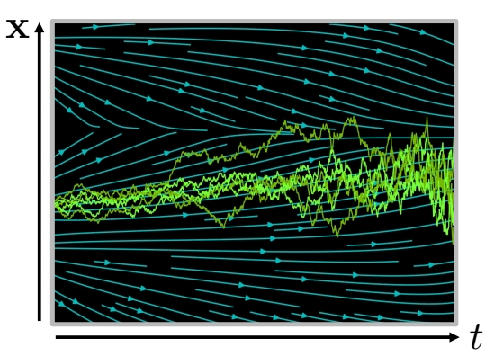
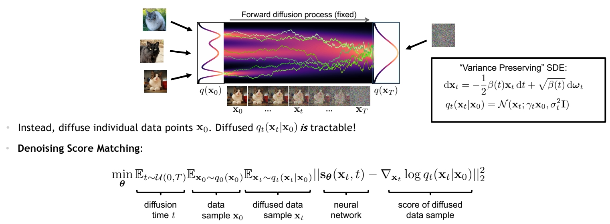

P22  

# Score-based Generative Modeling with Differential Equations

P24   
## Ordinary Differential Equation (ODE):    

$$
\frac{d\mathbf{x} }{dt} =\mathbf{f} (\mathbf{x},t) \quad  \mathrm{or}  \quad d\mathbf{x} =\mathbf{f} (\mathbf{x} ,t)dt
$$

> &#x2705; 图中描述了一个 function，这个函数没有闭式解，而是 \\(\mathbf{x}\\) 随着时间的变化。    
> &#x2705; \\(f(\mathbf{x},t)\\) 描述的是一个随时间变化的场 \\(f(\mathbf{x},t)\\) 可以是一个用网络拟合的结果。    

   

Analytical Solution:   

$$
\mathbf{x} (t)=\mathbf{x} (0)+\int_{0}^{t} \mathbf{f} (\mathbf{x} ,\tau )d\tau 
$$

Iterative Numerical Solution:    

$$
\mathbf{x} (t+\Delta t)\approx \mathbf{x} (t)+\mathbf{f} (\mathbf{x} (t),t)\Delta t
$$

## Stochastic Differential Equation (SDE):   

 

> &#x2705; \\(\sigma \\) 描述 noise 的 scale。\\(\omega _ t\\) 描述噪声。    
> &#x2705; SDE 在每个时间步注入高斯白噪声。因此多次求解 \\(\mathbf{x}(t)\\) 的结果是不一样的。    

P25   

 

P26   
## Forward Diffusion Process as Stochastic Differential Equation

 

> &#x2705; DDPM 是在时间上做了离散化的 SDE．    
> &#x1F50E; <u>Song et al., “Score-Based Generative Modeling through Stochastic Differential Equations”, ICLR, 2021</u>    

P27    
## Forward Diffusion Process as Stochastic Differential Equation

 

> &#x2705; drift term 使 \\( \mathbf{x} _ t\\) 趋向于 Origin.    
> &#x2705; Origin 我理解为 \\( \vec{o} \\) 向量的意思。    
> &#x2705; \\( \mathbf{x} _ t\\) 最终趋向于 std normal.    

P28   
## The Generative Reverse Stochastic Differential Equation

But what about the reverse direction, necessary for generation?    

<u>Song et al., ICLR, 2021</u>

P29  
## The Generative Reverse Stochastic Differential Equation

 

\\(\Rightarrow \\) **Simulate reverse diffusion process: Data generation from random noise!**    

<u>Song et al., ICLR, 2021</u>   
<u>Anderson, in Stochastic Processes and their Applications, 1982</u>    

> &#x2705; \\(q _ t(\cdot )\\) 描述 \\(t\\) 时刻的分布。    
> &#x2705; \\(q _ t(\mathbf{x} _ t)\\) 为 \\(\mathbf{x} _ t\\) 在 \\(q _ t\\) 分布中的概率。    
> &#x2705; Generative 的关键是拟合 score funchon．    

P31   
## The Generative Reverse Stochastic Differential Equation

**But how to get the score function** \\(\nabla \mathbf{x} _t \log q_t(\mathbf{x} _t)\\)?   

P32   
## Score Matching

 - Naïve idea, learn model for the score function by direct regression?    

 

**But** \\(\nabla \mathbf{x} _t \log q_t(\mathbf{x} _t)\\) **(score of the** ***marginal diffused density*** \\(q_t(\mathbf{x} _t)\\)**) is not tractable!**   

<u>Vincent, “A Connection Between Score Matching and Denoising Autoencoders”, Neural Computation, 2011</u>    

<u>Song and Ermon, “Generative Modeling by Estimating Gradients of the Data Distribution”, NeurIPS, 2019</u>    

> &#x2705; 直接用一个网络拟合 score function．    
> &#x2705; 存在的问题：只能 sample from \\(q_t\\)，但没有 \\(q_t\\) 的 close form.    

P33   
## Denoising Score Matching

 

 - Instead, diffuse individual data points \\(\mathbf{x}_0\\). Diffused \\(q_t(\mathbf{x}_t|\mathbf{x}_0)\\) ***is*** tractable!     

 - **Denoising Score Matching**:     

 
  
**After expectations**, \\(\mathbf{s} _ \theta (\mathbf{x} _ t,t)\approx \nabla _ {\mathbf{x} _ t}\log q _ t(\mathbf{x} _ t)\\)**!**    

<u>Vincent, in Neural Computation, 2011</u>      
<u>Song and Ermon, NeurIPS, 2019</u>   
<u>Song et al. ICLR, 2021</u>   

> &#x2753; \\(\gamma _ t\\) 和 \\(\sigma\\) 怎么定义？    
> &#x2705; 最后 \\(\mathbf{s} _ \theta (\mathbf{x} _ t,t)\\) 学到的是所有 \\(\mathbf{x} _ 0\\) 对应的 score 的均值。    
> &#x2753; 为什么 \\(\mathbf{s} _\theta (\mathbf{x} _t,t)\\) 不需要考虑 \\(\mathbf{x}_0\\)？    

P34   
## Denoising Score Matching    

 

$$
\min_ {\mathbf{\theta}  } \mathbb{E} _ {t\sim u(0,T)}\mathbb{E} _ {\mathbf{x} _ 0\sim q_ 0(\mathbf{x} _ 0)}\mathbb{E} _{\epsilon \sim \mathcal{N}(\mathbf{0,I} ) }\frac{1}{\sigma ^2_t} ||\epsilon -\epsilon _ \theta (\mathbf{x} _ t,t)||^2_2 
$$

**Same objectives in Part (1)!**    

<u>Vincent, in *Neural Computation*, 2011</u>     
<u>Song and Ermon, *NeurIPS*, 2019</u>   
<u>Song et al. *ICLR*, 2021</u>   

> &#x2705; 时间离散的 diffusion model(DDPM) 和时间连续的 diffusion model(SDE),其目标函数是一致的，且两个版本可以互相转化。    

P35    
## Different Parameterizations

More sophisticated model    
parametrizations and loss    
weightings possible!  

Karras et al., <u>"Elucidating the Design Space of Diffusion-Based Generative Models",</u> NeurIPS 2022    

> &#x2705; 调参对生成质量影响很大。    
> &#x2705; Best Paper.     

P36   
## Synthesis with SDE vs. ODE

**Generative Reverse Diffusion SDE (stochastic):**    

$$
d\mathbf{x} _ t=-\frac{1}{2} \beta (t)[\mathbf{x} _ t+2s_ \theta (\mathbf{x} _ t,t)]dt+\sqrt{\beta (t)} d\varpi _ t
$$

**Generative Probability Flow ODE (deterministic):**   

$$
d\mathbf{x} _ t=-\frac{1}{2} \beta (t)[\mathbf{x} _ t+s_ \theta (\mathbf{x} _ t,t)]dt
$$
 
<u>Song et al., ICLR, 2021</u>    

> &#x2705; 可以用 SDE 训练，用 ODE 推断，每个噪声对应特定的输出。  

P37   
## Probability Flow ODE  
##### Diffusion Models as Neural ODEs  

   

 - Enables use of **advanced ODE solvers**   
 - **Deterministic encoding and generation** (semantic image interpolation, etc.)     
 - **Log-likelihood computation** (instantaneous change of variables):       

<u>Chen et al., *NeurIPS*, 2018</u>    
<u>Grathwohl, *ICLR*, 2019</u>   
<u>Song et al., *ICLR*, 2021</u>    

> &#x2705; ODE 推断，可以使用成熟的 ODE solve 进行 sample 加速。    
> &#x2753; 第三条没听懂，把 model 当成基于数据的 ODE 来用？    

---------------------------------------
> 本文出自CaterpillarStudyGroup，转载请注明出处。
>
> https://caterpillarstudygroup.github.io/ImportantArticles/