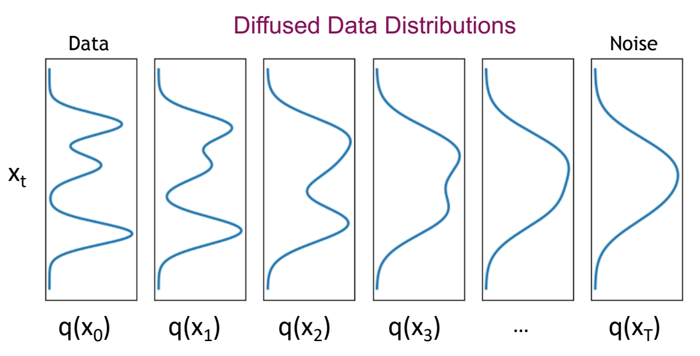
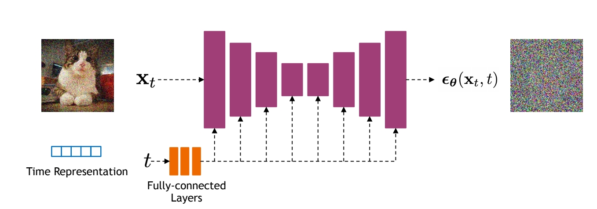
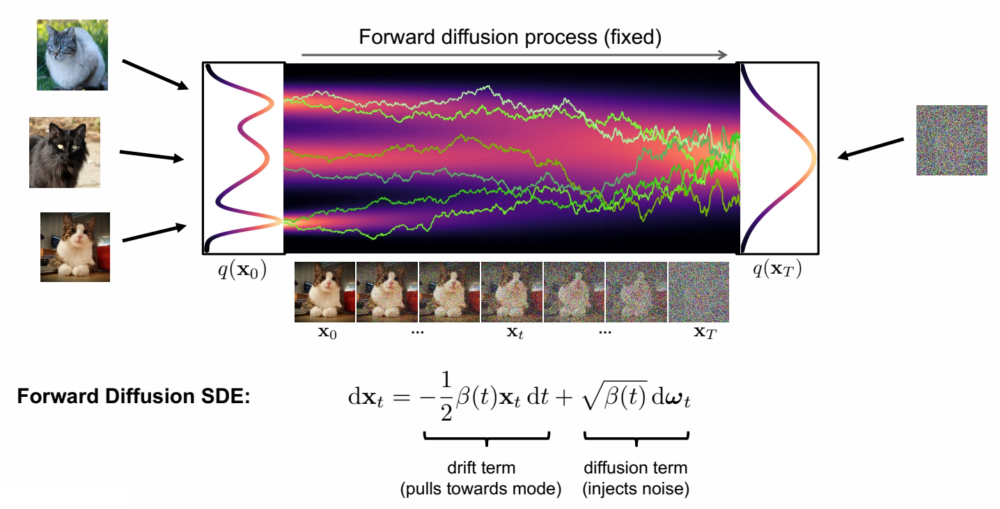
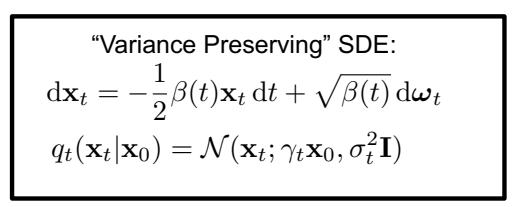
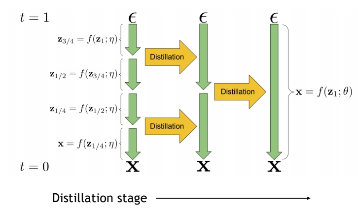
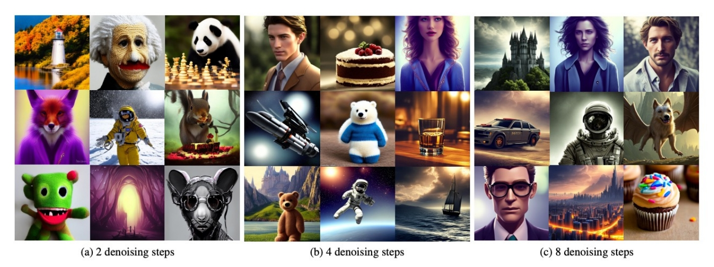
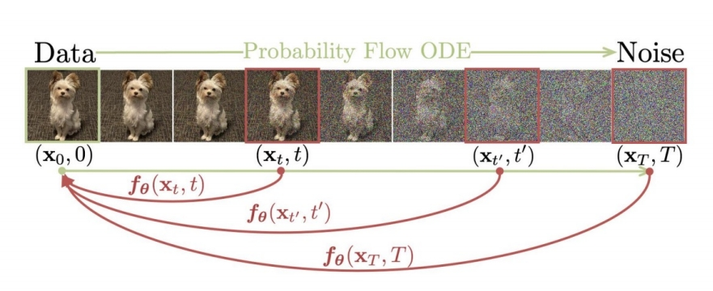
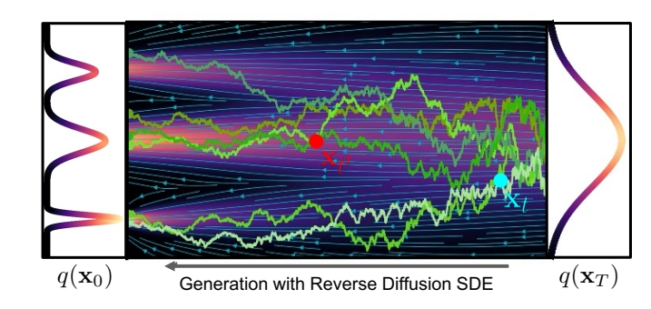
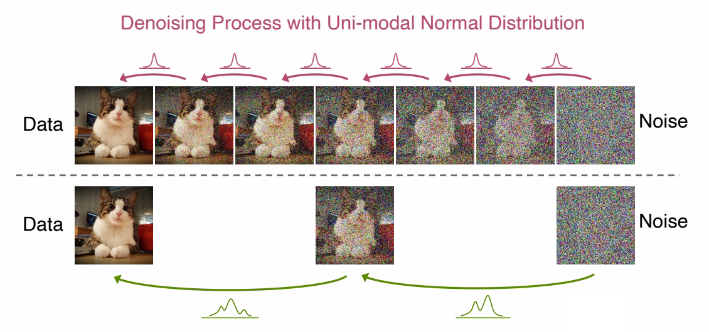
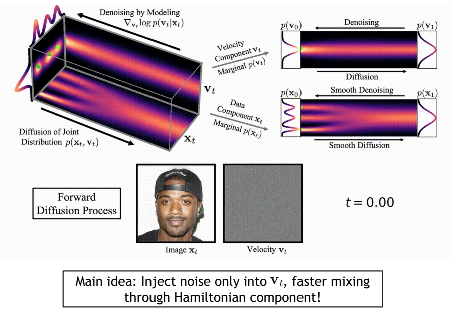

P1  

## Denoising Diffusion Models: A Generative Learning Big Bang　　　

Jiaming Song　　　Chenlin Meng 　　　Arash Vahdat　　　

P4  

## The Landscape of Deep Generative Learning

Restricted Boltzmann Machines   
Bayesian Networks   
Variational Autoencoders    
Normalizing Flows   
Energy-based Models   
Autoregressive Models   
Denoising Diffusion Models    

Generative Adversarial Networks    

P6    
## We May Not Know Cosmology, But We Know CVPR 
 
 

\\(^\ast \\)Disclaimer: We rely on paper titles for counting the number of papers in each topic. Our statistics are likely to be biased.    

P7   
## Today’s Program   

 

<https://cvpr2023-tutorial-diffusion-models.github.io/>  

P12  
## Part (1): Denoising Diffusion Probabilistic Models   

P13   

## Denoising Diffusion Models    
##### Learning to generate by denoising   

Denoising diffusion models consist of two processes:    
 - Forward diffusion process that gradually adds noise to input   
 - Reverse denoising process that learns to generate data by denoising    

 

<u>Sohl-Dickstein et al., Deep Unsupervised Learning using Nonequilibrium Thermodynamics, ICML 2015</u>     
<u>Ho et al., Denoising Diffusion Probabilistic Models, NeurIPS 2020</u>   
<u>Song et al., Score-Based Generative Modeling through Stochastic Differential Equations, ICLR 2021</u>    

P14   
## Forward Diffusion Process

The formal definition of the forward process in T steps:    

 

> &#x2705; 要让原始分布逼近 \\(\mathcal{N} (0,1 )\\)分布，通过逐步的 scale daun 让均值趋近于 0。通过引入噪声使方差趋近于 1。   
> &#x2753; 怎么保证方差为 1 呢？答：根据P15公式。只要 \\( \bar{\alpha } _ t\\) 趋于 0 即可。   
> &#x2753; 求联合分布有什么用?    

P15   
## Diffusion Kernel

 

 

> &#x2705; 把 \\(\mathbf{x}_0\\) 加噪为 init-noise，再从 init-noise 恢复出 \\(\mathbf{x}_0\\)，这个操作是不可行的。     
> &#x2705; 因为，根据公式 \\(\mathbf{x} _t=\sqrt{\bar{a} _t}   \mathbf{x} _0+\sqrt{(1-\bar{a} _t) }  \varepsilon  \\), 且 \\(\bar{a} _T  → 0\\)，那么经过 \\(T\\) 步加噪后，\\(\mathbf{x} _t\approx \varepsilon \\). 而是 \\(\varepsilon \\) 是一个与 \\(\mathbf{x} _ 0\\) 没有任务关系的噪声，所以不可能从中恢复出 \\(\mathbf{x} _ 0\\).     

P16   
## What happens to a distribution in the forward diffusion?

So far, we discussed the diffusion kernel \\(q(\mathbf{x} _t|\mathbf{x} _0)\\) but what about \\(q(\mathbf{x}_t)\\)?   

 

 

The diffusion kernel is Gaussian convolution.    

We can sample \\(\mathbf{x}_t \sim q(\mathbf{x}_t)\\) by first sampling and then sampling \\(\mathbf{x}_t \sim q(\mathbf{x}_t|\mathbf{x}_0)\\) (i.e., ancestral sampling).   

> &#x2705; convolution 是一种信号平滑方法。    
> &#x2705; \\(q(\mathbf{x} _ t|\mathbf{x} _ 0)\\) 是标准高斯分布，因此 \\(q(\mathbf{x} _ t)\\) 是以高斯分布为真实数据的加权平均。     
> &#x2705; 实际上，没有任意一个时间步的 \\(q(\mathbf{x})\\) 的真实分布，只有这些分布的 sample.    

P17   
## Generative Learning by Denoising   

Recall, that the diffusion parameters are designed such that 
\\(q(\mathbf{x}_T)\approx (\mathbf{x}_T；\mathbf{0,I})\\)    

 

 

Can we approximate \\(q(\mathbf{x}_{t-1}|\mathbf{x}_t)\\)? Yes, we can use a **Normal distribution** if \\(\beta _t\\) is small in each forward diffusion step.    

> &#x2705; 这里的 Nomal distribution 是高斯分布的意思吧？不一定是 std 高斯。    
> &#x2753; 为什么认为 \\(q(\mathbf{x} _ {t-1}|\mathbf{x} _ t)\\) 是 Normal 分布？应该是特定均值和方差的高斯分布。    

P18    
## Reverse Denoising Process

Formal definition of forward and reverse processes in T steps:    

 

> &#x2705; 虽然 \\(p(\mathbf{x} _ T)\\) 的真实分布未知，只有 \\(p (\mathbf{x} _ T)\\) 的 sample，但这里假设它是 \\( \mathcal{N} (0,1)\\).   

P19   
## Learning Denoising Model   
##### Variational upper bound   

 

> &#x2753; 网络只能产生 \\(\mathbf{x} _ t\\) 的均值，方差会有什么样的变化，对结果会有什么影响呢？   
> &#x2753; 求联合分布有什么用？     

P20   
## Summary   
### Training and Sample Generation

 

> &#x2705; 推导过程参考李宏毅的课程。    

P21    
## Implementation Considerations   
##### Network Architectures

Diffusion models often use U-Net architectures with ResNet blocks and self-attention layers to represent \\(\epsilon _\theta (\mathbf{x}_t,t)\\).    

 

Time representation: sinusoidal positional embeddings or random Fourier features.    

Time features are fed to the residual blocks using either simple spatial addition or using adaptive group normalization layers. (see <u>Dharivwal and Nichol NeurIPS 2021</u>).    

> &#x2705; \\(\sigma \\) 是怎么定义的？    

P22  
## Outline

Part (1): Denoising Diffusion Probabilistic Models   
**Part (2): Score-based Generative Modeling with Differential Equations**   
Part (3): Accelerated Sampling   
Part (4): Conditional Generation and Guidance   

P23   
## Crash Course in Differential Equations

Ordinary Differential Equation (ODE):    
\\(\frac{d\mathbf{x} }{dt} =\mathbf{f} (\mathbf{x},t) \quad  \mathrm{or}  \quad d\mathbf{x} =\mathbf{f} (\mathbf{x} ,t)dt \\)

P24   
## Crash Course in Differential Equations

**Ordinary Differential Equation (ODE):**    

\\(\frac{d\mathbf{x} }{dt} =\mathbf{f} (\mathbf{x},t) \quad  \mathrm{or}  \quad d\mathbf{x} =\mathbf{f} (\mathbf{x} ,t)dt \\)

   

Analytical Solution:   

$$
\mathbf{x} (t)=\mathbf{x} (0)+\int_{0}^{t} \mathbf{f} (\mathbf{x} ,\tau )d\tau 
$$

Iterative Numerical Solution:    

$$
\mathbf{x} (t+\Delta t)\approx \mathbf{x} (t)+\mathbf{f} (\mathbf{x} (t),t)\Delta t
$$

**Stochastic Differential Equation (SDE):**   

 

> &#x2705; \\(f(\mathbf{x},t)\\) 描述的是一个随时间变化的场 \\(f(\mathbf{x},t)\\) 可以是一个用网络拟合的结果。    
> &#x2705; \\(\sigma \\) 描述 noise 的 scale。\\(\omega _ t\\) 描述噪声。    
> &#x2705; 图中描述了一个 function，这个函数没有闭式解，而是 \\(\mathbf{x}\\) 随着时间的变化。    
> &#x2705; SDE 在每个时间步注入高斯白噪声。    

P25   
## Crash Course in Differential Equations

 

> &#x2705; 多次求解 \\(\mathbf{x}(t)\\) 的结果。   

P26   
## Forward Diffusion Process as Stochastic Differential Equation

 

<u>Song et al., “Score-Based Generative Modeling through Stochastic Differential Equations”, ICLR, 2021</u>    

> &#x2705; DDPM 是在时间上做了离散化的 SDE．    

P27    
## Forward Diffusion Process as Stochastic Differential Equation

 

> &#x2705; drift term 使 \\( \mathbf{x} _ t\\) 趋向于 Origin.    
> &#x2705; Origin 我理解为 \\( \vec{o} \\) 向量的意思。    
> &#x2705; \\( \mathbf{x} _ t\\) 最终趋向于 std normal.    

P28   
## The Generative Reverse Stochastic Differential Equation

But what about the reverse direction, necessary for generation?    

<u>Song et al., ICLR, 2021</u>

P29  
## The Generative Reverse Stochastic Differential Equation

 

\\(\Rightarrow \\) **Simulate reverse diffusion process: Data generation from random noise!**    

<u>Song et al., ICLR, 2021</u>   
<u>Anderson, in Stochastic Processes and their Applications, 1982</u>    

> &#x2705; \\(q _ t(\cdot )\\) 描述 \\(t\\) 时刻的分布。    
> &#x2705; \\(q _ t(\mathbf{x} _ t)\\) 为 \\(\mathbf{x} _ t\\) 在 \\(q _ t\\) 分布中的概率。    
> &#x2705; Generative 的关键是拟合 score funchon．    

P31   
## The Generative Reverse Stochastic Differential Equation

**But how to get the score function** \\(\nabla \mathbf{x} _t \log q_t(\mathbf{x} _t)\\)?   

P32   
## Score Matching

 - Naïve idea, learn model for the score function by direct regression?    

 

**But** \\(\nabla \mathbf{x} _t \log q_t(\mathbf{x} _t)\\) **(score of the** ***marginal diffused density*** \\(q_t(\mathbf{x} _t)\\)**) is not tractable!**   

<u>Vincent, “A Connection Between Score Matching and Denoising Autoencoders”, Neural Computation, 2011</u>    

<u>Song and Ermon, “Generative Modeling by Estimating Gradients of the Data Distribution”, NeurIPS, 2019</u>    

> &#x2705; 直接用一个网络拟合 score function．    
> &#x2705; 存在的问题：只能 sample from \\(q_t\\)，但没有 \\(q_t\\) 的close form.    

P33   
## Denoising Score Matching

 

 - Instead, diffuse individual data points \\(\mathbf{x}_0\\). Diffused \\(q_t(\mathbf{x}_t|\mathbf{x}_0)\\) ***is*** tractable!     

 - **Denoising Score Matching**:     

 
  
**After expectations**, \\(\mathbf{s} _ \theta (\mathbf{x} _ t,t)\approx \nabla _ {\mathbf{x} _ t}\log q _ t(\mathbf{x} _ t)\\)**!**    

<u>Vincent, in Neural Computation, 2011</u>      
<u>Song and Ermon, NeurIPS, 2019</u>   
<u>Song et al. ICLR, 2021</u>   

> &#x2705; \\(\gamma _ t\\) 和 \\(\sigma\\) 怎么定义？    
> &#x2705; 最后 \\(\mathbf{s} _ \theta (\mathbf{x} _ t,t)\\) 学到的是所有 \\(\mathbf{x} _ 0\\) 对应的 score 的均值。    
> &#x2753; 为什么 \\(\mathbf{s} _\theta (\mathbf{x} _t,t)\\) 不需要考虑 \\(\mathbf{x}_0\\)？    

P34   
## Denoising Score Matching    

 

$$
\min_ {\mathbf{\theta}  } \mathbb{E} _ {t\sim u(0,T)}\mathbb{E} _ {\mathbf{x} _ 0\sim q_ 0(\mathbf{x} _ 0)}\mathbb{E} _{\epsilon \sim \mathcal{N}(\mathbf{0,I} ) }\frac{1}{\sigma ^2_t} ||\epsilon -\epsilon _ \theta (\mathbf{x} _ t,t)||^2_2 
$$

**Same objectives in Part (1)!**    

<u>Vincent, in *Neural Computation*, 2011</u>     
<u>Song and Ermon, *NeurIPS*, 2019</u>   
<u>Song et al. *ICLR*, 2021</u>   

> &#x2705; 时间离散的 diffusion model(DDPM) 和时间连续的 diffusion model(SDE),其目标函数是一致的，且两个版本可以互相转化。    

P35    
## Different Parameterizations

More sophisticated model    
parametrizations and loss    
weightings possible!  

Karras et al., <u>"Elucidating the Design Space of Diffusion-Based Generative Models",</u> NeurIPS 2022    

> &#x2705; 调参对生成质量影响很大。    
> &#x2705; Best Paper.     
> &#x2705; 可以用 SDE 训练，用 ODE 推断，每个噪声对应特定的输出。  

P36   
## Synthesis with SDE vs. ODE

**Generative Reverse Diffusion SDE (stochastic):**    

$$
d\mathbf{x} _ t=-\frac{1}{2} \beta (t)[\mathbf{x} _ t+2s_ \theta (\mathbf{x} _ t,t)]dt+\sqrt{\beta (t)} d\varpi _ t
$$

**Generative Probability Flow ODE (deterministic):**   

$$
d\mathbf{x} _ t=-\frac{1}{2} \beta (t)[\mathbf{x} _ t+s_ \theta (\mathbf{x} _ t,t)]dt
$$
 
<u>Song et al., ICLR, 2021</u>    

P37   
## Probability Flow ODE  
##### Diffusion Models as Neural ODEs  

   

 - Enables use of **advanced ODE solvers**   
 - **Deterministic encoding and generation** (semantic image interpolation, etc.)     
 - **Log-likelihood computation** (instantaneous change of variables):       

<u>Chen et al., *NeurIPS*, 2018</u>    
<u>Grathwohl, *ICLR*, 2019</u>   
<u>Song et al., *ICLR*, 2021</u>    

> &#x2705; ODE 推断，可以使用成熟的 ODE solve 进行 sample 加速。    
> &#x2753; 第三条没听懂，把 model 当成基于数据的 ODE 来用？    

P38   
## Outline

Part (3): Accelerated Sampling    

P39   
## What makes a good generative model?    
##### The generative learning trilemma

 

<u>Tackling the Generative Learning Trilemma with Denoising Diffusion GANs, ICLR 2022</u>    

P40   
## What makes a good generative model?    
##### The generative learning trilemma   

Tackle the trilemma by accelerating diffusion models    

<u>Tackling the Generative Learning Trilemma with Denoising Diffusion GANs, ICLR 2022</u>   

P41  
## Acceleration Techniques   

Advanced ODE/SDE Solvers    
Distillation Techniques    
Low-dim. Diffusion Processes     
Advanced Diffusion Processes    

P42   

> &#x2705; ODE 实现 std normal 分布与真实数据分布之间的映射。    

P43   
## Generative ODEs    
##### Solve ODEs with as little function evaluations as possible    

$$
dx=\epsilon _\theta (x,t)dt
$$

 

> &#x2705; Euler 方法：每个时间步简化为线性过程当 step 较大时，会与 GT 有较大的偏离。     

P44    

 

Song et al., <u>"Denoising Diffusion Implicit Models (DDIM)",</u> ICLR 2021    

P45   
 

P46   
## A Rich Body of Work on ODE/SDE Solvers for Diffusion Models

 - Runge-Kutta adaptive step-size ODE solver:   
    - <u>Song et al., “Score-Based Generative Modeling through Stochastic Differential Equations”, *ICLR*, 2021</u>   
 - Higher-Order adaptive step-size SDE solver:    
    - <u>Jolicoeur-Martineau et al., “Gotta Go Fast When Generating Data with Score-Based Models”, *arXiv*, 2021</u>    
 - Reparametrized, smoother ODE:   
    - <u>Song et al., “Denoising Diffusion Implicit Models”, *ICLR*, 2021</u>   
    - <u>Zhang et al., "gDDIM: Generalized denoising diffusion implicit models", arXiv 2022</u>   
 - Higher-Order ODE solver with linear multistepping:   
    - <u>Liu et al., “Pseudo Numerical Methods for Diffusion Models on Manifolds”, *ICLR*, 2022</u>   
 - Exponential ODE Integrators:   
    - <u>Zhang and Chen, “Fast Sampling of Diffusion Models with Exponential Integrator”, *arXiv*, 2022</u>   
    - <u>Lu et al., “DPM-Solver: A Fast ODE Solver for Diffusion Probabilistic Model Sampling in Around 10 Steps”, *NeurIPS*, 2022</u>   
    - <u>Lu et al., "DPM-Solver++: Fast Solver for Guided Sampling of Diffusion Probabilistic Models", NeurIPS 2022</u>   
 - Higher-Order ODE solver with Heun’s Method:   
    - <u>Karras et al., “Elucidating the Design Space of Diffusion-Based Generative Models”, *NeurIPS*, 2022</u>   
 - Many more:   
    - <u>Zhao et al., "UniPC: A Unified Predictor-Corrector Framework for Fast Sampling of Diffusion Models", arXiv 2023</u>    
    - <u>Shih et al., "Parallel Sampling of Diffusion Models", arxiv 2023</u>     
    - <u>Chen et al., "A Geometric Perspective on Diffusion Models", arXiv 2023</u>     

P48    
## ODE Distillation

 

Can we train a neural network to directly predict \\(\mathbf{x} _{{t}'} \\) given \\(\mathbf{x} _t\\)?    

P49    
## Progressive Distillation   

 - Distill a deterministic ODE sampler to the same model architecture.     
 - At each stage, a “student” model is learned to distill two adjacent sampling steps of the “teacher” model to one sampling step.    
 - At next stage, the “student” model from previous stage will serve as the new “teacher” model.      

 

<u>Salimans & Ho, “Progressive distillation for fast sampling of diffusion models”, ICLR 2022.</u>     

> &#x2705; 假设有一个 solver，可以根据 \\(\mathbf{x} _ t\\) 预测\\( \mathbf{x} _ {t-1}\\)．    
> &#x2705; 调用两次 solver，可以从 \\(\mathbf{x} _ t\\) 得到\\( \mathbf{x} _ {t-2}\\)，学习这个过程，可以直接得到 2 step 的 solver.    
> &#x2705; 前一个 solver 称为 teacher，后一个称为 student.   
> &#x2705; student 成为新的 teacher，训练新的 student.   

P50   
## Progressive Distillation in Latent Space

 

<u>Meng et al., "On Distillation of Guided Diffusion Models", CVPR 2023 (Award Candidate)</u>    

> &#x2705; 把此技术应用于 latent space，仅用 2 步 denoise 即可生成高质量结果。    

P51    
## Consistency Distillation

 

Points on the same trajectory should generated the same \\(\mathbf{x} _ 0\\)    
Assume \\(f _ \theta (\mathbf{x} _ t,t)\\) is the current estimation of \\(\mathbf{x} _ 0\\)    
Basic idea:     
 - Find  \\(\mathbf{x} _ t\\) and \\(\mathbf{x} _ {t}'\\) on a trajectory by solving generative ODE in \\([t,{t}' ]\\)    
 - Minimize:    

$$
\min_ {\theta } ||f_ {EMA}(\mathbf{x} _ t,t)-f _ \theta ({\mathbf{x} }' _ t,{t}' )||^2_2
$$

<u>Song et al., Consistency Models, ICML 2023</u>   

> &#x2705; 一个网络 \\(f _ \theta \\)，从任意一个 \\(t\\) 预测 \\(\mathbf{x}_ 0 \\)，都应得到同一个结果。前提是所有 \\(\mathbf{x} _ t\\) 都来自于同一个 \\(\mathbf{x} _ 0\\) 的加噪。    
> &#x2753; \\(f _ {\mathrm{EMA} }\\) 是什么？Exponential Model Average.    
> &#x2705; 目标函数第 1 项为 teacher，\\(t\\) 为数值较小的 step 第
2 项为 student，\\({t}' \\) 为数值较大的 step.   
> &#x2705; \\(t\\) 越小，\\(f _ \theta \\) 预测结果越准确，\\(t\\) 从小往大训。    

P52   
## SDE Distillation

 

Can we train a neural network to directly predict **distribution of** \\(\mathbf{x} _ {{t}'} \\) given \\(\mathbf{x} _ t \\) ?    

> &#x2705; \\(\mathbf{x} _ t\\) 与 \\( \mathbf{x} _ {{t}' }\\) 没有必然的联系，得到的是 \\( \mathbf{x} _ {{t}' }\\) 的分布。    

P53   
## Advanced Approximation of Reverse Process    
##### Normal assumption in denoising distribution holds only for small step    

 

**Requires more complicated functional approximators!**   
GANs used by Xiao et al.    
Energy-based models by Gao et al.    

<u>Xiao et al., “Tackling the Generative Learning Trilemma with Denoising Diffusion GANs”, ICLR 2022.</u>    
<u>Gao et al., “Learning energy-based models by diffusion recovery likelihood”, ICLR 2021.</u>    

> &#x2705; 从 \\(t\\) 与 \\({t}'\\) 的差距过大时，normal 分布不足以表达 \\(q(\mathbf{x} _ {{t}'}｜\mathbf{x} _ t)\\).    

P54   
## Training-based Sampling Techniques

 - Knowledge distillation:   
    - Luhman and Luhman, <u>Knowledge Distillation in Iterative Generative Models for Improved Sampling Speed,</u> arXiv 2021    
 - Learned Samplers:   
    - Watson et al., <u>"Learning Fast Samplers for Diffusion Models by Differentiating Through Sample Quality",</u> ICLR 2022    
 - Neural Operators:   
    - Zheng et al., <u>Fast Sampling of Diffusion Models via Operator Learning, </u>ICML 2023
 - Wavelet Diffusion Models:    
    - Phung et al., <u>"Wavelet Diffusion Models Are Fast and Scalable Image Generators", </u> CVPR 2023    
 - Distilled ODE Solvers:   
    - Dockhorn et al., <u>"GENIE: Higher-Order Denoising Diffusion Solvers",</u> NeurIPS 2022    

P56   
## Cascaded Generation    
##### Pipeline    

 

Cascaded Diffusion Models outperform Big-GAN in FID and IS and VQ-VAE2 in Classification Accuracy Score.    

<u>Ho et al., “Cascaded Diffusion Models for High Fidelity Image Generation”, 2021.</u>     
<u>Ramesh et al., “Hierarchical Text-Conditional Image Generation with CLIP Latents”, arXiv 2022.</u>     
<u>Saharia et al., “Photorealistic Text-to-Image Diffusion Models with Deep Language Understanding”, arXiv 2022.</u>     

P57   
## Latent Diffusion Models   
##### Variational autoencoder + score-based prior   

 

##### Main Idea   

Encoder maps the input data to an embedding space    
Denoising diffusion models are applied in the latent space    

<u>Vahdat et al., “Score-based generative modeling in latent space”, NeurIPS 2021.</u>    

P58   
##### Advantages:    
(1) The distribution of latent embeddings close to Normal distribution \\(\to \\) ***Simpler denoising, Faster synthesis***!    
(2) Latent space \\(\to \\) ***More expressivity and flexibility in design!***    
(3) Tailored Autoencoders \\(\to \\) ***More expressivity, Application to any data type (graphs, text, 3D data, etc.)!***     

<u>Vahdat et al., “Score-based generative modeling in latent space”, NeurIPS 2021.</u>    

P59
## Latent Diffusion Models   
##### End-to-End Training objective    

 

<u>Vahdat et al., “Score-based generative modeling in latent space”, NeurIPS 2021.</u>   

> &#x2705; 这篇文章对 VAE 和 diffusion 一起进行训练，文章的创新点是，利用 score matching 中的信息来计算 cross entropy.    

P60   
## Latent Diffusion Models    
##### Two-stage Training   

The seminal work from Rombach et al. CVPR 2022:    
 - Two stage training: train autoencoder first, then train the diffusion prior   
 - Focus on compression without of any loss in reconstruction quality   
 - Demonstrated the expressivity of latent diffusion models on many conditional problems    

The efficiency and expressivity of latent diffusion models + open-source access fueled a large body of work in the community    

<u>Rombach et al., “High-Resolution Image Synthesis with Latent Diffusion Models”, CVPR 2022.</u>     

> &#x2705; 文章特点：1、VAE 和 diffusion 分开训练    
> &#x2705; 2、使用的数据集质量比较高   
> &#x2705; 3、Advanced Auto Encoders     
> &#x2705; 4、Adveseral Training

P61    
## Additional Reading    

More on low-dimensional diffusion models:    
 - Sinha et al., <u>"D2C: Diffusion-Denoising Models for Few-shot Conditional Generation", </u> NeurIPS 2021    
 - Daras et al., <u>"Score-Guided Intermediate Layer Optimization: Fast Langevin Mixing for Inverse Problems",</u> ICML 2022    
 - Zhang et al., <u>“Dimensionality-Varying Diffusion Process”, </u>arXiv 2022.    

P63   
## ODE interpretation    
##### Deterministic generative process   

 

 - DDIM sampler can be considered as an integration rule of the following ODE:    

$$
d\mathbf{\bar{x} } (t)=\epsilon ^{(t)} _ \theta(\frac{\mathbf{\bar{x} } (t)}{\sqrt{\eta ^2+1}} )d\eta (t); \mathbf{\bar{x} } =\mathbf{x} / \sqrt{\bar{a} },\eta = \sqrt{1-\bar{a}} / \sqrt{\bar{a } }
$$

 - Karras et al. argue that the ODE of DDIM is favored, as the tangent of the solution trajectory always points 
towards the denoiser output.   

 - This leads to largely linear solution trajectories with low curvature à Low curvature means less truncation 
errors accumulated over the trajectories. 

<u>Song et al., “Denoising Diffusion Implicit Models”, ICLR 2021.</u>   
<u>Karras et al., “Elucidating the Design Space of Diffusion-Based Generative Models”, arXiv 2022.</u>   
<u>Salimans & Ho, “Progressive distillation for fast sampling of diffusion models”, ICLR 2022.</u>   

P64   
## “Momentum-based” diffusion      

##### Introduce a velocity variable and run diffusion in extended space

 

<u>Dockhorn et al., “Score-Based Generative Modeling with Critically-Damped Langevin Diffusion”, ICLR 2022.</u>     

P65   
## Additional Reading

 - Schrödinger Bridge:    
    - Bortoli et al., <u>"Diffusion Schrödinger Bridge",</u> NeurIPS 2021    
    - Chen et al., <u>“Likelihood Training of Schrödinger Bridge using Forward-Backward SDEs Theory”, </u>ICLR 2022    
 - Diffusion Processes on Manifolds:   
    - Bortoli et al., <u>"Riemannian Score-Based Generative Modelling", </u>NeurIPS 2022    
 - Cold Diffusion:    
    - Bansal et al., <u>"Cold Diffusion: Inverting Arbitrary Image Transforms Without Noise", </u>arXiv 2022      
 - Diffusion for Corrupted Data:    
    - Daras et al., <u>"Soft Diffusion: Score Matching for General Corruptions", </u>TMLR 2023      
   - Delbracio and Milanfar, <u>"Inversion by Direct Iteration: An Alternative to Denoising Diffusion for Image Restoration", </u>arXiv 2023    
   - Luo et al., <u>"Image Restoration with Mean-Reverting Stochastic Differential Equations", </u>ICML 2023    
   - Liu et al., <u>“I2SB: Image-to-Image Schrödinger Bridge”, </u>ICML 2023    
 - Blurring Diffusion Process:    
    - Hoogeboom and Salimans, <u>"Blurring Diffusion Models", </u>ICLR 2023   
   - Rissanen et al, <u>“Generative Modelling With Inverse Heat Dissipation”, </u>ICLR 2023    

P66   
## Outline

Part (4): Conditional Generation and Guidance    

P67   
## Impressive Conditional Diffusion Models    
##### Text-to-image generation   

 

<u>Ramesh et al., “Hierarchical Text-Conditional Image Generation with CLIP Latents”, arXiv 2022.</u>    
<u>Saharia et al., “Photorealistic Text-to-Image Diffusion Models with Deep Language Understanding”, arXiv 2022.</u>    

P68   
## Conditioning and Guidance Techniques

Explicit Conditions    
Classifier Guidance    
Classifier-free Guidance    

P69   
## Conditioning and Guidance Techniques

Explicit Conditions    

P70   
## Explicit Conditional Training   

Conditional sampling can be considered as training \\(p(\mathbf{x} |\mathbf{y} )\\) where \\(\mathbf{y}\\) is the input conditioning (e.g., text) and \\(\mathbf{x}\\) is generated output (e.g., image)    

Train the score model for \\(\mathbf{x}\\) conditioned on \\(\mathbf{y}\\) using:    

$$
\mathbb{E} _ {(\mathbf{x,y} )\sim P\mathrm{data} (\mathbf{x,y} )}\mathbb{E} _ {\epsilon \sim \mathcal{N}(\mathbf{0,I} ) }\mathbb{E} _{t\sim u[0,T]}||\epsilon _ \theta (\mathbf{x} _ t,t;\mathbf{y} )- \epsilon ||^2_2 
$$

The conditional score is simply a U-Net with \\(\mathbf{x}_t\\) and \\(\mathbf{y}\\) together in the input.    

 

> &#x2705; 需要 \\((x，y)\\) 的 pair data.            

P71   
## Conditioning and Guidance Techniques

Classifier Guidance    

P72   
## Classifier Guidance: Bayes’ Rule in Action

 

<u>Song et al., “Score-Based Generative Modeling through Stochastic Differential Equations”, *ICLR*, 2021</u>    
<u>Nie et al., “Controllable and Compositional Generation with Latent-Space Energy-Based Models”, NeurIPS 2021</u>    
<u>Dhariwal and Nichol, “Diffusion models beat GANs on image synthesis”, NeurIPS 2021.</u>    

> &#x2705; \\(p(y)\\) 与 \\(\mathbf{x} _ t\\) 无关，因此可以去掉。     
> &#x2705; 在 diffusion 的基础上再训练一个分类网络。   
> &#x2705; \\(\omega \\) 决定分类器的影响力。   
> &#x2705; 比方法只适用于少量的离散的 \\(y\\)。    

P73    
## Conditioning and Guidance Techniques

Classifier-free Guidance    

P74    
## Classifier-free guidance   
##### Get guidance by Bayes’ rule on conditional diffusion models

 - Recall that classifier guidance requires training a classifier.   
 - Using Bayes’ rule again:   

 

 - Instead of training an additional classifier, get an “implicit classifier” by jointly training a conditional and  unconditional diffusion model. In practice, the conditional and unconditional models are trained together by randomly dropping the condition of the diffusion model at certain chance.     

 - The modified score with this implicit classifier included is:   

 

<u>Ho & Salimans, “Classifier-Free Diffusion Guidance”, 2021.</u>     

> &#x2705; Corditional 版本用前面的 Explicit 方法。两个 model 结合使用可以得到一个分类器，这个分类器被称为 Implicit 分类器。   
> &#x2753; 然后又用这个分类器再学一个 Conditional 生成？    
> &#x2705; 训一个模型同时支持 Conditional 和 Unconditional 两个任务。    

P75   
## Classifier-free guidance

##### Trade-off for sample quality and sample diversity

 

Large guidance weight \\((\omega  )\\) usually leads to better individual sample quality but less sample diversity.    

<u>Ho & Salimans, “Classifier-Free Diffusion Guidance”, 2021.</u>     

P76   
## Summary   

We reviewed diffusion fundamentals in 4 parts:     
 - Discrete-time diffusion models    
 - Continuous-time diffusion models     
 - Accelerated sampling from diffusion models    
 - Guidance and conditioning.    

Next, we will review different applications and use cases of diffusion models after a break.    

---------------------------------------
> 本文出自CaterpillarStudyGroup，转载请注明出处。
>
> https://caterpillarstudygroup.github.io/ImportantArticles/