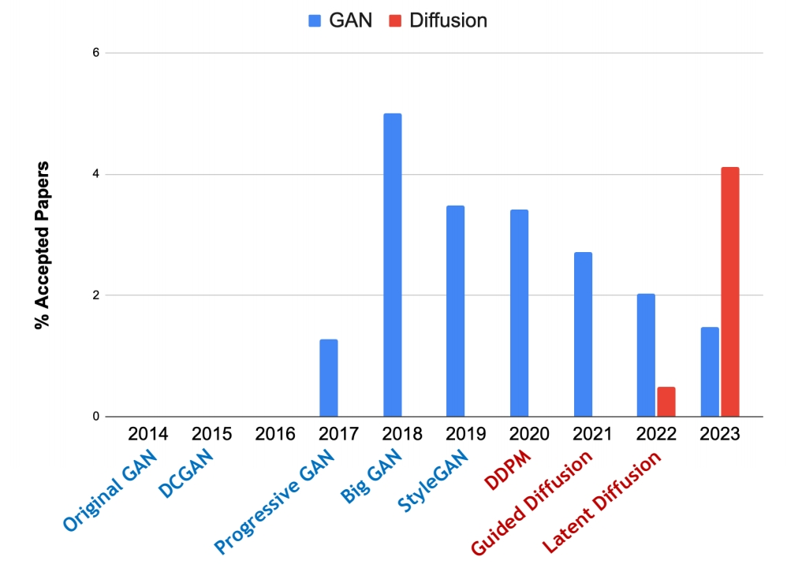
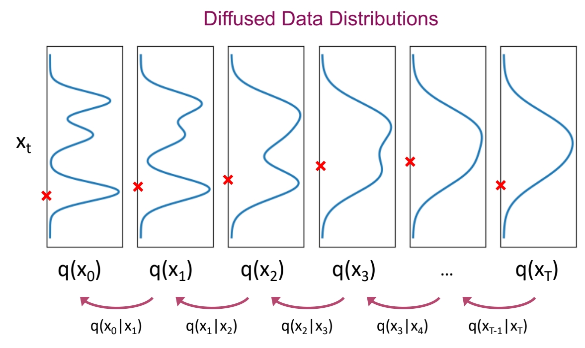
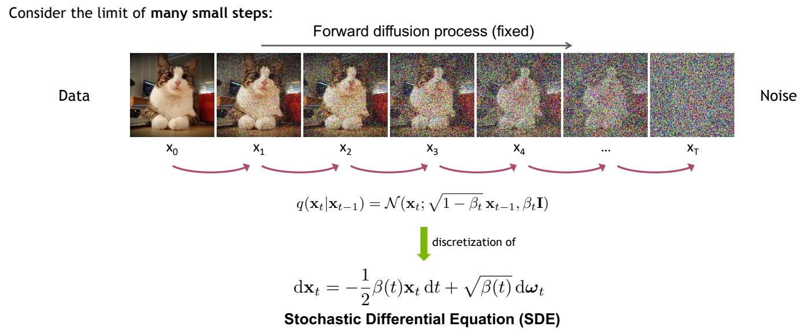

P1  

##　Denoising Diffusion Models: A Generative Learning Big Bang　　　

Jiaming Song　　　Chenlin Meng 　　　Arash Vahdat　　　

P4  

## The Landscape of Deep Generative Learning

Restricted Boltzmann Machines   
Bayesian Networks   
Variational Autoencoders    
Normalizing Flows   
Energy-based Models   
Autoregressive Models   
Denoising Diffusion Models    
Generative Adversarial Networks    

P6    
## We May Not Know Cosmology, But We Know CVPR 
 
 

*Disclaimer: We rely on paper titles for counting the number of papers in each topic. Our statistics are likely to be biased.    

P7   
## Today’s Program   

 

<https://cvpr2023-tutorial-diffusion-models.github.io/>  

P12  
## Part (1): Denoising Diffusion Probabilistic Models   

P13   

## Denoising Diffusion Models    
## Learning to generate by denoising   

Denoising diffusion models consist of two processes:    
 - Forward diffusion process that gradually adds noise to input   
 - Reverse denoising process that learns to generate data by denoising    

 

<u>Sohl-Dickstein et al., Deep Unsupervised Learning using Nonequilibrium Thermodynamics, ICML 2015</u>     
<u>Ho et al., Denoising Diffusion Probabilistic Models, NeurIPS 2020</u>   
<u>Song et al., Score-Based Generative Modeling through Stochastic Differential Equations, ICLR 2021</u>    

P14   
## Forward Diffusion Process

The formal definition of the forward process in T steps:    

 

P15   
## Diffusion Kernel

 

 

P16   
## What happens to a distribution in the forward diffusion?

So far, we discussed the diffusion kernel but what about \\(q(X_t)\\)?   

 

 

The diffusion kernel is Gaussian convolution.    

We can sample \\(X_t~q(X_t)\\) by first sampling and then sampling \\(X_t~q(X_t|X_0)\\) (i.e., ancestral sampling).   

P17   
## Generative Learning by Denoising   

Recall, that the diffusion parameters are designed such that 
\\(q(X_T)\approx （X_T；0,I）\\)    

 

 

Can we approximate \\(q(X_{t-1}|X_t)\\)? Yes, we can use a **Normal distribution** if \\(\beta _t\\) is small in each forward diffusion step.    

P18    
## Reverse Denoising Process

Formal definition of forward and reverse processes in T steps:    

 

P19   
## Learning Denoising Model   
## Variational upper bound   

 

P20   
## Summary   
## Training and Sample Generation

 

P21    
## Implementation Considerations   

Diffusion models often use U-Net architectures with ResNet blocks and self-attention layers to represent \\(\epsilon _\theta (X_t,t)\\).    

 

Time representation: sinusoidal positional embeddings or random Fourier features.    

Time features are fed to the residual blocks using either simple spatial addition or using adaptive group normalization layers. (see <u>Dharivwal and Nichol NeurIPS 2021</u>).    

P22  
## Outline

Part (1): Denoising Diffusion Probabilistic Models   
**Part (2): Score-based Generative Modeling with Differential Equations**   
Part (3): Accelerated Sampling   
Part (4): Conditional Generation and Guidance   

P23   
## Crash Course in Differential Equations

Ordinary Differential Equation (ODE):    
\\(\frac{d\mathbf{x} }{dt} =\mathbf{f} (\mathbf{x},t) \quad  \mathrm{or}  \quad d\mathbf{x} =\mathbf{f} (\mathbf{x} ,t)dt \\)

P24   
## Crash Course in Differential Equations

**Ordinary Differential Equation (ODE):**    

\\(\frac{d\mathbf{x} }{dt} =\mathbf{f} (\mathbf{x},t) \quad  \mathrm{or}  \quad d\mathbf{x} =\mathbf{f} (\mathbf{x} ,t)dt \\)

   

Analytical Solution:   

$$
\mathbf{x} (t)=\mathbf{x} (0)+\int_{0}^{t} \mathbf{f} (\mathbf{x} ,\tau )d\tau 
$$

Iterative Numerical Solution:    

$$
\mathbf{x} (t+\Delta t)\approx \mathbf{x} (t)+\mathbf{f} (\mathbf{x} (t),t)\Delta t
$$

**Stochastic Differential Equation (SDE):**   

 

P25   
## Crash Course in Differential Equations

 

P26   
## Forward Diffusion Process as Stochastic Differential Equation

 

<u>Song et al., “Score-Based Generative Modeling through Stochastic Differential Equations”, ICLR, 2021</u>    

P27    
## Forward Diffusion Process as Stochastic Differential Equation

 

P28   
## The Generative Reverse Stochastic Differential Equation

But what about the reverse direction, necessary for generation?    

P29  
## The Generative Reverse Stochastic Differential Equation

 

\\(\Rightarrow \\) Simulate reverse diffusion process: Data generation from random noise!    

<u>Song et al., ICLR, 2021</u>   
<u>Anderson, in Stochastic Processes and their Applications, 1982</u>    

P31   
## The Generative Reverse Stochastic Differential Equation

But how to get the score function \\(\nabla \mathbf{x} _t \log q_t(\mathbf{x} _t)\\)?   

P32   
## Score Matching

Naïve idea, learn model for the score function by direct regression?    

 

**But** \\(\nabla \mathbf{x} _t \log q_t(\mathbf{x} _t)\\) **(score of the** ***marginal diffused density*** \\(q_t(\mathbf{x} _t)\\)**) is not tractable!**   

<u>Vincent, “A Connection Between Score Matching and Denoising Autoencoders”, Neural Computation, 2011</u>    

<u>Song and Ermon, “Generative Modeling by Estimating Gradients of the Data Distribution”, NeurIPS, 2019</u>    

P33   
## Denoising Score Matching

 

Instead, diffuse individual data points \\(\mathbf{x}_0\\). Diffused \\(q_t(\mathbf{x}_t|\mathbf{x}_0)\\) ***is*** tractable!     

**Denoising Score Matching**:     

 
  
After expectations, ! s✓(xt, t) ⇡ rxt log qt(xt)

 