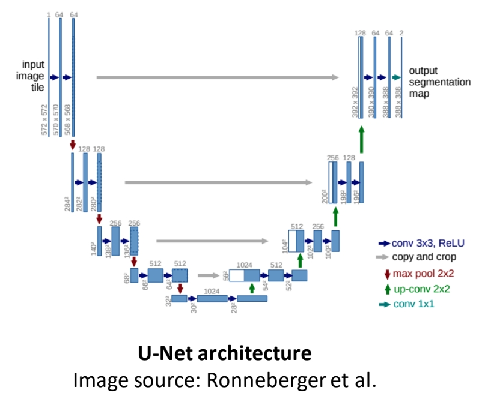
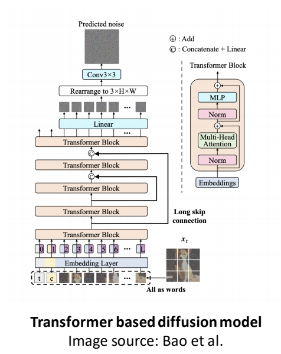
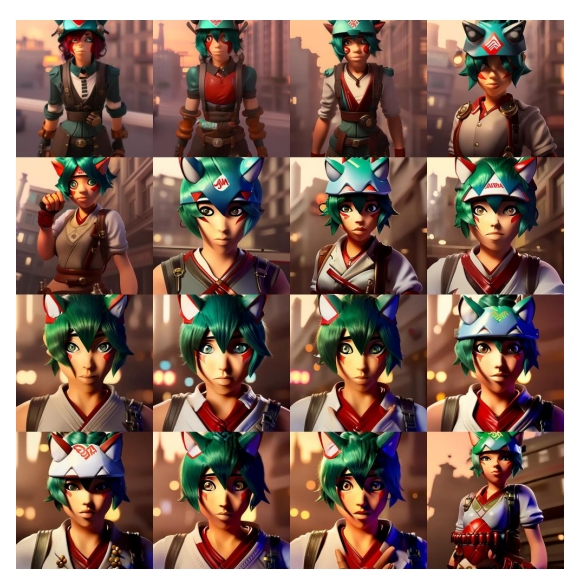
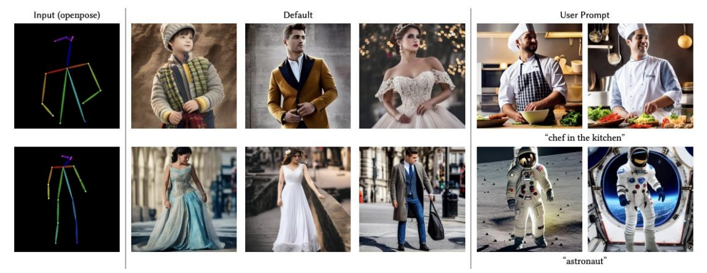

P1   
## Applications of Denoising Diffusion Models on Images

P2   
## Outline

 - **Diffusion model architectures**    
 - **Editing and customization with diffusion models**    
 - **Other applications of diffusion models**    

P4   
## Architecture

P5   
## U-Net Architecture

 

 

Ronneberger et al., <u>“U-Net: Convolutional Networks for Biomedical Image Segmentation”, </u>MICCAI 2015      
Rombach et al., <u>"High-Resolution Image Synthesis with Latent Diffusion Models",</u> CVPR 2022    

P6   
## U-Net Architecture

**Imagen** aharia et al.   
**Stable Diffusion** Rombach et al.    
**eDiff-I** Balaji et al.    
 
Saharia et al. <u>“Photorealistic text-to-image diffusion models with deep language understanding”, </u>NeurIPS 2022    
Rombach et al., <u>"High-Resolution Image Synthesis with Latent Diffusion Models", </u>CVPR 2022    
Balaji et al.,” <u>ediffi: Text-to-image diffusion models with an ensemble of expert denoisers”, </u>arXiv 2022    

P7    
## Transformer Architecture

 

 

Dosovitskiy et al., <u>“An image is worth 16x16 words: Transformers for image recognition at scale”, </u>ICLR 2021     
Bao et al.,<u> "All are Worth Words: a ViT Backbone for Score-based Diffusion Models", </u>arXiv 2022    

P8   
## Transformer Architecture

Peebles and Xie, <u>"Scalable Diffusion Models with Transformers", </u>arXiv 2022    
Bao et al., <u>"One Transformer Fits All Distributions in Multi-Modal Diffusion at Scale", </u>arXiv 2023    
Hoogeboom et al., <u>"simple diffusion: End-to-end diffusion for high resolution images", </u>arXiv 2023    

P9    
## Image editing and customization with diffusion models

P10    
## Image editing and customization with diffusion models
 - RGB pixel guidance   
 - Text guidance   
 - Reference image guidance   

P11   
## How to perform guided synthesis/editing?   

 

P12   
## SDEdit: Guided Image Synthesis and Editing with Stochastic Differential Equations   

First perturb the input with **Gaussian noise** and then progressively remove the noise using a pretrained diffusion model.    

 

**Gradually projects the input to the manifold of natural images.**

Meng et al., <u>"SDEdit: Guided Image Synthesis and Editing with Stochastic Differential Equations", </u>ICLR 2022   

P13   
## Fine-grained control using strokes

 

Meng et al., <u>"SDEdit: Guided Image Synthesis and Editing with Stochastic Differential Equations", </u>ICLR 2022    

P16   
## Image compositing  

 

Meng et al., <u>"SDEdit: Guided Image Synthesis and Editing with Stochastic Differential Equations", </u>ICLR 2022    

P17   
## Efficient Spatially Sparse Inference for Conditional GANs and Diffusion Models

 

Li et al., <u>"Efficient Spatially Sparse Inference for Conditional GANs and Diffusion Models", </u>NeurIPS 2022    

P18   
## DDIM Inversion

 

Song et al., <u>"Denoising Diffusion Implicit Models",</u> ICLR 2021    

P19   
## Style transfer with DDIM inversion

 

Su et al., <u>"Dual diffusion implicit bridges for image-to-image translation", </u>ICLR 2023    

P20   
## Style transfer with DDIM inversion

 

Su et al., <u>"Dual diffusion implicit bridges for image-to-image translation",</u> ICLR 2023    

P21    
## DiffEdit: Diffusion-based semantic image editing with mask guidance    

Instead of asking users to provide the mask, the model will generate the mask itself based on the caption and query.    

 

Couairon et al., <u>"DiffEdit: Diffusion-based semantic image editing with mask guidance", </u>ICLR 2023    

P22   
## DiffEdit: Diffusion-based semantic image editing with mask guidance    

 

Couairon et al., <u>"DiffEdit: Diffusion-based semantic image editing with mask guidance",</u> ICLR 2023   

P23   
## DiffEdit: Diffusion-based semantic image editing with mask guidance

 

Couairon et al., <u>"DiffEdit: Diffusion-based semantic image editing with mask guidance", </u>ICLR 2023    

P24   
## Imagic: Text-Based Real Image Editing with Diffusion Models   

 

Kawar et al., <u>"Imagic: Text-Based Real Image Editing with Diffusion Models",</u> CVPR 2023     

P25   
## Imagic: Text-Based Real Image Editing with Diffusion Models

     
     
   

Kawar et al., <u>"Imagic: Text-Based Real Image Editing with Diffusion Models", </u> CVPR 2023    

P26   
## Imagic: Text-Based Real Image Editing with Diffusion Models

 

Kawar et al., <u>"Imagic: Text-Based Real Image Editing with Diffusion Models", </u>CVPR 2023   

P27   
## Prompt-to-Prompt Image Editing with Cross-Attention Control

Hertz et al., <u>"Prompt-to-Prompt Image Editing with Cross-Attention Control", </u>ICLR 2023    

P28   
## Prompt-to-Prompt Image Editing with Cross￾Attention Control    

Hertz et al., <u>"Prompt-to-Prompt Image Editing with Cross-Attention Control",</u> ICLR 2023    

P29   
## Prompt-to-Prompt Image Editing with Cross-Attention Control   

Hertz et al., <u>"Prompt-to-Prompt Image Editing with Cross-Attention Control",</u> ICLR 2023     

P30   
## InstructPix2Pix: Learning to Follow Image Editing Instructions  

   

Brooks et al., <u>"Instructpix2pix: Learning to follow image editing instructions”,</u> CVPR 2023    

P31   
## InstructPix2Pix: Learning to Follow Image Editing Instructions   

    
    

Brooks et al., <u>"Instructpix2pix: Learning to follow image editing instructions”,</u> CVPR 2023    

P32   
## Personalization with diffusion models   

 

Ruiz et al., <u>"DreamBooth: Fine Tuning Text-to-Image Diffusion Models for Subject-Driven Generation",</u> CVPR 2023    

P33   
## DreamBooth: Fine Tuning Text-to-Image Diffusion Models for Subject-Driven Generation    

 

Ruiz et al., <u>"DreamBooth: Fine Tuning Text-to-Image Diffusion Models for Subject-Driven Generation",</u> CVPR 2023    

P34   
## The DreamBooth Method  

 

Ruiz et al., <u>"DreamBooth: Fine Tuning Text-to-Image Diffusion Models for Subject-Driven Generation",</u> CVPR 2023     
 
P35   
## DreamBooth Results

 

Ruiz et al., <u>"DreamBooth: Fine Tuning Text-to-Image Diffusion Models for Subject-Driven Generation",</u> CVPR 2023     

P36   
## DreamBooth Applications    

 

Ruiz et al., <u>"DreamBooth: Fine Tuning Text-to-Image Diffusion Models for Subject-Driven Generation",</u> CVPR 2023    

P37    
## Textual Inversion: Optimizing Text Embedding   

 

Gal et al., <u>"An Image is Worth One Word: Personalizing Text-to-Image Generation using Textual Inversion",</u> ICLR 2023    

P38   
## Textual Inversion: Optimizing Text Embedding  

 

Gal et al., <u>"An Image is Worth One Word: Personalizing Text-to-Image Generation using Textual Inversion",</u> ICLR 2023    

P39   
## Textual Inversion Results   

 

Gal et al., <u>"An Image is Worth One Word: Personalizing Text-to-Image Generation using Textual Inversion",</u> ICLR 2023    

P40    
## Works well for artistic styles    

 

Gal et al., <u>"An Image is Worth One Word: Personalizing Text-to-Image Generation using Textual Inversion",</u> ICLR 2023    

P41   
## Low-rank Adaptation (LoRA)   

 - Lora: Low-rank adaptation of large language models

 

Lora [Edward J. Hu\\(^\ast \\), Yelong Shen\\(^\ast \\), et al., ICLR 2022]     
Lora + Dreambooth (by Simo Ryu): <https://github.com/cloneofsimo/lora>     

P42   
## Low-rank Adaptation (LoRA)

 

Finetuned with only 9 images Visualized every 500 steps    

Lora [Edward J. Hu\\(^\ast \\), Yelong Shen\\(^\ast \\), et al., ICLR 2022]    
Lora + Dreambooth (by Simo Ryu): <https://github.com/cloneofsimo/lora>    

P43
## Fine-tuning all model weights

**Storage requirement**. 4GB storage for each fine-tuned model.    
**Compute requirement**. It requires more VRAM/training time.      
**Compositionality**. Hard to combine multiple models.    

Kumari et al., <u>"Multi-Concept Customization of Text-to-Image Diffusion",</u> CVPR 2023    

P45   
## Analyze change in weights   

 

Kumari et al., <u>"Multi-Concept Customization of Text-to-Image Diffusion",</u> CVPR 2023    

P46   
## Only fine-tune cross-attention layers

   

Kumari et al., <u>"Multi-Concept Customization of Text-to-Image Diffusion",</u> CVPR 2023    

P47   
## How to prevent overfitting?    

   

Kumari et al., <u>"Multi-Concept Customization of Text-to-Image Diffusion",</u> CVPR 2023    

P48   
## Personalized concepts   

   

How to describe personalized concepts?    

V\\(^\ast \\) dog   

Where V\\(^\ast \\) is a modifier token in the text embedding space    

Kumari et al., <u>"Multi-Concept Customization of Text-to-Image Diffusion",</u> CVPR 2023    

P49   
## Personalized concepts

Also fine-tune the modifier token V\\(^\ast \\) that describes the personalized concept   

   

P50   
## Single concept results

   

Kumari et al., <u>"Multi-Concept Customization of Text-to-Image Diffusion",</u> CVPR 2023    

P51   
## Multiple new concepts?    

   

Kumari et al., <u>"Multi-Concept Customization of Text-to-Image Diffusion",</u> CVPR 2023    

P52   
## Joint training

1. Combine the training dataset of multiple concepts    

   

Kumari et al., <u>"Multi-Concept Customization of Text-to-Image Diffusion",</u> CVPR 2023     

P53   
## Two concept results

   

Kumari et al., <u>"Multi-Concept Customization of Text-to-Image Diffusion",</u> CVPR 2023    

P54   
## Two concept results   

 

Kumari et al., <u>"Multi-Concept Customization of Text-to-Image Diffusion",</u> CVPR 2023    

P55   
## Key-Locked Rank One Editing for Text-to-Image Personalization   

    

Tewel et al., <u>"Key-Locked Rank One Editing for Text-to-Image Personalization",</u> SIGGRAPH 2023    

P56   
## T2I-Adapter: Learning Adapters to Dig out More Controllable Ability for Text-to-Image Diffusion Models

    

***√ Plug-and-play. Not affect original network topology and generation ability***   
***√ Simple and small. ~77M parameters and ~300M storage***    
***√ Flexible. Various adapters for different control conditions***    
***√ Composable.  Several adapters to achieve multi-condition control***    
***√ Generalizable. Can be directly used on customed models***    

    

Mou et al., <u>"T2I-Adapter: Learning Adapters to Dig out More Controllable Ability for Text-to-Image Diffusion Models",</u> arXiv 2023   

P57   
## T2I-Adapter: Learning Adapters to Dig out More Controllable Ability for Text-to-Image Diffusion Models    

    

Mou et al., <u>"T2I-Adapter: Learning Adapters to Dig out More Controllable Ability for Text-to-Image Diffusion Models",</u> arXiv 2023    

P58   
## Adding Conditional Control to Text-to-Image Diffusion Models (ControlNet)

 

Zhang and Agrawala, <u>"Adding Conditional Control to Text-to-Image Diffusion Models",</u> arXiv 2023    

P59   

 

P60   
## Adding Conditional Control to Text-to-Image Diffusion Models

Train objective   

$$
\mathcal{L} =\mathbb{E} _ {z_0,t,\mathbf{c} _ t,\mathbf{c} _ f,\epsilon \sim \mathcal{N} (0,1)}[||\epsilon -\epsilon _\theta (\mathbf{z} _ t,t,\mathbf{c} _ t,\mathbf{c}_f)||^2_2] 
$$

where t is the time step, \\(\mathbf{c} _t\\) is the text prompts, \\(\mathbf{c} _ f\\) is the task-specific conditions    

Zhang and Agrawala, <u>"Adding Conditional Control to Text-to-Image Diffusion Models",</u> arXiv 2023    

P63   
## ControlNet

 

Zhang and Agrawala, <u>"Adding Conditional Control to Text-to-Image Diffusion Models",</u> arXiv 2023   

P64   
## ControlNet   

 

Zhang and Agrawala, <u>"Adding Conditional Control to Text-to-Image Diffusion Models",</u> arXiv 2023    

P65   
## ControlNet

 

Zhang and Agrawala, <u>"Adding Conditional Control to Text-to-Image Diffusion Models",</u> arXiv 2023    

P66   
## GLIGEN: Open-Set Grounded Text-to-Image Generation  

 

Li et al., "GLIGEN: <u>Open-Set Grounded Text-to-Image Generation",</u> CVPR 2023   

P67  
## GLIGEN: Open-Set Grounded Text-to-Image Generation

    
    

Li et al., <u>"GLIGEN: Open-Set Grounded Text-to-Image Generation",,</u> CVPR 2023   

P68   
## GLIGEN: Open-Set Grounded Text-to-Image Generation

  

P69   
## Other applications  

P70   
## Your Diffusion Model is Secretly a Zero-Shot Classifier

  

Li et al., <u>"Your Diffusion Model is Secretly a Zero-Shot Classifier",</u> arXiv 2023   

P71  
## Better Diffusion Models Further Improve Adversarial Training   

  

Wang et al., <u>"Better Diffusion Models Further Improve Adversarial Training",</u> ICML 2023    

P74   
## Reference   

 - Bao et al., <u>"All are Worth Words: a ViT Backbone for Score-based Diffusion Models",</u> arXiv 2022   
 - Peebles and Xie, <u>"Scalable Diffusion Models with Transformers",</u> arXiv 2022   
 - Bao et al., <u>"One Transformer Fits All Distributions in Multi-Modal Diffusion at Scale",</u> arXiv 2023    
 - Jabri et al., <u>"Scalable Adaptive Computation for Iterative Generation",</u> arXiv 2022    
 - Hoogeboomet al., <u>"simple diffusion: End-to-end diffusion for high resolution images",</u> arXiv 2023   
 - Meng et al., <u>"SDEdit: Guided Image Synthesis and Editing with Stochastic Differential Equations",</u> ICLR 2022    
 - Li et al., <u>"Efficient Spatially Sparse Inference for Conditional GANs and Diffusion Models",</u> NeurIPS 2022   
 - Avrahami et al., <u>"Blended Diffusion for Text-driven Editing of Natural Images",</u> CVPR 2022   
 - Hertz et al., <u>"Prompt-to-Prompt Image Editing with Cross-Attention Control",</u> ICLR 2023   
 - Kawar et al., <u>"Imagic: Text-Based Real Image Editing with Diffusion Models",</u> CVPR 2023   
 - Couairon et al., <u>"DiffEdit: Diffusion-based semantic image editing with mask guidance",</u> ICLR 2023   
 - Sarukkai et al., <u>"Collage Diffusion",</u>  arXiv 2023   
 - Bar-Tal et al., <u>"MultiDiffusion: Fusing Diffusion Paths for Controlled Image Generation",</u>  ICML 2023   
 - Gal et al., <u>"An Image is Worth One Word: Personalizing Text-to-Image Generation using Textual Inversion",</u> ICLR 2023     
 - Ruiz et al., <u>"DreamBooth: Fine Tuning Text-to-Image Diffusion Models for Subject-Driven Generation",</u> CVPR 2023    
 - Kumari et al., <u>"Multi-Concept Customization of Text-to-Image Diffusion",</u>  CVPR 2023   
 - Tewel et al., <u>"Key-Locked Rank One Editing for Text-to-Image Personalization",</u>  SIGGRAPH 2023   
 - Zhao et al., <u>"A Recipe for Watermarking Diffusion Models",</u>  arXiv 2023   
 - Hu et al., <u>"LoRA: Low-Rank Adaptation of Large Language Models",</u> ICLR 2022   
 - Li et al., <u>"GLIGEN: Open-Set Grounded Text-to-Image Generation",</u> CVPR 2023   
 - Avrahami et al., <u>"SpaText: Spatio-Textual Representation for Controllable Image Generation",</u> CVPR 2023   
 - Zhang and Agrawala, <u>"Adding Conditional Control to Text-to-Image Diffusion Models",</u> arXiv 2023    
 - Mou et al., <u>"T2I-Adapter: Learning Adapters to Dig out More Controllable Ability for Text-to-Image Diffusion Models",</u> arXiv 2023   
 - Orgad et al., <u>"Editing Implicit Assumptions in Text-to-Image Diffusion Models",</u> arXiv 2023   
 - Han et al., <u>"SVDiff: Compact Parameter Space for Diffusion Fine-Tuning",</u> arXiv 2023   
 - Xie et al., <u>"DiffFit: Unlocking Transferability of Large Diffusion Models via Simple Parameter￾Efficient Fine-Tuning",</u> rXiv 2023   
 - Saharia et al., <u>"Palette: Image-to-Image Diffusion Models",</u> SIGGRAPH 2022   
 - Whang et al., <u>"Deblurring via Stochastic Refinement",</u> CVPR 2022   
 - Xu et al., <u>"Open-Vocabulary Panoptic Segmentation with Text-to-Image Diffusion Models",</u> arXiv 2023   
 - Saxena et al., <u>"Monocular Depth Estimation using Diffusion Models",</u> arXiv 2023   
 - Li et al., <u>"Your Diffusion Model is Secretly a Zero-Shot Classifier",</u> arXiv 2023  
 - Gowal et al., <u>"Improving Robustness using Generated Data",</u> NeurIPS 2021   
 - Wang et al., <u>"Better Diffusion Models Further Improve Adversarial Training",</u> ICML 2023  

---------------------------------------
> 本文出自CaterpillarStudyGroup，转载请注明出处。
>
> https://caterpillarstudygroup.github.io/ImportantArticles/
