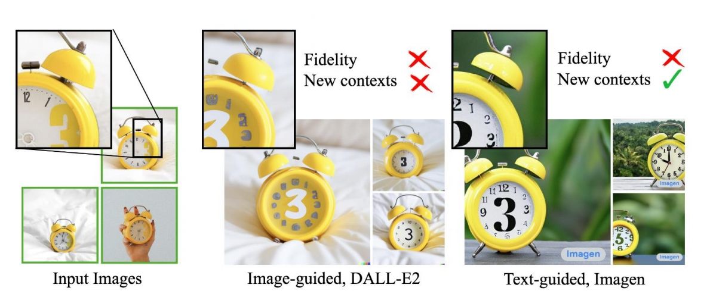
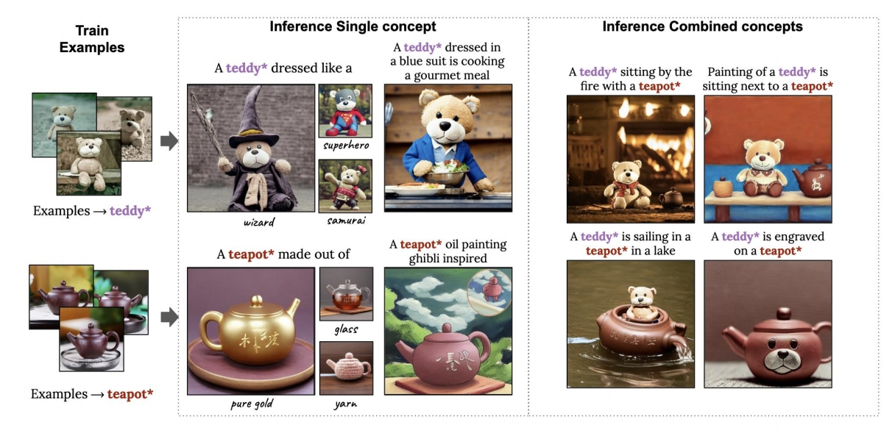
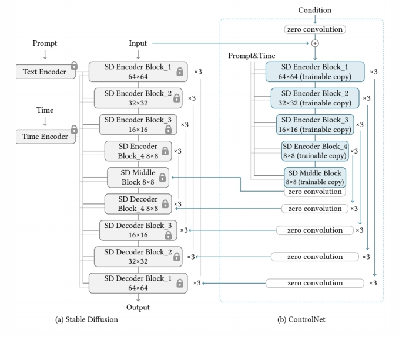
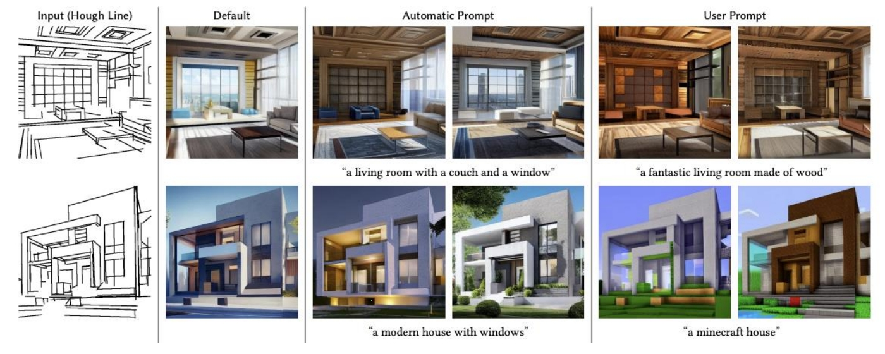
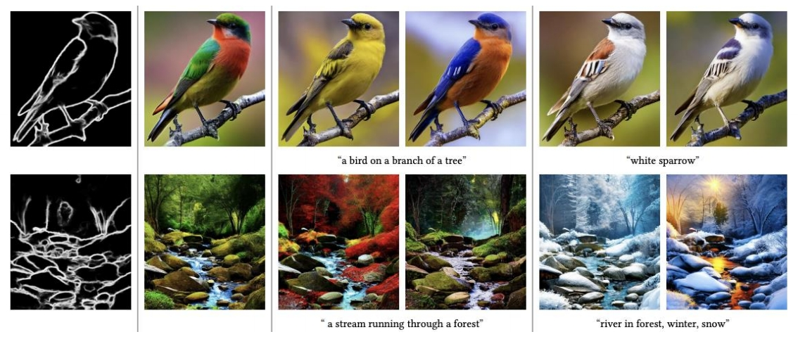

P2   
## Outline

 - **Diffusion model architectures**    
 - **Editing and customization with diffusion models**    
 - **Other applications of diffusion models**    

# Diffusion model architectures
P4   
## Architecture

P5   
### U-Net Based Diffusion Architecture

#### U-Net Architecture

 

> &#x2705; U-Net的是Large Scale Image Diffusion Model中最常用的backbone。  

> &#x1F50E; Ronneberger et al., <u>“U-Net: Convolutional Networks for Biomedical Image Segmentation”, </u>MICCAI 2015    

#### Pipeline 

 

> &#x2705; 包含Input、U-Net backbone、Condition。  
> &#x2705; Condition 通常用 Concat 或 Cross attention 的方式与 Content 相结合。    

> &#x1F50E; Rombach et al., <u>"High-Resolution Image Synthesis with Latent Diffusion Models",</u> CVPR 2022    

U-Net Based Diffusion Architecture

P6   
#### Application

**Imagen** Saharia et al.   

Saharia et al. <u>“Photorealistic text-to-image diffusion models with deep language understanding”, </u>NeurIPS 2022    

**Stable Diffusion** Rombach et al.    

Rombach et al., <u>"High-Resolution Image Synthesis with Latent Diffusion Models", </u>CVPR 2022    

**eDiff-I** Balaji et al.    

Balaji et al.,” <u>ediffi: Text-to-image diffusion models with an ensemble of expert denoisers”, </u>arXiv 2022    

P7    
### Transformer Architecture

#### Vision Transformer(ViT)

 

Dosovitskiy et al., <u>“An image is worth 16x16 words: Transformers for image recognition at scale”, </u>ICLR 2021    

#### Pipeline

 

> &#x2705; 特点：  
> &#x2705; 1. 把 image patches 当作 token.    
> &#x2705; 2. 在 Shallow layer 与 deep layer 之间引入 long skip connection.    

Bao et al.,<u> "All are Worth Words: a ViT Backbone for Score-based Diffusion Models", </u>arXiv 2022    

P8   
#### Application

Peebles and Xie, <u>"Scalable Diffusion Models with Transformers", </u>arXiv 2022    
Bao et al., <u>"One Transformer Fits All Distributions in Multi-Modal Diffusion at Scale", </u>arXiv 2023    
Hoogeboom et al., <u>"simple diffusion: End-to-end diffusion for high resolution images", </u>arXiv 2023    

P9    
# Image editing and customization with diffusion models

P10    
## RGB pixel guidance   

### SDEdit

Meng et al., <u>"SDEdit: Guided Image Synthesis and Editing with Stochastic Differential Equations", </u>ICLR 2022 

#### guided synthesis／editing Task   

 

> &#x2705; 过去的 guided synthesis／editing 任务是用 GAN based 方法实现的。    

P12   
#### Pipeline

 

**Gradually projects the input to the manifold of natural images.**

> 准备工作：一个预训练好的Image Diffusion Model  
> 第一步：perturb the input with **Gaussian noise**  
> 第二步：progressively remove the noise using a pretrained diffusion model.    
> [?] 怎样保证Denoise的图像与原始图像有高度的一致性？

#### 特点

> 只需要一个预训练模型，不需要额外的finetune。  

P13   
#### 其它应用场景

##### Fine-grained control using strokes

 

> 可以在Image上加上草图，也可以直接使用草图生成图像  

P16   
##### Image compositing  

 

> 把上面图的指定pixel patches应用到下面图上。  
> SDEdit的结果更合理且与原图更像。  

P17   
#### 效率提升

Efficient Spatially Sparse Inference for Conditional GANs and Diffusion Models

 

原理：全图生成速度比较慢，因此针对被编辑区域进行部分生成。  

Li et al., <u>"Efficient Spatially Sparse Inference for Conditional GANs and Diffusion Models", </u>NeurIPS 2022    

P18   

### Style Transfer with DDIM inversion

#### Recap DDIM Inversion

 

Song et al., <u>"Denoising Diffusion Implicit Models",</u> ICLR 2021    

> &#x2705; DDIM 方法中，从 noise 到图像的映射关系是确定的。同样也可以让图像与 noise 的关系是确定的。这个过程称为 DDIM Inversion.    
> &#x2705; DDIM Inversion 是图像编辑的常用方法。     

P19   
#### Pipeline

 

Su et al., <u>"Dual diffusion implicit bridges for image-to-image translation", </u>ICLR 2023    

> &#x2705; 假设已有一个 文生图的pretrained DDIM model．    
> &#x2705; 任务：把老虎的图像变成猫的图像，且不改变 Sryle.     
> &#x2705; (1) 老虎图像 ＋ DDIM Inversion ＋ “老虎”标签  → noise      
> &#x2705; (2) noise ＋ DDIM ＋ “猫”标签 → 猫图像        
> &#x2705; 优点：不需要重训。     

P20   
#### 效果

 

Su et al., <u>"Dual diffusion implicit bridges for image-to-image translation",</u> ICLR 2023    

> &#x2705; 学习不同颜色空间的 transform    

P21    
### DiffEdit: Diffusion-based semantic image editing with mask guidance    

Couairon et al., <u>"DiffEdit: Diffusion-based semantic image editing with mask guidance", </u>ICLR 2023    

#### 任务目标

> SDEdit要求用户对想更新的区域打MASK。  

Instead of asking users to provide the mask, the model will generate the mask itself based on the caption and query.    

 

> &#x2705; 作者认为让用户打 MASK 比较麻烦，因此生成 MASK    

P22   
#### Pipeline

  

> &#x2705; (1) 原始图像加噪。      
> &#x2705; (2) 基于两个文本做去噪，生成 MASK.     
> &#x2705; Step 2: DDIM Inversion      
> &#x2753; Step 1：如何训练？有 pair data 吗？    
> &#x2705; Step2：DDIM Encoder 加噪    
> &#x2705; DDIM Decoder condition MASK    

P23   
## DiffEdit: Diffusion-based semantic image editing with mask guidance

 

Couairon et al., <u>"DiffEdit: Diffusion-based semantic image editing with mask guidance", </u>ICLR 2023     

P24   
## Imagic: Text-Based Real Image Editing with Diffusion Models   

 

Kawar et al., <u>"Imagic: Text-Based Real Image Editing with Diffusion Models",</u> CVPR 2023     

> &#x2705; 修改内容，但对不相关部分保留。    

P25   
## Imagic: Text-Based Real Image Editing with Diffusion Models

     
     
   

Kawar et al., <u>"Imagic: Text-Based Real Image Editing with Diffusion Models", </u> CVPR 2023    

> &#x2705; (1) 对 target text 作 embedding (2) 用 text embedding 重建 Input Image，这一步会 finelue teat embedding.    
> &#x2705; (1) finetue Diffusion Model 基于 stes A 中的 text embedding，目的没听懂。    
> &#x2705; (1) eopt 来自 Step A   (2) Diffusion Process 来自 Step B．     
> &#x2705; \\(e_{tgt}\\) 来自 step A 第1步   

P26   
## Imagic: Text-Based Real Image Editing with Diffusion Models

 

Kawar et al., <u>"Imagic: Text-Based Real Image Editing with Diffusion Models", </u>CVPR 2023   

P27   
## Prompt-to-Prompt Image Editing with Cross-Attention Control

Hertz et al., <u>"Prompt-to-Prompt Image Editing with Cross-Attention Control", </u>ICLR 2023    

> &#x2705; 基于标题的图像编辑 (1) 修改某个单词的影响力；(2) 替换单词；(3) 添加单词；     

P28   
## Prompt-to-Prompt Image Editing with Cross-Attention Control    

Hertz et al., <u>"Prompt-to-Prompt Image Editing with Cross-Attention Control",</u> ICLR 2023    

> &#x2705; 控制 attention maps，在编辑图像过程中把原始图像的 attention map 注入到 diffusion 过程中。    

P29   
## Prompt-to-Prompt Image Editing with Cross-Attention Control   

Hertz et al., <u>"Prompt-to-Prompt Image Editing with Cross-Attention Control",</u> ICLR 2023     

P30   
## InstructPix2Pix: Learning to Follow Image Editing Instructions  

   

Brooks et al., <u>"Instructpix2pix: Learning to follow image editing instructions”,</u> CVPR 2023    

> &#x2705; 优势：只修改推断过程，不需针对图像做 finetune.    

P31   
## InstructPix2Pix: Learning to Follow Image Editing Instructions   

    
    

Brooks et al., <u>"Instructpix2pix: Learning to follow image editing instructions”,</u> CVPR 2023    

> &#x2705; 只是文本引导方式做了改变，哪里体现 pix 2 呢？     

P32   
## Personalization with diffusion models   

 

Ruiz et al., <u>"DreamBooth: Fine Tuning Text-to-Image Diffusion Models for Subject-Driven Generation",</u> CVPR 2023    

> &#x2705; 基于目标的多张 reference，输入文本，生成包含目标的图像。   

P33   
## DreamBooth: Fine Tuning Text-to-Image Diffusion Models for Subject-Driven Generation    

 

Ruiz et al., <u>"DreamBooth: Fine Tuning Text-to-Image Diffusion Models for Subject-Driven Generation",</u> CVPR 2023    

P34   
## The DreamBooth Method  

 

Ruiz et al., <u>"DreamBooth: Fine Tuning Text-to-Image Diffusion Models for Subject-Driven Generation",</u> CVPR 2023     
 
> &#x2705; 使用 reference image 微调 model，
> &#x2705; 目的：对输入图像做 encode，
> &#x2705; 方法：构造 pairdata，(包含特定 identifier 的文本，图像)    
> &#x2705; 目的：多样性。   
> &#x2705; 方法：用不含 identifer 的图像和文本调练，构造重建 loss 和对抗 loss.    

P35   
## DreamBooth Results

 

Ruiz et al., <u>"DreamBooth: Fine Tuning Text-to-Image Diffusion Models for Subject-Driven Generation",</u> CVPR 2023     

P36   
## DreamBooth Applications    

 

Ruiz et al., <u>"DreamBooth: Fine Tuning Text-to-Image Diffusion Models for Subject-Driven Generation",</u> CVPR 2023    

P37    
## Textual Inversion: Optimizing Text Embedding   

 

Gal et al., <u>"An Image is Worth One Word: Personalizing Text-to-Image Generation using Textual Inversion",</u> ICLR 2023    

> &#x2705; 可以把内容、风格、动作等编辑为 \\(S_ {\ast }\\)     
> &#x2705; 用一个 word 来 Encode 源，称为 Textual Inversion.    

P38   
## Textual Inversion: Optimizing Text Embedding  

 

Gal et al., <u>"An Image is Worth One Word: Personalizing Text-to-Image Generation using Textual Inversion",</u> ICLR 2023   

> &#x2705; 输入带 holder world 的 String，(1) 转为 token (2) token 转为“连续的表示”，即 embedding. (3) embedding 转为 conditional code，用于引导生成模型。    
> &#x2705; 通过重建来优化 embedding.    

P39   
## Textual Inversion Results   

 

Gal et al., <u>"An Image is Worth One Word: Personalizing Text-to-Image Generation using Textual Inversion",</u> ICLR 2023    

P40    
## Works well for artistic styles    

 

Gal et al., <u>"An Image is Worth One Word: Personalizing Text-to-Image Generation using Textual Inversion",</u> ICLR 2023    

P41   
## Low-rank Adaptation (LoRA)   

 - Lora: Low-rank adaptation of large language models

 

Lora [Edward J. Hu\\(^\ast \\), Yelong Shen\\(^\ast \\), et al., ICLR 2022]     
Lora + Dreambooth (by Simo Ryu): <https://github.com/cloneofsimo/lora>     

> &#x2705; 要解决的问题：finetune 所需的训练时间、参数存储，Computation 的成本很高。    
> &#x2705; 用 low rank 来优化 residual model 而不是 entire model.    
> &#x2705; 极大提升 fineture 的速度。    

P42   
## Low-rank Adaptation (LoRA)

 

**Finetuned with only 9 images Visualized every 500 steps**    

Lora [Edward J. Hu\\(^\ast \\), Yelong Shen\\(^\ast \\), et al., ICLR 2022]    
Lora + Dreambooth (by Simo Ryu): <https://github.com/cloneofsimo/lora>    

P43
## Fine-tuning all model weights

**Storage requirement**. 4GB storage for each fine-tuned model.    
**Compute requirement**. It requires more VRAM/training time.      
**Compositionality**. Hard to combine multiple models.    

Kumari et al., <u>"Multi-Concept Customization of Text-to-Image Diffusion",</u> CVPR 2023    

> &#x2705; 用极少的图 finetune entire model too long 极容易发生过拟合。   

P45   
## Analyze change in weights   

 

Kumari et al., <u>"Multi-Concept Customization of Text-to-Image Diffusion",</u> CVPR 2023    

> &#x2705; insights 应该 finetune 哪些参数，分析模型各参数的重要性。   
> &#x2705; Cross-Attn 层用于结合图像和文本的特征。     
> &#x2705; Self-Attn 用于图像内部。    
> &#x2705; Other 主要是卷积和 Normalization.    
> &#x2705; 通过比较 pretrained 模型和 finetune 模型，change 主要发生成Cross-Attn 层，说明 Cross-Attn 层在 finetune 过程中更重要！    
> &#x2753; 选择模型的部分参数进行 finetune．问题是怎么选择？    

P46   
## Only fine-tune cross-attention layers

   

Kumari et al., <u>"Multi-Concept Customization of Text-to-Image Diffusion",</u> CVPR 2023    

> &#x2705; 由以上观察结果，finetune 时只更新 \\(K\\) 和 \\(V\\) 的参数。    

P47   
## How to prevent overfitting?    

   

Kumari et al., <u>"Multi-Concept Customization of Text-to-Image Diffusion",</u> CVPR 2023    

> &#x2705; (1) 计算“标题相似度”。    
> &#x2705; 通过引入一个正则化项来防止过拟合（1）从 caption Image model 中生成正则化图像，即输入与训练数据相似的文本做为 caption 生成 Image.    

P48   
## Personalized concepts   

   

How to describe personalized concepts?    

V\\(^\ast \\) **dog**   

Where V\\(^\ast \\) is a modifier token in the text embedding space    

Kumari et al., <u>"Multi-Concept Customization of Text-to-Image Diffusion",</u> CVPR 2023    

> &#x2705; 目的：finetune SD 得到这只狗的文生图模型。但只有少量的关于这只狗的数据定义 \\(V^ \ast \\) 为 modifier token，并把它作为一个新的 token.    

P49   
## Personalized concepts

Also fine-tune the modifier token V\\(^\ast \\) that describes the personalized concept   

   

> &#x2705; 把 \\(V^ \ast \\) 代入 caption，并用这只狗的数据做 finetune。并同样只更新 \\(K\\) 和\\(V\\).    

P50   
## Single concept results

   

Kumari et al., <u>"Multi-Concept Customization of Text-to-Image Diffusion",</u> CVPR 2023    

P51   
## Multiple new concepts?    

   

Kumari et al., <u>"Multi-Concept Customization of Text-to-Image Diffusion",</u> CVPR 2023    

P52   
## Joint training

1. Combine the training dataset of multiple concepts    

   

Kumari et al., <u>"Multi-Concept Customization of Text-to-Image Diffusion",</u> CVPR 2023     

> &#x2705; 同时使用两个小样本数据 finetune，且使用 modifier token 和正则化图像，可以得到二者结合的效果。    

P53   
## Two concept results

   

Kumari et al., <u>"Multi-Concept Customization of Text-to-Image Diffusion",</u> CVPR 2023    

> &#x2705; 也可以同时引入2个 modifier token．    

P54   
## Two concept results   

 

Kumari et al., <u>"Multi-Concept Customization of Text-to-Image Diffusion",</u> CVPR 2023    

P55   
## Key-Locked Rank One Editing for Text-to-Image Personalization   

    

Tewel et al., <u>"Key-Locked Rank One Editing for Text-to-Image Personalization",</u> SIGGRAPH 2023    

> &#x2753;  Perffusion？这个词从哪来的？    
> &#x2705; 方法：dynamic random update.     
> &#x2705; Perffusion 可以解决 Image Personalization 的 overfitting 问题 (1) Introducing new \\(\times \times \times \times \\) that lost the new concepts cross-attention keys to disordinate category.    
> &#x2705; (2) 引入 a gate random approach 可用于控制 the learned concept —— 推断时。    
> &#x2705; (3) 允许 medel 把不同的 concept 结合到一起，并学到不同concept 之间的联系。    

P56   
## T2I-Adapter: Learning Adapters to Dig out More Controllable Ability for Text-to-Image Diffusion Models

    

***√ Plug-and-play. Not affect original network topology and generation ability***   
***√ Simple and small. ~77M parameters and ~300M storage***    
***√ Flexible. Various adapters for different control conditions***    
***√ Composable.  Several adapters to achieve multi-condition control***    
***√ Generalizable. Can be directly used on customed models***    

    

Mou et al., <u>"T2I-Adapter: Learning Adapters to Dig out More Controllable Ability for Text-to-Image Diffusion Models",</u> arXiv 2023   

> &#x2705; 引入一个简单的模型称为 Adapter，用于引导 Image Diffusion Model.    
> &#x2705; Adapter 包含多次降采样，对应于 UNET 的不同 Level.    
> &#x2705; 优点：简单、易训、易使用。    
> &#x2705; Adapter 包含4个 feature extraction blocks 和3个 down sample blocks.   

P57   
## T2I-Adapter: Learning Adapters to Dig out More Controllable Ability for Text-to-Image Diffusion Models    

    

Mou et al., <u>"T2I-Adapter: Learning Adapters to Dig out More Controllable Ability for Text-to-Image Diffusion Models",</u> arXiv 2023    

> &#x2705; Adapter 可以使用于多种形式的 Control．     

P58   
## Adding Conditional Control to Text-to-Image Diffusion Models (ControlNet)

 

Zhang and Agrawala, <u>"Adding Conditional Control to Text-to-Image Diffusion Models",</u> arXiv 2023    

> &#x2705; Control Net 是一种通过引入额外条件来控制 Diffusion Model 的网络架构。    
> &#x2705; (a) 是预训练的 diffusion model.    
> &#x2705; 把 (a) 的网络复制一份，finetune copy 的网络，结果叠加。C 是condition.    
> &#x2705; Zero Convolution：1-1 卷积层，初始的 \\(w\\) 和 \\(b\\) 都为 0．   

P59   

   

Zhang and Agrawala, <u>"Adding Conditional Control to Text-to-Image Diffusion Models",</u> arXiv 2023    

> &#x2705; Contrd Net 应用到 Stable Diffusion 的例子。   

P60   
## Adding Conditional Control to Text-to-Image Diffusion Models

Train objective   

$$
\mathcal{L} =\mathbb{E} _ {\mathbb{z}_0,t,\mathbf{c} _ t,\mathbf{c} _ f,\epsilon \sim \mathcal{N} (0,1)}[||\epsilon -\epsilon _\theta (\mathbf{z} _ t,t,\mathbf{c} _ t,\mathbf{c}_f)||^2_2] 
$$

where t is the time step, \\(\mathbf{c} _t\\) is the text prompts, \\(\mathbf{c} _ f\\) is the task-specific conditions    

Zhang and Agrawala, <u>"Adding Conditional Control to Text-to-Image Diffusion Models",</u> arXiv 2023    

P61    
## ControlNet

 

Zhang and Agrawala, <u>"Adding Conditional Control to Text-to-Image Diffusion Models",</u> arXiv 2023    

P62   
## ControlNet  

 

Zhang and Agrawala, <u>"Adding Conditional Control to Text-to-Image Diffusion Models",</u> arXiv 2023    

P63   
## ControlNet

 

Zhang and Agrawala, <u>"Adding Conditional Control to Text-to-Image Diffusion Models",</u> arXiv 2023   

P64   
## GLIGEN: Open-Set Grounded Text-to-Image Generation    

 

Li et al., <u>"GLIGEN: Open-Set Grounded Text-to-Image Generation",</u> CVPR 2023        

> &#x2705; GLIGEN 是另一种网络架构。    

P65   

## GLIGEN: Open-Set Grounded Text-to-Image Generation

    
    

Li et al., <u>"GLIGEN: Open-Set Grounded Text-to-Image Generation",,</u> CVPR 2023   

> &#x2705; 新增 Gated Self-Attention 层，加在 Attention 和 Cross Attention 之间。     
> &#x2705; GLIGEN 与 Control NET 的区别：GLIGEN 把 Condition 和 init feature 作 Concat，而 Control Net 分别处理 feature 和 Control 并把结果叠加。    

P66   
## GLIGEN: Open-Set Grounded Text-to-Image Generation

  

P67   
## Other applications  

P68   
## Your Diffusion Model is Secretly a Zero-Shot Classifier

  

Li et al., <u>"Your Diffusion Model is Secretly a Zero-Shot Classifier",</u> arXiv 2023   

> &#x2705; diffusion model 不经过额外的训练就能完成 Zero-shot 的分类任务。    
> &#x2705; 一个预训练好的 stable diffusion model，无须额外训练可以用作分类器    
> &#x2705; 输入图像\\(x\\)，用随机噪声\\(\varepsilon \\)加噪；再用 condition c 预测噪声 \\(\varepsilon _\theta \\)。优化条件 C 使得 \\(\varepsilon _\theta \\) 最接近 \\(\varepsilon\\). 得到的 C 就是分类。    

P69   
## Improving Robustness using Generated Data

  

**Overview of the approach:**     
1. train a generative model and a non￾robust classifier, which are used to provide pseudo-labels to the generated data.    
2. The generated and original training data are combined to train a robust classifier.    

Gowal et al., <u>"Improving Robustness using Generated Data",</u> NeurIPS 2021    

> &#x2705; 使用 diffusion Model 做数据增强。    

P70  
## Better Diffusion Models Further Improve Adversarial Training   

  

Wang et al., <u>"Better Diffusion Models Further Improve Adversarial Training",</u> ICML 2023    

P72   
## Reference   

 - Bao et al., <u>"All are Worth Words: a ViT Backbone for Score-based Diffusion Models",</u> arXiv 2022   
 - Peebles and Xie, <u>"Scalable Diffusion Models with Transformers",</u> arXiv 2022   
 - Bao et al., <u>"One Transformer Fits All Distributions in Multi-Modal Diffusion at Scale",</u> arXiv 2023    
 - Jabri et al., <u>"Scalable Adaptive Computation for Iterative Generation",</u> arXiv 2022    
 - Hoogeboomet al., <u>"simple diffusion: End-to-end diffusion for high resolution images",</u> arXiv 2023   
 - Meng et al., <u>"SDEdit: Guided Image Synthesis and Editing with Stochastic Differential Equations",</u> ICLR 2022    
 - Li et al., <u>"Efficient Spatially Sparse Inference for Conditional GANs and Diffusion Models",</u> NeurIPS 2022   
 - Avrahami et al., <u>"Blended Diffusion for Text-driven Editing of Natural Images",</u> CVPR 2022   
 - Hertz et al., <u>"Prompt-to-Prompt Image Editing with Cross-Attention Control",</u> ICLR 2023   
 - Kawar et al., <u>"Imagic: Text-Based Real Image Editing with Diffusion Models",</u> CVPR 2023   
 - Couairon et al., <u>"DiffEdit: Diffusion-based semantic image editing with mask guidance",</u> ICLR 2023   
 - Sarukkai et al., <u>"Collage Diffusion",</u>  arXiv 2023   
 - Bar-Tal et al., <u>"MultiDiffusion: Fusing Diffusion Paths for Controlled Image Generation",</u>  ICML 2023   
 - Gal et al., <u>"An Image is Worth One Word: Personalizing Text-to-Image Generation using Textual Inversion",</u> ICLR 2023     
 - Ruiz et al., <u>"DreamBooth: Fine Tuning Text-to-Image Diffusion Models for Subject-Driven Generation",</u> CVPR 2023    
 - Kumari et al., <u>"Multi-Concept Customization of Text-to-Image Diffusion",</u>  CVPR 2023   
 - Tewel et al., <u>"Key-Locked Rank One Editing for Text-to-Image Personalization",</u>  SIGGRAPH 2023   
 - Zhao et al., <u>"A Recipe for Watermarking Diffusion Models",</u>  arXiv 2023   
 - Hu et al., <u>"LoRA: Low-Rank Adaptation of Large Language Models",</u> ICLR 2022   
 - Li et al., <u>"GLIGEN: Open-Set Grounded Text-to-Image Generation",</u> CVPR 2023   
 - Avrahami et al., <u>"SpaText: Spatio-Textual Representation for Controllable Image Generation",</u> CVPR 2023   
 - Zhang and Agrawala, <u>"Adding Conditional Control to Text-to-Image Diffusion Models",</u> arXiv 2023    
 - Mou et al., <u>"T2I-Adapter: Learning Adapters to Dig out More Controllable Ability for Text-to-Image Diffusion Models",</u> arXiv 2023   
 - Orgad et al., <u>"Editing Implicit Assumptions in Text-to-Image Diffusion Models",</u> arXiv 2023   
 - Han et al., <u>"SVDiff: Compact Parameter Space for Diffusion Fine-Tuning",</u> arXiv 2023   
 - Xie et al., <u>"DiffFit: Unlocking Transferability of Large Diffusion Models via Simple Parameter￾Efficient Fine-Tuning",</u> rXiv 2023   
 - Saharia et al., <u>"Palette: Image-to-Image Diffusion Models",</u> SIGGRAPH 2022   
 - Whang et al., <u>"Deblurring via Stochastic Refinement",</u> CVPR 2022   
 - Xu et al., <u>"Open-Vocabulary Panoptic Segmentation with Text-to-Image Diffusion Models",</u> arXiv 2023   
 - Saxena et al., <u>"Monocular Depth Estimation using Diffusion Models",</u> arXiv 2023   
 - Li et al., <u>"Your Diffusion Model is Secretly a Zero-Shot Classifier",</u> arXiv 2023  
 - Gowal et al., <u>"Improving Robustness using Generated Data",</u> NeurIPS 2021   
 - Wang et al., <u>"Better Diffusion Models Further Improve Adversarial Training",</u> ICML 2023  

---------------------------------------
> 本文出自CaterpillarStudyGroup，转载请注明出处。
>
> https://caterpillarstudygroup.github.io/ImportantArticles/
