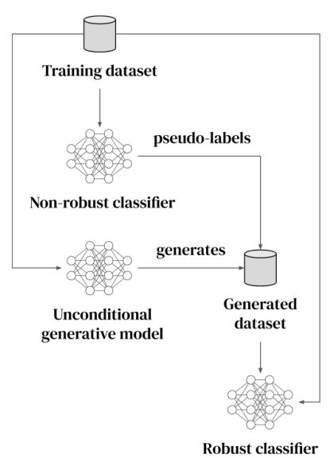

P9    
# 图像编辑

P10    
## Gaussian Noise方法

|ID|Year|Name|Note|Tags|Link|
|---|---|---|---|---|---|
||2022|SDEdit: Guided Image Synthesis and Editing with Stochastic Differential Equations||[link](https://caterpillarstudygroup.github.io/ReadPapers/23.html)|

## DDIM Inversion方法

|ID|Year|Name|Note|Tags|Link|
|---|---|---|---|---|---|
|23|2023|Dual diffusion implicit bridges for image-to-image translation||[link](https://caterpillarstudygroup.github.io/ReadPapers/23.html)|
|24|2023|DiffEdit: Diffusion-based semantic image editing with mask guidance||[link](https://caterpillarstudygroup.github.io/ReadPapers/24.html)|
|25|2023|Imagic: Text-Based Real Image Editing with Diffusion Models||[link](https://caterpillarstudygroup.github.io/ReadPapers/25.html)|

## Attention based 方法

|ID|Year|Name|Note|Tags|Link|
|---|---|---|---|---|---|
||2023|Prompt-to-Prompt Image Editing with Cross-Attention Control|通过控制生成过程中的 attention maps进行图像编辑|attention控制|[link](https://caterpillarstudygroup.github.io/ReadPapers/20.html)|
||2023|NULL-text Inversion for Editing Real Images Using Guided Diffusion Models|针对真实图像（非生成图像）的编辑，以[CFG](https://caterpillarstudygroup.github.io/ReadPapers/6.html)为基础，fix condition分支，优化无condition分支，使其embedding向condition分支的embedding靠近|attention控制|
|||Plug-and-Play Diffusion Features for Text-Driven Image-to-Image Translation|在上一篇的基础上，通过attention注入的方式加速上述流程|attention控制|
||2023|InstructPix2Pix: Learning to Follow Image Editing Instructions|在上一篇的基础上，通过attention注入的方式加速上述流程|attention控制|

P32   
# 特定对象定制化的图像生成   

|ID|Year|Name|Note|Tags|Link|
|---|---|---|---|---|---|
|52|2024|Mix-of-Show: Decentralized Low-Rank Adaptation for Multi-Concept Customization of Diffusion Models|多个特定对象的图像生成，让多个特定的对象生成到一张图像中，并用2D pose控制对象的动作|TI, LoRA|[link](https://caterpillarstudygroup.github.io/ReadPapers/51.html)|
|62|2023|Ruiz et al., “DreamBooth: Fine Tuning Text-to-Image Diffusion Models for Subject-Driven Generation,” ||| [link](https://caterpillarstudygroup.github.io/ReadPapers/62.html)|
|63|2023|Gal et al., <u>"An Image is Worth One Word: Personalizing Text-to-Image Generation using Textual Inversion"|||   [link](https://caterpillarstudygroup.github.io/ReadPapers/63.html)|
|**38**|2021|Lora: Low-rank adaptation of large language models|对已训好的大模型进行微调，生成想要的风格。学习其中的残差。残差通常可以用low rank Matrix来拟合，因此称为low-rank adaptation。low rank的好处是要训练或调整的参数非常少。||[link](https://caterpillarstudygroup.github.io/ReadPapers/38.html)|
|||Lora + Dreambooth (by Simo Ryu)||| <https://github.com/cloneofsimo/lora> |
||2023|Mix-of-Show: Decentralized Low-Rank Adaptation for Multi-Concept Customization of Diffusion Models|将多个LoRA融合到一个模型时，解决LoRA之间的冲突问题。|

P43
# 多个特定对象定制化的图像生成   

|ID|Year|Name|Note|Tags|Link|
|---|---|---|---|---|---|
|52|2024|Mix-of-Show: Decentralized Low-Rank Adaptation for Multi-Concept Customization of Diffusion Models|多个特定对象的图像生成，让多个特定的对象生成到一张图像中，并用2D pose控制对象的动作|TI, LoRA|[link](https://caterpillarstudygroup.github.io/ReadPapers/51.html)|
|64|2023|Kumari et al., <u>"Multi-Concept Customization of Text-to-Image Diffusion"|||[link](https://caterpillarstudygroup.github.io/ReadPapers/64.html)|
||2023|Tewel et al., Key-Locked Rank One Editing for Text-to-Image Personalization"|&#x2705; 方法：dynamic rank one update.   &#x2705; Perffusion 解决 Image Personalization 的 overfitting 问题的方法：    &#x2705; (1) 训练时，Introducing new *xxxx* that locks the new concepts cross-attention keys to their sub-ordinate category.      &#x2705; (2) 推断时，引入 a gate rank one approach 可用于控制 the learned concept的影响力。      &#x2705; (3) 允许 medel 把不同的 concept 结合到一起，并学到不同concept 之间的联系。 Results: 可以很好地model the interaction of the two conception。  |    ||
|65|2023|Mou et al., T2I-Adapter: Learning Adapters to Dig out More Controllable Ability for Text-to-Image Diffusion Models",|||[link](https://caterpillarstudygroup.github.io/ReadPapers/65.html)|
||2013|Adding Conditional Control to Text-to-Image Diffusion Models|
|66|2023|Li et al., <u>"GLIGEN: Open-Set Grounded Text-to-Image Generation",</u> |||[link](https://caterpillarstudygroup.github.io/ReadPapers/66.html)|

P64   

P67   
# Other applications  

P68   
## Your Diffusion Model is Secretly a Zero-Shot Classifier

> &#x2705; 一个预训练好的 diffusion model （例如stable diffusion model），无须额外训练可以用作分类器，甚至能完成 Zero-shot 的分类任务。  

Li et al., <u>"Your Diffusion Model is Secretly a Zero-Shot Classifier",</u> arXiv 2023   

### Pipeline

  

> &#x2705; 输入图像\\(x\\)，用随机噪声\\(\epsilon  \\)加噪；再用 condition c 预测噪声 \\(\epsilon  _\theta \\)。优化条件 C 使得 \\(\epsilon  _\theta \\) 最接近 \\(\epsilon \\). 得到的 C 就是分类。    

P69   
## Improving Robustness using Generated Data

> &#x2705; 使用 diffusion Model 做数据增强。    

  

**Overview of the approach:**     
1. train a generative model and a non￾robust classifier, which are used to provide pseudo-labels to the generated data.    
2. The generated and original training data are combined to train a robust classifier.    

Gowal et al., <u>"Improving Robustness using Generated Data",</u> NeurIPS 2021    

P70  
## Better Diffusion Models Further Improve Adversarial Training   

  

Wang et al., <u>"Better Diffusion Models Further Improve Adversarial Training",</u> ICML 2023    

P72   
# Reference   

 - Bao et al., <u>"All are Worth Words: a ViT Backbone for Score-based Diffusion Models",</u> arXiv 2022   
 - Peebles and Xie, <u>"Scalable Diffusion Models with Transformers",</u> arXiv 2022   
 - Bao et al., <u>"One Transformer Fits All Distributions in Multi-Modal Diffusion at Scale",</u> arXiv 2023    
 - Jabri et al., <u>"Scalable Adaptive Computation for Iterative Generation",</u> arXiv 2022    
 - Hoogeboomet al., <u>"simple diffusion: End-to-end diffusion for high resolution images",</u> arXiv 2023   
 - Meng et al., <u>"SDEdit: Guided Image Synthesis and Editing with Stochastic Differential Equations",</u> ICLR 2022    
 - Li et al., <u>"Efficient Spatially Sparse Inference for Conditional GANs and Diffusion Models",</u> NeurIPS 2022   
 - Avrahami et al., <u>"Blended Diffusion for Text-driven Editing of Natural Images",</u> CVPR 2022   
 - Hertz et al., <u>"Prompt-to-Prompt Image Editing with Cross-Attention Control",</u> ICLR 2023   
 - Kawar et al., <u>"Imagic: Text-Based Real Image Editing with Diffusion Models",</u> CVPR 2023   
 - Couairon et al., <u>"DiffEdit: Diffusion-based semantic image editing with mask guidance",</u> ICLR 2023   
 - Sarukkai et al., <u>"Collage Diffusion",</u>  arXiv 2023   
 - Bar-Tal et al., <u>"MultiDiffusion: Fusing Diffusion Paths for Controlled Image Generation",</u>  ICML 2023   
 - Gal et al., <u>"An Image is Worth One Word: Personalizing Text-to-Image Generation using Textual Inversion",</u> ICLR 2023     
 - Ruiz et al., <u>"DreamBooth: Fine Tuning Text-to-Image Diffusion Models for Subject-Driven Generation",</u> CVPR 2023    
 - Kumari et al., <u>"Multi-Concept Customization of Text-to-Image Diffusion",</u>  CVPR 2023   
 - Tewel et al., <u>"Key-Locked Rank One Editing for Text-to-Image Personalization",</u>  SIGGRAPH 2023   
 - Zhao et al., <u>"A Recipe for Watermarking Diffusion Models",</u>  arXiv 2023   
 - Hu et al., <u>"LoRA: Low-Rank Adaptation of Large Language Models",</u> ICLR 2022   
 - Li et al., <u>"GLIGEN: Open-Set Grounded Text-to-Image Generation",</u> CVPR 2023   
 - Avrahami et al., <u>"SpaText: Spatio-Textual Representation for Controllable Image Generation",</u> CVPR 2023   
 - Zhang and Agrawala, <u>"Adding Conditional Control to Text-to-Image Diffusion Models",</u> arXiv 2023    
 - Mou et al., <u>"T2I-Adapter: Learning Adapters to Dig out More Controllable Ability for Text-to-Image Diffusion Models",</u> arXiv 2023   
 - Orgad et al., <u>"Editing Implicit Assumptions in Text-to-Image Diffusion Models",</u> arXiv 2023   
 - Han et al., <u>"SVDiff: Compact Parameter Space for Diffusion Fine-Tuning",</u> arXiv 2023   
 - Xie et al., <u>"DiffFit: Unlocking Transferability of Large Diffusion Models via Simple Parameter￾Efficient Fine-Tuning",</u> rXiv 2023   
 - Saharia et al., <u>"Palette: Image-to-Image Diffusion Models",</u> SIGGRAPH 2022   
 - Whang et al., <u>"Deblurring via Stochastic Refinement",</u> CVPR 2022   
 - Xu et al., <u>"Open-Vocabulary Panoptic Segmentation with Text-to-Image Diffusion Models",</u> arXiv 2023   
 - Saxena et al., <u>"Monocular Depth Estimation using Diffusion Models",</u> arXiv 2023   
 - Li et al., <u>"Your Diffusion Model is Secretly a Zero-Shot Classifier",</u> arXiv 2023  
 - Gowal et al., <u>"Improving Robustness using Generated Data",</u> NeurIPS 2021   
 - Wang et al., <u>"Better Diffusion Models Further Improve Adversarial Training",</u> ICML 2023  

---------------------------------------
> 本文出自CaterpillarStudyGroup，转载请注明出处。
>
> https://caterpillarstudygroup.github.io/ImportantArticles/
