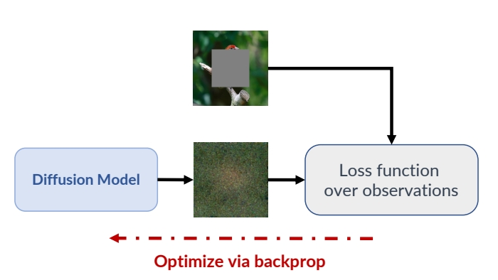
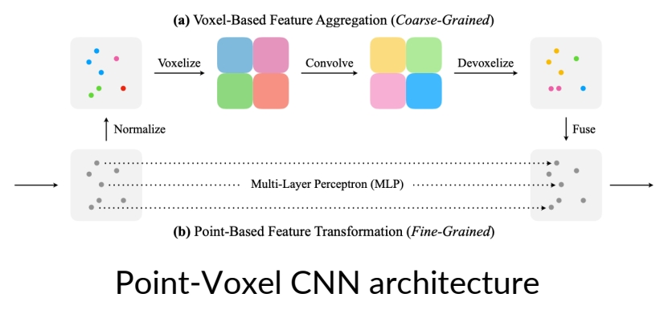
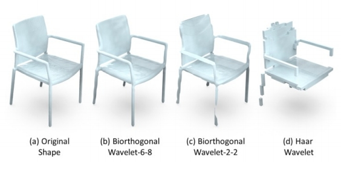
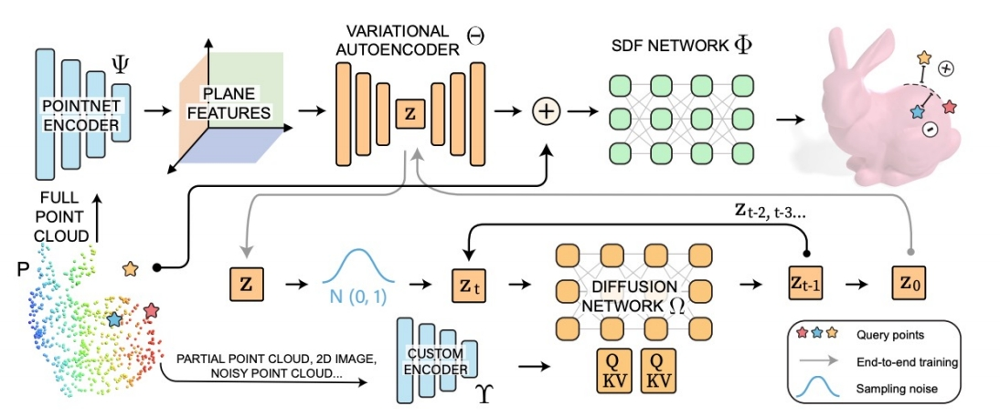

P1   
## Denoising Diffusion Models A Generative Learning Big Bang 

##### CVPR 2023 Tutorial

Part III: Applications on other domains    

P2   
## Outline    
 - Inverse problems
 - Setup
 - Replacement-based methods
 - Reconstruction-based methods

P3   
## Diffusion Models for Inverse Problems

Goal: denoise and super-resolve an image    

  

  

P4   
## Diffusion Models for Inverse Problems

Goal: recover the masked region of an image

  

  

P5   
## Diffusion Models for Inverse Problems: Two Paradigms

  

**Replacement-based methods**    
(Overwrites model prediction with known information)    

  

**Reconstruction-based methods**    
(Approximate classifier-free guidance **without additional training**)    

P6   
## Replacement-based Methods: An Example   

  

Song et al., <u>"Score-Based Generative Modeling through Stochastic Differential Equations",</u> ICLR 2021    

P7   
## Reconstruction-based Methods: An Example

  

Chung et al., <u>"Diffusion Posterior Sampling for General Noisy Inverse Problems",</u> ICLR 2023   

P8    
## Diffusion Posterior Sampling   

In the Gaussian case,    

$$
p(\mathbf{y} |\mathbb{E} [\mathbf{x} _0|\mathbf{x} _t])=-c||\mathcal{A} \mathbf{(\hat{x}}  _0)-\mathbf{y} ||^2_2
$$

Maximizing the likelihood is minimizing the L2 distance between measured and generated!     

  

Chung et al., <u>"Diffusion Posterior Sampling for General Noisy Inverse Problems",</u> ICLR 2023    

P9   
## Solving Inverse Problems with Diffusion Models   

**Reconstruction-based methods**    
 - **ScoreSDE**: simple linear problems, e.g., inpainting, colorization; later extended to MRI and CT.   
 - **ILVR**: more linear problems, e.g., super-resolution.   
 - **SNIP**S: slow solution for noisy linear problems.   
 - **CCDF**: better initializations.    
 - **DDRM**: fast solution for all noisy linear problems, and JPEG.   

Choi et al., <u>"ILVR: Conditioning Method for Denoising Diffusion Probabilistic Models",</u> ICCV 2021       
Kawar et al., <u>"SNIPS: Solving Noisy Inverse Problems Stochastically",</u> NeurIPS 2021   
Chung et al., <u>"Come-Closer-Diffuse-Faster: Accelerating Conditional Diffusion Models for Inverse Problems through Stochastic Contraction",</u> CVPR 2022    
Song et al., <u>"Solving Inverse Problems in Medical Imaging with Score-Based Generative Models",</u> ICLR 2022   
Kawar et al., <u>"Denoising Diffusion Restoration Models",</u> NeurIPS 2022   

P10    
## Solving Inverse Problems with Diffusion Models

**Replacement-based methods**    
 - **Video Diffusion/Pyramid DDPM**: used for uper-resolution.      
 - **Pseudoinverse guidance**: linear and some non-differentiable problems, e.g., JPEG
 - **MCG**: combines replacement & reconstruction for linear problems.

**Others**
 - **CSGM**: Posterior sampling with Langevin Dynamics based on the diffusion score model.   
 - **RED-Diff**: A Regularizing-by-Denoising (RED), variational inference approach.   
 - **Posterior sampling**: use RealNVP to approximate posterior samples from diffusion models.   

Ho et al., <u>"Video Diffusion Models",</u> NeurIPS 2022   
Chung et al., <u>"Improving Diffusion Models for Inverse Problems using Manifold Constraints",</u> NeurIPS 2022   
Ryu and Ye, <u>"Pyramidal Denoising Diffusion Probabilistic Models",</u> arXiv 2022   
Chung et al., <u>"Diffusion Posterior Sampling for General Noisy Inverse Problems",</u> arXiv 2022   
Song et al., <u>"Pseudoinverse-Guided Diffusion Models for Inverse Problems",</u> ICLR 2023   
Jalal et al., <u>"Robust Compressed Sensing MRI with Deep Generative Priors",</u> NeurIPS 2021   
Mardani et al., <u>"A Variational Perspective on Solving Inverse Problems with Diffusion Models",</u> arXiv 2023   
Feng et al., <u>"Score-Based Diffusion Models as Principled Priors for Inverse Imaging",</u> arXiv 2023   

P11   
## Outline

 - **3D**    
 - **Diffusion on various 3D representations**    
 - 2D diffusion models for 3D generation    
 - Diffusion models for view synthesis    
 - 3D reconstruction    
 - 3D editing    

P12   
## Diffusion Models for Point Clouds   

A set of points with location information.    

  

  

Zhou et al., <u>"3D Shape Generation and Completion through Point-Voxel Diffusion",</u> ICCV 2021    
Liu et al, <u>"Point-Voxel CNN for Efficient 3D Deep Learning",</u> NeurIPS 2019    

P13    
## Diffusion Models for Point Clouds    

  

Zhou et al., <u>"3D Shape Generation and Completion through Point-Voxel Diffusion",</u> ICCV 2021    

P14     
## Diffusion Models for Point Clouds   

  

Zeng et al., <u>"LION: Latent Point Diffusion Models for 3D Shape Generation",</u> NeurIPS 2022    

P15   
## Diffusion Models for Point Clouds

Point-E uses a synthetic view from fine-tuned GLIDE, and then ”lifts” the image to a 3d point cloud.

  

Nichol et al., <u>"Point-E: A System for Generating 3D Point Clouds from Complex Prompts",</u> arXiv 2022     

P16   
## Diffusion Models for Signed Distance Functions   

SDF is a function representation of a surface.  
For each location x, |SDF(x)| = smallest distance to any point on the surface.    

  

P17   
## Diffusion Models for Signed Distance Functions   

 - Memory of SDF grows cubically with resolution    
 - Wavelets can be used for compression!   
 - Diffusion for coarse coefficients, then predict detailed ones.   

  

  

Hui et al., <u>"Neural Wavelet-domain Diffusion for 3D Shape Generation",</u> arXiv 2022    

P18   
## Diffusion Models for Signed Distance Functions

  

Latent space diffusion for SDFs, where conditioning can be provided with cross attention

Chou et al., <u>"DiffusionSDF: Conditional Generative Modeling of Signed Distance Functions",</u> arXiv 2022    

  

---------------------------------------
> 本文出自CaterpillarStudyGroup，转载请注明出处。
>
> https://caterpillarstudygroup.github.io/ImportantArticles/