P2   
# Outline    
 - Inverse problems
 - Setup
 - Replacement-based methods
 - Reconstruction-based methods

P3   
# Diffusion Models for Inverse Problems

## Setup

### Goal: denoise and super-resolve an image

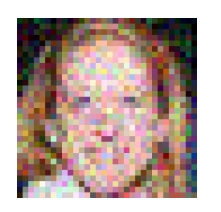  

  

P4   
### Goal: recover the masked region of an image

  

  

We want to use the same diffusion model for different problems!    

P5   
## Diffusion Models for Inverse Problems: Two Paradigms

  

**Replacement-based methods**    
(Overwrites model prediction with known information)    

  

**Reconstruction-based methods**    
(Approximate classifier-free guidance **without additional training**)    

P6   
## Replacement-based Methods: An Example   

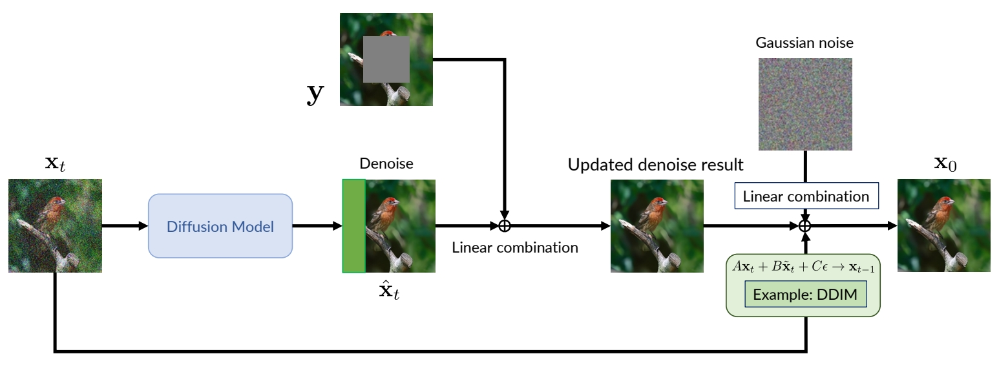  

Song et al., <u>"Score-Based Generative Modeling through Stochastic Differential Equations",</u> ICLR 2021    

P7   
## Reconstruction-based Methods: An Example

  

Chung et al., <u>"Diffusion Posterior Sampling for General Noisy Inverse Problems",</u> ICLR 2023   

P8    
## Diffusion Posterior Sampling   

In the Gaussian case,    

$$
p(\mathbf{y} |\mathbb{E} [\mathbf{x} _ 0|\mathbf{x} _ t])=-c||\mathcal{A} \mathbf{(\hat{x}}  _ 0)-\mathbf{y} ||^2_2
$$

Maximizing the likelihood is minimizing the L2 distance between measured and generated!     

  

Chung et al., <u>"Diffusion Posterior Sampling for General Noisy Inverse Problems",</u> ICLR 2023    

P9   
## Solving Inverse Problems with Diffusion Models   

**Reconstruction-based methods**    
 - **ScoreSDE**: simple linear problems, e.g., inpainting, colorization; later extended to MRI and CT.   
 - **ILVR**: more linear problems, e.g., super-resolution.   
 - **SNIP**S: slow solution for noisy linear problems.   
 - **CCDF**: better initializations.    
 - **DDRM**: fast solution for all noisy linear problems, and JPEG.   

Choi et al., <u>"ILVR: Conditioning Method for Denoising Diffusion Probabilistic Models",</u> ICCV 2021       
Kawar et al., <u>"SNIPS: Solving Noisy Inverse Problems Stochastically",</u> NeurIPS 2021   
Chung et al., <u>"Come-Closer-Diffuse-Faster: Accelerating Conditional Diffusion Models for Inverse Problems through Stochastic Contraction",</u> CVPR 2022    
Song et al., <u>"Solving Inverse Problems in Medical Imaging with Score-Based Generative Models",</u> ICLR 2022   
Kawar et al., <u>"Denoising Diffusion Restoration Models",</u> NeurIPS 2022   

P10    
## Solving Inverse Problems with Diffusion Models

**Replacement-based methods**    
 - **Video Diffusion/Pyramid DDPM**: used for uper-resolution.      
 - **Pseudoinverse guidance**: linear and some non-differentiable problems, e.g., JPEG
 - **MCG**: combines replacement & reconstruction for linear problems.

**Others**
 - **CSGM**: Posterior sampling with Langevin Dynamics based on the diffusion score model.   
 - **RED-Diff**: A Regularizing-by-Denoising (RED), variational inference approach.   
 - **Posterior sampling**: use RealNVP to approximate posterior samples from diffusion models.   

Ho et al., <u>"Video Diffusion Models",</u> NeurIPS 2022   
Chung et al., <u>"Improving Diffusion Models for Inverse Problems using Manifold Constraints",</u> NeurIPS 2022   
Ryu and Ye, <u>"Pyramidal Denoising Diffusion Probabilistic Models",</u> arXiv 2022   
Chung et al., <u>"Diffusion Posterior Sampling for General Noisy Inverse Problems",</u> arXiv 2022   
Song et al., <u>"Pseudoinverse-Guided Diffusion Models for Inverse Problems",</u> ICLR 2023   
Jalal et al., <u>"Robust Compressed Sensing MRI with Deep Generative Priors",</u> NeurIPS 2021   
Mardani et al., <u>"A Variational Perspective on Solving Inverse Problems with Diffusion Models",</u> arXiv 2023   
Feng et al., <u>"Score-Based Diffusion Models as Principled Priors for Inverse Imaging",</u> arXiv 2023   

P11   
# 3D    
 - **Diffusion on various 3D representations**    
 - 2D diffusion models for 3D generation    
 - Diffusion models for view synthesis    
 - 3D reconstruction    
 - 3D editing    

P12   
## Diffusion Models for Point Clouds   

A set of points with location information.    

  

  

Zhou et al., <u>"3D Shape Generation and Completion through Point-Voxel Diffusion",</u> ICCV 2021    
Liu et al, <u>"Point-Voxel CNN for Efficient 3D Deep Learning",</u> NeurIPS 2019    

P13    
## Diffusion Models for Point Clouds    

  

Zhou et al., <u>"3D Shape Generation and Completion through Point-Voxel Diffusion",</u> ICCV 2021    

P14     
## Diffusion Models for Point Clouds   

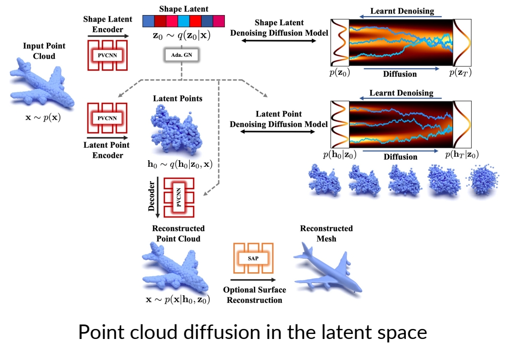  

Zeng et al., <u>"LION: Latent Point Diffusion Models for 3D Shape Generation",</u> NeurIPS 2022    

P15   
## Diffusion Models for Point Clouds

Point-E uses a synthetic view from fine-tuned GLIDE, and then ”lifts” the image to a 3d point cloud.

  

  

Nichol et al., <u>"Point-E: A System for Generating 3D Point Clouds from Complex Prompts",</u> arXiv 2022     

P16   
## Diffusion Models for Signed Distance Functions   

SDF is a function representation of a surface.  
For each location x, |SDF(x)| = smallest distance to any point on the surface.    

  

P17   
## Diffusion Models for Signed Distance Functions   

 - Memory of SDF grows cubically with resolution    
 - Wavelets can be used for compression!   
 - Diffusion for coarse coefficients, then predict detailed ones.   

  

  

Hui et al., <u>"Neural Wavelet-domain Diffusion for 3D Shape Generation",</u> arXiv 2022    

P18   
## Diffusion Models for Signed Distance Functions

  

**Latent space diffusion for SDFs, where conditioning can be provided with cross attention**

Chou et al., <u>"DiffusionSDF: Conditional Generative Modeling of Signed Distance Functions",</u> arXiv 2022    

P19   
## Diffusion Models for Other 3D Representations    

Neural Radiance Fields (NeRF) is another representation of a 3D object.    

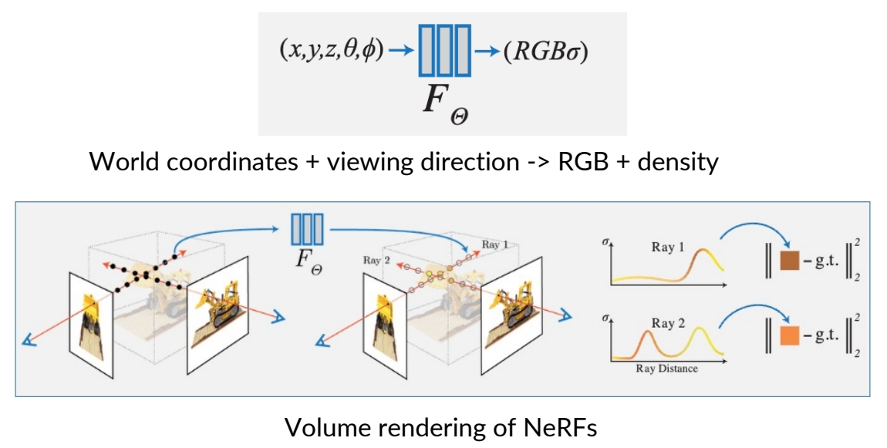  
 
P20   
## Diffusion Models for Other 3D Representations

  
**NeRF**    
(Fully implicit)    

  
**Voxels**    
(Explicit / hybrid)    

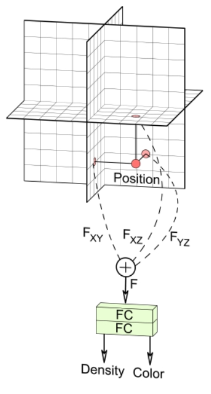  
**Triplanes**    
(Factorized, hybrid)    

Image from EG3D paper.    

P21   
## Diffusion Models for Other 3D Representations     

 - Triplanes, regularized ReLU Fields, the MLP of NeRFs...    
 - A good representation is important!     

  
Triplane diffusion    

  
Regularized ReLU Fields    

  
Implicit MLP of NeRFs     

Shue et al., <u>"3D Neural Field Generation using Triplane Diffusion",</u> arXiv 2022    
Yang et al., <u>"Learning a Diffusion Prior for NeRFs",</u> ICLR Workshop 2023    
Jun and Nichol, <u>"Shap-E: Generating Conditional 3D Implicit Functions",</u> arXiv 2023    

P22    
## Outline

 - 2D diffusion models for 3D generation     

P23   
## 2D Diffusion Models for 3D Generation   

 - Just now, we discussed diffusion models directly on 3d.   
 - However, there are a lot fewer 3d data than 2d.   
    - A lot of experiments are based on ShapeNet!   
 - Can we use 2d diffusion models as a “prior” for 3d?   

P25    
## DreamFusion: Setup    

 - Suppose there is a text-to-image diffusion model.    
 -  Goal: optimize NeRF parameter such that each angle “looks 
good” from the text-to-image model.    
 - Unlike ancestral sampling (e.g., DDIM), the underlying 
parameters are being optimized over some loss function.    

     
     

Poole et al., <u>"DreamFusion: Text-to-3D using 2D Diffusion",</u> ICLR 2023    

P26   
## DreamFusion: Score Distillation Sampling   

     

Poole et al., <u>"DreamFusion: Text-to-3D using 2D Diffusion",</u> ICLR 2023     

P27   
## DreamFusion: Score Distillation Sampling

Consider the KL term to minimize (given t):   

$$
\mathbf{KL} (q(\mathbf{z} _ t|g(\theta );y,t)||p\phi (\mathbf{z} _ t;y,t))
$$

KL between noisy real image distribution and generated image 
distributions, conditioned on y!     

KL and its gradient is defined as:    

  

(B) can be derived from chain rule    

$$
\nabla _ \theta \log p _ \phi (\mathbf{z} _ t|y)=s _ \phi (\mathbf{z} _ t|y)\frac{\partial \mathbf{z} _ t}{\partial \theta }=\alpha _ ts _ \phi (\mathbf{z} _ t|y)\frac{\partial \mathbf{x} }{\partial \theta } =-\frac{\alpha _ t}{\sigma _ t}\hat{\epsilon }_ \phi (\mathbf{z} _ t|y)\frac{\partial \mathbf{x} }{\partial \theta }   
$$

(A) is the gradient of the entropy of the forward process with fixed variance = 0.    

Poole et al., <u>"DreamFusion: Text-to-3D using 2D Diffusion",</u> ICLR 2023   

P28    
## DreamFusion: Score Distillation Sampling  

$$
(A)+(B)=\frac{\alpha _ t}{\sigma _ t}\hat{\epsilon } _ \phi (\mathbf{z} _ t|y)\frac{\partial \mathbf{x} }{\partial \theta }
$$

However, this objective can be quite noisy.     
Alternatively, we can consider a “baseline” approach in reinforcement learning: add a component that has zero mean but reduces variance. Writing out (A) again:     

  

Thus, we have:

  

This has the same mean, but **reduced variance**, as we train \\(\hat{\epsilon } _ \phi\\) to predict \\(\epsilon\\)    

Poole et al., <u>"DreamFusion: Text-to-3D using 2D Diffusion",</u> ICLR 2023    

P29   
## DreamFusion in Text-to-3D    

 - SDS can be used to optimize a 3D representation, like NeRF.   

  

Poole et al., <u>"DreamFusion: Text-to-3D using 2D Diffusion",</u> ICLR 2023    

P30   
## Extensions to SDS: Magic3D

2x speed and higher resolution   
 - Accelerate NeRF with Instant-NGP, for coarse representations.    
 - Optimize a fine mesh model with differentiable renderer.   

  

Lin et al., <u>"Magic3D: High-Resolution Text-to-3D Content Creation",</u> CVPR 2023   

P31
## Alternative to SDS: Score Jacobian Chaining

A different formulation, motivated from approximating 3D score.   

  

In principle, the diffusion model is the noisy 2D score (over clean images),   
but in practice, the diffusion model suffers from out-of-distribution (OOD) issues!    

For diffusion model on noisy images, **the non-noisy images are OOD**!    

Wang et al., <u>"Score Jacobian Chaining: Lifting Pretrained 2D Diffusion Models for 3D Generation",</u> CVPR 2023.     

P32   
## Score Jacobian Chaining   

SJC approximates noisy score with “Perturb-and-Average Scoring”, which is not present in SDS.   
 - Use score model on multiple noise-perturbed data, then average it.    

  

Wang et al., <u>"Score Jacobian Chaining: Lifting Pretrained 2D Diffusion Models for 3D Generation",</u> CVPR 2023.    

P33    
## SJC and SDS

SJC is a competitive alternative to SDS.   

 

Wang et al., <u>"Score Jacobian Chaining: Lifting Pretrained 2D Diffusion Models for 3D Generation",</u> CVPR 2023.    

P34   
## Alternative to SDS: ProlificDreamer   

 - SDS-based method often set classifier-guidance weight to 100, which limits the “diversity” of the generated samples.   
 - ProlificDreamer reduces this to 7.5, leading to diverse samples.    

 

Wang et al., <u>"ProlificDreamer: High-Fidelity and Diverse Text-to-3D Generation with Variational Score Distillation",</u> arXiv 2023    

P35   
## ProlificDreamer and Variational Score Distillation  

Instead of maximizing the likelihood under diffusion model, VSD minimizes the KL divergence via variational inference.    

$$
\begin{matrix}
\min_{\mu } D _ {\mathrm{KL} }(q^\mu _ 0(\mathbf{x} _ 0|y)||p _ 0(\mathbf{x} _ 0|y)). \\\\
\quad \mu \quad \text{is the distribution of NeRFs} .
\end{matrix}
$$

Suppose is a \\(\theta _ \tau \sim \mu \\) NeRF sample, then VSD simulates this ODE:    

 

 - Diffusion model can be used to approximate score of noisy real images.   
 - How about noisy rendered images?   sss

P36   
## ProlificDreamer and Variational Score Distillation

 - Learn another diffusion model to approximate the score of noisy rendered images!

 

Wang et al., <u>"ProlificDreamer: High-Fidelity and Diverse Text-to-3D Generation with Variational Score Distillation",</u> arXiv 2023    

P37   
## Why does VSD work in practice?    

 - The valid text-to-image NeRFs form a distribution with infinite possibilities!    
 - In SDS, epsilon is the score of noisy “dirac distribution” over finite renders, which converges to the true score with infinite renders!    
 - In VSD, the LoRA model aims to **represent the (true) score of noisy distribution over infinite number of renders!**   
 - If the generated NeRF distribution is only one point and LoRA overfits perfectly, then VSD = SDS!    
 - But LoRA has good generalization (and learns from a trajectory of NeRFs), so closer to the true score!    

 - This is analogous to    
    - Representing the dataset score via mixture of Gaussians on the dataset (SDS), versus     
    - Representing the dataset score via the LoRA UNet (VSD)    

Wang et al., <u>"ProlificDreamer: High-Fidelity and Diverse Text-to-3D Generation with Variational Score Distillation",</u> arXiv 2023    

P38   
## Outline

 - Diffusion models for view synthesis   

P39
## Novel-view Synthesis with Diffusion Models   

 - These do not produce 3D as output, but synthesis the view at different angles.    

Watson et al., <u>"Novel View Synthesis with Diffusion Models",</u> ICLR 2023    

P40   
## 3DiM   

 - Condition on a frame and two poses, predict another frame.     

  

UNet with frame cross-attention   

  

Sample based on stochastic conditions,   
allowing the use of multiple conditional frames.    

Watson et al., <u>"Novel View Synthesis with Diffusion Models",</u> ICLR 2023    

P41    
## GenVS   

 - 3D-aware architecture with latent feature field.    
 - Use diffusion model to improve render quality based on structure.   

  

Chan et al., <u>"Generative Novel View Synthesis with 3D-Aware Diffusion Models",</u> arXiv 2023    

P42    
## Outline   

 - 3D reconstruction    

P43    
## NeuralLift-360 for 3D reconstruction

 - SDS + Fine-tuned CLIP text embedding + Depth supervision    

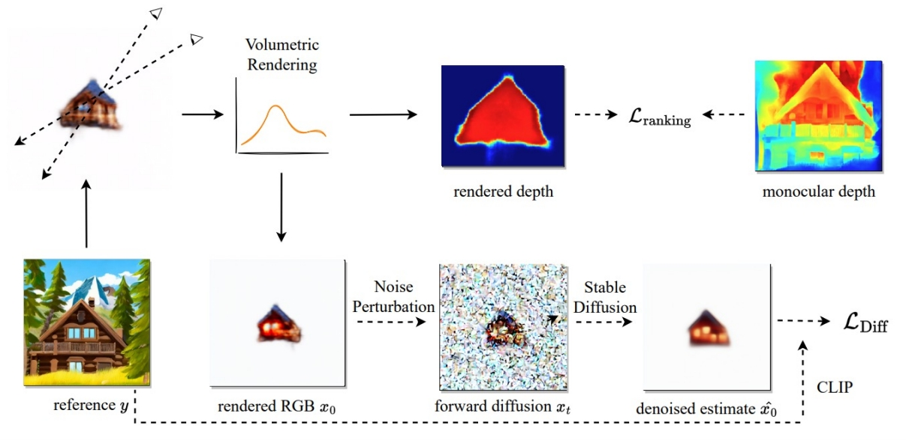  

Xu et al., <u>"NeuralLift-360: Lifting An In-the-wild 2D Photo to A 3D Object with 360° Views",</u> CVPR 2023    

P44    
## Zero 1-to-3   

 - Generate novel view from 1 view and pose, with 2d model.    
 - Then, run SJC / SDS-like optimizations with view-conditioned model.   

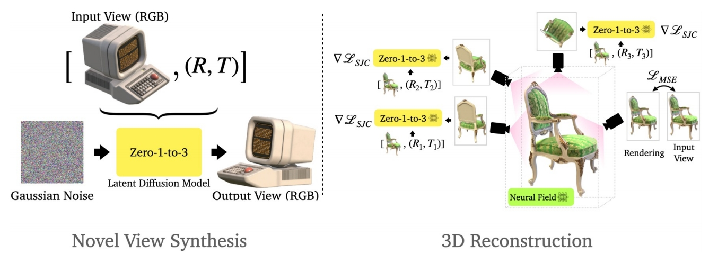  

Liu et al., <u>"Zero-1-to-3: Zero-shot One Image to 3D Object",</u> arXiv 2023    

P45    
## Outline

 - Inverse problems    
 - **3D**    
 - Video    
 - Miscellaneous    

 - 3D editing    

P46   
## Instruct NeRF2NeRF

Edit a 3D scene with text instructions   

  

Haque et al., <u>"Instruct-NeRF2NeRF: Editing 3D Scenes with Instructions",</u> arXiv 2023      

P47   
## Instruct NeRF2NeRF   

**Edit a 3D scene with text instructions**   
 -  Given existing scene, use Instruct Pix2Pix to edit image at different viewpoints.   
 - Continue to train the NeRF and repeat the above process   

  

Haque et al., <u>"Instruct-NeRF2NeRF: Editing 3D Scenes with Instructions",</u> arXiv 2023   

P48   
## Instruct NeRF2NeRF

With each iteration, the edits become more consistent.    

Haque et al., <u>"Instruct-NeRF2NeRF: Editing 3D Scenes with Instructions",</u> arXiv 2023   

P49   
## Vox-E: Text-guided Voxel Editing of 3D Objects    

 - Text-guided object editing with SDS
 - Regularize the structure of the new voxel grid.

  

Sella et al., <u>"Vox-E: Text-guided Voxel Editing of 3D Objects",</u> arXiv 2023   

P50   
# Video   

- Video generative models   

P51   
## Video Diffusion Models

3D UNet from a 2D UNet.   
 - 3x3 2d conv to 1x3x3 3d conv.   
 - Factorized spatial and temporal attentions.   

     
     

Ho et al., <u>"Video Diffusion Models",</u> NeurIPS 2022    

P52   
## Imagen Video: Large Scale Text-to-Video   

 - 7 cascade models in total.   
 - 1 Base model (16x40x24)   
 - 3 Temporal super-resolution models.   
 - 3 Spatial super-resolution models.   

     

Ho et al., <u>"Imagen Video: High Definition Video Generation with Diffusion Models",</u> 2022    

P53   
## Make-a-Video  

 - Start with an unCLIP (DALL-E 2) base network.    

     

Singer et al., <u>"Make-A-Video: Text-to-Video Generation without Text-Video Data",</u> ICLR 2023    

P54   
## Make-a-Video   

     
3D Conv from Spatial Conv + Temporal Conv   

     
3D Attn from Spatial Attn + Temporal Attn   

Different from Imagen Video, only the image prior takes text as input!   

Singer et al., <u>"Make-A-Video: Text-to-Video Generation without Text-Video Data",</u> ICLR 2023     

P55   
## Video LDM   

 - Similarly, fine-tune a text-to-video model from text-to-image model.    

     

Blattmann et al., <u>"Align your Latents: High-Resolution Video Synthesis with Latent Diffusion Models",</u> CVPR 2023    

P56   
## Video LDM: Decoder Fine-tuning   

 - Fine-tune the decoder to be video-aware, keeping encoder frozen.    

     

Blattmann et al., <u>"Align your Latents: High-Resolution Video Synthesis with Latent Diffusion Models",</u> CVPR 2023    

P57    
## Video LDM: LDM Fine-tuning   

 - Interleave spatial layers and temporal layers.    
 - The spatial layers are frozen, whereas temporal layers are trained.    
 - Temporal layers can be Conv3D or Temporal attentions.   
 - Context can be added for autoregressive generation.    

     

Optional context via learned down-sampling operation.   

**For Conv3D,**    
shape is [batch, time, channel, height, width]    

**For Temporal attention,**   
shape is [batch \\(^\ast \\)height\\(^\ast \\) width, time, channel]    

Blattmann et al., <u>"Align your Latents: High-Resolution Video Synthesis with Latent Diffusion Models",</u> CVPR 2023   

P58   
## Video LDM: Upsampling
 - After key latent frames are generated, the latent frames go through temporal interpolation.   
 - Then, they are decoded to pixel space and optionally upsampled.   

     

Blattmann et al., <u>"Align your Latents: High-Resolution Video Synthesis with Latent Diffusion Models",</u> CVPR 2023    

P59   
## Outline   

 - Video style transfer / editing methods    

P60   
## Gen-1

 - Transfer the style of a video using text prompts given a “driving video”

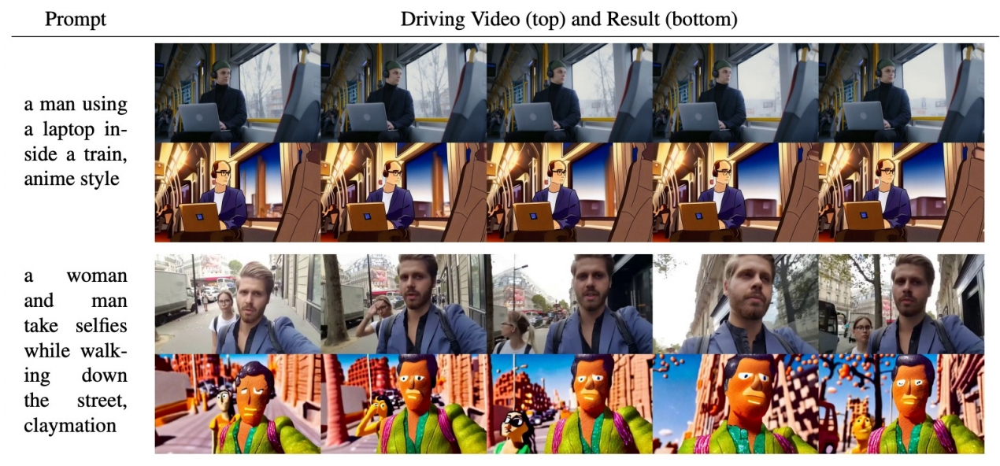     

Esser et al., <u>"Structure and Content-Guided Video Synthesis with Diffusion Models",</u> arXiv 2023    

P61   
## Gen-1

 - Condition on structure (depth) and content (CLIP) information.   
 - Depth maps are passed with latents as input conditions.   
 - CLIP image embeddings are provided via cross-attention blocks.   
 - During inference, CLIP text embeddings are converted to CLIP image embeddings.    

     

Esser et al., <u>"Structure and Content-Guided Video Synthesis with Diffusion Models",</u> arXiv 2023     

P62   
## Pix2Video: Video Editing Using Image Diffusion   

 - Given a sequence of frames, generate a new set of images that reflects an edit.   
 - Editing methods on individual images fail to preserve temporal information.    

Ceylan et al., <u>"Pix2Video: Video Editing using Image Diffusion",</u> arXiv 2023    

P63   
## Pix2Video: Video Editing Using Image Diffusion   

    

 - **Self-Attention injection:** use the features of previous frame for Key and Values.   

    

Ceylan et al., <u>"Pix2Video: Video Editing using Image Diffusion",</u> arXiv 2023   

P64    
## Pix2Video: Video Editing Using Image Diffusion   

    

Ceylan et al., <u>"Pix2Video: Video Editing using Image Diffusion",</u> arXiv 2023    

P65   
## Pix2Video: Video Editing Using Image Diffusion  

 - The two methods improve the temporal consistency of the final video!   

Ceylan et al., <u>"Pix2Video: Video Editing using Image Diffusion",</u> arXiv 2023   

P66    
## Concurrent / Related Works   

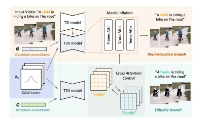    
Video-P2P: Cross-Attention Control on text-to-video model    

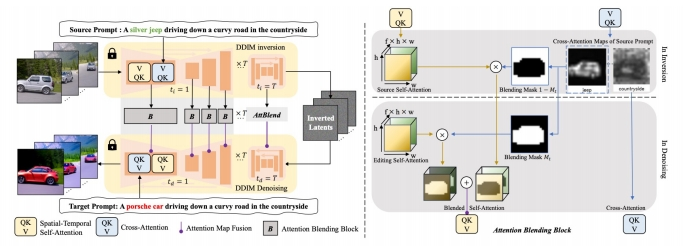    
FateZero: Store attention maps from DDIM inversion for later use    

    
Tune-A-Video: Fine-tune projection matrices of the attention layers, from text2image model to text2video model.    

    
Vid2vid-zero: Learn a null-text embedding for inversion, then use cross-frame attention with original weights.    

P67   
# Miscellaneous   

 - Diffusion models for large contents   

P68   
## Diffusion Models for Large Contents   

 - Suppose model is trained on small, squared images, how to extend it to larger images?   
 - Outpainting is always a solution, but not a very efficient one!   

Let us generate this image with a diffusion model only trained on squared regions:    

    

1. Generate the center region \\(q(\mathbf{x} _ 1,\mathbf{x} _ 2)\\)    
2. Generate the **surrounding region conditioned on parts of the center image** \\(q(\mathbf{x} _ 3|\mathbf{x} _ 2)\\)    

    

Latency scales linearly with the content size!     
   
P69   
## Diffusion Models for Large Contents

 - Unlike autoregressive models, diffusion models can generate large contents **in parallel**!    

    

Zhang et al., <u>"DiffCollage: Parallel Generation of Large Content with Diffusion Models",</u> CVPR 2023    

P70   
## Diffusion Models for Large Contents   

 - A “large” diffusion model from “small” diffusion models!   

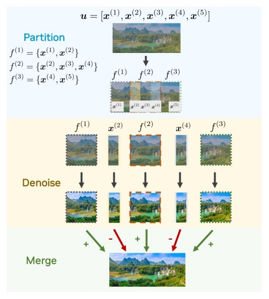    

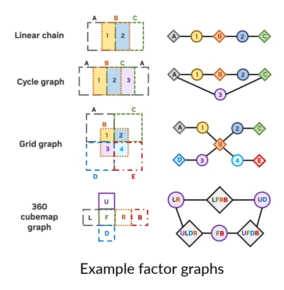    

Zhang et al., <u>"DiffCollage: Parallel Generation of Large Content with Diffusion Models",</u> CVPR 2023   

P71   
## Diffusion Models for Large Contents

 - Applications such as long images, looped motion, 360 images…   

Zhang et al., <u>"DiffCollage: Parallel Generation of Large Content with Diffusion Models",</u> CVPR 2023   

P72   
## Related Works   

 - Based on similar ideas but differ in how overlapping regions are mixed.

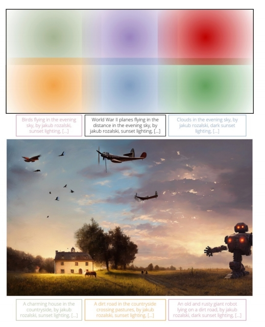    

    

Jiménez, <u>"Mixture of Diffusers for scene composition and high resolution image generation",</u> arXiv 2023    
Bar-Tal et al., <u>"MultiDiffusion: Fusing Diffusion Paths for Controlled Image Generation",</u> ICML 2023   

P73   
## Outline

 - Safety and limitations of diffusion models   

P74   
## Data Memorization in Diffusion Models

 - Due to the likelihood-base objective function, **diffusion models can ”memorize” data**.    
 - And with a higher chance than GANs!   
 - Nevertheless, a lot of “memorized images” are highly-duplicated in the dataset.    

  

Carlini et al., <u>"Extracting Training Data from Diffusion Models",</u> arXiv 2023    

P75   
## Erasing Concepts in Diffusion Models   

 - Fine-tune a model to remove unwanted concepts.   
 - From original model, **obtain score via negative CFG**.   
 - **A new model is fine-tuned** from the new score function.    

  

  

Gandikota et al., <u>"Erasing Concepts from Diffusion Models",</u> arXiv 2023    

P77   
## Part I

Ho et al., <u>"Denoising Diffusion Probabilistic Models",</u> NeurIPS 2020    
Song et al., <u>"Score-Based Generative Modeling through Stochastic Differential Equations",</u> ICLR 2021   
Kingma et al., <u>"Variational Diffusion Models",</u> arXiv 2021   
Karras et al., <u>"Elucidating the Design Space of Diffusion-Based Generative Models",</u> NeurIPS 2022   
Song et al., <u>"Denoising Diffusion Implicit Models",</u> ICLR 2021   
Jolicoeur-Martineau et al., "Gotta Go Fast When Generating Data with Score-Based Models",</u> arXiv 2021   
Liu et al., <u>"Pseudo Numerical Methods for Diffusion Models on Manifolds",</u> ICLR 2022   
Lu et al., <u>"DPM-Solver: A Fast ODE Solver for Diffusion Probabilistic Model Sampling in Around 10 Steps",</u> NeurIPS 2022   
Lu et al., <u>"DPM-Solver++: Fast Solver for Guided Sampling of Diffusion Probabilistic Models",</u> NeurIPS 2022   
Zhang and Chen, <u>"Fast Sampling of Diffusion Models with Exponential Integrator",</u> arXiv 2022   
Zhang et al., <u>"gDDIM: Generalized denoising diffusion implicit models",</u> arXiv 2022   
Zhao et al., <u>"UniPC: A Unified Predictor-Corrector Framework for Fast Sampling of Diffusion Models",</u> arXiv 2023    
Shih et al., <u>"Parallel Sampling of Diffusion Models",</u> arxiv 2023   
Chen et al., <u>"A Geometric Perspective on Diffusion Models",</u> arXiv 2023   
Xiao et al., <u>"Tackling the Generative Learning Trilemma with Denoising Diffusion GANs",</u> arXiv 2021   
Salimans and Ho, <u>"Progressive Distillation for Fast Sampling of Diffusion Models",</u> ICLR 2022   
Meng et al., <u>"On Distillation of Guided Diffusion Models",</u> arXiv 2022   
Dockhorn et al., <u>"GENIE: Higher-Order Denoising Diffusion Solvers",</u> NeurIPS 2022   
Watson et al., <u>"Learning Fast Samplers for Diffusion Models by Differentiating Through Sample Quality",</u> ICLR 2022   
Phung et al., <u>"Wavelet Diffusion Models Are Fast and Scalable Image Generators",</u> CVPR 2023   
Dhariwal and Nichol, <u>"Diffusion Models Beat GANs on Image Synthesis",</u> arXiv 2021   
Ho and Salimans, <u>"Classifier-Free Diffusion Guidance",</u> NeurIPS Workshop 2021     
Automatic1111, <u>"Negative Prompt",</u> GitHub   
Hong et al., <u>"Improving Sample Quality of Diffusion Models Using Self-Attention Guidance",</u> arXiv 2022   
Saharia et al., <u>"Image Super-Resolution via Iterative Refinement",</u> arXiv 2021   
Ho et al., <u>"Cascaded Diffusion Models for High Fidelity Image Generation",</u> JMLR 2021   
Sinha et al., <u>"D2C: Diffusion-Denoising Models for Few-shot Conditional Generation",</u> NeurIPS 2021   
Vahdat et al., <u>"Score-based Generative Modeling in Latent Space",</u> arXiv 2021   
Rombach et al., <u>"High-Resolution Image Synthesis with Latent Diffusion Models",</u> CVPR 2022   
Daras et al., <u>"Score-Guided Intermediate Layer Optimization: Fast Langevin Mixing for Inverse Problems",</u> ICML 2022   

P78   
## Part I (cont’d)

Bortoli et al.,<u> "Diffusion Schrödinger Bridge",</u> NeurIPS 2021       
Bortoli et al.,<u> "Riemannian Score-Based Generative Modelling",</u> NeurIPS 2022  
Neklyudov et al., <u>"Action Matching: Learning Stochastic Dynamics from Samples",</u> ICML 2023  
Bansal et al., <u>"Cold Diffusion: Inverting Arbitrary Image Transforms Without Noise",</u> arXiv 2022   
Daras et al., <u>"Soft Diffusion: Score Matching for General Corruptions",</u> TMLR 2023   
Delbracio and Milanfar, <u>"Inversion by Direct Iteration: An Alternative to Denoising Diffusion for Image Restoration",</u> arXiv 2023   
Luo et al., <u>"Image Restoration with Mean-Reverting Stochastic Differential Equations",</u> ICML 2023   

P79    
## Part II

Bao et al., <u>"All are Worth Words: a ViT Backbone for Score-based Diffusion Models",</u> arXiv 2022    
Peebles and Xie, <u>"Scalable Diffusion Models with Transformers",</u> arXiv 2022    
Bao et al., <u>"One Transformer Fits All Distributions in Multi-Modal Diffusion at Scale",</u> arXiv 2023    
Jabri et al., <u>"Scalable Adaptive Computation for Iterative Generation",</u> arXiv 2022    
Hoogeboom et al., <u>"simple diffusion: End-to-end diffusion for high resolution images",</u> arXiv 2023    
Meng et al., <u>"SDEdit: Guided Image Synthesis and Editing with Stochastic Differential Equations",</u> ICLR 2022    
Li et al., <u>"Efficient Spatially Sparse Inference for Conditional GANs and Diffusion Models",</u> NeurIPS 2022   
Avrahami et al., <u>"Blended Diffusion for Text-driven Editing of Natural Images",</u> CVPR 2022     
Hertz et al., <u>"Prompt-to-Prompt Image Editing with Cross-Attention Control",</u> ICLR 2023    
Kawar et al., <u>"Imagic: Text-Based Real Image Editing with Diffusion Models",</u> CVPR 2023    
Couairon et al., <u>"DiffEdit: Diffusion-based semantic image editing with mask guidance",</u> ICLR 2023    
Sarukkai et al., <u>"Collage Diffusion",</u> arXiv 2023    
Bar-Tal et al., <u>"MultiDiffusion: Fusing Diffusion Paths for Controlled Image Generation",</u> ICML 2023    
Gal et al., <u>"An Image is Worth One Word: Personalizing Text-to-Image Generation using Textual Inversion",</u> ICLR 2023    
Ruiz et al., <u>"DreamBooth: Fine Tuning Text-to-Image Diffusion Models for Subject-Driven Generation",</u> CVPR 2023    
Kumari et al., <u>"Multi-Concept Customization of Text-to-Image Diffusion",</u> CVPR 2023    
Tewel et al., <u>"Key-Locked Rank One Editing for Text-to-Image Personalization",</u> SIGGRAPH 2023    
Zhao et al., <u>"A Recipe for Watermarking Diffusion Models",</u> arXiv 2023    
Hu et al., <u>"LoRA: Low-Rank Adaptation of Large Language Models",</u> ICLR 2022    
Li et al., <u>"GLIGEN: Open-Set Grounded Text-to-Image Generation",</u> CVPR 2023    

P80    
## Part II (cont’d)

Avrahami et al., <u>"SpaText: Spatio-Textual Representation for Controllable Image Generation",</u> CVPR 2023    
Zhang and Agrawala, <u>"Adding Conditional Control to Text-to-Image Diffusion Models",</u> arXiv 2023    
Mou et al., <u>"T2I-Adapter: Learning Adapters to Dig out More Controllable Ability for Text-to-Image Diffusion Models",</u> arXiv 2023    
Orgad et al., <u>"Editing Implicit Assumptions in Text-to-Image Diffusion Models",</u> arXiv 2023    
Han et al., <u>"SVDiff: Compact Parameter Space for Diffusion Fine-Tuning",</u> arXiv 2023    
Xie et al., <u>"DiffFit: Unlocking Transferability of Large Diffusion Models via Simple Parameter-Efficient Fine-Tuning",</u> arXiv 2023    
Saharia et al., <u>"Palette: Image-to-Image Diffusion Models",</u> SIGGRAPH 2022    
Whang et al., <u>"Deblurring via Stochastic Refinement",</u> CVPR 2022    
Xu et al., <u>"Open-Vocabulary Panoptic Segmentation with Text-to-Image Diffusion Models",</u> arXiv 2023    
Saxena et al., <u>"Monocular Depth Estimation using Diffusion Models",</u> arXiv 2023    
Li et al., <u>"Your Diffusion Model is Secretly a Zero-Shot Classifier",</u> arXiv 2023    
Gowal et al., <u>"Improving Robustness using Generated Data",</u> NeurIPS 2021    
Wang et al., <u>"Better Diffusion Models Further Improve Adversarial Training",</u> ICML 2023    

P81   
## Part III   

Jalal et al., <u>"Robust Compressed Sensing MRI with Deep Generative Priors",</u> NeurIPS 2021  
Song et al., <u>"Solving Inverse Problems in Medical Imaging with Score-Based Generative Models",</u> ICLR 2022   
Kawar et al., <u>"Denoising Diffusion Restoration Models",</u> NeurIPS 2022   
Chung et al., <u>"Improving Diffusion Models for Inverse Problems using Manifold Constraints",</u> NeurIPS 2022   
Ryu and Ye, <u>"Pyramidal Denoising Diffusion Probabilistic Models",</u> arXiv 2022   
Chung et al., <u>"Diffusion Posterior Sampling for General Noisy Inverse Problems",</u> arXiv 2022   
Feng et al., <u>"Score-Based Diffusion Models as Principled Priors for Inverse Imaging",</u> arXiv 2023   
Song et al., <u>"Pseudoinverse-Guided Diffusion Models for Inverse Problems",</u> ICLR 2023   
Mardani et al., <u>"A Variational Perspective on Solving Inverse Problems with Diffusion Models",</u> arXiv 2023   
Delbracio and Milanfar, <u>"Inversion by Direct Iteration: An Alternative to Denoising Diffusion for Image Restoration",</u> arxiv 2023   
Stevens et al., <u>"Removing Structured Noise with Diffusion Models",</u> arxiv 2023   
Wang et al., <u>"Zero-Shot Image Restoration Using Denoising Diffusion Null-Space Model",</u> ICLR 2023   
Zhou et al., <u>"3D Shape Generation and Completion through Point-Voxel Diffusion",</u> ICCV 2021   
Zeng et al., <u>"LION: Latent Point Diffusion Models for 3D Shape Generation",</u> NeurIPS 2022   
Nichol et al., <u>"Point-E: A System for Generating 3D Point Clouds from Complex Prompts",</u> arXiv 2022   
Chou et al., <u>"DiffusionSDF: Conditional Generative Modeling of Signed Distance Functions",</u> arXiv 2022   
Cheng et al., <u>"SDFusion: Multimodal 3D Shape Completion, Reconstruction, and Generation",</u> arXiv 2022   
Hui et al., <u>"Neural Wavelet-domain Diffusion for 3D Shape Generation",</u> arXiv 2022   
Shue et al., <u>"3D Neural Field Generation using Triplane Diffusion",</u> arXiv 2022   
Yang et al., <u>"Learning a Diffusion Prior for NeRFs",</u> ICLR Workshop 2023   
Jun and Nichol, <u>"Shap-E: Generating Conditional 3D Implicit Functions",</u> arXiv 2023   
Poole et al., <u>"DreamFusion: Text-to-3D using 2D Diffusion",</u> arXiv 2022   
Lin et al., <u>"Magic3D: High-Resolution Text-to-3D Content Creation",</u> arXiv 2022   
Wang et al., <u>"Score Jacobian Chaining: Lifting Pretrained 2D Diffusion Models for 3D Generation",</u> arXiv 2022   
Metzer et al., <u>"Latent-NeRF for Shape-Guided Generation of 3D Shapes and Textures",</u> arXiv 2022   
Hong et al., <u>"Debiasing Scores and Prompts of 2D Diffusion for Robust Text-to-3D Generation",</u> CVPR Workshop 2023   
Watson et al., <u>"Novel View Synthesis with Diffusion Models",</u> arXiv 2022   
Chan et al., <u>"Generative Novel View Synthesis with 3D-Aware Diffusion Models",</u> arXiv 2023   
Xu et al., <u>"NeuralLift-360: Lifting An In-the-wild 2D Photo to A 3D Object with 360° Views",</u> arXiv 2022   
Zhou and Tulsiani, <u>"SparseFusion: Distilling View-conditioned Diffusion for 3D Reconstruction",</u> arXiv 2022   

P82   
## Part III (cont’d)

Seo et al., <u>"DITTO-NeRF: Diffusion-based Iterative Text To Omni-directional 3D Model",</u> arXiv 2023   
Haque et al., <u>"Instruct-NeRF2NeRF: Editing 3D Scenes with Instructions",</u> arXiv 2023   
Sella et al., <u>"Vox-E: Text-guided Voxel Editing of 3D Objects",</u> arXiv 2023   
Ho et al., <u>"Video Diffusion Models",</u> NeurIPS 2022   
Harvey et al., <u>"Flexible Diffusion Modeling of Long Videos",</u> arXiv 2022    
Voleti et al., <u>"MCVD: Masked Conditional Video Diffusion for Prediction, Generation, and Interpolation",</u> NeurIPS 2022   
Ho et al., <u>"Imagen Video: High Definition Video Generation with Diffusion Models",</u> Oct 2022   
Singer et al., <u>"Make-A-Video: Text-to-Video Generation without Text-Video Data",</u> arXiv 2022    
Mei and Patel, <u>"VIDM: Video Implicit Diffusion Models",</u> arXiv 2022    
Blattmann et al., <u>"Align your Latents: High-Resolution Video Synthesis with Latent Diffusion Models",</u> CVPR 2023    
Wang et al., <u>"Zero-Shot Video Editing Using Off-The-Shelf Image Diffusion Models",</u> arXiv 2023    
Ceylan et al., <u>"Pix2Video: Video Editing using Image Diffusion",</u> arXiv 2023    
Esser et al., <u>"Structure and Content-Guided Video Synthesis with Diffusion Models",</u> arXiv 2023    
Jiménez, <u>"Mixture of Diffusers for scene composition and high resolution image generation",</u> arXiv 2023    
Bar-Tal et al., <u>"MultiDiffusion: Fusing Diffusion Paths for Controlled Image Generation",</u> arXiv 2023    
Zhang et al., <u>"DiffCollage: Parallel Generation of Large Content with Diffusion Models",</u> CVPR 2023    
Zhang et al., <u>"MotionDiffuse: Text-Driven Human Motion Generation with Diffusion Model",</u> arXiv 2022    
Tevet et al., <u>"Human Motion Diffusion Model",</u> arXiv 2022    
Chen et al., <u>"Executing your Commands via Motion Diffusion in Latent Space",</u> CVPR 2023    
Du et al., <u>"Avatars Grow Legs: Generating Smooth Human Motion from Sparse Tracking Inputs with Diffusion Model",</u> CVPR 2023    
Shafir et al., <u>"Human Motion Diffusion as a Generative Prior",</u> arXiv 2023    
Somepalli et al., <u>"Diffusion Art or Digital Forgery? Investigating Data Replication in Diffusion Models",</u> CVPR 2023    
Carlini et al., <u>"Extracting Training Data from Diffusion Models",</u> arXiv 2023    
Gandikota et al., <u>"Erasing Concepts from Diffusion Models",</u> arXiv 2023    
Kumari et al., <u>"Ablating Concepts in Text-to-Image Diffusion Models",</u> arXiv 2023    
Somepalli et al., <u>"Understanding and Mitigating Copying in Diffusion Models",</u> arXiv 2023    

---------------------------------------
> 本文出自CaterpillarStudyGroup，转载请注明出处。
>
> https://caterpillarstudygroup.github.io/ImportantArticles/