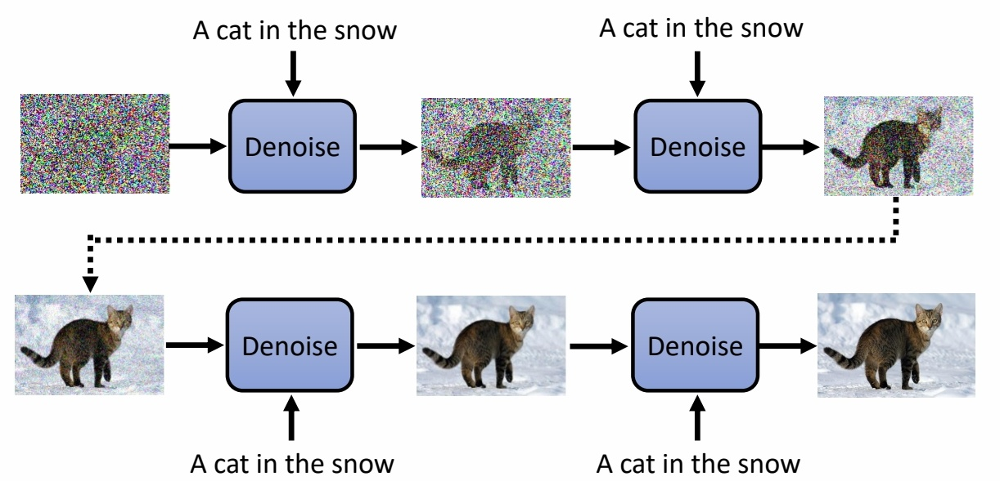

P1   

Denoising Diffusion Probabilistic Models (DDPM)   
<https://arxiv.org/abs/2006.11239>    

P2   
## Diffusion Model 是如何運作的？

 

2
 
3
 
33
 

P3  

The sculpture is already complete within the marble block, before I start my work. It is already there, I just have to chisel away the superfluous material. **-Michelangelo**    

Powered by Midjourney   

P4   
 

> &#x2705; Denoise 模块需要根据当前的时间步做出不同程度的去噪。   

P5   
## Denoise 模組內部實際做的事情

 

> &#x2705; 预测 noise，原始图 - noise ＝ 去噪图    
> &#x2705; 原因：预测 noise 的难度小于预测一张图像    

P6   
## 如何訓練 Noise Predictor 

 

P8    
 

> &#x2705; 通过自己加噪来构造 GT    

P10   
## Text-to-Image 

 

 

> &#x2705; 每一个 step 的 denoise 都要输入 text．    

P11
## Text-to-Image 

 

P12  
 

P13   
## Denoising Diffusion Probabilistic Models

 

 

