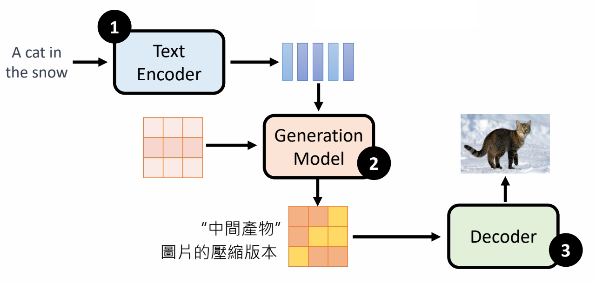
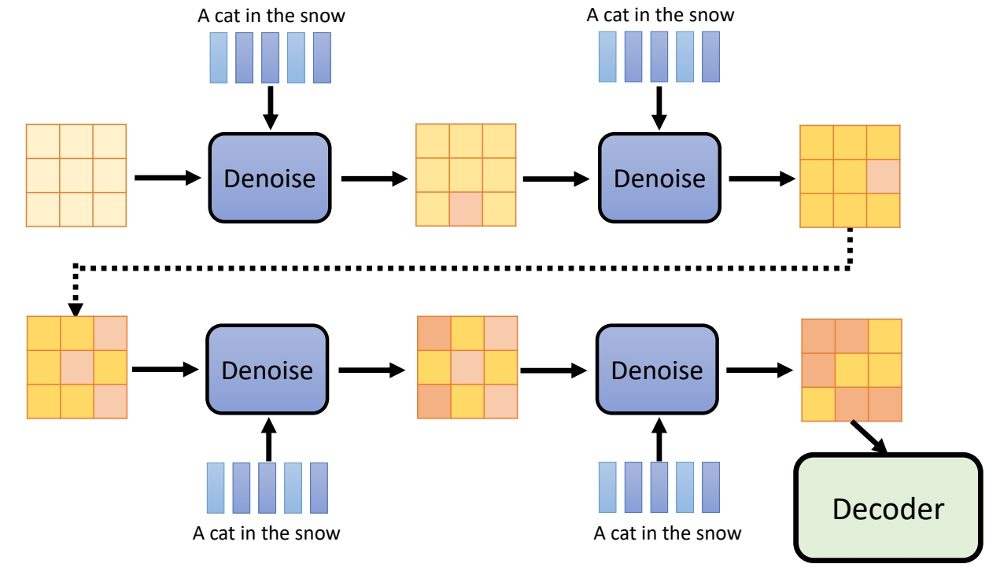

P2   
# Framework 

 

 

P4   
## DALL-E series 

 

|ID|Year|Name|Note|Tags|Link|
|---|---|---|---|---|---|
||2022|https://arxiv.org/abs/2204.06125|
||2021|https://arxiv.org/abs/2102.12092|

> &#x2705; DALL-E 的生成模型有两种：Auoregressive 和 Diffusion.   

P5   
## Imagen 

<https://imagen.research.google/>

<https://arxiv.org/abs/2205.11487>

 

> &#x2705; Decoder 也是一个 Diffusion Model，把小图变成大图。    

P6   
# Text Encoder   

> &#x2705; Text Encoder 可以用 GPT．BERT 等预训练模型。      

P7   

 

<https://arxiv.org/abs/2205.11487>

> &#x2705; 评分说明：FID 越小越好，CLIP score 越大越好。因此右下角最好。   
> &#x2705; Text Encoder 的大小对结果影响很大。Diffusion Model 的大小没那么重要。  

P10   
# Decoder

Decoder can be trained without labelled data.   

P11  
## 「中间产物」为小图

 

P12   
## 「中间产物」为「Latent Representation」

<u>Auto-encoder</u>

 

 

P13   
# Generation Model   

## Forard Process

P14   
 

> &#x2705; Forard Process：noise 加下 “中间产物”或latent code上。   

## Reverte Process.    

P15   
 

## Inference    

P16   
 

---------------------------------------
> 本文出自CaterpillarStudyGroup，转载请注明出处。
>
> https://caterpillarstudygroup.github.io/ImportantArticles/