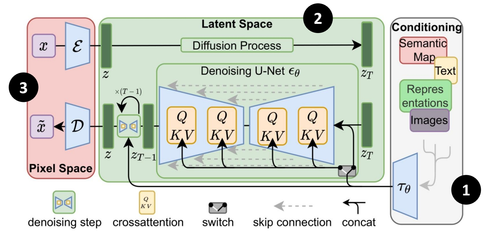
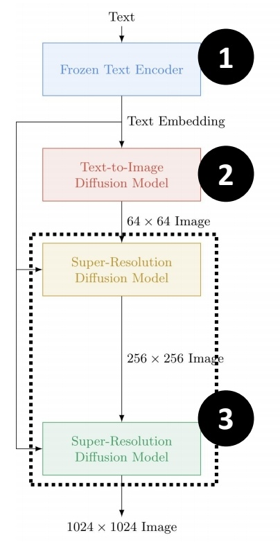
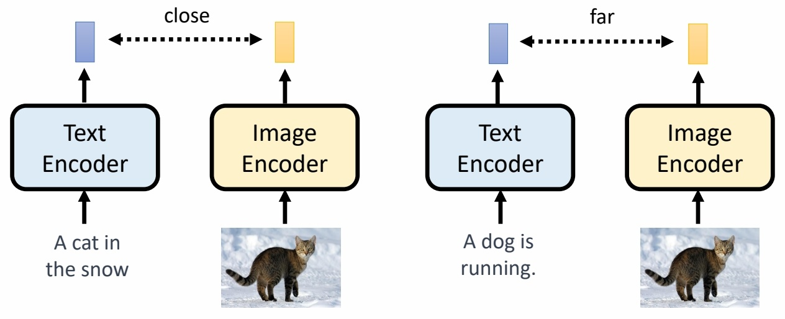
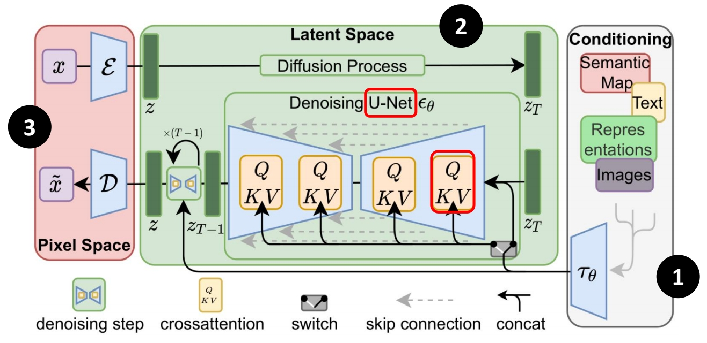

P2   
## Framework 

 

 

P3   
## Stable Diffusion 

<https://arxiv.org/abs/2112.10752>  

 

P4   
## DALL-E series 
<https://arxiv.org/abs/2204.06125>

<https://arxiv.org/abs/2102.12092>

 

> &#x2705; DALL-E 的生成模型有两种：Auoregressive 和 Diffusion.   

P5   
## Imagen 

<https://imagen.research.google/>

<https://arxiv.org/abs/2205.11487>

 

> &#x2705; Decoder 也是一个 Diffusion Model，把小图变成大图。    

P6   
## Framework 

Text Encoder   

P7   

 

<https://arxiv.org/abs/2205.11487>

> &#x2705; Text Encoder 可以用 GPT．BERT 等预训练模型。      
> &#x2705; Text Encoder 的大小对结果影响很大。  
> &#x2705; 评分说明：FID 越小越好，CLIP score 越大越好。因此右下角最好。   
> &#x2705; Diffusion Model 的大小没那么重要。   

P8   
## Fréchet Inception Distance (FID)

<https://arxiv.org/abs/1706.08500>

 

> &#x2753; 怎么评价图像生成的好坏？   
> &#x2705; CNN＋Softmax 是一个预训练好的图像分类网络，取 softmax 上一层做为图像的 feature.    
> &#x2705; 取大量真实图像的 feaure 和预州图你的 featwre.    
> &#x2705; 假设两类图像的 feature 各自符合高斯分布，计算两个分布的距离。    
> &#x2705; 优点：评价结果与人类直觉很接近，缺点：需要大量 sample.   

P9   
## Contrastive Language-Image Pre-Training (CLIP) 

<https://arxiv.org/abs/2103.00020>

400 million image-text pairs  

 

> &#x2705; CLIP Score，衡量与文字的匹配度。   

P10   
## Framework

Decoder can be trained without labelled data.   

Decoder

P11  
## 「中间产物」为小图

 

P12   
## 「中间产物」为「Latent Representation」

<u>Auto-encoder</u>

 

 

P13   
## Framework 

Generation Model   

P14   
 

> &#x2705; noise 加下 “中间产物”／latent code上。    
> &#x2705; Forard Process    

P15   
 

> &#x2705; Reverte Process.    

P16   
 

> &#x2705; Inference    

P17   
## Stable Diffusion 

<https://arxiv.org/abs/2112.10752>

 

